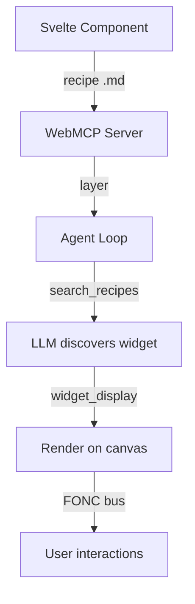
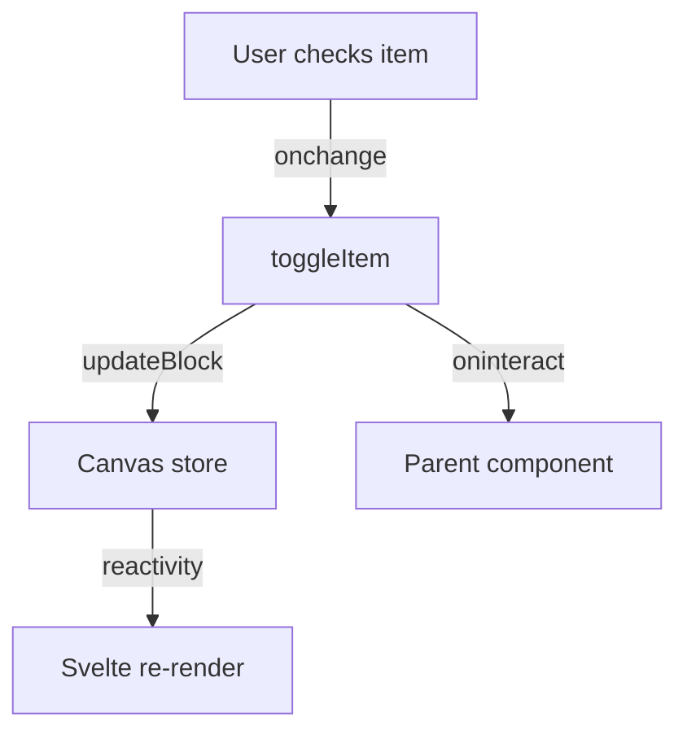
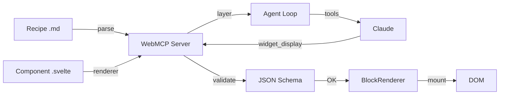

Need a widget that does not exist in the native library? This tutorial walks you through every step: creating the Svelte component, writing the recipe, registering it in a WebMCP server, and integrating with the agent loop. By the end, the LLM will be able to use your widget just like any built-in one.

## Goal

Create an interactive progress bar, register it as a WebMCP widget, and make it usable by the AI agent.

## Prerequisites

- The boilerplate is installed and running (see [Getting started](./boilerplate))
- Basic familiarity with Svelte 5 (`$props`, `$derived`, `$state`)
- Understanding of JSON Schema (optional, covered in this tutorial)

## What you will build

A "progress-bar" widget that the LLM can call via `widget_display('progress-bar', {label: "Loading", current: 75, max: 100})`, with automatic parameter validation and interactions via the FONC bus.



---

## Step 1: Create the Svelte component

A widget is a standard Svelte 5 component. The only convention: it receives its data via a `data` prop (or directly via schema props).

Create `src/lib/widgets/CustomProgressBar.svelte`:

```svelte
<script lang="ts">
  interface Props {
    data: {
      label: string;
      current: number;
      max: number;
      color?: string;
    };
  }

  let { data }: Props = $props();
  const percentage = $derived((data.current / data.max) * 100);
</script>

<div class="card">
  <h3>{data.label}</h3>
  <div class="progress-container">
    <div
      class="progress-bar"
      style="width: {percentage}%; background-color: {data.color ?? '#3b82f6'}"
    />
  </div>
  <p class="text-sm">{data.current} / {data.max}</p>
</div>

<style>
  .card {
    padding: 1rem;
    border: 1px solid #e5e7eb;
    border-radius: 0.5rem;
  }

  .progress-container {
    height: 8px;
    background: #f3f4f6;
    border-radius: 4px;
    overflow: hidden;
    margin: 0.5rem 0;
  }

  .progress-bar {
    height: 100%;
    transition: width 0.3s ease;
  }
</style>
```

What happens in this component:
- `interface Props` defines the data contract. This is also the source of the JSON Schema (auto-generated or written in the recipe)
- `$derived` reactively computes the percentage
- The CSS `transition` animates value changes

:::tip[Naming convention]
Name your files in PascalCase (`CustomProgressBar.svelte`) and the widget identifier in kebab-case (`progress-bar`). The mapping between the two is explicit in the recipe.
:::

**Checkpoint**: the file compiles without TypeScript errors.

---

## Step 2: Write the recipe

The recipe is a Markdown file with a **YAML frontmatter** that defines the widget. This is what the LLM reads to know when and how to use your widget.

Create `src/lib/recipes/progress-bar.md`:

```markdown
---
widget: progress-bar
description: Animated progress bar. Download, progress, completion, score, percentage.
group: feedback
schema:
  type: object
  required:
    - label
    - current
    - max
  properties:
    label:
      type: string
      description: Label displayed above the bar
    current:
      type: number
      description: Current progress value
    max:
      type: number
      description: Maximum value (100%)
    color:
      type: string
      description: CSS color for the bar (default blue)
---

## When to use

To show progress, a score, a completion rate,
or any bounded numeric value.

## How

Call widget_display('progress-bar', {label: "Download", current: 45, max: 100}).
To customize the color: add color: "#10b981" (green).

## Common mistakes

- Forgetting max: it is required to calculate the percentage
- current > max: the bar overflows, always ensure current <= max
```

The frontmatter contains three required fields:

| Field | Role |
|-------|------|
| `widget` | Unique widget identifier (used in `widget_display`) |
| `description` | Short description for the LLM (appears in `search_recipes`) |
| `schema` | JSON Schema of the parameters expected by the component |

The `group` field is optional and is used to categorize widgets in `search_recipes`.

The body (after the second `---`) contains free-form instructions for the LLM. Three recommended sections:
- **When to use**: use cases
- **How**: a concrete call example
- **Common mistakes**: pitfalls to avoid

:::caution[The description is crucial]
The LLM chooses the widget based on the description. Include varied keywords to maximize match probability: "progress, score, completion, download, percentage".
:::

---

## Step 3: Register the widget in a WebMCP server

The WebMCP server exposes your widgets to the LLM. Create or modify `src/lib/widgets/register.ts`:

```typescript
import { createWebMcpServer } from '@webmcp-auto-ui/core';
import CustomProgressBar from './CustomProgressBar.svelte';
import progressBarRecipe from '../recipes/progress-bar.md?raw';

const myServer = createWebMcpServer('my-app', {
  description: 'Custom widgets for my application',
});

myServer.registerWidget(progressBarRecipe, CustomProgressBar);

export { myServer };
```

`registerWidget` does three things internally:
1. **Parses** the frontmatter to extract `widget`, `description`, and `schema`
2. **Stores** the component as the renderer for this widget type
3. **Automatically creates** the 4 built-in tools (on first call):
   - `search_recipes` -- list available widgets
   - `list_recipes` -- list all widgets with name and description
   - `get_recipe` -- get schema + instructions for a widget
   - `widget_display` -- display a widget on the canvas

**Checkpoint**: calling `myServer.listWidgets()` returns `['progress-bar']`.

---

## Step 4: Connect to the agent loop

Add your server's layer to the agent loop layers:

```typescript
import { autoui } from '@webmcp-auto-ui/agent';
import { myServer } from '$lib/widgets/register';

const layers = [
  autoui.layer(),       // native widgets (stat, chart, table...)
  myServer.layer(),     // your custom widgets
];
```

And pass the server to `WidgetRenderer` for rendering:

```svelte
<WidgetRenderer
  id={block.id}
  type={block.type}
  data={block.data}
  servers={[myServer]}
/>
```

Tool prefixing is automatic:

| Raw tool | Name exposed to the LLM |
|----------|------------------------|
| `search_recipes` | `my-app_webmcp_search_recipes` |
| `get_recipe` | `my-app_webmcp_get_recipe` |
| `widget_display` | `my-app_webmcp_widget_display` |

**Checkpoint**: in the chat, ask "Show me a progress bar at 75%". The LLM should discover the recipe and display your widget.

---

## Step 5: Add interactions (optional)

If your widget needs to communicate with the agent or other widgets, use the **FONC bus**:

```svelte
<script lang="ts">
  import { bus } from '@webmcp-auto-ui/ui';

  interface Props {
    id?: string;
    data: {
      label: string;
      current: number;
      max: number;
    };
  }

  let { id, data }: Props = $props();

  function handleComplete() {
    if (id) {
      bus.broadcast(id, 'progress-complete', { label: data.label });
    }
  }
</script>

<div class="progress-bar">
  <progress value={data.current} max={data.max}></progress>
  <button onclick={handleComplete}>Done</button>
</div>
```

---

## Step 6: Integrate with the WebMCP bus (advanced, optional)

To let the agent update the widget after creation, register a WebMCP tool in the component:

```svelte
<script lang="ts">
  import { onMount } from 'svelte';

  onMount(() => {
    const mc = (navigator as any).modelContext;
    if (!mc) return;

    mc.registerTool({
      name: `progress_${id}_update`,
      description: `Update progress bar widget`,
      inputSchema: {
        type: 'object',
        properties: {
          current: { type: 'number' },
        },
        required: ['current'],
      },
      execute: (args: Record<string, any>) => {
        data.current = args.current;
        return {
          content: [{ type: 'text', text: `Progress updated to ${args.current}` }],
        };
      },
    });
  });
</script>
```

---

## Step 7: Type the widget (optional)

For strict typing in your app, add the type to the `WidgetType` union:

```typescript
export type WidgetType =
  | 'stat' | 'kv' | 'list' | 'chart' | 'alert' | 'code' | 'text' | 'actions' | 'tags'
  | 'stat-card' | 'data-table' | 'timeline' | 'profile' | 'trombinoscope' | 'json-viewer'
  | 'hemicycle' | 'chart-rich' | 'cards' | 'grid-data' | 'sankey' | 'map' | 'log'
  | 'gallery' | 'carousel' | 'd3' | 'js-sandbox'
  | 'progress-bar'  // your custom widget
  | (string & {});  // fallback for plugin widgets
```

---

## Full example: checklist widget with persistent state

A more complete widget combining reactive state, canvas persistence, and interactions:

```svelte
<script lang="ts">
  import { canvas } from '@webmcp-auto-ui/sdk/canvas';

  interface Props {
    id: string;
    data: {
      items: string[];
      completed: number;
    };
    oninteract?: (type: string, action: string, payload: unknown) => void;
  }

  let { id, data, oninteract }: Props = $props();
  let items = $state(data.items);
  let completed = $state(data.completed);

  function toggleItem(index: number) {
    completed = completed === index ? -1 : index;
    canvas.updateBlock(id, { completed });
    oninteract?.('checklist', 'toggle', { index, completed });
  }
</script>

<div class="checklist">
  <h3>Checklist ({completed + 1}/{items.length})</h3>
  {#each items as item, i (i)}
    <label>
      <input type="checkbox" checked={completed === i} onchange={() => toggleItem(i)} />
      <span class:done={completed === i}>{item}</span>
    </label>
  {/each}
</div>

<style>
  .checklist { padding: 1rem; }
  label { display: flex; gap: 0.5rem; margin: 0.5rem 0; }
  .done { text-decoration: line-through; color: #6b7280; }
</style>
```



---

## Automatic parameter validation

The WebMCP server automatically validates the LLM's parameters against the JSON Schema **before** rendering. If the LLM sends invalid data, it receives the expected schema and can self-correct on the next turn.

:::note[Image URL sanitization]
The WebMCP server also automatically sanitizes image fields (`src`, `avatar`, `photo`, `thumbnail`) to remove URLs hallucinated by the LLM. Only valid prefixes are accepted: `http://`, `https://`, `data:`, `/`.
:::

---

## Architecture overview



---

## Troubleshooting

| Problem | Likely cause | Solution |
|---------|-------------|----------|
| Widget not discovered by LLM | Description too vague in recipe | Add keywords to the frontmatter `description` |
| "Validation failed" | LLM sends data not matching schema | Add `description` to each schema property |
| Widget renders but is empty | Props don't match | Verify `interface Props` matches the schema |
| "Unknown widget type" | Server not passed to WidgetRenderer | Add `servers={[myServer]}` to WidgetRenderer |

---

## Creation checklist

- [ ] Svelte component created with `interface Props` and `data` prop
- [ ] Recipe `.md` with frontmatter (`widget`, `description`, `schema`) + body
- [ ] `createWebMcpServer()` + `registerWidget()`
- [ ] Layer added to the agent loop layers
- [ ] Server passed to `WidgetRenderer`
- [ ] Tested: LLM discovers and uses the widget
- [ ] (Optional) Interactions via FONC bus
- [ ] (Optional) WebMCP tool for dynamic updates

## Going further

- **Auto-generate schemas**: run `npm run sync:schemas` to generate JSON Schema from your Svelte `interface Props`
- **Vanilla renderer**: use `mountWidget()` from the core package for framework-free widget integration
- **Custom tools**: add extra tools to your WebMCP server with `server.addTool()`

## See also

- [Use existing widgets](./use-existing-widgets)
- [Create a WebMCP server](./create-webmcp-server)
- [Connect an MCP server](./connect-mcp-server)
- [UI Package (WidgetRenderer)](/packages/ui)
