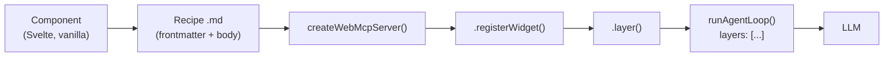
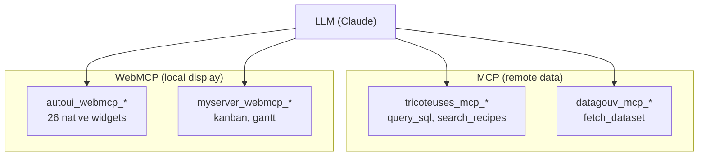
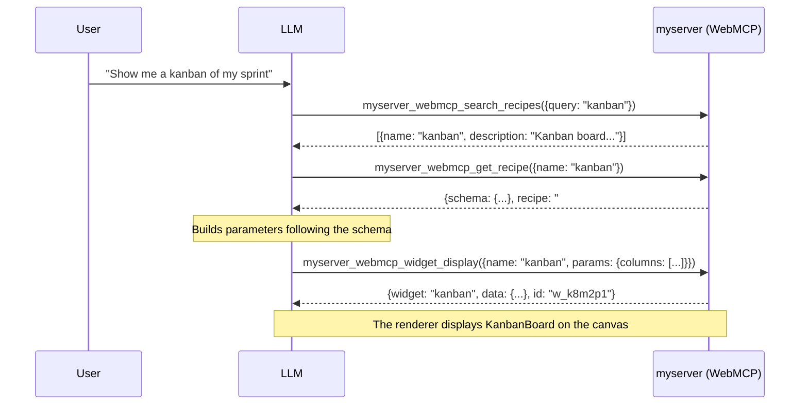
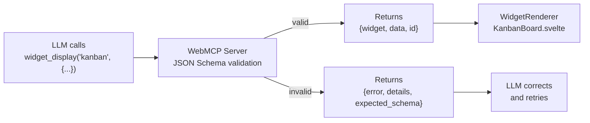

This tutorial explains how to expose your own widgets via the WebMCP protocol, from component creation to integration in the agent loop.

## Overview



The full pipeline starts from a UI component, goes through a declarative recipe, then is registered in a WebMCP server that exposes tools to the LLM.

---

## Step 1: Create the component

The component will be rendered on the canvas when the LLM calls `widget_display`. Two options depending on your approach.

### Option A: Svelte 5

```svelte
<!-- src/lib/widgets/KanbanBoard.svelte -->
<script lang="ts">
  interface Props {
    title?: string;
    columns: {
      name: string;
      cards: {
        title: string;
        description?: string;
        tag?: string;
      }[];
    }[];
  }

  let { title, columns }: Props = $props();
</script>

{#if title}
  <h3>{title}</h3>
{/if}

<div class="kanban">
  {#each columns as col}
    <div class="column">
      <h4>{col.name}</h4>
      {#each col.cards as card}
        <div class="card">
          <strong>{card.title}</strong>
          {#if card.description}<p>{card.description}</p>{/if}
          {#if card.tag}<span class="tag">{card.tag}</span>{/if}
        </div>
      {/each}
    </div>
  {/each}
</div>

<style>
  .kanban { display: flex; gap: 1rem; }
  .column { flex: 1; background: #1a1a2e; border-radius: 8px; padding: 0.75rem; }
  .card { background: #16213e; border-radius: 6px; padding: 0.5rem; margin-bottom: 0.5rem; }
  .tag { font-size: 0.75rem; color: #888; }
</style>
```

### Option B: Vanilla renderer

A vanilla renderer is a pure function that receives an `HTMLElement` and data, and optionally returns a cleanup function:

```typescript
// src/widgets/kanban.ts
export function render(
  container: HTMLElement,
  data: Record<string, unknown>,
): void | (() => void) {
  const { title, columns } = data as {
    title?: string;
    columns: { name: string; cards: { title: string }[] }[];
  };

  const wrapper = document.createElement('div');
  wrapper.style.display = 'flex';
  wrapper.style.gap = '1rem';

  for (const col of columns) {
    const colEl = document.createElement('div');
    colEl.innerHTML = `<h4>${col.name}</h4>`;
    for (const card of col.cards) {
      const cardEl = document.createElement('div');
      cardEl.textContent = card.title;
      colEl.appendChild(cardEl);
    }
    wrapper.appendChild(colEl);
  }

  container.appendChild(wrapper);

  return () => { container.innerHTML = ''; };
}
```

---

## Step 2: Write the recipe

The recipe is a Markdown file with a YAML frontmatter. This is what the LLM will read to know how to use the widget.

```markdown
---
widget: kanban
description: Kanban board with columns and cards. Project management, workflow, pipeline.
group: project
schema:
  type: object
  required:
    - columns
  properties:
    title:
      type: string
    columns:
      type: array
      items:
        type: object
        required:
          - name
          - cards
        properties:
          name:
            type: string
          cards:
            type: array
            items:
              type: object
              required:
                - title
              properties:
                title:
                  type: string
                description:
                  type: string
                tag:
                  type: string
---

## When to use

To display a column-based workflow: recruitment pipeline, sprint board,
sales pipeline, or any step-based progression.

## How

Call widget_display('kanban', {columns: [{name: "To do", cards: [{title: "Task 1"}]}, {name: "In progress", cards: []}]}).

## Common mistakes

- Forgotten empty columns: always include columns even if they have no cards (cards: [])
- Too many columns: beyond 5 columns, readability decreases
```

The frontmatter contains three required fields:

| Field         | Role                                                    |
|---------------|---------------------------------------------------------|
| `widget`      | Unique widget identifier (used in widget_display)          |
| `description` | Short description for the LLM (search_recipes)             |
| `schema`      | JSON Schema of the parameters expected by the component    |

The `group` field is optional and is used for categorization in `search_recipes`.

The body (after `---`) contains free-form instructions for the LLM: when to use the widget, how to build the parameters, and mistakes to avoid.

---

## Step 3: Generate schemas automatically

If your component is in Svelte with an `interface Props`, you can generate the JSON Schema automatically from TypeScript types:

```bash
npm run sync:schemas
```

This script parses the `interface Props` from Svelte components, converts them to JSON Schema, and injects the result into each recipe `.md` frontmatter. This avoids maintaining the schema manually.

For vanilla renderers, the schema must be written manually in the recipe.

---

## Step 4: Create the server

```typescript
// src/lib/my-server.ts
import { createWebMcpServer } from '@webmcp-auto-ui/core';
import KanbanBoard from './widgets/KanbanBoard.svelte';

// The recipe can be imported as a raw string (Vite)
import kanbanRecipe from './recipes/kanban.md?raw';

const myserver = createWebMcpServer('myserver', {
  description: 'Project management widgets (kanban, gantt, ...)',
});
```

`createWebMcpServer` creates an empty server with a name and description. The name will be used as a prefix in tools (`myserver_webmcp_*`).

---

## Step 5: Register the widget

```typescript
myserver.registerWidget(kanbanRecipe, KanbanBoard);
```

`registerWidget` does three things:
1. Parses the frontmatter to extract `widget`, `description` and `schema`
2. Stores the component as renderer
3. Automatically creates the 4 built-in tools (on first call):
   - `search_recipes` -- list available widgets
   - `list_recipes` -- list all widgets with name and description
   - `get_recipe` -- get the schema + instructions for a widget
   - `widget_display` -- display a widget on the canvas

You can register multiple widgets on the same server:

```typescript
import ganttRecipe from './recipes/gantt.md?raw';
import GanttChart from './widgets/GanttChart.svelte';

myserver.registerWidget(kanbanRecipe, KanbanBoard);
myserver.registerWidget(ganttRecipe, GanttChart);
```

---

## Step 6: Add custom tools (optional)

You can add additional tools to the server. These tools will appear in the same namespace as the widgets:

```typescript
myserver.addTool({
  name: 'move_card',
  description: 'Move a card between kanban columns.',
  inputSchema: {
    type: 'object',
    properties: {
      cardTitle: { type: 'string', description: 'Card title' },
      targetColumn: { type: 'string', description: 'Target column name' },
    },
    required: ['cardTitle', 'targetColumn'],
  },
  execute: async (params) => {
    const { cardTitle, targetColumn } = params as {
      cardTitle: string;
      targetColumn: string;
    };
    return {
      ok: true,
      message: `Card "${cardTitle}" moved to "${targetColumn}"`,
    };
  },
});
```

---

## Step 7: Connect to the agent loop

Call `.layer()` to get the tool layer, then pass it to `runAgentLoop`:

```typescript
import { runAgentLoop, autoui } from '@webmcp-auto-ui/agent';

const layers = [
  autoui.layer(),        // native widgets (stat, chart, table, ...)
  myserver.layer(),      // your custom widgets
];

const result = await runAgentLoop(userMessage, {
  provider,
  layers,
});
```

Tool prefixing is automatic:

| Raw tool            | Name exposed to the LLM                  |
|---------------------|-------------------------------------------|
| `search_recipes`    | `myserver_webmcp_search_recipes`          |
| `get_recipe`        | `myserver_webmcp_get_recipe`              |
| `widget_display`    | `myserver_webmcp_widget_display`          |
| `move_card`         | `myserver_webmcp_move_card`               |

This prefixing prevents collisions when multiple servers (MCP + WebMCP) coexist.

### Multi-server architecture



---

## Step 8: Test

### Verify discovery

In the chat, ask something that triggers recipe search:

```
User: "Show me a kanban of my sprint"
```

The LLM will follow this sequence:



### The widget_display dispatch



### Verify rendering

The result of `widget_display` contains an `id` (e.g. `w_a3f2k1`). The UI uses this return to:
1. Find the renderer (`KanbanBoard.svelte`) via `getWidget('kanban')`
2. Pass `data` as props to the component
3. Display the widget on the canvas

---

## Parameter validation

The WebMCP server automatically validates parameters against the JSON Schema before passing them to the renderer. The implementation uses `validateJsonSchema` from the `@webmcp-auto-ui/core` package:

```typescript
// Excerpt from webmcp-server.ts -- widget_display execute
const rawParams = (params.params ?? {}) as Record<string, unknown>;
const validation = validateJsonSchema(rawParams, entry.inputSchema as JsonSchema);
if (!validation.valid) {
  return {
    error: 'Validation failed',
    details: validation.errors,
    expected_schema: entry.inputSchema,
  };
}
```

If validation fails, the LLM receives the expected schema and can correct its call on the next turn.

---

## Image URL sanitization

The WebMCP server automatically sanitizes image fields (src, avatar, photo, thumbnail, etc.) to remove URLs hallucinated by the LLM. Only valid prefixes are accepted: `http://`, `https://`, `data:`, `/`.

---

## Checklist

- [ ] Component created (Svelte or vanilla)
- [ ] Recipe `.md` with frontmatter (`widget`, `description`, `schema`) + body
- [ ] `npm run sync:schemas` executed (if Svelte)
- [ ] `createWebMcpServer('name', {description})`
- [ ] `server.registerWidget(recipe, component)`
- [ ] `server.addTool({...})` if needed
- [ ] `layers: [..., server.layer()]`
- [ ] Test: search_recipes --> get_recipe --> widget_display

## See also

- [Create a custom widget](./create-custom-widget)
- [MCP / WebMCP Architecture](./architecture-mcp-webmcp)
- [Use existing widgets](./use-existing-widgets)
- [Core package](/packages/core)
