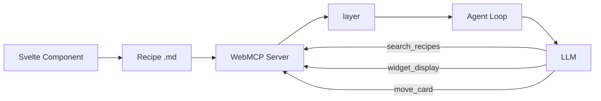
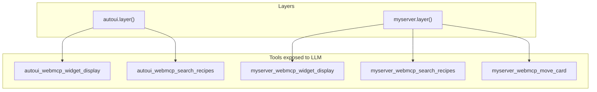
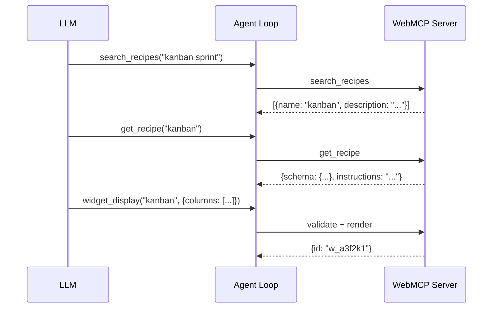

Want the LLM to use your own widgets autonomously? This tutorial shows you how to create a complete WebMCP server: component, recipe, registration, custom tools, and agent loop integration. By the end, your widgets will feel just as natural as the built-in ones.

## Goal

Create a WebMCP server that exposes a Kanban widget, with automatic validation, custom tools, and full agent loop integration.

## Prerequisites

- The boilerplate is installed (see [Getting started](./boilerplate))
- Having read [Create a custom widget](./create-custom-widget) (recommended)
- Basic understanding of JSON Schema

## What you will build

A WebMCP server `myserver` with a Kanban widget that the LLM discovers via `search_recipes`, reads via `get_recipe`, and displays via `widget_display` -- with automatic parameter validation and a custom `move_card` tool.



---

## Step 1: Create the component

The component will be rendered on the canvas when the LLM calls `widget_display`. Two options are available.

### Option A: Svelte 5 (recommended)

Create `src/lib/widgets/KanbanBoard.svelte`:

```svelte
<script lang="ts">
  interface Props {
    title?: string;
    columns: {
      name: string;
      cards: {
        title: string;
        description?: string;
        tag?: string;
      }[];
    }[];
  }

  let { title, columns }: Props = $props();
</script>

{#if title}
  <h3>{title}</h3>
{/if}

<div class="kanban">
  {#each columns as col}
    <div class="column">
      <h4>{col.name} <span class="count">({col.cards.length})</span></h4>
      {#each col.cards as card}
        <div class="card">
          <strong>{card.title}</strong>
          {#if card.description}<p>{card.description}</p>{/if}
          {#if card.tag}<span class="tag">{card.tag}</span>{/if}
        </div>
      {/each}
    </div>
  {/each}
</div>

<style>
  .kanban { display: flex; gap: 1rem; overflow-x: auto; }
  .column { flex: 1; min-width: 200px; background: var(--color-surface2, #1a1a2e); border-radius: 8px; padding: 0.75rem; }
  .card { background: var(--color-surface, #16213e); border-radius: 6px; padding: 0.5rem; margin-bottom: 0.5rem; }
  .tag { font-size: 0.75rem; color: var(--color-text2, #888); }
  .count { font-weight: normal; color: var(--color-text2, #888); font-size: 0.85em; }
</style>
```

### Option B: Vanilla renderer

A pure function that receives an `HTMLElement` and data:

```typescript
export function render(
  container: HTMLElement,
  data: Record<string, unknown>,
): void | (() => void) {
  const { title, columns } = data as {
    title?: string;
    columns: { name: string; cards: { title: string }[] }[];
  };

  const wrapper = document.createElement('div');
  wrapper.style.display = 'flex';
  wrapper.style.gap = '1rem';

  for (const col of columns) {
    const colEl = document.createElement('div');
    colEl.innerHTML = `<h4>${col.name}</h4>`;
    for (const card of col.cards) {
      const cardEl = document.createElement('div');
      cardEl.textContent = card.title;
      colEl.appendChild(cardEl);
    }
    wrapper.appendChild(colEl);
  }

  container.appendChild(wrapper);
  return () => { container.innerHTML = ''; };
}
```

---

## Step 2: Write the recipe

Create `src/lib/recipes/kanban.md`:

```markdown
---
widget: kanban
description: Kanban board with columns and cards. Project management, workflow, pipeline, sprint board.
group: project
schema:
  type: object
  required:
    - columns
  properties:
    title:
      type: string
      description: Optional board title
    columns:
      type: array
      items:
        type: object
        required:
          - name
          - cards
        properties:
          name:
            type: string
            description: Column name
          cards:
            type: array
            items:
              type: object
              required:
                - title
              properties:
                title:
                  type: string
                description:
                  type: string
                tag:
                  type: string
---

## When to use

To display a column-based workflow: recruitment pipeline, sprint board,
sales pipeline, or any step-based progression.

## How

Call widget_display('kanban', {columns: [{name: "To do", cards: [{title: "Task 1"}]}, {name: "In progress", cards: []}]}).

## Common mistakes

- Forgotten empty columns: always include columns even if they have no cards (cards: [])
- Too many columns: beyond 5 columns, readability decreases
```

:::caution[The description is your SEO for the LLM]
The LLM chooses the widget based on the `description`. Include synonyms and varied use cases.
:::

---

## Step 3: Generate schemas automatically (optional)

If your component uses `interface Props`, auto-generate the JSON Schema:

```bash
npm run sync:schemas
```

---

## Step 4: Create the server

```typescript
import { createWebMcpServer } from '@webmcp-auto-ui/core';
import KanbanBoard from './widgets/KanbanBoard.svelte';
import kanbanRecipe from './recipes/kanban.md?raw';

const myserver = createWebMcpServer('myserver', {
  description: 'Project management widgets (kanban, gantt, ...)',
});
```

`createWebMcpServer` creates an empty server with a name and description:
- The **name** is used as the prefix in tools (`myserver_webmcp_*`)
- The **description** appears in the system prompt

---

## Step 5: Register the widget

```typescript
myserver.registerWidget(kanbanRecipe, KanbanBoard);
```

`registerWidget` does three things:
1. **Parses** the frontmatter to extract `widget`, `description`, and `schema`
2. **Stores** the component as renderer
3. **Creates** the 4 built-in tools automatically:
   - `search_recipes`, `list_recipes`, `get_recipe`, `widget_display`

You can register multiple widgets on the same server:

```typescript
myserver.registerWidget(kanbanRecipe, KanbanBoard);
myserver.registerWidget(ganttRecipe, GanttChart);
```

---

## Step 6: Add custom tools (optional)

```typescript
myserver.addTool({
  name: 'move_card',
  description: 'Move a card between kanban columns.',
  inputSchema: {
    type: 'object',
    properties: {
      cardTitle: { type: 'string', description: 'Card title' },
      targetColumn: { type: 'string', description: 'Target column name' },
    },
    required: ['cardTitle', 'targetColumn'],
  },
  execute: async (params) => {
    const { cardTitle, targetColumn } = params as {
      cardTitle: string;
      targetColumn: string;
    };
    return {
      ok: true,
      message: `Card "${cardTitle}" moved to "${targetColumn}"`,
    };
  },
});
```

---

## Step 7: Connect to the agent loop

```typescript
import { runAgentLoop, autoui } from '@webmcp-auto-ui/agent';

const layers = [
  autoui.layer(),        // native widgets (stat, chart, table, ...)
  myserver.layer(),      // your custom widgets
];

const result = await runAgentLoop(userMessage, {
  provider,
  layers,
});
```

Tool prefixing is automatic:

| Raw tool | Name exposed to the LLM |
|----------|------------------------|
| `search_recipes` | `myserver_webmcp_search_recipes` |
| `widget_display` | `myserver_webmcp_widget_display` |
| `move_card` | `myserver_webmcp_move_card` |

Don't forget to pass the server to `WidgetRenderer`:

```svelte
<WidgetRenderer
  id={block.id}
  type={block.type}
  data={block.data}
  servers={[myserver]}
/>
```



---

## Step 8: Test

In the chat, ask something that triggers recipe search:

```
User: "Show me a kanban of my sprint"
```

The LLM will follow this sequence:



**Checkpoint**: the kanban displays with columns and cards generated by the LLM.

---

## Parameter validation

The WebMCP server validates parameters against the JSON Schema before rendering. If validation fails, the LLM receives the expected schema and can self-correct.

:::note[Image sanitization]
The server automatically sanitizes image fields (`src`, `avatar`, `photo`, `thumbnail`) to remove hallucinated URLs. Only valid prefixes accepted: `http://`, `https://`, `data:`, `/`.
:::

---

## Troubleshooting

| Problem | Likely cause | Solution |
|---------|-------------|----------|
| Widget not discovered | Recipe `description` doesn't match query | Enrich with synonyms |
| "Validation failed" | LLM sends incompatible params | Add `description` to schema properties |
| Widget renders as raw JSON | Server not passed to WidgetRenderer | Add `servers={[myserver]}` |
| Custom tool not visible | Tool added after `layer()` | Call `addTool()` before `layer()` |

---

## Checklist

- [ ] Component created (Svelte or vanilla)
- [ ] Recipe `.md` with frontmatter (`widget`, `description`, `schema`) + body
- [ ] `createWebMcpServer('name', {description})`
- [ ] `server.registerWidget(recipe, component)`
- [ ] `server.addTool({...})` if needed
- [ ] `layers: [..., server.layer()]`
- [ ] Server passed to WidgetRenderer via `servers={[...]}`
- [ ] Test: search_recipes --> get_recipe --> widget_display

## Going further

- **Combine MCP and WebMCP**: your WebMCP server can coexist with remote MCP servers in the same layers
- **Auto-generated schemas**: use `sync:schemas` to never write schemas manually
- **Interactive component**: add the FONC bus for cross-widget interactions

## See also

- [Create a custom widget](./create-custom-widget)
- [MCP / WebMCP Architecture](./architecture-mcp-webmcp)
- [Use existing widgets](./use-existing-widgets)
- [Core package](/webmcp-auto-ui/en/packages/core)
