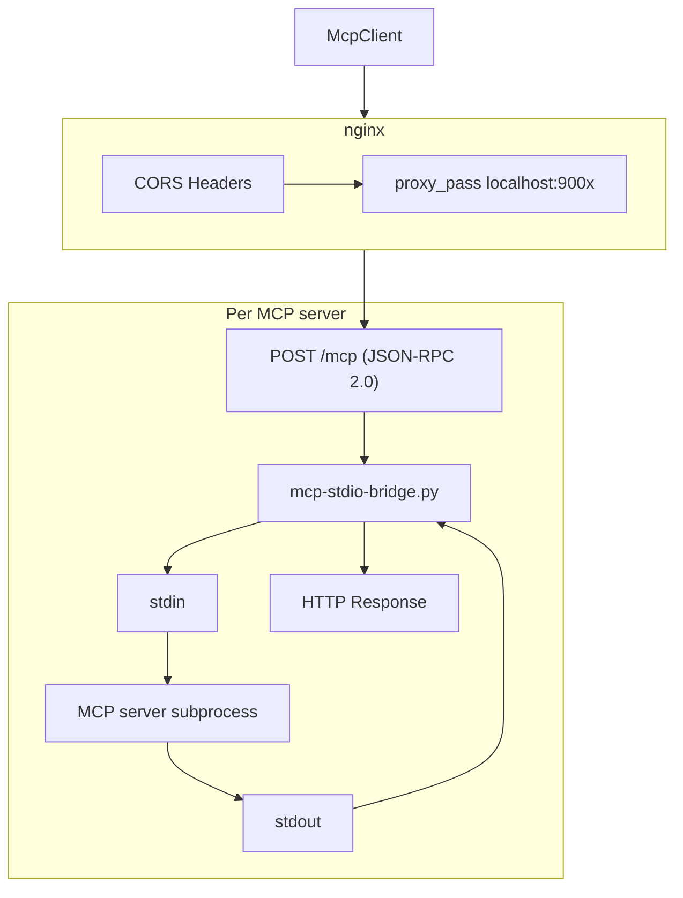
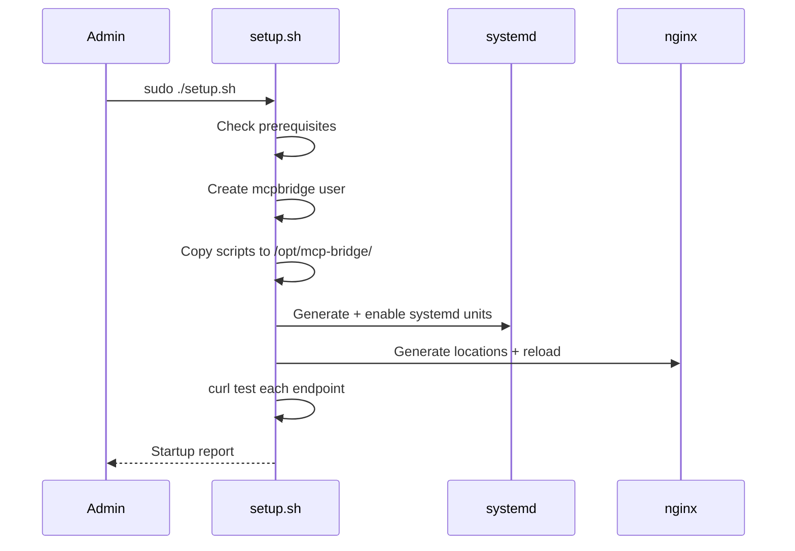

MCP servers communicate via stdio (stdin/stdout), but browsers need HTTP endpoints. This tutorial shows you how to deploy the proxies that bridge the gap, locally with Docker or in production with systemd and nginx.

## Goal

Deploy MCP proxies to make public MCP servers (NASA, HackerNews, Wikipedia, etc.) accessible from the browser.

## Prerequisites

- Docker and Docker Compose installed (for the quick method)
- Or: an Ubuntu/Debian VM with `python3`, `node`, `npm`, `nginx` (for production)
- Understanding of what an MCP server is (see [Connect an MCP server](./connect-mcp-server))

## What you will build

MCP servers accessible via HTTP, with CORS configured, recipes injected, and systemd monitoring.


---

## Architecture

Each bridge is a Python process that:
- Spawns the MCP server as a child process communicating via stdio
- Accepts `POST /mcp` with a JSON-RPC 2.0 body
- Forwards to the subprocess via stdin, reads the response from stdout
- Manages the subprocess lifecycle (lazy start, restart on crash)
- Optionally injects recipe tools from a JSON file



---

## Quick method: Docker

For local development, Docker Compose starts all servers in one command:

```bash
cd mcp-proxies
docker compose up -d
```

All servers are then accessible on `localhost:9001` through `localhost:9008`.

To start a single server:

```bash
docker compose up -d hackernews
```

**Checkpoint**: test with curl:

```bash
curl -s -X POST http://localhost:9006/mcp \
  -H 'Content-Type: application/json' \
  -d '{
    "jsonrpc": "2.0",
    "id": 1,
    "method": "initialize",
    "params": {
      "protocolVersion": "2024-11-05",
      "capabilities": {},
      "clientInfo": { "name": "test", "version": "1.0" }
    }
  }'
```

A valid response contains `"result"` with the server capabilities.

:::tip[Quick development]
Use Docker for development. Only switch to the VM method for production deployment.
:::

---

## Production method: systemd + nginx

For production on an Ubuntu/Debian VM:

```bash
cd mcp-proxies
sudo ./setup.sh
```

The script is **idempotent** (safe to re-run). It performs:

1. Prerequisite checks (`python3`, `node`, `npm`, `nginx`)
2. Creates a dedicated `mcpbridge` system user
3. Copies bridge scripts to `/opt/mcp-bridge/`
4. Generates systemd unit files for each server
5. Generates nginx location blocks
6. Starts or restarts all services
7. Tests each endpoint with curl



### NASA API key

The NASA proxy requires a `NASA_API_KEY` environment variable:

```bash
export NASA_API_KEY="your-key-here"
sudo -E ./setup.sh
```

:::caution[Don't forget -E]
The `-E` flag preserves environment variables in the sudo context. Without it, `NASA_API_KEY` won't be passed to the script.
:::

---

## Adding a new MCP server

### 1. Create the directory

```bash
mkdir mcp-proxies/servers/my-server
```

### 2. Add configuration files

```
mcp-proxies/servers/my-server/
  recipes.json    # Recipe tools injected into the server (optional)
  service.conf    # systemd configuration (command, port, env)
  README.md       # Server documentation
  examples.md     # Prompt examples
```

### 3. Create recipes (optional but recommended)

```json
[
  {
    "name": "search-guide",
    "description": "How to search in my-server",
    "content": "## Search\\n\\nUse search({query: 'keyword'})..."
  }
]
```

### 4. Re-run setup

```bash
sudo ./setup.sh
```

**Checkpoint**: the new service appears in `systemctl status mcp-bridge-my-server`.

---

## Testing a server

Send an `initialize` request:

```bash
curl -s -X POST http://localhost:9001/mcp \
  -H 'Content-Type: application/json' \
  -d '{
    "jsonrpc": "2.0",
    "id": 1,
    "method": "initialize",
    "params": {
      "protocolVersion": "2024-11-05",
      "capabilities": {},
      "clientInfo": { "name": "test", "version": "1.0" }
    }
  }'
```

Then list tools:

```bash
curl -s -X POST http://localhost:9001/mcp \
  -H 'Content-Type: application/json' \
  -d '{
    "jsonrpc": "2.0",
    "id": 2,
    "method": "tools/list",
    "params": {}
  }'
```

---

## Connecting from a webmcp-auto-ui app

```typescript
import { McpClient } from '@webmcp-auto-ui/core';

// Local development
const client = new McpClient('http://localhost:9001/mcp');

// Production
const client = new McpClient('https://demos.hyperskills.net/mcp-metmuseum/mcp');

await client.initialize();
const tools = await client.listTools();
```

For multiple servers:

```typescript
import { McpMultiClient } from '@webmcp-auto-ui/core';

const multi = new McpMultiClient();
await multi.addServer('https://demos.hyperskills.net/mcp-metmuseum/mcp');
await multi.addServer('https://demos.hyperskills.net/mcp-wikipedia/mcp');
```

---

## Recipe system

Each server can optionally include a `recipes.json` file that injects recipe tools (`list_recipes`, `get_recipe`, `search_recipes`) into the MCP server's tool list. The bridge loads these at startup via the `--recipes` flag.

Recipes let the LLM discover how to use the server autonomously, even if the original MCP server has no built-in discovery mechanism.

---

## Available servers

| Server | Main tools | Port | Production URL | Example prompt |
|--------|-----------|------|----------------|----------------|
| hackernews | `get-front-page`, `search-posts` | 9006 | `/mcp-hackernews/mcp` | "Top 10 stories on HN today" |
| metmuseum | `search-museum-objects`, `get-museum-object` | 9001 | `/mcp-metmuseum/mcp` | "Show impressionist paintings" |
| openmeteo | `weather_forecast`, `geocoding` | 9002 | `/mcp-openmeteo/mcp` | "Weather in Paris this week" |
| wikipedia | `search`, `readArticle` | 9005 | `/mcp-wikipedia/mcp` | "Article about quantum computing" |
| inaturalist | `search_observations` | 9007 | `/mcp-inaturalist/mcp` | "Birds spotted near Lyon" |
| nasa | `nasa_apod`, `nasa_mars_rover`, `nasa_neo` | 9008 | `/mcp-nasa/mcp` | "Latest Mars rover photos" |
| datagouv | remote proxy (no bridge) | -- | `/mcp-datagouv/mcp` | "Transport datasets in France" |

Production URLs are prefixed with `https://demos.hyperskills.net`.

:::note[Special case: datagouv]
The `datagouv` server does not use a stdio bridge but a simple nginx reverse proxy to a remote MCP server already accessible over HTTP.
:::

---

## File structure

```
mcp-proxies/
  bridge/
    mcp-stdio-bridge.py      # Generic stdio-to-HTTP bridge
    inaturalist-mcp.py        # Custom Python MCP server for iNaturalist
  nginx/
    mcp-locations.conf        # nginx location blocks (CORS + proxy_pass)
  servers/
    hackernews/               # Per-server config and recipes
    metmuseum/
    openmeteo/
    wikipedia/
    inaturalist/
    nasa/
    datagouv/
  setup.sh                    # VM provisioning script
  docker-compose.yml          # Docker alternative for local dev
```

---

## Troubleshooting

| Problem | Likely cause | Solution |
|---------|-------------|----------|
| "Connection refused" | Bridge not started | `systemctl status mcp-bridge-<name>` |
| "CORS error" | Missing CORS headers in nginx | Check `mcp-locations.conf` |
| Timeout on first call | MCP server takes time to start | Bridge does lazy start, first call is slow |
| "Invalid JSON-RPC" | Wrong request format | Check JSON-RPC 2.0 body format |
| Server crash loop | Missing npm dependency | `journalctl -u mcp-bridge-<name>` for logs |

---

## Going further

- **Create a custom MCP server**: write your own MCP server in Node.js or Python
- **Monitoring**: add systemd healthchecks and alerts
- **Security**: add token authentication to endpoints

## See also

- [Getting started with the boilerplate](./boilerplate)
- [Connect an MCP server](./connect-mcp-server)
- [Architecture](../guide/architecture)
