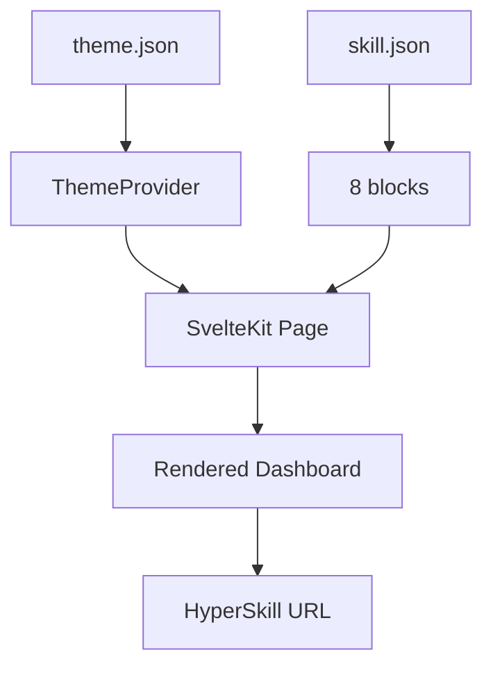
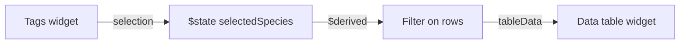
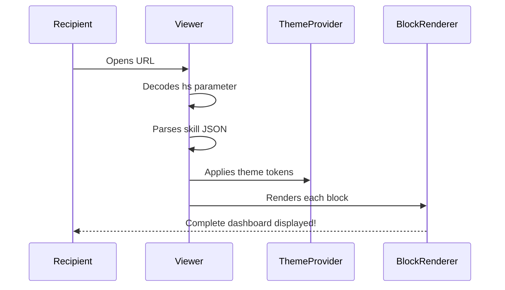

Themed dashboards are the showcase of webmcp-auto-ui: a color palette, interconnected widgets, and a shareable URL. This tutorial walks you through building a "Nature Observatory" -- a wildlife tracking dashboard for a nature reserve.

## Goal

Build a complete themed dashboard with 8 widgets, a light/dark theme, cross-component interactions, and a shareable HyperSkill URL export.

## Prerequisites

- The monorepo is cloned and `npm install` has been run
- Packages are built (`npm run build` at the root)
- Basic familiarity with Svelte 5 and JSON
- Having read [Use existing widgets](./use-existing-widgets)

## What you will build

A "Nature Observatory" dashboard with 8 widgets (stats, area chart, table, map, timeline, profile), a green/brown nature theme, interactive filtering, and a URL that anyone can open to see the dashboard.



---

## Step 1: Create the theme

A theme is a set of **CSS tokens** that define the color palette. Create `apps/showcase/theme.json`:

```json
{
  "name": "nature-observatory",
  "tokens": {
    "color-bg":       "#f4f1eb",
    "color-surface":  "#ffffff",
    "color-surface2": "#ede8df",
    "color-border":   "rgba(101, 78, 50, 0.10)",
    "color-border2":  "rgba(101, 78, 50, 0.20)",
    "color-accent":   "#2d6a4f",
    "color-accent2":  "#bc4749",
    "color-amber":    "#b07d1e",
    "color-teal":     "#40916c",
    "color-text1":    "#2b2118",
    "color-text2":    "#7a6e5d"
  },
  "dark": {
    "color-bg":       "#1a1612",
    "color-surface":  "#252019",
    "color-surface2": "#302a21",
    "color-border":   "rgba(210, 190, 160, 0.10)",
    "color-border2":  "rgba(210, 190, 160, 0.20)",
    "color-accent":   "#52b788",
    "color-text1":    "#ede8df",
    "color-text2":    "#a89b88"
  }
}
```

Palette breakdown:
- **accent** (`#2d6a4f`): deep forest green for primary actions
- **accent2** (`#bc4749`): warm red for alerts
- **teal** (`#40916c`): light green for success states
- **amber** (`#b07d1e`): golden brown for warnings
- **bg/surface**: off-white evoking parchment
- **text**: dark brown instead of pure black

The `dark` tokens override values in dark mode. Tokens not specified in `dark` inherit from the light version.

:::tip[Choosing colors]
Start with an accent color that evokes your theme (nature green, ocean blue, firefighter red), then derive other colors with saturation and brightness variations.
:::

---

## Step 2: Create the skill

A **skill** defines the blocks to display with their data. Create `apps/showcase/nature-observatory.skill.json`:

```json
{
  "name": "nature-observatory",
  "description": "Wildlife tracking dashboard for a nature reserve",
  "tags": ["nature", "wildlife", "dashboard"],
  "theme": {
    "color-bg": "#f4f1eb",
    "color-accent": "#2d6a4f",
    "color-accent2": "#bc4749"
  },
  "blocks": [
    {
      "type": "stat",
      "data": { "label": "Species observed", "value": "347", "trend": "+12", "trendDir": "up" }
    },
    {
      "type": "stat",
      "data": { "label": "Observations this week", "value": "1,204", "trend": "+8.3%", "trendDir": "up" }
    },
    {
      "type": "stat",
      "data": { "label": "Endangered species alerts", "value": "3", "trend": "+1", "trendDir": "up" }
    },
    {
      "type": "chart-rich",
      "data": {
        "title": "Observations by month",
        "type": "area",
        "labels": ["Jan", "Feb", "Mar", "Apr", "May", "Jun"],
        "data": [
          { "label": "Birds", "values": [120, 145, 210, 320, 410, 380], "color": "#2d6a4f" },
          { "label": "Mammals", "values": [45, 52, 68, 95, 110, 102], "color": "#b07d1e" },
          { "label": "Reptiles", "values": [15, 18, 35, 55, 72, 68], "color": "#40916c" }
        ]
      }
    },
    {
      "type": "data-table",
      "data": {
        "title": "Recent observations",
        "columns": [
          { "key": "species", "label": "Species" },
          { "key": "location", "label": "Location" },
          { "key": "date", "label": "Date" },
          { "key": "observer", "label": "Observer" },
          { "key": "status", "label": "Status" }
        ],
        "rows": [
          { "species": "Red-tailed hawk", "location": "North Ridge", "date": "2026-04-05", "observer": "A. Muir", "status": "Confirmed" },
          { "species": "River otter", "location": "Willow Creek", "date": "2026-04-05", "observer": "B. Carson", "status": "Confirmed" },
          { "species": "Timber rattlesnake", "location": "Rocky Bluff", "date": "2026-04-04", "observer": "C. Leopold", "status": "Pending" },
          { "species": "Bald eagle", "location": "Eagle Point", "date": "2026-04-04", "observer": "A. Muir", "status": "Confirmed" },
          { "species": "Black bear", "location": "Pine Hollow", "date": "2026-04-03", "observer": "D. Thoreau", "status": "Confirmed" }
        ]
      }
    },
    {
      "type": "profile",
      "data": {
        "name": "North Ridge Reserve",
        "subtitle": "Founded in 1987 -- 5,000 hectares",
        "badge": { "text": "Active", "variant": "success" },
        "fields": [
          { "label": "Region", "value": "Highland plateaus" },
          { "label": "Elevation", "value": "800-2,200m" },
          { "label": "Habitats", "value": "Forest, Wetland, Alpine" }
        ],
        "stats": [
          { "label": "Species", "value": "347" },
          { "label": "Observers", "value": "24" },
          { "label": "Observations", "value": "18.4K" }
        ]
      }
    },
    {
      "type": "map",
      "data": {
        "title": "Observation locations",
        "center": { "lat": 35.6, "lng": -83.5 },
        "zoom": 10,
        "markers": [
          { "lat": 35.65, "lng": -83.48, "label": "Red-tailed hawk" },
          { "lat": 35.58, "lng": -83.52, "label": "River otter" },
          { "lat": 35.62, "lng": -83.45, "label": "Bald eagle" },
          { "lat": 35.55, "lng": -83.55, "label": "Black bear" }
        ]
      }
    },
    {
      "type": "timeline",
      "data": {
        "title": "Observatory activity",
        "events": [
          { "date": "2026-04-05", "title": "Nesting confirmed", "description": "Hawk pair nesting on North Ridge", "status": "active" },
          { "date": "2026-04-03", "title": "Bear spotted near trail", "description": "Black bear at Pine Hollow, caution advisory issued", "status": "done" },
          { "date": "2026-03-28", "title": "Migration begins", "description": "First wave of migratory songbirds in wetland area", "status": "done" },
          { "date": "2026-03-15", "title": "Sensor network updated", "description": "12 new camera traps in the southern sector", "status": "done" }
        ]
      }
    }
  ]
}
```

---

## Step 3: Set up the SvelteKit page

Create `apps/showcase/src/routes/nature/+page.svelte`:

```svelte
<script lang="ts">
  import { ThemeProvider, BlockRenderer } from '@webmcp-auto-ui/ui';
  import themeJson from '../../../theme.json';
  import skillJson from '../../../nature-observatory.skill.json';
</script>

<ThemeProvider defaultMode="light" overrides={themeJson.tokens}>
  <div class="min-h-screen bg-bg p-6">
    <header class="max-w-6xl mx-auto mb-8">
      <h1 class="text-3xl font-bold text-text1">Nature Observatory</h1>
      <p class="text-text2 mt-1">Wildlife tracking dashboard -- North Ridge Reserve</p>
    </header>

    <main class="max-w-6xl mx-auto space-y-6">
      <div class="grid grid-cols-1 md:grid-cols-3 gap-4">
        {#each skillJson.blocks.slice(0, 3) as block}
          <BlockRenderer type={block.type} data={block.data} />
        {/each}
      </div>

      <BlockRenderer type={skillJson.blocks[3].type} data={skillJson.blocks[3].data} />
      <BlockRenderer type={skillJson.blocks[4].type} data={skillJson.blocks[4].data} />

      <div class="grid grid-cols-1 md:grid-cols-2 gap-4">
        <BlockRenderer type={skillJson.blocks[5].type} data={skillJson.blocks[5].data} />
        <BlockRenderer type={skillJson.blocks[6].type} data={skillJson.blocks[6].data} />
      </div>

      <BlockRenderer type={skillJson.blocks[7].type} data={skillJson.blocks[7].data} />
    </main>
  </div>
</ThemeProvider>
```

Start the dev server and open `http://localhost:5177/nature`.

**Checkpoint**: the complete dashboard displays with the nature theme applied.

---

## Step 4: Cross-component interactions

Use Svelte reactive state to link blocks without going through the agent:

```svelte
<script lang="ts">
  let selectedSpecies = $state('all');
  let allRows = skillJson.blocks[4].data.rows;

  let tableData = $derived(
    selectedSpecies === 'all'
      ? skillJson.blocks[4].data
      : {
          ...skillJson.blocks[4].data,
          rows: allRows.filter(r => r.species === selectedSpecies),
        }
  );
</script>

<BlockRenderer
  type="tags"
  data={{
    label: "Filter by species",
    tags: [
      { text: "All", active: selectedSpecies === 'all' },
      { text: "Red-tailed hawk", active: selectedSpecies === 'Red-tailed hawk' },
      { text: "River otter", active: selectedSpecies === 'River otter' },
      { text: "Bald eagle", active: selectedSpecies === 'Bald eagle' },
    ]
  }}
/>

<BlockRenderer type="data-table" data={tableData} />
```



---

## Step 5: Export as a HyperSkill URL

Export your dashboard as a portable URL anyone can open -- no server, no installation needed:

```typescript
import { encode } from '@webmcp-auto-ui/sdk';

const skill = {
  version: '1.0',
  name: 'nature-observatory',
  description: 'Wildlife tracking dashboard',
  theme: themeJson.tokens,
  blocks: skillJson.blocks,
};

const shareUrl = await encode(
  'https://demos.hyperskills.net/viewer',
  JSON.stringify(skill),
);
```



:::tip[Serverless sharing]
HyperSkill URLs are self-contained: all dashboard data is encoded in the URL. No database, no backend needed. The Viewer is a static app.
:::

---

## Step 6: Deploy

```bash
./scripts/deploy.sh showcase
```

The script handles package builds, app build, old file cleanup, copying to the right location, and integrity verification.

---

## Troubleshooting

| Problem | Likely cause | Solution |
|---------|-------------|----------|
| Theme not applied | `ThemeProvider` missing or misconfigured | Verify `overrides={themeJson.tokens}` is present |
| Dark mode doesn't work | `dark` tokens missing from theme.json | Add the `dark` section |
| Map invisible | Leaflet library not loaded | Verify build includes Leaflet stylesheet |
| HyperSkill URL too long | Too much data in skill | Data > 6 KB is automatically gzip-compressed |

---

## Summary

What we built:
1. A nature color palette in `theme.json`
2. A skill with 8 blocks (stats, chart, table, profile, map, timeline)
3. A SvelteKit page with `ThemeProvider` and `BlockRenderer`
4. Interactive filtering between components
5. A shareable HyperSkill URL
6. A production deployment

The same pattern works for any theme and any combination of the 26+ available widget types.

## Going further

- **Generative theme**: ask the agent to generate a theme from a description ("cyberpunk neon theme")
- **Dynamic dashboard**: replace the static skill JSON with data fetched from an API
- **Custom widgets**: add your own widgets for domain-specific visualizations

## See also

- [Getting started with the boilerplate](./boilerplate)
- [Create a custom widget](./create-custom-widget)
- [Use existing widgets](./use-existing-widgets)
- [Deployment](/guide/deploy)
