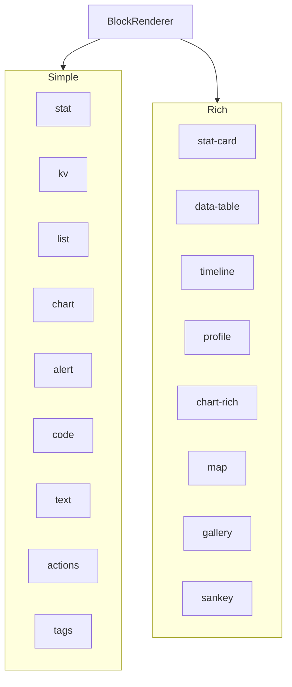
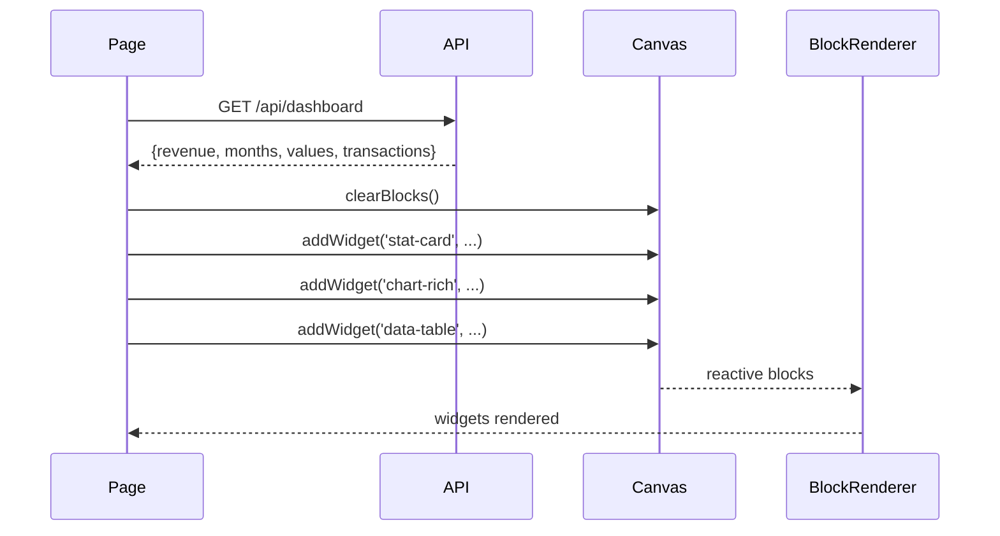

WebMCP Auto-UI ships with 26+ ready-to-use widget types. This tutorial shows you how to use them, customize them, and make them interact with each other. No need to create anything -- everything is already there.

## Goal

Discover and use the native widgets to build rich interfaces without writing custom components.

## Prerequisites

- The boilerplate is installed (see [Getting started](./boilerplate))
- Basic Svelte 5 knowledge (`$state`, `{#each}`)

## What you will build

An interactive dashboard using stat, chart-rich, data-table, timeline, and profile -- with dynamic updates and interaction handling.

---

## Widget catalog

### Simple widgets

| Widget | Description | Typical use |
|--------|-------------|-------------|
| `stat` | Key statistic (KPI) | Number with trend |
| `kv` | Key-value pairs | Metadata, properties |
| `list` | Ordered list | Text items |
| `chart` | Simple bar chart | Quick comparisons |
| `alert` | Notification/alert | Important messages |
| `code` | Code block with syntax highlighting | Code snippets |
| `text` | Text paragraph | Written content |
| `actions` | Action buttons | Calls to action |
| `tags` | Badges/tags | Filters, categories |

### Rich widgets

| Widget | Description | Typical use |
|--------|-------------|-------------|
| `stat-card` | Enhanced KPI with delta and color | Financial dashboard |
| `data-table` | Sortable table with columns | Data lists |
| `timeline` | Event chronology | Project history |
| `profile` | Profile card with avatar | Contact page |
| `trombinoscope` | Portrait grid | Teams |
| `json-viewer` | Interactive JSON tree | Debug, API |
| `hemicycle` | Parliamentary composition | Politics |
| `chart-rich` | Multi-series (bar, line, area, pie) | Comparative analysis |
| `cards` | Card grid | Catalogs |
| `grid-data` | Grid with cell highlights | Matrices |
| `sankey` | Flow diagram | Financial flows |
| `map` | Interactive Leaflet map | Geolocation |
| `log` | Log stream | Monitoring |
| `gallery` | Image gallery with lightbox | Portfolios |
| `carousel` | Slide carousel | Presentations |
| `d3` | D3.js visualizations | Advanced charts |
| `js-sandbox` | Custom JavaScript sandbox | Interactive code |



---

## Step 1: Import BlockRenderer

`BlockRenderer` is the entry point for displaying any widget. It automatically resolves the Svelte component matching the widget `type`:

```svelte
<script lang="ts">
  import { BlockRenderer } from '@webmcp-auto-ui/ui';
  import { canvas } from '@webmcp-auto-ui/sdk/canvas';
</script>
```

`BlockRenderer` takes three main props:
- `type`: the widget name (`'stat'`, `'data-table'`, etc.)
- `data`: the data in the format expected by the widget
- `id`: (optional) unique identifier for interactions

---

## Step 2: Create widgets programmatically

The `canvas` store provides methods to add widgets:

```svelte
<script lang="ts">
  function addStatWidget() {
    canvas.addWidget('stat', {
      label: 'Total sales',
      value: '$12,450',
      trend: '+12%',
      trendDir: 'up',
    });
  }

  function addChartWidget() {
    canvas.addWidget('chart', {
      title: 'Monthly sales',
      bars: [
        ['January', 120],
        ['February', 190],
        ['March', 150],
      ],
    });
  }

  function addTableWidget() {
    canvas.addWidget('data-table', {
      title: 'Active customers',
      columns: [
        { key: 'name', label: 'Name' },
        { key: 'email', label: 'Email' },
        { key: 'status', label: 'Status' },
      ],
      rows: [
        { name: 'Alice Dupont', email: 'alice@example.com', status: 'Active' },
        { name: 'Bob Martin', email: 'bob@example.com', status: 'Suspended' },
        { name: 'Charlie Lenoir', email: 'charlie@example.com', status: 'Active' },
      ],
    });
  }
</script>

<button onclick={addStatWidget}>Add KPI</button>
<button onclick={addChartWidget}>Add chart</button>
<button onclick={addTableWidget}>Add table</button>
```

**Checkpoint**: click each button and verify the corresponding widget appears.

---

## Step 3: Display widgets

Loop through the canvas blocks and render them with `BlockRenderer`:

```svelte
<div class="widgets-grid">
  {#each canvas.blocks as block (block.id)}
    <BlockRenderer
      id={block.id}
      type={block.type}
      data={block.data}
    />
  {/each}
</div>

<style>
  .widgets-grid {
    display: grid;
    grid-template-columns: repeat(auto-fit, minmax(300px, 1fr));
    gap: 1rem;
    padding: 1rem;
  }
</style>
```

:::tip[Responsive by default]
Use `grid-template-columns: repeat(auto-fit, minmax(300px, 1fr))` for a responsive grid that adapts to screen width.
:::

---

## Widget gallery with examples

### Enhanced KPI (`stat-card`)

```svelte
<script lang="ts">
  canvas.addWidget('stat-card', {
    label: 'Conversion rate',
    value: '3.2',
    unit: '%',
    trend: 'up',
    delta: '+0.5%',
    variant: 'success',   // 'success' | 'warning' | 'danger' | 'info'
  });
</script>
```

### Rich multi-series chart (`chart-rich`)

5 chart types in a single widget:

```svelte
<script lang="ts">
  canvas.addWidget('chart-rich', {
    title: 'Quarterly performance',
    type: 'bar',  // 'bar' | 'line' | 'area' | 'pie' | 'donut'
    labels: ['Q1', 'Q2', 'Q3', 'Q4'],
    data: [
      { label: 'Sales', values: [120, 190, 150, 180], color: '#3b82f6' },
      { label: 'Profit', values: [80, 140, 110, 150], color: '#10b981' },
    ],
  });
</script>
```

### Event timeline (`timeline`)

```svelte
<script lang="ts">
  canvas.addWidget('timeline', {
    title: 'Project history',
    events: [
      { title: 'Kickoff', date: '2024-01-15', status: 'done', description: 'Project launched' },
      { title: 'First release', date: '2024-02-28', status: 'done', description: 'MVP delivered' },
      { title: 'Optimizations', date: '2024-04-01', status: 'active', description: 'In progress' },
      { title: 'Public launch', date: '2024-05-01', status: 'pending', description: 'Scheduled' },
    ],
  });
</script>
```

### Profile card (`profile`)

```svelte
<script lang="ts">
  canvas.addWidget('profile', {
    name: 'Alice Dupont',
    subtitle: 'Senior Developer',
    badge: { text: 'Online', variant: 'success' },
    fields: [
      { label: 'Team', value: 'Backend' },
      { label: 'Location', value: 'Paris, France' },
      { label: 'Since', value: '2021' },
    ],
    stats: [
      { label: 'Projects', value: '12' },
      { label: 'Contributors', value: '45' },
    ],
  });
</script>
```

### Interactive map (`map`)

```svelte
<script lang="ts">
  canvas.addWidget('map', {
    title: 'Office locations',
    center: { lat: 46.6, lng: 2.3 },
    zoom: 6,
    markers: [
      { lat: 48.86, lng: 2.35, label: 'Paris (HQ)' },
      { lat: 43.60, lng: 1.44, label: 'Toulouse' },
      { lat: 45.76, lng: 4.84, label: 'Lyon' },
    ],
  });
</script>
```

### Code with syntax highlighting (`code`)

```svelte
<script lang="ts">
  canvas.addWidget('code', {
    lang: 'typescript',
    content: `interface User {
  id: number;
  name: string;
  email: string;
}`,
  });
</script>
```

### JSON viewer (`json-viewer`)

```svelte
<script lang="ts">
  canvas.addWidget('json-viewer', {
    title: 'Data structure',
    data: {
      user: { id: 123, name: 'Alice', tags: ['admin', 'developer'] },
    },
    maxDepth: 3,
    expanded: true,
  });
</script>
```

---

## Handling interactions

Some widgets emit events when the user interacts with them. Use the `oninteract` prop to capture them:

```svelte
<BlockRenderer
  id={block.id}
  type={block.type}
  data={block.data}
  oninteract={(type, action, payload) => {
    console.log(`Widget ${type} -- action: ${action}`, payload);
  }}
/>
```

Events emitted by widgets:

| Widget | Action | Payload |
|--------|--------|---------|
| `data-table` | `rowclick` | Row object |
| `timeline` | `eventclick` | Event object |
| `cards` | `cardclick` | Card object |
| `gallery` | `imageclick` | `{image, index}` |
| `tags` | `tagclick` | `{tag, index}` |
| `actions` | `click` | `{action, index}` |

---

## Dynamic updates

Modify a widget after creation using canvas methods:

```svelte
<script lang="ts">
  function updateStat(blockId: string) {
    canvas.updateBlock(blockId, {
      value: '$15,000',
      trend: '+20%',
      trendDir: 'up',
    });
  }

  function removeWidget(blockId: string) {
    canvas.removeBlock(blockId);
  }

  function clearAll() {
    canvas.clearBlocks();
  }
</script>
```

:::note[Automatic reactivity]
Updates via `canvas.updateBlock()` automatically trigger re-rendering of the affected Svelte component.
:::

---

## Theme and customization

Wrap your widgets in a `ThemeProvider` to apply a consistent theme:

```svelte
<script lang="ts">
  import { ThemeProvider } from '@webmcp-auto-ui/ui';
</script>

<ThemeProvider defaultMode="light" overrides={{
  'color-accent': '#2d6a4f',
  'color-bg': '#f4f1eb',
}}>
  <div class="widgets-grid">
    {#each canvas.blocks as block (block.id)}
      <BlockRenderer id={block.id} type={block.type} data={block.data} />
    {/each}
  </div>
</ThemeProvider>
```

All native widgets respect theme tokens. Changing `color-accent` updates the accent color across all charts, progress bars, and buttons.

---

## Complete use case: Dynamic dashboard

```svelte
<script lang="ts">
  import { BlockRenderer } from '@webmcp-auto-ui/ui';
  import { canvas } from '@webmcp-auto-ui/sdk/canvas';
  import { onMount } from 'svelte';

  function buildDashboard(data: any) {
    canvas.clearBlocks();
    canvas.addWidget('stat-card', {
      label: 'Monthly revenue',
      value: data.revenue.toLocaleString('en-US'),
      unit: '$',
      trend: 'up',
      variant: 'success',
    });
    canvas.addWidget('chart-rich', {
      title: 'Trend',
      type: 'line',
      labels: data.months,
      data: [{ label: 'Revenue', values: data.values }],
    });
    canvas.addWidget('data-table', {
      title: 'Latest transactions',
      columns: [
        { key: 'date', label: 'Date' },
        { key: 'amount', label: 'Amount' },
        { key: 'status', label: 'Status' },
      ],
      rows: data.transactions,
    });
  }

  onMount(async () => {
    const data = await fetch('/api/dashboard').then(r => r.json());
    buildDashboard(data);
  });
</script>

<div class="dashboard">
  {#each canvas.blocks as block (block.id)}
    <BlockRenderer id={block.id} type={block.type} data={block.data} />
  {/each}
</div>
```



---

## Troubleshooting

| Problem | Likely cause | Solution |
|---------|-------------|----------|
| Widget shows as raw JSON | Unrecognized type | Check spelling (e.g., `data-table`, not `datatable`) |
| Empty table | `rows` missing or empty | Ensure `rows` is an array of objects |
| Invisible chart | `labels` or `data` missing | Both properties are required for `chart-rich` |
| Theme not applied | No `ThemeProvider` | Wrap your widgets in a `<ThemeProvider>` |

---

## Going further

- **Create your own widgets**: follow [Create a custom widget](./create-custom-widget)
- **Advanced theming**: see [Build a themed demo](./themed-demo)
- **Cross-widget interactions**: use the FONC bus or Svelte reactive filters to connect widgets

## See also

- [Create a custom widget](./create-custom-widget)
- [Connect an MCP server](./connect-mcp-server)
- [Widget catalog](../concepts/ui-widgets)
