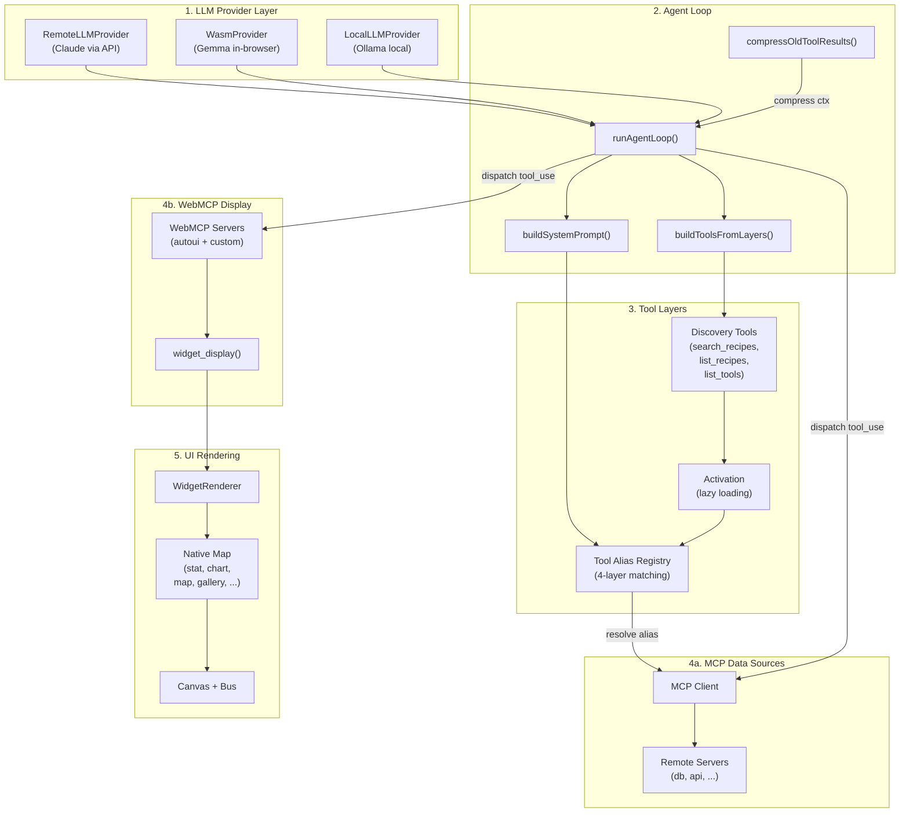

## Vue d'ensemble

WebMCP Auto-UI est composé de **4 couches** :

1. **LLM Provider** : Interface avec Claude, Gemma, ou Haiku
2. **Agent Loop** : Orchestration des appels d'outils et gestion du contexte
3. **Tool Layers** : Abstraction unifiée des outils MCP + WebMCP
4. **UI Rendering** : Widgets natifs + dispatcher

### Diagramme architectural complet



## Agent Loop Flow

```mermaid
sequenceDiagram
    participant User
    participant Agent as runAgentLoop()
    participant LLM as LLM Provider
    participant Tools as Tool Dispatch
    participant MCP as MCP Client
    participant WebMCP as WebMCP Server
    participant UI as Widget Renderer
    
    User->>Agent: chat message
    Agent->>Agent: Build discovery tools
    
    loop Until end_turn or max_iterations
        Agent->>LLM: chat(messages, activeTools)
        LLM-->>Agent: response + tool_calls
        
        alt No tool calls
            Agent->>Agent: finishedNormally = true
            break
        end
        
        Agent->>Agent: Add assistant response to messages
        
        for each tool_call
            Agent->>Tools: Resolve alias + dispatch
            
            alt MCP tool
                Tools->>MCP: callTool(name, args)
                MCP-->>Tools: result
            else WebMCP tool (widget_display)
                Tools->>WebMCP: executeTool(name, args)
                WebMCP-->>Tools: {widget, data, id}
                Tools->>UI: onWidget callback
                UI-->>Tools: widgetId
            else WebMCP tool (recall)
                Tools->>Agent: resultBuffer[id]
                Agent-->>Tools: full result
            end
            
            Tools-->>Agent: tool_result (truncated if > 10KB)
            Agent->>Agent: Store in resultBuffer[tool_use_id]
        end
        
        Agent->>Agent: Add tool_results to messages
        Agent->>Agent: compressOldToolResults(messages)
        
        alt No render yet && iterationsWithoutRender >= 4
            Agent->>Agent: Strip discovery tools to force render
        end
        
        alt No render yet && iterationsWithoutRender >= 5
            Agent->>Agent: Nudge: "Call widget_display() NOW"
        end
    end
    
    Agent-->>User: AgentResult {text, toolCalls, metrics}
```

## Tool Layers — Résolution et Dispatch

### Qu'est-ce qu'une Tool Layer ?

Une **ToolLayer** encapsule un serveur d'outils (MCP ou WebMCP) :

```typescript
interface ToolLayer {
  protocol: 'mcp' | 'webmcp';
  serverName: string;
  description?: string;
  tools: McpToolDef[] | WebMcpToolDef[];
}
```

### Nommage unifié : `{serverName}_{protocol}_{toolName}`

Tous les outils reçoivent un préfixe unique :
- `recipes_mcp_search_recipes` → MCP server "recipes"
- `autoui_webmcp_stat` → WebMCP server "autoui"
- `autoui_webmcp_widget_display` → Built-in display tool

### 4-layer Canonical Tool Matching

L'agent doit connaître quels outils correspondent à :
- `search_recipes` — Chercher une recette
- `list_recipes` — Lister toutes les recettes
- `get_recipe` — Lire une recette complète

Le système les trouve via 4 couches de heuristique :

```typescript
// Layer 1 — Exact match par nom
if (toolName === 'search_recipes') → found!

// Layer 2 — Décomposer nom en tokens (action, resource)
'find_templates' → action='find' + resource='templates'
if (action in SEARCH_ACTIONS && resource in RESOURCES) → found!

// Layer 3 — Scanner la description
if (description.includes('recipe')) → likely a recipe tool

// Layer 4 — Fallback : pas de recettes trouvées
// → lister les outils bruts disponibles
```

### Lazy Loading et Activation

Au démarrage, seuls les **discovery tools** sont actifs :
```typescript
const disc = buildDiscoveryToolsWithAliases(layers);
// → [search_recipes, list_recipes, search_tools, list_tools, ...]
```

Quand l'agent appelle un outil d'un serveur pour la première fois :
```typescript
// Détecter: "autoui_webmcp_stat" → serverName="autoui", protocol="webmcp"
if (!activatedServers.has("autoui_webmcp")) {
  activateServerTools(currentTools, layer); // Ajouter tous les outils du serveur
}
```

Cela économise le contexte initial en masquant les implémentations détaillées.

## Compression du contexte

Après 2+ itérations, les anciens résultats d'outils sont tronqués :

```typescript
// Avant (300+ chars)
{
  "content": "SELECT * FROM users;... [5000 rows] ...",
  "type": "tool_result"
}

// Après (économise ~2KB)
{
  "content": "SELECT * FROM users;... [recall('toolu_xxx') pour résultat complet, 125000 chars]",
  "type": "tool_result"
}
```

L'agent peut appeler `recall('toolu_xxx')` pour récupérer le résultat complet.

## Widget Registry et Rendering

### Native Map

La UI expose une **static map** de 30+ widgets natifs :

```typescript
const NATIVE_MAP = {
  'stat': { component: StatBlock, props: (data) => ({ data }) },
  'chart': { component: ChartBlock, ... },
  'map': { component: MapView, ... },
  'gallery': { component: Gallery, ... },
  // ...
};
```

### Résolution de rendering

Quand un widget doit être rendu :

1. **Chercher dans les serveurs WebMCP connectés** → custom renderers
2. **Sinon chercher dans NATIVE_MAP** → widgets natifs
3. **Sinon** → placeholder `[widget_type]`

```typescript
// WidgetRenderer.svelte
const customRenderer = servers?.find(s => s.getWidget(type))?.renderer;
const nativeEntry = NATIVE_MAP[type];

if (customRenderer) {
  // Renderer custom (framework component ou vanilla)
} else if (nativeEntry) {
  // Widget natif
} else {
  // Fallback
}
```

### SafeImage — Validation d'URLs

Puisque les agents peuvent halluciner des URLs d'images, **SafeImage** valide les URLs :

```typescript
const VALID_PREFIXES = ['http://', 'https://', 'data:', '/'];

if (!src?.startsWith(...VALID_PREFIXES)) {
  // Afficher placeholder au lieu de 
}
```

## System Prompt — Cascade de découverte

Le prompt généré suit une cascade de 4 étapes :

```text
ÉTAPE 1 — Recherche de recette (search_recipes)
   ↓ Si pas de résultat
ÉTAPE 1b — Liste des recettes (list_recipes)
   ↓ Si pas de recettes
ÉTAPE 1c — Recherche d'outils (search_tools)
   ↓ Si pas d'outils
ÉTAPE 1d — Liste des outils (list_tools)
   ↓
ÉTAPE 2 — Lecture recette (get_recipe)
   ↓
ÉTAPE 3 — Exécution (utiliser recette ou outil)
   ↓
ÉTAPE 4 — Affichage UI (widget_display)
```

Ceci garantit que :
- L'agent cherche d'abord des **recettes** (workflows pré-définis)
- En fallback, il cherche des **outils bruts**
- Il lit la documentation complète avant d'exécuter
- Il affiche toujours un résultat UI (pas juste du texte)

## Canvas Store — État UI

Le canvas centralise l'état UI :

```typescript
// @webmcp-auto-ui/sdk
const canvas = {
  blocks: [], // Widgets actuels
  mode: 'chat' | 'drag',
  llm: 'claude-3-5-sonnet-20241022',
  mcpUrl: 'http://localhost:3001',
  mcpConnected: boolean,
  messages: [], // Historique chat
  
  // Méthodes
  addWidget(type, data),
  removeBlock(id),
  updateBlock(id, data),
  addMsg(role, content),
};
```

## FONC Message Bus

Composants communiquent via un message bus inspiré par Smalltalk (FONC) :

```typescript
// Envoyer un message
bus.broadcast('myComponent', 'data-changed', { newValue: 42 });

// Écouter
const unsub = bus.subscribe(['data-changed'], (msg) => {
  console.log(msg.payload);
});

// Lier des widgets (visualiser les relations)
bus.link(['widget1_id', 'widget2_id'], 'groupId');
```

Cette approche découple les composants et permet les interactions sans props drilling.
