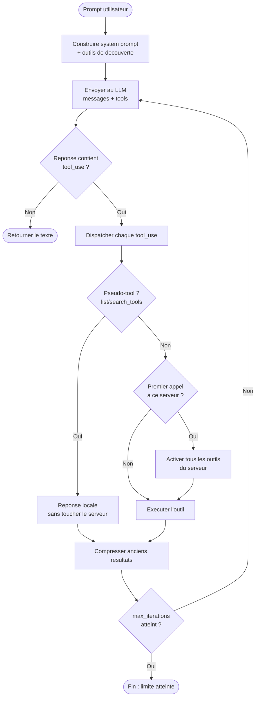
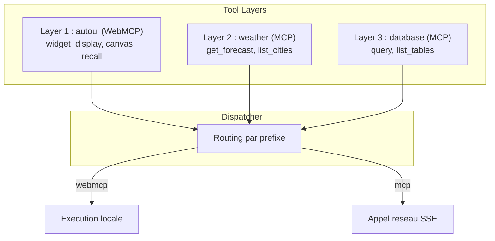
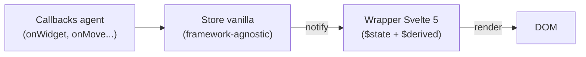
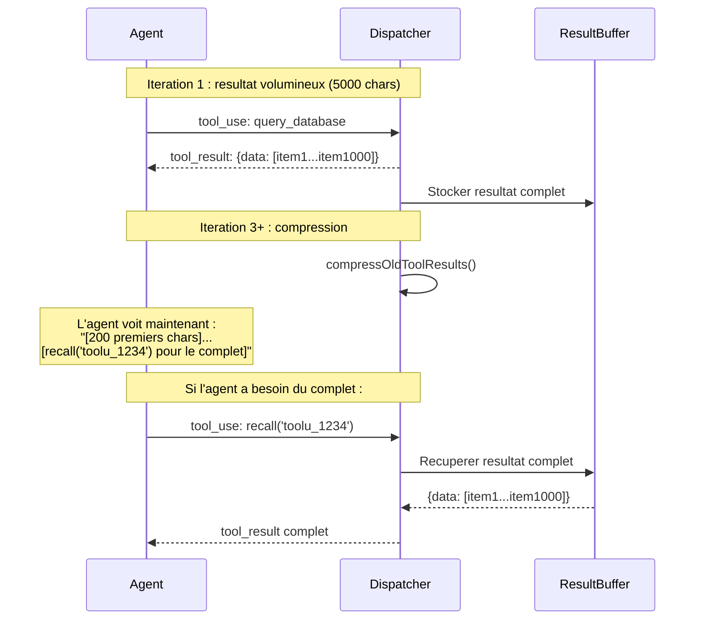

WebMCP Auto-UI repose sur une **architecture modulaire** articulee autour de quatre concepts fondamentaux : la **boucle agentic**, les **tool layers**, le **widget registry** et le **canvas reactif**. Cette page explique le *pourquoi* de chaque choix architectural et montre comment les pieces s'assemblent.

## Architecture globale


L'architecture se decompose en trois zones :

1. **Frontend** (Svelte 5) : canvas reactif, widgets, panneau de chat, selecteur LLM.
2. **Moteur agent** (TypeScript pur) : boucle iterative, providers LLM, dispatcher d'outils.
3. **Serveurs d'outils** : MCP (distants, via SSE) et WebMCP (locaux, dans le navigateur).

Le moteur agent est volontairement framework-agnostic. Il peut tourner dans un Web Worker, un serveur Node.js ou directement dans le thread principal du navigateur.

## Boucle agentic detaillee


La boucle agent est implementee dans `runAgentLoop()`. Voici son fonctionnement, etape par etape :



**Pourquoi une boucle et pas un appel unique ?** Parce qu'un agent doit pouvoir :
- Decouvrir les outils disponibles (iteration 1)
- Charger une recette (iteration 2)
- Appeler l'outil reel (iteration 3)
- Ajuster la mise en page (iteration 4)

Chaque iteration enrichit le contexte. La compression automatique (`compressOldToolResults`) evite que l'historique ne sature la fenetre de contexte.

## Providers LLM

Le package `@webmcp-auto-ui/agent` expose trois providers interchangeables. Tous implementent la meme interface :

```typescript
interface LLMProvider {
  readonly name: string;
  readonly model: string;
  chat(
    messages: ChatMessage[],
    tools: ProviderTool[],
    options?: {
      signal?: AbortSignal;
      cacheEnabled?: boolean;
      system?: string;
      maxTokens?: number;
      temperature?: number;
      onToken?: (token: string) => void;
    }
  ): Promise<LLMResponse>;
}
```

Cette interface unique permet de passer d'un provider a l'autre sans modifier le code de l'agent. Le choix du provider est une decision d'execution, pas d'architecture.

### RemoteLLMProvider (LLM distant)

Provider pour toute API compatible OpenAI (e.g. Claude/Anthropic, Gemini/Google, ChatGPT/OpenAI, Le Chat/Mistral, Qwen) via un proxy HTTP. Le proxy est un endpoint SvelteKit (`/api/chat`) qui ajoute la cle API cote serveur :

```typescript
import { RemoteLLMProvider } from '@webmcp-auto-ui/agent';

const provider = new RemoteLLMProvider({
  proxyUrl: '/api/chat',
});

// Changer de modele a la volee
provider.setModel('haiku');   // Rapide, economique
provider.setModel('sonnet');  // Equilibre
provider.setModel('opus');    // Raisonnement profond
```

**Pourquoi un proxy ?** Pour ne jamais exposer la cle API au navigateur. Le proxy ajoute l'en-tete d'autorisation avant de relayer la requete vers l'API du provider LLM.

### WasmProvider (Gemma 4 LiteRT)

Provider in-browser utilisant Gemma 4 via le runtime LiteRT. Le modele tourne entierement dans le navigateur, sans appel reseau :

```typescript
import { WasmProvider } from '@webmcp-auto-ui/agent';

const provider = new WasmProvider({
  model: 'gemma-e2b',       // 2B parametres
  contextSize: 32_768,
  onProgress: (progress, status, loaded, total) => {
    // Afficher la progression du telechargement
  },
  onStatusChange: (status) => {
    // 'idle' | 'loading' | 'ready' | 'error'
  },
});

await provider.initialize();
```

| Variante | Parametres | Contexte | Usage |
|----------|-----------|----------|-------|
| `gemma-e2b` | 2B | 32K | Rapide, ideal pour les demos |
| `gemma-e4b` | 4B | 32K | Plus capable, requiert plus de RAM |

Le `WasmProvider` supporte nativement le format `<|tool_call|>` de Gemma pour le tool calling sans intermediaire. Le parseur detecte ce format et le convertit en blocs `tool_use` compatibles avec la boucle agent.

:::tip[ONNX Runtime via CDN]
Les binaires ONNX Runtime (~33 Mo) sont charges depuis un CDN au lieu d'etre embarques dans le bundle de l'app. Cela reduit drastiquement la taille du build.
:::

### LocalLLMProvider (Ollama)

Provider pour les modeles locaux via Ollama. Utile pour le developpement hors ligne ou les modeles non supportes par les autres providers :

```typescript
import { LocalLLMProvider } from '@webmcp-auto-ui/agent';

const provider = new LocalLLMProvider({
  backend: 'ollama',
  model: 'llama3.2',
  baseUrl: 'http://localhost:11434',
});
```

### Factory

La fonction `createProvider` instancie le bon provider selon la configuration :

```typescript
import { createProvider } from '@webmcp-auto-ui/agent';

const claude = createProvider({ type: 'remote', model: 'sonnet', proxyUrl: '/api/chat' });
const gemma = createProvider({ type: 'wasm', model: 'gemma-e4b' });
const ollama = createProvider({ type: 'local', model: 'llama3.2', baseUrl: 'http://localhost:11434' });
```

### Composant `<LLMSelector>`

Le selecteur unifie les trois providers dans un seul composant UI Svelte. Il affiche les modeles disponibles et gere le chargement de Gemma via `<ModelLoader>` :

```svelte
<script>
  import { LLMSelector, ModelLoader } from '@webmcp-auto-ui/ui';

  let selectedModel = $state('sonnet');
</script>

<LLMSelector bind:value={selectedModel} />
{#if selectedModel.startsWith('gemma')}
  <ModelLoader model={selectedModel} />
{/if}
```

## Tool Layers (couches d'outils)

Chaque **couche** represente un **serveur** (MCP ou WebMCP). Cette abstraction permet au dispatcher de router les appels de maniere transparente, quel que soit le protocole.

```typescript
interface ToolLayer {
  protocol: 'mcp' | 'webmcp';
  serverName: string;
  description?: string;
  tools: WebMcpToolDef[] | McpToolDef[];
}
```



**Pourquoi des couches ?** Pour decouvrir les outils progressivement. Au lieu de charger des centaines d'outils au demarrage (ce qui saturerait le contexte LLM), chaque couche est activee a la demande.

### Phase 1 : Discovery (demarrage)

Au lancement, seuls les **outils de decouverte** sont disponibles :

```typescript
const discoveryTools = buildDiscoveryToolsWithAliases(layers);
```

Ces outils permettent a l'agent d'explorer ce qui est disponible sans activer les serveurs :

| Outil | Role |
|-------|------|
| `{server}_{proto}_search_recipes(query)` | Chercher une recette par mot-cle |
| `{server}_{proto}_list_recipes()` | Lister toutes les recettes |
| `{server}_{proto}_get_recipe(name)` | Charger une recette complete (schema, exemples) |
| `{server}_{proto}_search_tools(query)` | Chercher un outil par nom ou description |
| `{server}_{proto}_list_tools()` | Lister les outils d'un serveur |

### Phase 2 : Activation (lazy loading)

Quand l'agent appelle un outil **reel** (non-discovery) pour la premiere fois :

```typescript
if (!activatedServers.has(serverKey)) {
  activatedServers.add(serverKey);
  const layer = layers.find(l => l.serverName === serverName);
  activeTools = activateServerTools(activeTools, layer);
  // Tous les outils du serveur deviennent disponibles
}
```

L'activation est irreversible dans une session : une fois un serveur active, tous ses outils restent disponibles jusqu'a la fin de la conversation.

### Phase 3 : Resolution canonique (4 couches de matching)

Pour les **serveurs MCP**, les noms d'outils sont imprevisibles (chaque serveur nomme ses outils differemment). Le resolver canonique normalise ces noms en 4 couches :


**Couche 1 -- Nom exact** : L'outil s'appelle `search_recipes` ? Correspondance directe.

**Couche 2 -- Decomposition en tokens** : L'outil s'appelle `find_recipe_by_keyword` ?
```
tokens: ["find", "recipe", "by", "keyword"]
→ test paires: (find, recipe) → SEARCH + RECIPE = "search_recipes" ✓
```

**Couche 3 -- Mots-cles dans la description** : La description contient "template" ou "library" ? Mapping vers `list_recipes`.

**Couche 4 -- Fallback** : Aucun match. L'outil est utilise tel quel, sans alias.

### Aliasing et dispatch transparent

Les alias sont stockes dans une map locale et utilises a chaque appel :

```typescript
const { prompt, aliasMap } = buildSystemPromptWithAliases(layers);
// aliasMap: {
//   "myserver_mcp_search_recipes" → "myserver_mcp_find_recipes_by_keyword"
// }

// Dans le dispatcher :
const resolvedName = aliasMap.get(toolName) ?? toolName;
```

L'agent voit des noms normalises (`search_recipes`), mais le dispatcher appelle les vrais noms du serveur MCP. Cette indirection rend le system prompt stable quelle que soit la convention de nommage du serveur.

## Widget Registry (WebMCP)

Un **serveur WebMCP** expose des **widgets** et des **outils de rendu**. Le serveur `autoui` (built-in) gere les 30+ widgets natifs :

```typescript
import { createWebMcpServer } from '@webmcp-auto-ui/core';

const autoui = createWebMcpServer('autoui', {
  description: 'Built-in UI widgets'
});

// Enregistrer un widget via une recette markdown avec frontmatter
autoui.registerWidget(`
---
widget: stat
description: Statistique cle (KPI, compteur)
schema:
  type: object
  required: [label, value]
  properties:
    label: { type: string }
    value: { type: string }
    trend: { type: string, enum: [up, down, stable] }
---
## Comment utiliser
Appeler widget_display('stat', {label: "X", value: "Y"})
`, vanillaStatRenderer);
```

La recette contient deux choses :
1. **Le frontmatter** : schema JSON Schema, description, nom du widget.
2. **Le corps markdown** : instructions en langage naturel pour l'agent.

L'agent lit le corps pour comprendre *quand* et *comment* utiliser le widget. Le schema garantit que les parametres sont valides.

### Outils natifs du serveur autoui

| Outil | Role |
|-------|------|
| `widget_display(name, params)` | Afficher un widget sur le canvas |
| `canvas(action, id, params)` | Manipuler les widgets (move, resize, style, update, clear) |
| `recall(id)` | Relire un resultat compresse |

## System Prompt construction

Le **system prompt** est construit dynamiquement a partir des couches d'outils. Il guide l'agent etape par etape :

```
ETAPE 1 — Recherche de recette : search_recipes(query)
ETAPE 1b — Liste des recettes : list_recipes()
ETAPE 1c — Recherche d'outils : search_tools(query)
ETAPE 1d — Liste des outils : list_tools()
ETAPE 2 — Lecture de recette : get_recipe(name)
ETAPE 3 — Execution : appeler l'outil avec les bons parametres
ETAPE 4 — Affichage UI : widget_display(name, params), canvas(action, ...)
```

**Pourquoi structurer le prompt en etapes ?** Pour forcer un comportement previsible. Sans ces instructions, les LLM ont tendance a inventer des noms d'outils ou a sauter directement a l'execution sans decouvrir le schema. Les etapes imposent : decouverte → lecture → execution → rendu.

## Canvas reactif (Svelte 5)

Le **canvas** est un **store reactif** qui gere l'etat des widgets de maniere centralisee :


### Architecture dual-store



Deux couches travaillent ensemble :

**Store vanilla** (`createCanvasVanilla()`) : un objet JavaScript pur avec un pattern pub/sub. Framework-agnostic, peut tourner dans un Worker ou un serveur Node.

```typescript
const canvasVanilla = createCanvasVanilla();
canvasVanilla.addWidget('stat', { label: 'Visiteurs', value: '1,234' });
// → declenche notify() → tous les listeners recoivent le changement
```

**Wrapper Svelte 5** (`createCanvas()`) : s'abonne au store vanilla et expose les donnees via `$state`. Chaque modification du store vanilla se propage automatiquement dans l'arbre de composants Svelte.

```typescript
const canvas = createCanvas();
// canvas.blocks est un $state qui reflete canvasVanilla.blocks
// Chaque ajout/suppression/modification se propage automatiquement
```

**Pourquoi deux couches ?** Pour permettre le rendu vanilla (`mountWidget()` dans `@webmcp-auto-ui/core`) sans dependre de Svelte. Le store vanilla est la source de verite ; Svelte est une vue parmi d'autres.

### Message Bus FONC

Pour la communication **inter-composants** sans couplage direct :

```typescript
import { bus } from '@webmcp-auto-ui/ui';

// Emettre un evenement
bus.broadcast('widget_sales', 'data-update', { newValue: 42 });

// Ecouter un type d'evenement
bus.subscribe(['data-update'], (msg) => {
  console.log('Recu de', msg.from, ':', msg.payload);
});

// Lier des widgets visuellement (fleches SVG)
bus.link(['widget_1', 'widget_2', 'widget_3'], 'group_sales');
```

Le bus FONC (Functions Over Networked Components) permet aux widgets de communiquer sans se connaitre mutuellement. Un widget `chart` peut ecouter les mises a jour d'un widget `data-table` sans import direct.

## Compression d'historique et recall

Pour economiser la fenetre de contexte LLM, les anciens resultats d'outils sont compresses automatiquement :



Ce mecanisme est transparent pour l'agent. Il voit un resultat tronque avec un indice `recall()`, et peut choisir de le relire ou de continuer avec l'apercu.

## Flux widget_display


Le flux complet d'un appel `widget_display` :

1. **Reception** : le dispatcher recoit le bloc `tool_use` avec le nom du widget et les parametres.
2. **Resolution** : le registre de widgets trouve la definition correspondante.
3. **Validation** : les parametres sont valides contre le JSON Schema du widget. Si la validation echoue, l'agent recoit le schema attendu et peut retenter.
4. **Sanitisation** : les URL d'images sont verifiees (pas de `data:` excessifs, pas d'URL malveillantes).
5. **Generation d'ID** : un identifiant unique `w_xxxxxx` est genere.
6. **Callback** : `onWidget(type, data)` est appele, ce qui ajoute le widget au canvas store.
7. **Rendu** : le `WidgetRenderer` Svelte detecte le nouveau widget et monte le composant correspondant.

## Resume architectural

| Composant | Responsabilite | Package |
|-----------|---------------|---------|
| **Agent Loop** | Boucle iterative LLM → outils → LLM | `agent` |
| **LLM Providers** | Remote (toute API compatible OpenAI), Gemma 4 (WASM), Ollama (local) | `agent` |
| **Tool Layers** | Structuration et decouverte des outils MCP + WebMCP | `agent` |
| **Dispatcher** | Routing par prefixe + activation lazy | `agent` |
| **Tool Resolver** | Matching canonique en 4 couches | `agent` |
| **System Prompt** | Instructions structurees + listing d'outils | `agent` |
| **Canvas Store** | Etat centralise des widgets (vanilla + Svelte) | `sdk` |
| **FONC Bus** | Communication inter-composants par evenements | `ui` |
| **Compression** | Economie de contexte + recall des resultats | `agent` |
| **Widget Registry** | Decouverte, validation de schemas, recettes markdown | `core` + `agent` |
| **WidgetRenderer** | Dispatch et montage des composants Svelte | `ui` |
| **HyperSkills** | Serialisation/deserialisation de canvas en URL | `sdk` |
| **Nano-RAG** | Compaction de contexte par embeddings | `agent` |

## FAQ

### Pourquoi WebMCP et pas juste MCP ?

MCP est un protocole reseau : un serveur expose des outils via HTTP/SSE, et un client les appelle a distance. WebMCP est un *complement* local qui tourne dans le navigateur. Il sert pour les widgets et les actions UI qui n'ont pas besoin de reseau.

### Pourquoi Svelte 5 ?

Svelte 5 (runes) offre une reactivite fine grain sans virtual DOM. Pour un canvas avec 30+ widgets qui se mettent a jour en temps reel, la performance est critique. Les runes (`$state`, `$derived`, `$effect`) permettent un controle precis de la reactivite.

### Pourquoi trois providers LLM ?

Chaque provider repond a un cas d'usage different :
- **Distant** (e.g. Claude, Gemini, ChatGPT) : qualite maximale, requiert une cle API et une connexion internet.
- **Gemma** : confidentialite totale (tout tourne dans le navigateur), pas de cle API.
- **Ollama** : modeles locaux pour le developpement hors ligne ou les modeles custom.

### Comment ajouter un nouveau widget ?

Ecrire une recette markdown avec frontmatter (schema JSON Schema) et l'enregistrer sur le serveur WebMCP avec `autoui.registerWidget()`. Pas besoin de modifier le code de l'agent.
