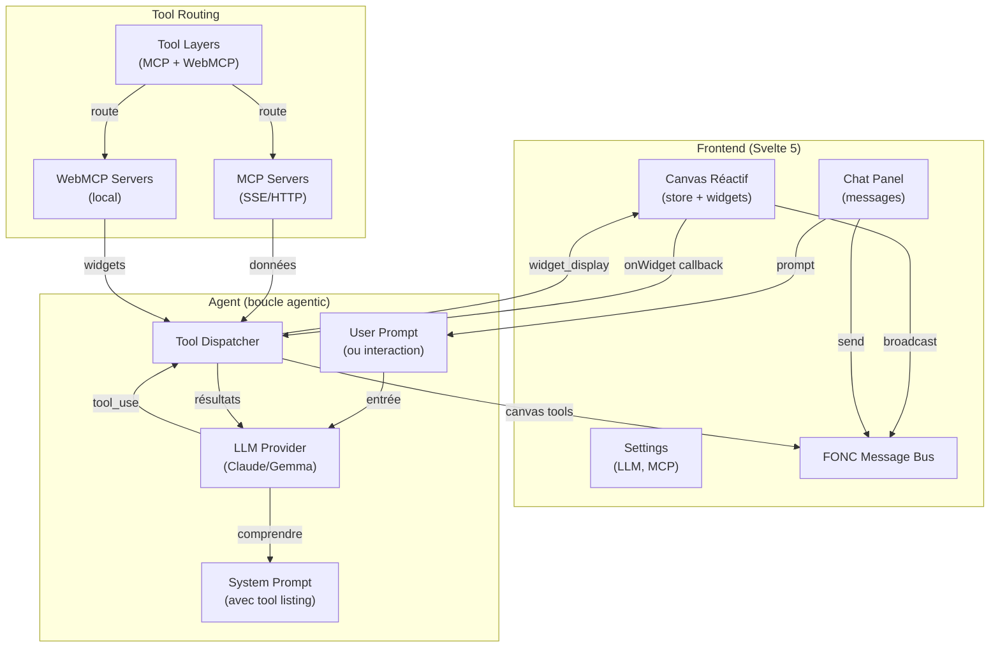
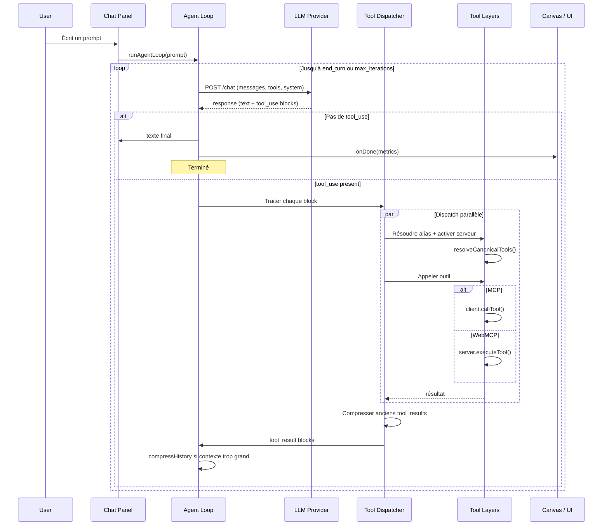
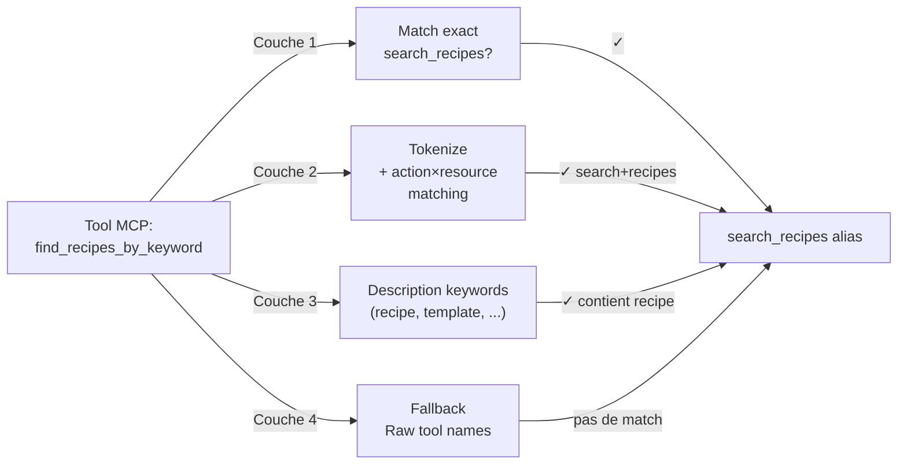
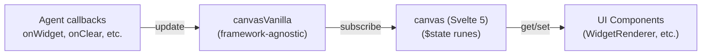
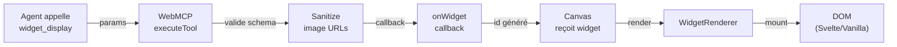

WebMCP Auto-UI utilise une **architecture modulaire** basée sur quatre concepts fondamentaux : la **boucle agentic**, les **tool layers**, le **composant registry** et le **canvas réactif**.

## Architecture globale



## Boucle agentic détaillée



## Tool Layers (couches d'outils)

Chaque **couche** représente un **serveur** (MCP ou WebMCP) :

```typescript
interface ToolLayer {
  protocol: 'mcp' | 'webmcp';
  serverName: string;
  description?: string;
  tools: WebMcpToolDef[] | McpToolDef[];
}
```

### Phase 1 : Discovery (démarrage)

Au lancement, seuls les **outils de discovery** sont disponibles :

```typescript
const discoveryTools = buildDiscoveryToolsWithAliases(layers);
// Retourne : [ {name: "server_mcp_search_recipes", ...}, 
//              {name: "server_mcp_list_tools", ...}, ... ]
```

**Outils discovery** :
- `{server}_{protocol}_search_recipes(query)` — cherche par mot-clé
- `{server}_{protocol}_list_recipes()` — liste toutes les recettes
- `{server}_{protocol}_get_recipe(name)` — charge une recette complète
- `{server}_{protocol}_search_tools(query)` — cherche les outils
- `{server}_{protocol}_list_tools()` — liste les outils disponibles

### Phase 2 : Activation (lazy loading)

Quand l'agent appelle un outil **réel** (non-discovery) :

```typescript
// Dispatcher détecte que c'est la 1ère fois
if (!activatedServers.has(serverKey)) {
  activatedServers.add(serverKey);
  const layer = layers.find(l => l.serverName === serverName);
  activeTools = activateServerTools(activeTools, layer);
  // ✅ Tous les outils du serveur deviennent disponibles
}
```

### Phase 3 : Canonical tool resolution (4-layer matching)

Pour les **MCP servers**, les outils sont matchés à des **rôles canoniques** :



**Couche 1** : Nom exact (`search_recipes`, `list_recipes`, `get_recipe`)

**Couche 2** : Décomposition en tokens + matching action/ressource
```typescript
// Exemple : "find_recipe_by_keyword"
// → tokens: ["find", "recipe", "by", "keyword"]
// → test toutes les paires (find, recipe) → SEARCH + RECIPE = "search_recipes" ✓
```

**Couche 3** : Keywords dans la description
```typescript
// Exemple : "Query our template library" 
// → contient "template" → LIST + template = "list_recipes" ✓
```

**Couche 4** : Fallback (pas d'alias, utiliser le nom brut)

### Aliasing et dispatch transparent

Une fois résolu, les **alias** sont stockés localement (thread-safe) :

```typescript
const { prompt, aliasMap } = buildSystemPromptWithAliases(layers);
// aliasMap: {
//   "myserver_mcp_search_recipes" → "myserver_mcp_find_recipes_by_keyword"
// }

// Dans le dispatcher :
const resolvedName = aliasMap.get(toolName) ?? toolName;
// "myserver_mcp_search_recipes" → "myserver_mcp_find_recipes_by_keyword"
```

## Component Registry (WebMCP)

Un **WebMCP server** expose des **widgets** + **outils de rendu** :

```typescript
// Création du serveur
const autoui = createWebMcpServer('autoui', {
  description: 'Built-in UI widgets'
});

// Enregistrement des widgets (via recette markdown avec frontmatter)
autoui.registerWidget(`
---
widget: stat
description: Statistique clé (KPI, compteur)
schema:
  type: object
  required: [label, value]
  properties:
    label: { type: string }
    value: { type: string }
---
## Comment utiliser
Appeler widget_display('stat', {label: "X", value: "Y"})
`, vanillaStatRenderer);

// Outils natifs (built-in)
autoui.addTool({
  name: 'widget_display',
  description: 'Afficher un widget sur le canvas',
  inputSchema: { ... },
  execute: async (params) => {
    // Valide le widget + renvoie { widget, data, id }
  }
});

autoui.addTool({
  name: 'canvas',
  description: 'Manipuler les widgets (move, resize, style, update)',
  execute: async (params) => { ... }
});

autoui.addTool({
  name: 'recall',
  description: 'Relire un résultat complet après compression',
  execute: async (params) => { ... }
});
```

## System Prompt construction

Le **system prompt** est construit dynamiquement à partir des outils disponibles :

```typescript
const systemPrompt = buildSystemPromptWithAliases(layers).prompt;
// Contient :
// 1. Instructions générales (agent = IA qui aide via recettes)
// 2. ÉTAPE 1 — Recherche de recette : liste search_recipes()
// 3. ÉTAPE 1b — Liste des recettes : liste list_recipes()
// 4. ÉTAPE 1c — Recherche d'outils : liste search_tools()
// 5. ÉTAPE 1d — Liste des outils : liste list_tools()
// 6. ÉTAPE 2 — Lecture de recette : liste get_recipe()
// 7. ÉTAPE 3 — Exécution : instructions précises
// 8. ÉTAPE 4 — Affichage UI : liste widget_display(), canvas()
```

**Avantage** : L'agent suit toujours un schéma logique sans deviation.

## Canvas réactif (Svelte 5)

Le **canvas** est un **store réactif** avec gestion d'état centralisée :



### Réactivité

```typescript
// Store vanilla (framework-agnostic)
const canvasVanilla = createCanvasVanilla();
canvasVanilla.addWidget('stat', { label: 'Visiteurs', value: '1,234' });
// → déclenche notify() → listeners reçoivent changement

// Wrapper Svelte 5
const canvas = createCanvas(); // subscribed to canvasVanilla
// canvas.blocks est un $state qui reflète canvasVanilla.blocks
```

### Message Bus FONC

Pour l'**inter-composants** sans appels directs :

```typescript
// Component A : émettre un message
bus.broadcast('component_a', 'data-update', { newValue: 42 });

// Component B : écouter
bus.subscribe(['data-update'], (msg) => {
  console.log('Reçu:', msg.payload);
});

// Linking widgets (FONC links)
bus.link(['widget_1', 'widget_2', 'widget_3'], 'group_sales');
// → affiche des flèches SVG entre les widgets
```

## Compression d'historique et recall

Pour économiser le **contexte LLM** :

```typescript
// Après 2 itérations, ancien tool_result > 300 chars est compressé
compressOldToolResults(messages, resultBuffer);
// Avant : { content: "très long résultat json..." }
// Après : { content: "premiers 200 chars... [recall('id_xyz') pour le complet]" }

// Si l'agent a besoin du résultat complet :
const fullResult = await client.callTool('recall', { id: 'id_xyz' });
// → intercepté par le dispatcher, utilise resultBuffer
```

## Flux widget_display



## Résumé architectural

| Composant | Responsabilité |
|-----------|-----------------|
| **Agent Loop** | Boucle LLM → tools → LLM |
| **Tool Layers** | Structuration MCP + WebMCP |
| **Dispatcher** | Routing + activation lazy |
| **Tool Resolver** | Matching canonique (4 couches) |
| **System Prompt** | Instructions + tool listing |
| **Canvas Store** | État centralisé widgets |
| **FONC Bus** | Communication inter-composants |
| **Compression** | Économie contexte + recall |
| **Widget Registry** | Découverte + validation schemas |
