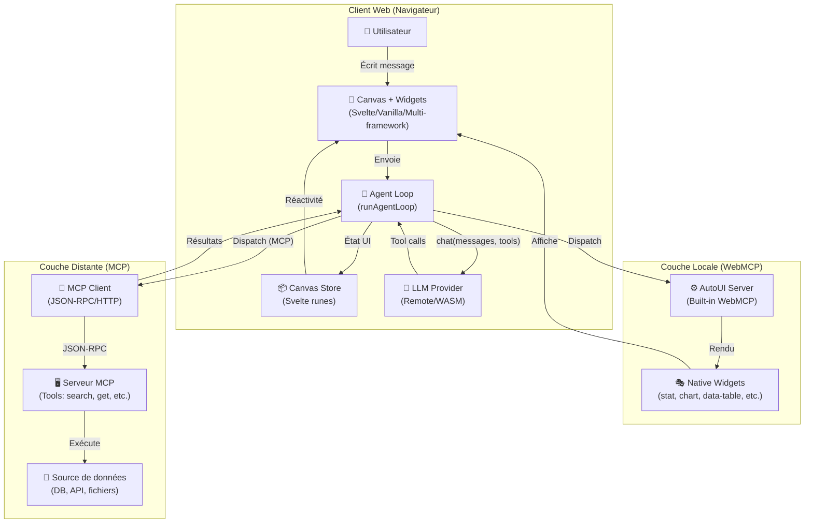
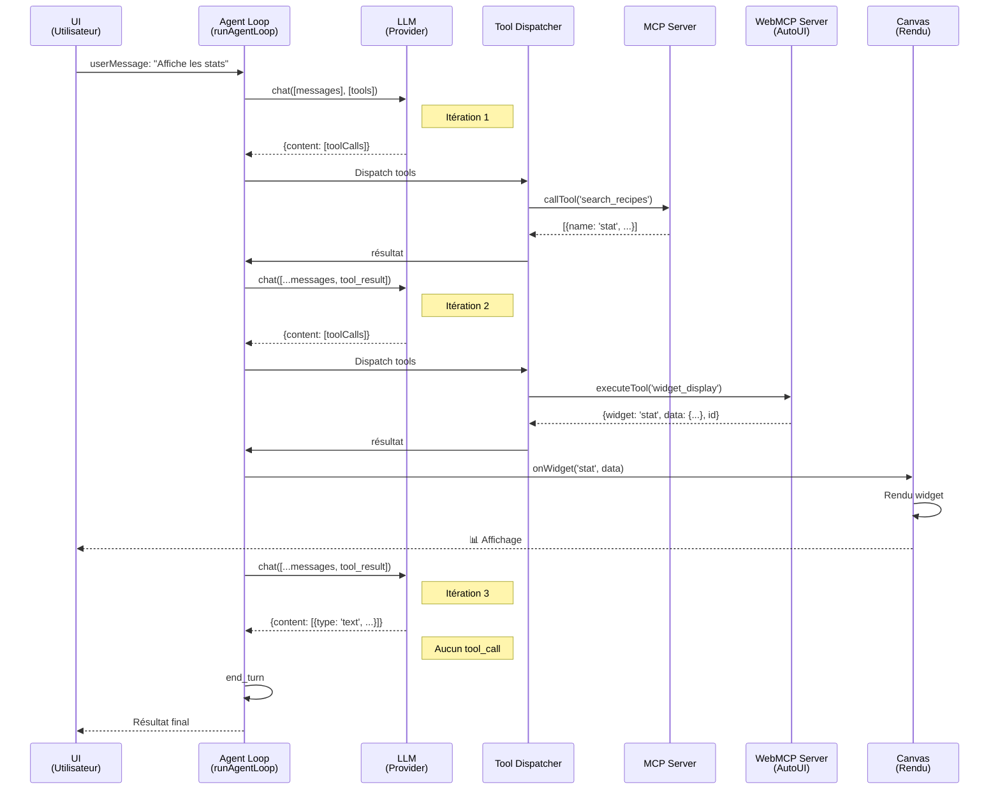
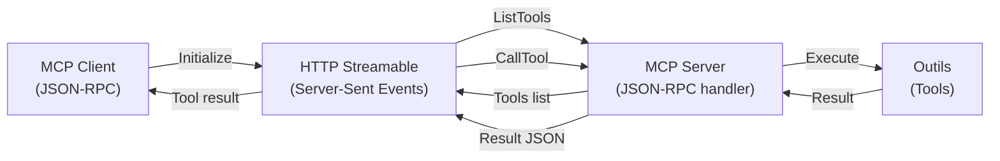
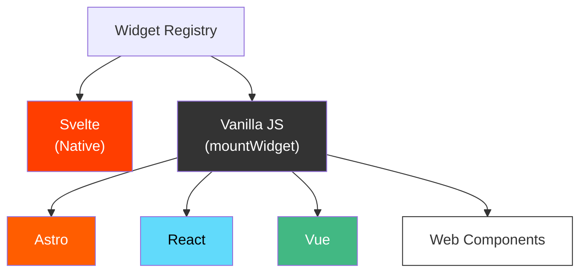

## Architecture globale



## Flux d'une itération agent



## Composants clés

### 1. Agent Loop (`packages/agent/src/loop.ts`)

Boucle itérative LLM avec gestion d'état complet :

```typescript
async function runAgentLoop(
  userMessage: string,
  options: AgentLoopOptions
): Promise<AgentResult>
```

**Responsabilités** :
- Maintenir l'historique des messages
- Appeler le fournisseur LLM
- Parser les tool calls
- Dispatcher les outils (MCP ou WebMCP)
- Compresser les résultats anciens pour économiser le contexte
- Gérer les callbacks (onToken, onWidget, etc.)

**Fonctionnalités spéciales** :
- **Discovery phase** : Tools de découverte (`search_recipes`, `get_recipe`) au démarrage
- **Activation lazy** : Outils additionnels activés au premier contact
- **Recall** : Récupération de résultats complets via `resultBuffer`
- **Nudging** : Injections de messages pour forcer le rendu si l'agent explore trop

### 2. Tool Layers (`packages/agent/src/tool-layers.ts`)

Abstraction unifiée pour les sources d'outils multiples :

```typescript
interface ToolLayer {
  protocol: 'mcp' | 'webmcp';
  serverName: string;
  description?: string;
  tools: McpToolDef[] | WebMcpToolDef[];
}
```

**Opérations** :
- `buildToolsFromLayers()` : Génère la liste de tous les outils (préfixés)
- `buildDiscoveryToolsWithAliases()` : Outils initialement disponibles (recettes + actions)
- `activateServerTools()` : Ajoute tous les outils d'un serveur au premier appel
- `resolveCanonicalTools()` : 4-layer matching pour identifier `search_recipes` et `get_recipe`

**Résolution canonique (4 couches)** :
1. **Layer 1** : Correspondance exacte (`tool.name === 'search_recipes'`)
2. **Layer 2** : Décomposition (tokenize + paires action×resource)
3. **Layer 3** : Scan description pour mots-clés
4. **Layer 4** : Fallback (outils bruts si aucune recette trouvée)

### 3. Canvas Store (`packages/sdk/src/stores/canvas.ts`)

Gestion d'état réactive des widgets et du contexte :

```typescript
interface Widget {
  id: string;
  type: WidgetType;
  data: Record<string, unknown>;
}

interface CanvasSnapshot {
  blocks: Widget[];
  mode: Mode;
  llm: LLMId;
  mcpUrl: string;
  mcpConnected: boolean;
  messages: ChatMsg[];
  generating: boolean;
  // ...
}
```

**Opérations** :
- `addWidget(type, data)` : Ajouter un widget au canevas
- `updateBlock(id, data)` : Mettre à jour les données d'un widget
- `removeBlock(id)` : Supprimer un widget
- `setBlocks(widgets)` : Charger un état complet

**Serialization** :
- `buildSkillJSON()` : Exporte l'état en JSON
- `buildHyperskillParam()` : Encode en URL compacte
- `loadFromParam()` : Décode et charge

### 4. AutoUI Server (`packages/agent/src/autoui-server.ts`)

Serveur WebMCP built-in fournissant :

**Widgets natifs** (30+) :
- Simples : `stat`, `kv`, `list`, `chart`, `alert`, `code`, `text`, `actions`, `tags`
- Riches : `data-table`, `timeline`, `profile`, `trombinoscope`, `json-viewer`, `hemicycle`, `chart-rich`, `cards`, `sankey`, `map`, `log`, `gallery`, `carousel`, `d3`, `js-sandbox`

**Outils d'action** :
- `widget_display(name, params)` : Afficher un widget
- `canvas(action, id, params)` : Manipuler les widgets (move, resize, style, update, clear)
- `recall(id)` : Récupérer le résultat complet d'une itération antérieure

**Outils de recette** (auto-générés) :
- `search_recipes(query)` : Lister les widgets disponibles
- `get_recipe(name)` : Obtenir le schéma et les instructions

### 5. Widget Renderer (`packages/ui/src/widgets/WidgetRenderer.svelte`)

Composant Svelte qui rencontre un widget type et sélectionne le bon renderer :

```svelte
<WidgetRenderer
  type="data-table"
  data={{rows: [...], columns: [...]}}
  servers={[autoui, customServer]}
  oninteract={(type, action, payload) => ...}
/>
```

**Logique de résolution** :
1. Chercher un renderer personnalisé dans les `servers` connectés
2. Chercher un renderer natif dans `NATIVE_MAP` (Svelte)
3. Fallback vanilla renderer si défini
4. Fallback texte `[type]` si aucun renderer trouvé

## Model Context Protocol (MCP)

### Client et Serveur



### Intégration dans l'agent

L'agent dispatche les tool calls vers MCP en 3 étapes :

1. **Parse le préfixe** : `{serverName}_{protocol}_{toolName}`
2. **Resolve l'alias** : canonique (e.g. `search_recipes`) → réel (e.g. `list_all_recipes`)
3. **Route** :
   - `protocol === 'mcp'` → `client.callTool(realToolName, input)`
   - `protocol === 'webmcp'` → `webmcpServer.executeTool(realToolName, input)`

## WebMCP (Local Display Layer)

Complément local du MCP pour la **couche présentation** :

### Widgets

Chaque widget est une **recette Markdown** :

```markdown
---
widget: stat
description: Statistique clé
schema:
  type: object
  required: [label, value]
  properties:
    label: { type: string }
    value: { type: string }
---

## Usage
Appeler widget_display('stat', {label: "Total", value: "42"}).
```

Frontmatter = schéma + métadonnées
Body = instructions pour l'agent

### Renderers

Deux approches :

**Native (Svelte)** :
```typescript
const NATIVE_MAP = {
  'stat': { component: StatBlock, props: (data) => ({ data }) },
  'chart': { component: ChartBlock, props: (data) => ({ data }) },
};
```

**Vanilla** :
```typescript
mountWidget(container, 'stat', {label: "Total", value: "42"}, [autoui]);
```

## LLM Providers

### Trois stratégies

1. **Remote (Anthropic)** : API Claude distante
   ```typescript
   new RemoteLLMProvider({
     apiKey: 'sk-ant-...',
     model: 'claude-3-5-sonnet-20241022',
   })
   ```

2. **WASM (Gemma)** : LLM in-browser
   ```typescript
   new WasmProvider({
     model: 'gemma-2b',
     wasmUrl: '...',
   })
   ```

3. **Local** : Serveur local (Ollama, etc.)
   ```typescript
   new LocalLLMProvider({
     baseUrl: 'http://localhost:11434',
     model: 'llama2',
   })
   ```

## Intégration Multi-Framework



Chaque framework peut enregistrer des **widget packs** :
- `packages/widgets-d3` : D3.js visualizations
- `packages/widgets-threejs` : 3D (Three.js)
- `packages/widgets-leaflet` : Cartographie
- `packages/widgets-plotly` : Graphiques interactifs
- etc.

## Persisance et Import/Export

### HyperSkill Encoding

Chaque canvas peut être sérialisé et compressé en URL compacte :

```typescript
const skill = {
  meta: { title: "Mon analyse", version: "1.0" },
  content: { blocks: [...], mode: "chat", llm: "sonnet" }
};

const url = await encodeHyperSkill(skill);
// https://demos.hyperskills.net?hs=Ez_xv...
```

Décodage (viewer app) :
```typescript
const skill = await decodeHyperSkill(urlOrParam);
canvas.setBlocks(skill.content.blocks);
```

## Sécurité

### Image URL Sanitization

Prévention des hallucinations d'URLs :

```typescript
const VALID_PREFIXES = ['http://', 'https://', 'data:', '/'];
const IMAGE_KEY_PATTERN = /^(src|image|avatar|...)$/i;

function sanitizeImageUrls(obj) {
  // Nullify invalid image URLs before rendering
}
```

Appliqué dans `widget_display()` avant le rendu.

### Schema Validation

Tous les inputs widget sont validés contre le schema :

```typescript
const validation = validateJsonSchema(params, widget.inputSchema);
if (!validation.valid) {
  return { error: 'Validation failed', details: validation.errors };
}
```

===
