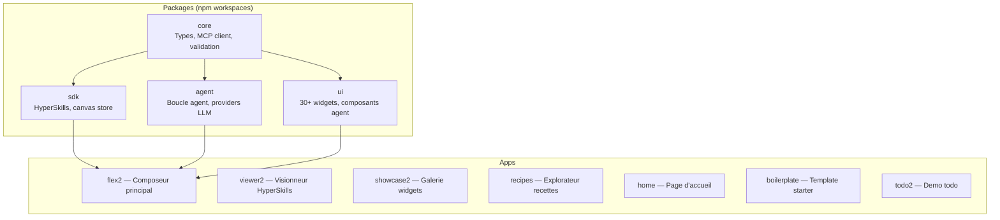

Ce guide documente les patterns a suivre et les pieges a eviter pour contribuer a WebMCP Auto-UI. Il est mis a jour au fil des incidents de production -- chaque regle correspond a un bug reel, pas a une convention theorique.

## Structure du monorepo



### Regle fondamentale : reutiliser les packages

Avant d'ecrire du code dans une app (`apps/*`), verifier d'abord si la fonctionnalite existe deja dans un package. Le tableau ci-dessous liste les imports disponibles :

| Besoin | Import | Package |
|--------|--------|---------|
| Serveur WebMCP | `createWebMcpServer` | `core` |
| Client MCP | `McpClient`, `McpMultiClient` | `core` |
| Validation JSON Schema | `validateJsonSchema` | `core` |
| Montage widget vanilla | `mountWidget` | `core` |
| Boucle agent | `runAgentLoop` | `agent` |
| Provider Claude | `RemoteLLMProvider` | `agent` |
| Provider Gemma | `WasmProvider` | `agent` |
| Provider Ollama | `LocalLLMProvider` | `agent` |
| Outils de decouverte | `buildDiscoveryTools`, `activateServerTools` | `agent` |
| Resolution canonique | `resolveCanonicalTools`, `toolAliasMap` | `agent` |
| Suivi de tokens | `TokenTracker` | `agent` |
| Nano-RAG | `ContextRAG` | `agent` |
| Selecteur LLM | `<LLMSelector>` | `ui` |
| Chargement Gemma | `<GemmaLoader>` | `ui` |
| Statut MCP | `<McpStatus>` | `ui` |
| Progression agent | `<AgentProgress>` | `ui` |
| Rendu widgets | `<WidgetRenderer>`, `<BlockRenderer>` | `ui` |
| Message bus FONC | `bus` | `ui` |
| Encodage HyperSkill | `encode`, `decode` | `sdk` |
| Canvas store | `canvas` via `@webmcp-auto-ui/sdk/canvas` | `sdk` |

:::caution[Jamais dupliquer]
Si une fonctionnalite existe dans un package, l'importer. Si elle n'existe pas mais devrait, la proposer comme ajout au package -- pas comme code inline dans l'app.
:::

## Svelte 5 -- Reactivite

Les regles suivantes viennent de bugs reels de production. Chaque regle est illustree par le code fautif et le code correct.

### Regle 1 : un `$effect` ne doit pas lire ET ecrire les memes etats

**Symptome** : `effect_update_depth_exceeded` en console, la page entiere se bloque (boutons sans effet, modals qui ne s'ouvrent pas).

**Cause** : Svelte 5 re-execute un `$effect` chaque fois qu'une de ses dependances reactives change. Si l'effet ecrit une valeur qu'il lit aussi, il se re-declenche lui-meme -- boucle infinie -- arret au bout de 5 iterations.

```svelte
<!-- INCORRECT -- lit gemmaStatus ET l'ecrit -->
$effect(() => {
  const llm = canvas.llm;
  if (gemmaStatus === 'ready') {   // lit gemmaStatus → tracke
    gemmaStatus = 'idle';          // ecrit gemmaStatus → re-run !
  }
  canvas.addMsg('system', llm);
});

<!-- CORRECT -- untrack() pour les lectures non-declencheuses -->
import { untrack } from 'svelte';

$effect(() => {
  const llm = canvas.llm;         // seule dependance trackee
  untrack(() => {
    if (gemmaStatus === 'ready') { // lu mais pas tracke
      gemmaStatus = 'idle';
    }
    canvas.addMsg('system', llm);
  });
});
```

**Regle** : isoler la ou les dependances qui doivent declencher le re-run, et wrapper tout le reste dans `untrack()`.

---

### Regle 2 : preferer `$derived` a `$effect` + `$state` pour les valeurs calculees

```svelte
<!-- INCORRECT -- $state ecrit dans un $effect -->
let paletteOpen = $state(true);
$effect(() => { paletteOpen = canvas.mode === 'drag'; });

<!-- CORRECT si la valeur est read-only -->
const paletteOpen = $derived(canvas.mode === 'drag');

<!-- CORRECT si la valeur est aussi ecrite manuellement (toggle utilisateur) -->
let paletteOpen = $state(true);
$effect(() => { paletteOpen = canvas.mode === 'drag'; });
// OK car l'effet ne LIT PAS paletteOpen
```

`$derived` est toujours preferable quand la valeur ne depend que d'autres etats reactifs. Utiliser `$effect` + `$state` uniquement quand la valeur est aussi modifiee par l'utilisateur (toggle, drag, etc.).

---

### Regle 3 : eviter les `$effect` redondants avec `onMount`

```svelte
<!-- INCORRECT -- double initialisation -->
let skills = $state([]);
$effect(() => { skills = listSkills(); });   // court-circuite par onMount
onMount(() => { skills = listSkills(); });

<!-- CORRECT -- une seule source de verite -->
let skills = $state([]);
onMount(() => { skills = listSkills(); });
```

Si `listSkills()` ne lit aucun etat reactif, le `$effect` ne se re-declenchera jamais apres le premier run. Il est strictement equivalent a `onMount`, mais plus trompeur a la lecture.

---

### Regle 4 : passer le modele LLM explicitement au provider

```typescript
// INCORRECT -- utilise toujours 'haiku' par defaut
return new RemoteLLMProvider({ proxyUrl: `${base}/api/chat` });

// CORRECT -- transmet le choix de l'utilisateur
return new RemoteLLMProvider({
  proxyUrl: `${base}/api/chat`,
  model: canvas.llm,
});
```

`RemoteLLMProvider` utilise `model ?? 'haiku'` comme valeur par defaut. Si l'utilisateur selecte `sonnet` dans le `<LLMSelector>`, il recevra quand meme `haiku` sans message d'erreur. Toujours passer `model` explicitement.

## Boucle agent -- loop.ts

### `onText` n'est appele qu'a la derniere iteration

Par defaut, `callbacks.onText` est appele uniquement quand le LLM repond sans `tool_use`. Comme le system prompt force l'usage d'outils, ce callback n'est jamais atteint dans le flux normal.

**Consequence** : la bulle "thinking" reste figee sur le dernier outil appele.

**Correctif** applique dans `loop.ts` : appeler `onText` aussi quand il y a du texte intermediaire avant les `tool_use` :

```typescript
// Texte intermediaire avant tool_use -- mise a jour live
if (lastText) callbacks.onText?.(lastText);
```

## Deploiement -- Integrite du build

### Toujours verifier le sha256 apres deploiement

Le script `deploy.sh` verifie automatiquement l'integrite apres chaque transfert. En cas de mismatch, le deploiement echoue avec rollback.

**Pourquoi ?** Sans cette verification, un deploiement peut "reussir" (pas d'erreur SCP, service `active`) mais servir l'ancien code si :
- Le build local etait perime
- Le SCP a ete interrompu silencieusement
- Le fichier cible etait en lecture seule

### Toujours rebuilder les apps

Le script rebuild automatiquement les apps via `npm run build` avant de copier. Avant ce correctif, les packages etaient recompiles mais les apps conservaient leur ancien `build/`, et les correctifs Svelte etaient perdus.

## Packages JS purs : wrapper type obligatoire

Quand un package npm est en JavaScript pur (sans types TypeScript), ne jamais l'importer directement dans le code TypeScript du projet. Creer un wrapper type dans le SDK :

```typescript
// packages/sdk/src/hyperskills.ts
// @ts-ignore — hyperskills is intentionally pure JS
import * as hs from 'hyperskills';

export const encode: (sourceUrl: string, content: string) => Promise<string> = hs.encode;
export const decode: (urlOrParam: string) => Promise<{ sourceUrl: string; content: string }> = hs.decode;
```

**Pourquoi pas `declare module` ?** Ignore par `moduleResolution: "NodeNext"` quand le JS est deja resolu.
**Pourquoi pas `.d.ts` dans `node_modules` ?** Supprime au prochain `npm install`.
**Pourquoi pas `allowJs` ?** Ne suffit pas avec `strict: true` + NodeNext.

## Tests

### Tests unitaires (Vitest)

```bash
npm run test          # Tous les tests
npm run test:watch    # Mode watch
npm run test:coverage # Avec couverture
```

### Tests end-to-end (Playwright)

Les tests e2e verifient les apps deployees sur `https://demos.hyperskills.net` :

```bash
npx playwright test                    # Tous les tests
npx playwright test --grep "Composer"  # Une suite
npx playwright test --grep "export"    # Un test precis
```

**Quand lancer les tests** :
- Apres chaque deploiement important
- Avant de marquer un bug comme resolu
- Apres un refactoring qui touche plusieurs composants

:::caution[Hydratation SvelteKit]
Les composants SSR sont dans le DOM des le chargement, mais les event handlers Svelte ne sont attaches qu'apres l'hydratation JavaScript. Un `page.click()` immediat apres `page.goto()` peut frapper un bouton non-hydrate.
:::

```typescript
// INCORRECT -- peut cliquer avant hydratation
await page.goto(url);
await page.click('button:has-text("export")');

// CORRECT -- attendre un element client-side
await page.goto(url);
await page.waitForSelector('select', { state: 'visible' });
await page.waitForTimeout(500);   // tick d'hydratation
await page.click('button:has-text("export")');
```

### Ce que les tests ne verifient pas

- Que le code deploye correspond au code local (c'est le role du sha256 dans `deploy.sh`)
- Les erreurs JavaScript silencieuses cote client (ajouter `page.on('pageerror')`)
- Les boucles reactives Svelte qui n'affectent pas les selecteurs CSS testes

## Debug -- Checklist "le correctif n'est pas en production"

Quand un correctif semble applique localement mais pas visible en production, suivre cette checklist dans l'ordre :

1. **Le build local est-il a jour ?**
   ```bash
   ls -la apps/flex2/build/index.js   # Verifier la date de modification
   ```

2. **Le fichier deploye correspond-il au build local ?**
   ```bash
   sha256sum apps/flex2/build/index.js
   ssh bot "sha256sum /opt/webmcp-demos/flex2/index.js"
   # Les deux hashes doivent etre identiques
   ```

3. **Le service a-t-il redemarre avec le bon fichier ?**
   ```bash
   ssh bot "systemctl status webmcp-flex2 --no-pager | head -20"
   ```

4. **Y a-t-il des erreurs JavaScript cote client ?**
   Ouvrir la console du navigateur (`F12`) sur l'URL de production.

## Documentation

### Synchronisation automatique

Apres toute modification de code qui change les exports, les tokens ou les types de widgets :

```bash
npm run docs:sync
```

Le CI verifie que la documentation est a jour a chaque push.

### Diagrammes Mermaid

Les diagrammes existants sont pre-rendus en SVG dans `docs-site/public/diagrams/`. Pour regenerer les SVG apres modification d'un diagramme :

```bash
npx @mermaid-js/mermaid-cli -i fichier.mmd -o docs-site/public/diagrams/fichier.svg --backgroundColor transparent
```

:::note[Mots reserves Mermaid]
Dans les `sequenceDiagram`, les mots `Loop`, `break`, `end`, `alt`, `opt`, `par` ne peuvent pas etre utilises comme noms de participants. Utiliser des alias ou des variantes.
:::

## Workflow de contribution

### 1. Creer une branche

```bash
git checkout -b feat/ma-feature
```

Conventions de nommage :
- `feat/` : nouvelle fonctionnalite
- `fix/` : correction de bug
- `refactor/` : restructuration sans changement fonctionnel
- `docs/` : documentation uniquement

### 2. Developper et tester

```bash
npm run dev:flex2    # Developper sur l'app principale
npm run test         # Lancer les tests unitaires
npm run check        # Verifier les types TypeScript
```

### 3. Commiter

Utiliser le format [Conventional Commits](https://www.conventionalcommits.org/) :

```
feat(agent): add context compaction via Nano-RAG
fix(ui): prevent effect_update_depth_exceeded in GemmaLoader
refactor(core): simplify JSON Schema validation
docs(guide): update architecture diagram
perf(onnxruntime): load WASM from CDN instead of bundling
```

### 4. Pull Request

- Titre court et descriptif (< 70 caracteres)
- Description avec le contexte et les changements
- Lier les issues si applicable

## FAQ

### Comment ajouter un nouveau widget ?

1. Creer le composant Svelte dans `packages/ui/src/widgets/rich/` ou `simple/`.
2. L'exporter dans `packages/ui/src/index.ts`.
3. Ecrire une recette markdown avec frontmatter (schema JSON Schema).
4. Enregistrer la recette dans `packages/agent/src/autoui-server.ts`.
5. Lancer `npm run docs:sync` pour mettre a jour la doc.

### Comment ajouter un nouveau provider LLM ?

1. Creer un fichier dans `packages/agent/src/providers/`.
2. Implementer l'interface `LLMProvider` (methode `chat`).
3. L'exporter dans `packages/agent/src/index.ts`.
4. Ajouter un cas dans la factory `createProvider`.

### Comment connecter un nouveau serveur MCP ?

1. Lancer le serveur MCP (doit exposer un endpoint SSE).
2. Ajouter l'URL dans la configuration (`.env.local` ou parametres de l'app).
3. Le resolver canonique gerera automatiquement le mapping des noms d'outils.

### Pourquoi les tests e2e testent les apps deployees et pas locales ?

Parce que les bugs les plus dangereux surviennent entre le build local et le deploiement. Tester en production (avec des donnees de test) detecte les problemes d'integrite de build, de configuration nginx et de variables d'environnement manquantes.
