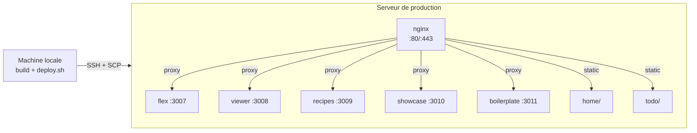
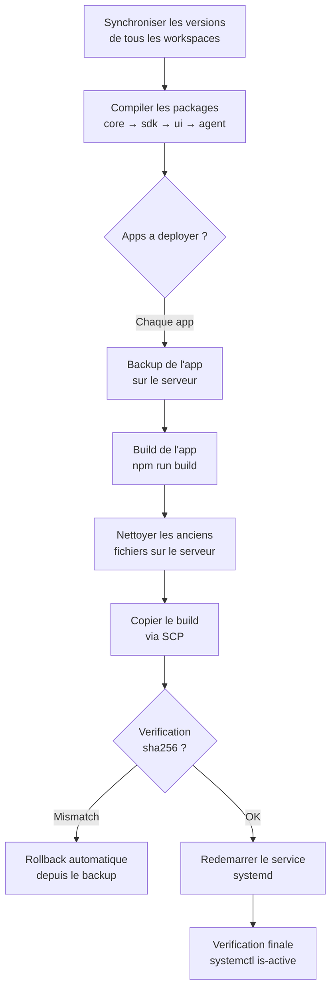

Le deploiement de WebMCP Auto-UI repose sur un **script centralise** (`scripts/deploy.sh`) qui gere les sept apps du monorepo avec leurs chemins et configurations specifiques. Ce guide couvre la procedure complete, du build local jusqu'a la verification en production.

## Regle d'or

:::danger[Jamais de deploiement manuel]
**TOUJOURS utiliser `./scripts/deploy.sh`.** Jamais `scp`, `rsync` ou toute autre methode manuelle.

Pourquoi ? Chaque app a un chemin de deploiement different sur le serveur, et des erreurs repetees ont ete causees par des deploiements au mauvais endroit :
- `rsync --delete` a supprime les `.env` de production
- `scp` dans le mauvais dossier a servi l'ancien code pendant des heures
- Les anciens chunks JS non nettoyes ont pollue le cache navigateur
:::

## Infrastructure cible



| Element | Valeur |
|---------|--------|
| **Serveur** | `demo.hyperskills.net` (via SSH alias `ssh bot`) |
| **Base** | `/opt/webmcp-demos/` |
| **Apps Node.js** | flex (:3007), viewer, recipes, showcase, boilerplate |
| **Apps statiques** | home, todo (servies par nginx) |
| **Reverse proxy** | nginx sur les ports 80/443 |

## Applications et chemins de deploiement


Chaque app a un chemin de deploiement specifique. Le script `deploy.sh` connait ces chemins et les gere automatiquement.

| App | Type | Build dir (local) | Deploy dest (serveur) | ExecStart | Notes |
|-----|------|-------------------|----------------------|-----------|-------|
| **flex** | Node.js (SvelteKit) | `apps/flex/build/` | `/opt/webmcp-demos/flex/` | `node index.js` | Composeur principal |
| **viewer** | Node.js (SvelteKit) | `apps/viewer/build/` | `/opt/webmcp-demos/viewer/` | `node index.js` | Visionneur HyperSkills |
| **showcase** | Node.js (SvelteKit) | `apps/showcase/build/` | `/opt/webmcp-demos/showcase/` | `node index.js` | Galerie de widgets |
| **recipes** | Node.js (SvelteKit) | `apps/recipes/build/` | `/opt/webmcp-demos/recipes/` | `node index.js` | Explorateur de recettes |
| **boilerplate** | Node.js (SvelteKit) | `apps/boilerplate/build/` | `/opt/webmcp-demos/boilerplate/` | `node index.js` | Template de demarrage |
| **home** | Static (SvelteKit) | `apps/home/build/` | `/opt/webmcp-demos/home/` | N/A (nginx) | Page d'accueil |
| **todo** | Static (SvelteKit) | `apps/todo/build/` | `/opt/webmcp-demos/todo/` | N/A (nginx) | Demo todo |

:::caution[Chemins differents]
Les apps Node.js sont deployees a la **racine** de leur dossier (`/opt/webmcp-demos/flex/index.js`), car systemd lance `node index.js` depuis ce dossier. Si vous deployez au mauvais endroit, le service demarre mais sert l'ancien code.
:::

## Procedure de deploiement

### Etape 1 : Deployer via le script

Le script gere tout : build des packages, build des apps, nettoyage, transfert, verification d'integrite et redemarrage.

```bash
# Deployer toutes les apps
./scripts/deploy.sh

# Deployer une app specifique
./scripts/deploy.sh flex

# Deployer plusieurs apps
./scripts/deploy.sh flex viewer home

# Voir ce qui serait deploye sans rien changer
./scripts/deploy.sh --dry-run

# Deployer avec mise a jour de la documentation
./scripts/deploy.sh --with-docs
```

### Etape 2 : Verifier sur le serveur

```bash
ssh bot

# Verifier les services Node.js
systemctl status webmcp-flex
systemctl status webmcp-viewer

# Verifier les apps statiques
curl -s -o /dev/null -w "%{http_code}" http://localhost/home/

# Verifier nginx
sudo systemctl status nginx
```

## Ce que fait le script

Le script `deploy.sh` execute ces etapes dans l'ordre :



### Verification d'integrite (sha256)

Apres chaque transfert, le script compare le hash SHA-256 du fichier local avec celui du fichier deploye :

```bash
expected=$(sha256sum apps/flex/build/index.js | cut -d' ' -f1)
actual=$(ssh bot "sha256sum /opt/webmcp-demos/flex/index.js | cut -d' ' -f1")

if [ "$expected" != "$actual" ]; then
  echo "INTEGRITY ERROR — sha256 mismatch, rolling back"
  rollback_app "flex"
fi
```

Cette verification detecte les transferts incomplets, les fichiers en lecture seule et les builds perimes.

### Backup et rollback

Avant chaque deploiement, une copie complete de l'app existante est stockee dans `/opt/webmcp-demos/.backups/`. En cas d'echec, le script restaure automatiquement la version precedente.

```bash
# Rollback manuel si necessaire
ssh bot
cp -a /opt/webmcp-demos/.backups/flex.prev /opt/webmcp-demos/flex
systemctl restart webmcp-flex
```

## Variables d'environnement

### Sur le serveur (production)

Les fichiers `.env` doivent exister **avant** le premier deploiement. Ils sont crees manuellement une seule fois et ne sont **jamais** deployes par le script.

:::danger[Ne jamais deployer les .env]
Les fichiers `.env` contiennent des cles API et des secrets. Ils ne doivent jamais etre dans git, ni copies par le script de deploiement. Si un `.env` disparait du serveur (incident rsync de 2026-04-06), le recreer manuellement.
:::

### Variables de build (home)

L'app `home` necessite `PUBLIC_BASE_URL` au moment du build, pas a l'execution :

```bash
# Le script deploy.sh gere automatiquement cette variable
# pour les apps statiques (home, todo)
PUBLIC_BASE_URL=https://demos.hyperskills.net npm run build
```

Si vous buildez manuellement (hors script), n'oubliez pas cette variable, sinon les liens internes pointeront vers `localhost`.

## Configuration nginx

nginx sert de reverse proxy pour les apps Node.js et de serveur statique pour les autres :

```nginx
# Apps Node.js → proxy vers le port local
location /flex/ {
  proxy_pass http://localhost:3007/;
  proxy_http_version 1.1;
  proxy_set_header Upgrade $http_upgrade;
  proxy_set_header Connection 'upgrade';
}

# Apps statiques → servir depuis le disque
location /home/ {
  alias /opt/webmcp-demos/home/;
  try_files $uri $uri/index.html =404;
}

# Page par defaut = home
location / {
  alias /opt/webmcp-demos/home/;
  try_files $uri $uri/index.html =404;
}
```

## Monitoring en production

### Journaux (logs)

```bash
ssh bot

# Suivre les logs en temps reel
journalctl -u webmcp-flex -f

# Voir les 50 derniers logs
journalctl -u webmcp-flex -n 50 --no-pager
```

### Verification de sante

```bash
# Tester toutes les apps
for app in home flex viewer showcase recipes; do
  code=$(curl -s -o /dev/null -w "%{http_code}" "https://demos.hyperskills.net/$app/")
  echo "$app: HTTP $code"
done
```

### Ressources systeme

```bash
ssh bot
df -h       # Espace disque
free -h     # Memoire
```

## Depannage

### L'app affiche du code ancien apres deploiement

**Cause probable** : chunks JavaScript orphelins. Si vous avez deploye manuellement (sans le script), les anciens fichiers `.js` restent et le navigateur les sert depuis son cache.

**Solution** :
```bash
ssh bot
# Nettoyer les anciens fichiers
rm -rf /opt/webmcp-demos/flex/client /opt/webmcp-demos/flex/server
# Redeployer proprement
./scripts/deploy.sh flex
```

:::tip[Le script nettoie automatiquement]
Le script `deploy.sh` fait un nettoyage cible avant chaque copie (supprime `index.js`, `handler.js`, `client/`, `server/`, `build/`). Ce nettoyage est la raison principale d'utiliser le script plutot qu'un `scp` manuel.
:::

### `.env` manquant apres deploiement

**Cause** : les `.env` ne font pas partie du deploy et ne doivent jamais l'etre.

**Solution** : recreer le fichier manuellement sur le serveur, puis redemarrer le service.

### nginx retourne 404

**Diagnostic** :
```bash
ssh bot

# Verifier que les fichiers existent
ls -la /opt/webmcp-demos/home/index.html

# Tester la config nginx
sudo nginx -t

# Voir les paths dans la config
grep -A 5 "location /home/" /etc/nginx/sites-available/default

# Recharger apres correction
sudo systemctl reload nginx
```

### API rate-limited (provider LLM)

**Symptome** : erreurs 429 dans les logs de flex.

**Solutions** :
1. Attendre (le client gere le backoff exponentiel automatiquement)
2. Reduire `maxIterations` dans la configuration de l'agent
3. Verifier que la cle API n'est pas partagee entre plusieurs deployments

### Le service ne demarre pas

```bash
ssh bot

# Voir l'erreur detaillee
journalctl -u webmcp-flex -n 30 --no-pager

# Causes courantes :
# - Port deja utilise → lsof -i :3007
# - .env manquant → ls -la /opt/webmcp-demos/flex/.env
# - Dependances npm manquantes → cd /opt/webmcp-demos/flex && npm install --production
```

## Maintenance courante

### Redemarrer tous les services

```bash
ssh bot
sudo systemctl restart webmcp-flex webmcp-viewer webmcp-recipes webmcp-showcase nginx
```

### Nettoyer les anciens logs

```bash
ssh bot
journalctl --vacuum-time=7d  # Garder 7 jours
```

### Mettre a jour les dependances

```bash
# Localement
npm update
npm run build
./scripts/deploy.sh
```

## Checklist de deploiement

Avant chaque deploiement, verifier :

- [ ] Le build local reussit (`npm run build` sans erreurs)
- [ ] Les tests passent (`npm run test`)
- [ ] Le code est commite et pousse
- [ ] Utiliser `./scripts/deploy.sh` (jamais `scp` ou `rsync`)
- [ ] Apres deploiement : verifier les logs (`journalctl -u webmcp-flex -n 20`)
- [ ] Apres deploiement : tester dans le navigateur
- [ ] Si l'app `home` est deployee : verifier que `PUBLIC_BASE_URL` est correct

## Rollback d'urgence

Si un deploiement casse quelque chose et que le rollback automatique n'a pas fonctionne :

```bash
# Option 1 : Restaurer depuis le backup
ssh bot
cp -a /opt/webmcp-demos/.backups/flex.prev /opt/webmcp-demos/flex
systemctl restart webmcp-flex

# Option 2 : Redeployer une version anterieure
git checkout <commit_precedent>
./scripts/deploy.sh flex
```

:::caution[Vitesse de rollback]
Le backup ne contient que la version immediatement precedente (`*.prev`). Si vous deployez deux fois de suite, le premier backup est ecrase. En cas de doute, verifiez d'abord le contenu du backup avant de restaurer.
:::
