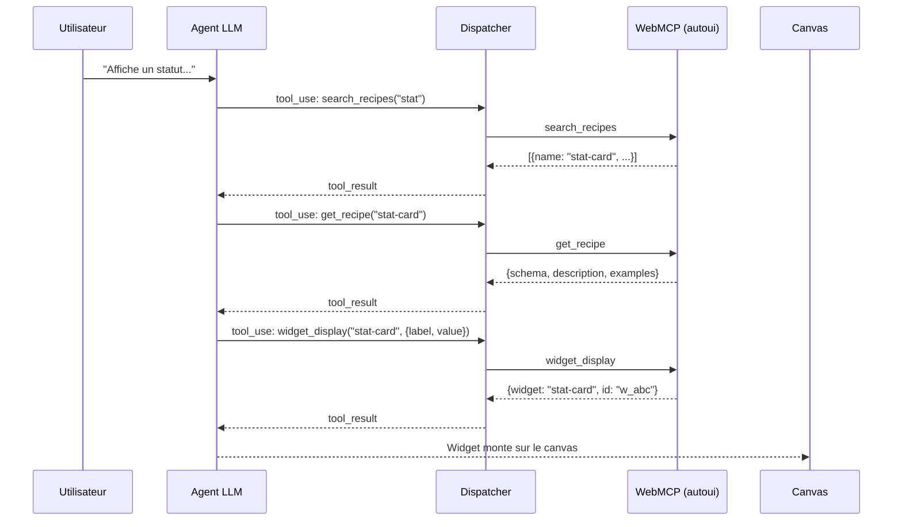
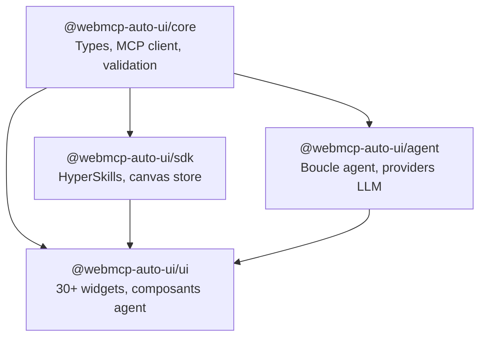

Ce guide vous accompagne de l'installation a votre premier agent fonctionnel. A la fin, vous aurez un canvas interactif ou un agent IA genere des widgets en temps reel a partir de vos prompts.

## A qui s'adresse ce guide

- **Developpeurs frontend** qui veulent integrer un agent IA dans une interface Svelte
- **Explorateurs** curieux de voir MCP en action cote client
- **Contributeurs** qui souhaitent comprendre la structure du monorepo avant de plonger dans le code

## Prerequis

| Outil | Version minimale | Pourquoi |
|-------|-----------------|----------|
| **Node.js** | 18.x | Runtime serveur (SvelteKit) et build |
| **npm** | 9.x | Gestion du monorepo (workspaces) |
| **Navigateur moderne** | Chrome/Edge recommande | WebAssembly pour Gemma, Web Workers |

:::note[Cle API optionnelle]
Une cle API n'est necessaire que pour les LLM distants (tout provider compatible OpenAI : Claude, Gemini, ChatGPT, Mistral, Qwen, etc.). L'agent Gemma 4 tourne entierement dans le navigateur, sans cle ni serveur distant.
:::

## Chemin rapide : Boilerplate

Le moyen le plus simple de demarrer est le **boilerplate** -- une app SvelteKit prete a l'emploi avec trois widgets Tricoteuses pre-configures :

```bash
npx degit jeanbaptiste/webmcp-auto-ui/apps/boilerplate my-app
cd my-app
npm install
npm run dev
```

Voici ce que chaque commande fait :

1. `npx degit` telecharge le dossier `apps/boilerplate` sans l'historique git (rapide, leger).
2. `npm install` installe les dependances, dont les quatre packages `@webmcp-auto-ui/*`.
3. `npm run dev` lance le serveur SvelteKit sur `http://localhost:5173`.

L'app demarre avec un canvas, un panneau de chat et trois widgets fonctionnels. Tapez un prompt dans le chat pour voir l'agent en action.

:::tip[Quand choisir le boilerplate ?]
Choisissez le boilerplate si vous voulez **utiliser** WebMCP Auto-UI dans un projet. Choisissez le monorepo complet si vous voulez **contribuer** au projet ou modifier les packages.
:::

## Monorepo complet (pour contribuer)

### Etape 1 : Cloner le depot

```bash
git clone https://github.com/jeanbaptiste/webmcp-auto-ui.git
cd webmcp-auto-ui
```

Le depot fait environ 50 Mo (sans les `node_modules`). Il contient quatre packages et sept apps de demo.

### Etape 2 : Installer les dependances

```bash
npm install
```

npm detecte automatiquement les workspaces definis dans `package.json` et installe toutes les dependances en une seule passe. Les packages locaux (`@webmcp-auto-ui/*`) sont lies par symlinks -- pas besoin de `npm link` manuel.

### Etape 3 : Configurer l'environnement

Creez un fichier `.env.local` a la racine de l'app que vous voulez lancer (par exemple `apps/flex/.env.local`) :

```bash
# API LLM distante (optionnel, requis uniquement pour les agents distants)
LLM_API_KEY=sk-ant-...

# Serveurs MCP distants (optionnel, format: protocol://host:port)
MCP_SERVERS=http://localhost:3001,http://localhost:3002
```

:::caution[Securite]
Ne commitez jamais les fichiers `.env`. Ils sont deja dans le `.gitignore`. Sur le serveur de production, les `.env` sont crees manuellement une seule fois.
:::

### Etape 4 : Lancer en developpement

```bash
npm run dev
```

Cette commande lance toutes les apps en parallele via `concurrently`. Chaque app ecoute sur un port different :

| App | Port | Description |
|-----|------|-------------|
| home | 5173 | Page d'accueil (statique) |
| flex | 5174 | App principale (SvelteKit) |
| viewer | 5175 | Visionneur HyperSkills |
| showcase | 5176 | Galerie de widgets |
| todo | 5177 | Demo todo |

Pour lancer une seule app :

```bash
npm run dev:flex    # Juste flex
npm run dev:home     # Juste home
```

## Premier agent : pas a pas

### 1. Choisir un modele

Ouvrez `http://localhost:5174` (flex). Dans le panneau de droite, cliquez sur **Settings** et selectionnez un modele :

| Modele | Vitesse | Qualite | Prerequis |
|--------|---------|---------|-----------|
| Claude Haiku | Rapide | Bonne | Cle API |
| Claude Sonnet | Moyen | Tres bonne | Cle API |
| Claude Opus | Lent | Excellente | Cle API |
| Gemma 4 E2B | Moyen | Correcte | Aucun (in-browser) |
| Gemma 4 E4B | Lent | Bonne | Aucun (in-browser) |

Si vous choisissez Gemma, le navigateur telecharge les poids du modele (~2-6 Go). Le composant `<ModelLoader>` affiche la progression en temps reel.

### 2. Ecrire un prompt

Dans le **panneau de chat**, tapez :

```
Affiche un statut avec le label "Visiteurs" et la valeur "1,234"
```

### 3. Observer l'agent

L'agent suit un flux previsible :



1. L'agent cherche une recette correspondante (`search_recipes`).
2. Il charge la recette complete pour connaitre le schema (`get_recipe`).
3. Il appelle `widget_display` avec les parametres valides.
4. Le canvas affiche le widget.

### 4. Aller plus loin

Essayez des prompts plus complexes :

```
Affiche 3 stats : visiteurs (1,234), conversions (3.2%) et revenu (€45,678).
Puis ajoute un graphique en barres avec les ventes mensuelles.
```

L'agent enchainera plusieurs appels d'outils en une seule boucle.

## Structure du monorepo

```
webmcp-auto-ui/
├── packages/
│   ├── core/          # Types WebMCP, polyfill, client MCP, validation
│   ├── agent/         # Boucle agent, providers LLM, tool layers, Nano-RAG
│   ├── ui/            # 30+ widgets Svelte, composants agent, theme, bus
│   └── sdk/           # HyperSkills, registre de skills, canvas store
├── apps/
│   ├── boilerplate/   # Point d'entree nouveaux devs (SvelteKit + Tricoteuses)
│   ├── flex/         # App SvelteKit principale (composeur)
│   ├── showcase/     # Galerie de widgets
│   ├── todo/         # Demo todo
│   ├── viewer/       # Visionneur HyperSkills
│   ├── home/          # Page d'accueil (statique)
│   └── recipes/       # Explorateur de recettes
├── scripts/
│   └── deploy.sh      # Script de deploiement centralise
├── docs-site/         # Site de documentation (Astro Starlight)
└── tests/
    └── e2e/           # Tests Playwright
```

### Relations entre packages



Le `core` est la fondation : il ne depend de rien d'autre. L'`agent` et le `sdk` dependent du `core`. L'`ui` depend des trois autres.

## Imports recommandes

```typescript
// Boucle agent
import { runAgentLoop } from '@webmcp-auto-ui/agent';

// Providers LLM
import { RemoteLLMProvider } from '@webmcp-auto-ui/agent';  // LLM distant via proxy
import { WasmProvider } from '@webmcp-auto-ui/agent';       // Gemma 4 in-browser
import { LocalLLMProvider } from '@webmcp-auto-ui/agent';   // Ollama local

// Tool layers
import { buildDiscoveryTools, activateServerTools } from '@webmcp-auto-ui/agent';
import { resolveCanonicalTools, buildSystemPromptWithAliases } from '@webmcp-auto-ui/agent';

// Widgets
import { WidgetRenderer, BlockRenderer } from '@webmcp-auto-ui/ui';

// Canvas store (Svelte 5 seulement)
import { canvas } from '@webmcp-auto-ui/sdk/canvas';

// Client MCP
import { McpClient, McpMultiClient } from '@webmcp-auto-ui/core';

// HyperSkills
import { encodeHyperSkill, decodeHyperSkill } from '@webmcp-auto-ui/sdk';
```

## Exemples concrets

### Creer un provider LLM distant

Le `RemoteLLMProvider` se connecte a toute API compatible OpenAI (e.g. Claude, Gemini, ChatGPT, Mistral) via un endpoint proxy SvelteKit. La cle API reste cote serveur -- jamais exposee au navigateur.

```typescript
import { RemoteLLMProvider } from '@webmcp-auto-ui/agent';

const provider = new RemoteLLMProvider({
  proxyUrl: '/api/chat',
  model: 'sonnet',  // Alias resolu cote serveur en claude-sonnet-4-6
});
```

Les alias disponibles :

| Alias | Modele complet | Usage |
|-------|---------------|-------|
| `'haiku'` | `claude-haiku-4-5-20251001` | Rapide, economique |
| `'sonnet'` | `claude-sonnet-4-6` | Equilibre qualite/vitesse |
| `'opus'` | `claude-opus-4-6` | Raisonnement profond |

### Creer un provider Gemma (in-browser)

Le `WasmProvider` execute Gemma 4 directement dans le navigateur via LiteRT. Aucune cle API, aucun serveur distant :

```typescript
import { WasmProvider } from '@webmcp-auto-ui/agent';

const provider = new WasmProvider({
  model: 'gemma-e4b',      // Variante 4B (plus capable)
  contextSize: 32_768,
  onProgress: (progress, status, loaded, total) => {
    console.log(`Chargement: ${Math.round(progress * 100)}%`);
  },
  onStatusChange: (status) => {
    // 'idle' → 'loading' → 'ready' (ou 'error')
    console.log('Gemma:', status);
  },
});

await provider.initialize();
```

### Lancer un agent complet

```typescript
import { runAgentLoop } from '@webmcp-auto-ui/agent';
import { autoui } from '@webmcp-auto-ui/agent';

const result = await runAgentLoop('Affiche un graphique des ventes par mois', {
  provider,           // RemoteLLMProvider ou WasmProvider
  layers: [
    { protocol: 'webmcp', serverName: 'autoui', tools: autoui.listTools() },
    // Ajouter d'autres layers MCP si necessaire
  ],
  maxIterations: 5,   // Garde-fou : max 5 boucles
  callbacks: {
    onToolCall: (call) => console.log('Outil appele:', call.name, `(${call.elapsed}ms)`),
    onWidget: (type, data) => {
      console.log('Widget genere:', type);
      // Ajouter au canvas ici
      return { id: `w_${Date.now()}` };
    },
    onText: (text) => console.log('Agent dit:', text),
  },
});

console.log('Resultat:', result.text);
console.log('Outils appeles:', result.metrics.toolCalls);
```

Cet exemple montre le flux complet : le provider envoie le prompt au LLM, la boucle agent itere en appelant des outils, et les callbacks recoivent les evenements en temps reel.

### Afficher un widget dans Svelte

```svelte
<script>
  import { WidgetRenderer } from '@webmcp-auto-ui/ui';
  import { autoui } from '@webmcp-auto-ui/agent';

  const widgetData = {
    label: 'Visiteurs',
    value: '1,234',
    trend: 'up',
    variant: 'success',
  };
</script>

<WidgetRenderer
  type="stat-card"
  data={widgetData}
  servers={[autoui]}
/>
```

Le `WidgetRenderer` detecte le type, charge le composant Svelte correspondant et passe les donnees comme props. L'attribut `servers` reference les serveurs WebMCP pour la validation du schema.

### Se connecter a un serveur MCP

```typescript
import { McpClient } from '@webmcp-auto-ui/core';

const client = new McpClient({
  serverUrl: 'http://localhost:3000',
});

await client.initialize();

// Lister les outils exposes par le serveur
const tools = await client.listTools();
console.log('Outils MCP:', tools.map(t => t.name));

// Appeler un outil
const result = await client.callTool('get_forecast', { location: 'Paris' });
console.log('Resultat:', result);
```

Le client MCP communique via SSE (Server-Sent Events) avec le serveur distant. L'initialisation negocie les capacites et recupere la liste des outils.

## Deploiement local (preview)

Pour tester un build de production localement :

```bash
npm run build    # Construit toutes les apps
npm run preview  # Lance le serveur de preview
```

L'app est accessible sur `http://localhost:4173`. C'est le meme code qui sera deploye en production.

## Depannage

### L'agent n'appelle pas les outils

1. **Verifier les layers** : le tableau `layers` passe a `runAgentLoop` doit contenir au moins un layer avec des outils.
2. **Verifier le system prompt** : `buildSystemPromptWithAliases(layers)` doit retourner un prompt qui liste les outils disponibles.
3. **Consulter les logs** : activer `onToolCall` dans les callbacks pour tracer chaque appel.
4. **Verifier le modele** : certains modeles (petits Gemma) ont du mal avec le format de tool calling.

### Gemma ne charge pas

- **Connexion internet** : le premier lancement telecharge les poids (~2-6 Go selon la variante).
- **Navigateur** : Chrome ou Edge sont recommandes. Firefox supporte WebAssembly mais peut etre plus lent.
- **Memoire** : Gemma 4B requiert ~8 Go de RAM disponible dans le navigateur.
- **Console** : ouvrir `F12` et verifier les erreurs dans l'onglet Console.

### Les widgets ne s'affichent pas

- **Type inconnu** : verifier que le type passe a `WidgetRenderer` existe dans la map native (`NATIVE_WIDGET_NAMES`).
- **Schema invalide** : les donnees sont validees contre le JSON Schema du widget. Si la validation echoue, le widget n'est pas monte.
- **Erreurs silencieuses** : ouvrir la console du navigateur pour voir les erreurs de validation.

### Le build echoue

- **Ordre de build** : les packages doivent etre compiles avant les apps (`core` → `sdk` → `ui` → `agent`). Le script `npm run build` gere cet ordre.
- **Cache stale** : supprimer `node_modules/.cache` et relancer `npm run build`.
- **Types** : lancer `npm run check` pour verifier les erreurs TypeScript.

## Prochaines etapes

- **[Architecture](./architecture)** : Comprendre la boucle agent, les tool layers et le canvas reactif
- **[Tool calling](./tool-calling)** : Le parcours complet d'un appel d'outil
- **[Deploiement](./deploy)** : Heberger en production avec `deploy.sh`
- **[Contribuer](./contributing)** : Patterns, pieges et workflow de contribution
