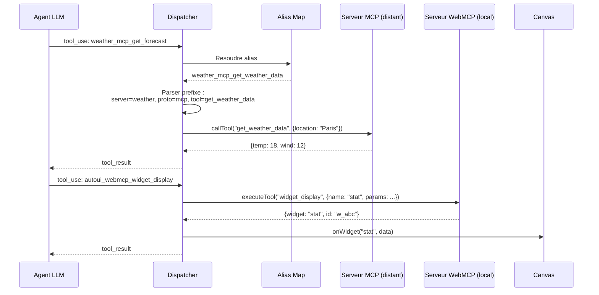
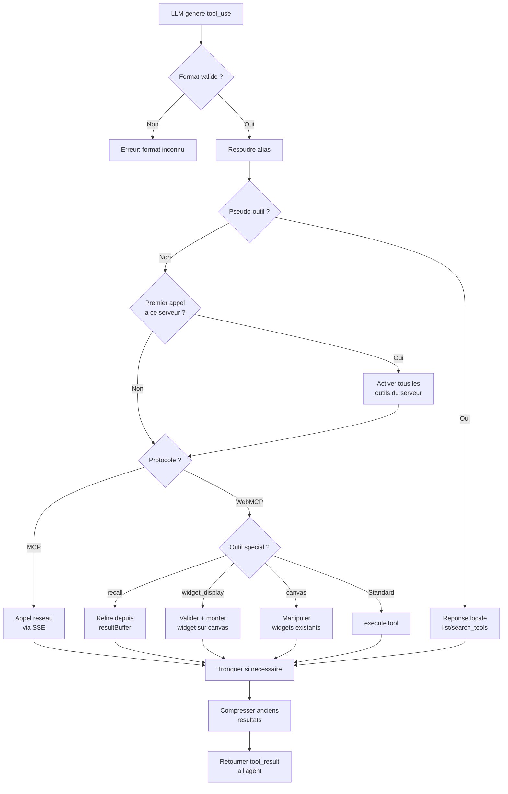

Le **tool calling** est le mecanisme central de WebMCP Auto-UI. L'agent LLM genere des blocs `tool_use`, et le dispatcher les achemine vers le bon serveur -- MCP distant ou WebMCP local. Cette page decrit le parcours complet d'un appel d'outil, du LLM jusqu'au resultat.

## Vue d'ensemble du flux



## Anatomie d'un appel d'outil

### 1. L'agent genere un bloc tool_use

Quand le LLM decide d'utiliser un outil, il produit un bloc structuree :

```typescript
{
  type: 'tool_use',
  id: 'toolu_1234',                    // Identifiant unique de l'appel
  name: 'weather_mcp_get_forecast',    // Nom canonique avec prefixe
  input: { location: 'Paris', days: 3 } // Parametres de l'outil
}
```

Le nom suit la convention `{serverName}_{protocol}_{toolName}`. Ce format permet au dispatcher de savoir immediatement :
- **Quel serveur** contacter (`weather`)
- **Quel protocole** utiliser (`mcp` = distant, `webmcp` = local)
- **Quel outil** appeler (`get_forecast`)

### 2. Le dispatcher route l'appel

Le dispatcher est le coeur du routage. Pour chaque bloc `tool_use`, il :

1. Resout les alias (noms canoniques → noms reels du serveur)
2. Parse le prefixe pour identifier serveur, protocole et outil
3. Route vers MCP ou WebMCP

```typescript
for (const block of toolBlocks) {
  // Etape 1 : Resoudre alias
  const resolvedName = aliasMap.get(block.name) ?? block.name;

  // Etape 2 : Parser le prefixe
  const match = resolvedName.match(/^(.+?)_(mcp|webmcp)_(.+)$/);
  if (!match) {
    result = `Error: unknown tool format`;
  } else {
    const [, serverName, protocol, realToolName] = match;

    // Etape 3 : Routing
    if (protocol === 'mcp') {
      // → Appel reseau via MCP client
    } else if (protocol === 'webmcp') {
      // → Execution locale via WebMCP server
    }
  }
}
```

:::note[Format du prefixe]
La regex `^(.+?)_(mcp|webmcp)_(.+)$` est volontairement gourmande sur la premiere partie (`(.+?)`) pour supporter les noms de serveurs avec des underscores (ex: `my_weather_mcp_get_forecast`).
:::

### 3. Intercepteur (pseudo-outils)

Avant le dispatch normal, deux **pseudo-outils** sont interceptes localement. Ils ne declenchent pas d'activation serveur :

```typescript
if (toolMatch[3] === 'list_tools' || toolMatch[3] === 'search_tools') {
  const layer = layers.find(l =>
    sanitizeServerName(l.serverName) === serverName &&
    l.protocol === protocol
  );

  if (pseudoTool === 'list_tools') {
    // Retourner la liste complete des outils du serveur
    result = JSON.stringify(layer.tools);
  } else {
    // Filtrer par mot-cle dans le nom ou la description
    const query = String(block.input.query ?? '').toLowerCase();
    const matches = layer.tools.filter(t =>
      t.name.toLowerCase().includes(query) ||
      t.description.toLowerCase().includes(query)
    );
    result = JSON.stringify(matches);
  }
}
```

**Pourquoi intercepter ?** Pour permettre a l'agent d'explorer les outils disponibles sans declencher de connexion reseau. L'agent peut appeler `list_tools()` autant de fois qu'il veut sans cout reseau.

### 4. Activation lazy du serveur

Lors du **premier appel reel** a un outil d'un serveur :

```typescript
const serverKey = `${serverName}_${protocol}`;

if (!activatedServers.has(serverKey)) {
  activatedServers.add(serverKey);
  const layer = layers.find(l =>
    sanitizeServerName(l.serverName) === serverName &&
    l.protocol === protocol
  );
  if (layer) {
    // Ajouter TOUS les outils du serveur aux outils actifs
    activeTools = activateServerTools(activeTools, layer);
  }
}
```

Apres activation, le LLM recoit la liste complete des outils du serveur dans son prochain appel. L'activation est un one-shot : elle ne se produit qu'une fois par session.

## Dispatch MCP


Le dispatch MCP passe par un client SSE (Server-Sent Events) connecte au serveur distant :

```typescript
if (protocol === 'mcp') {
  if (!client) {
    result = `Error: no MCP client available for tool ${name}`;
  } else {
    // Appeler l'outil sur le serveur distant
    const mcpResult = await client.callTool(realToolName, block.input);

    // Extraire le contenu texte de la reponse MCP
    const textContent = mcpResult.content?.find(
      (c) => c.type === 'text'
    ) as { text?: string } | undefined;
    const rawResult = textContent?.text ?? JSON.stringify(mcpResult);

    // Tronquer si le resultat depasse la limite (defaut: 10 000 caracteres)
    result = truncateResults
      ? truncateResult(rawResult, maxResultLength)
      : rawResult;
  }
}
```

La troncature evite qu'un resultat volumineux (une table de 10 000 lignes, par exemple) ne sature la fenetre de contexte. Le resultat complet est stocke dans le `resultBuffer` et accessible via `recall()`.

:::caution[Latence reseau]
Les appels MCP impliquent un aller-retour reseau. Si le serveur est lent ou injoignable, le dispatcher attend indefiniment (sauf si un `AbortSignal` est fourni via les options de l'agent).
:::

## Dispatch WebMCP


Le dispatch WebMCP execute l'outil localement dans le navigateur :

```typescript
if (protocol === 'webmcp') {
  // Cas special : recall (relire un resultat compresse)
  if (realToolName === 'recall' && resultBuffer.size > 0) {
    const recallId = (block.input as { id: string }).id;
    result = resultBuffer.get(recallId)
      ?? `Aucun resultat trouve pour l'id '${recallId}'.`;
  } else {
    // Dispatch normal vers le serveur WebMCP
    const webmcpServer = webmcpServers.get(serverName);
    if (!webmcpServer) {
      result = `Error: no WebMCP server "${serverName}" found.`;
    } else {
      const toolResult = await webmcpServer.executeTool(
        realToolName,
        block.input
      );
      result = typeof toolResult === 'string'
        ? toolResult
        : JSON.stringify(toolResult);
    }
  }
}
```

Le dispatch WebMCP gere trois cas speciaux en plus de l'execution standard :

### Cas special : widget_display

Quand l'outil appele est `widget_display`, le dispatcher detecte le resultat et declenche le callback de rendu :

```typescript
if (realToolName === 'widget_display') {
  const wr = toolResult as Record<string, unknown>;
  if (wr.widget && wr.data && !wr.error) {
    const widgetResult = callbacks.onWidget?.(
      wr.widget as string,
      wr.data as Record<string, unknown>
    );
    if (widgetResult?.id) {
      result = JSON.stringify({ ...wr, id: widgetResult.id });
    }
  }
}
```

Le callback `onWidget` est responsable d'ajouter le widget au canvas. Le `id` retourne permet a l'agent de manipuler le widget dans les iterations suivantes (move, resize, update).

### Cas special : canvas

L'outil `canvas` permet a l'agent de manipuler les widgets existants :

```typescript
if (realToolName === 'canvas') {
  const action = block.input.action as string;
  const id = block.input.id as string;
  const actionParams = block.input.params as Record<string, unknown>;

  switch (action) {
    case 'clear':  callbacks.onClear?.(); break;
    case 'update': callbacks.onUpdate?.(id, actionParams ?? {}); break;
    case 'move':   callbacks.onMove?.(id, x, y); break;
    case 'resize': callbacks.onResize?.(id, width, height); break;
    case 'style':  callbacks.onStyle?.(id, styles); break;
  }
}
```

| Action | Description | Exemple d'utilisation |
|--------|-------------|----------------------|
| `clear` | Vider tout le canvas | "Recommence depuis zero" |
| `update` | Modifier les donnees d'un widget | Changer la valeur d'un stat |
| `move` | Repositionner un widget (CSS transform) | Reorganiser la mise en page |
| `resize` | Redimensionner un widget | Agrandir un graphique |
| `style` | Appliquer des styles CSS | Changer la couleur de fond |

### Cas special : recall

`recall` est un pseudo-outil qui relit un resultat compresse. Il est intercepte avant le dispatch normal :

```typescript
if (realToolName === 'recall' && resultBuffer.size > 0) {
  const recallId = (block.input as { id: string }).id;
  result = resultBuffer.get(recallId) ?? `Aucun resultat trouve...`;
}
```

## Widget Display en detail

`widget_display()` est l'outil principal pour le rendu UI. Voici le parcours complet d'un appel :


### Exemple end-to-end

```typescript
// 1. L'agent appelle widget_display
{
  type: 'tool_use',
  id: 'toolu_5678',
  name: 'autoui_webmcp_widget_display',
  input: {
    name: 'stat-card',
    params: {
      label: 'Conversion',
      value: '3.2%',
      trend: 'up',
      variant: 'success'
    }
  }
}
```

Le dispatcher execute ces etapes en sequence :

1. **Resolution** : trouver la definition du widget `stat-card` dans le registre.
2. **Validation** : verifier que `params` respecte le JSON Schema (`label` et `value` requis, `trend` parmi `[up, down, stable]`).
3. **Sanitisation** : verifier les URL d'images (si presentes) contre une liste de domaines autorises.
4. **Generation d'ID** : creer un identifiant unique `w_1a2b3c`.
5. **Callback** : appeler `onWidget('stat-card', {...params})` pour ajouter le widget au canvas.
6. **Canvas store** : le store ajoute `{ id: 'w_1a2b3c', type: 'stat-card', data: {...} }` a la liste des blocs.
7. **Rendu Svelte** : le `WidgetRenderer` detecte le nouveau bloc et monte le composant `StatCard` avec les props.
8. **Affichage** : le widget apparait sur le canvas.

:::tip[Auto-reparation]
Si la validation echoue, le dispatcher retourne l'erreur **et** le schema attendu. Les LLM modernes (Claude, Gemma 4) sont capables de corriger leurs parametres et de retenter l'appel automatiquement. Le module `autoRepairParams` peut aussi tenter une reparation automatique avant de retourner l'erreur.
:::

## Gestion des erreurs

### Erreur de validation schema

```typescript
// L'agent oublie un champ requis
{
  name: 'autoui_webmcp_widget_display',
  input: {
    name: 'stat',
    params: { label: 'Sales' }  // Manque 'value' (requis)
  }
}

// Le dispatcher retourne l'erreur + le schema
{
  type: 'tool_result',
  content: JSON.stringify({
    error: 'Validation failed',
    details: [{ path: '/value', message: 'required' }],
    expected_schema: { type: 'object', required: ['label', 'value'], ... }
  })
}
```

L'agent recoit le schema attendu et peut retenter avec les bons champs. Ce pattern d'erreur-correction est naturel pour les LLM.

### Outil introuvable

```typescript
// Serveur MCP non connecte
if (!client) {
  result = `Error: no MCP client available for tool ${name}`;
}

// Serveur WebMCP non enregistre
if (!webmcpServer) {
  result = `Error: no WebMCP server "${serverName}" found.`;
}
```

### Echec d'execution

```typescript
try {
  const toolResult = await webmcpServer.executeTool(realToolName, block.input);
  result = ...;
} catch (e) {
  call.error = e instanceof Error ? e.message : String(e);
  toolResults.push({
    type: 'tool_result',
    tool_use_id: block.id,
    content: `Error: ${call.error}`
  });
}
```

Les erreurs d'execution sont capturees et retournees a l'agent comme des `tool_result` normaux. L'agent peut decider de retenter, d'utiliser un autre outil ou de signaler l'echec a l'utilisateur.

## Metriques et monitoring

Chaque appel d'outil est trace avec des metriques :

```typescript
const call: ToolCall = {
  id: block.id,          // ID unique de l'appel
  name: block.name,      // Nom canonique de l'outil
  args: block.input,     // Parametres
  result: result,        // Resultat (ou erreur)
  error: undefined,      // Message d'erreur si echec
  elapsed: Math.round(performance.now() - t1),  // Duree en ms
  guided: wasDiscovering, // true si precede par un outil de decouverte
};

metrics.toolCalls++;
callbacks.onToolCall?.(call);
```

Le callback `onToolCall` permet de :
- **Logger** chaque appel pour le debug
- **Mesurer** la latence des serveurs MCP
- **Compter** le nombre d'outils appeles par iteration
- **Detecter** les boucles (meme outil appele plusieurs fois avec les memes parametres)

Le composant `<AgentConsole>` de `@webmcp-auto-ui/ui` affiche ces metriques en temps reel dans l'interface.

## Compression des resultats

Apres environ 2 iterations, les anciens `tool_result` sont compresses pour economiser le contexte :

```typescript
// Avant compression
{
  type: 'tool_result',
  tool_use_id: 'toolu_1234',
  content: '{"data": [item1, item2, ... item1000], "total": 1000}'
  // 5000 caracteres
}

// Apres compression (mute en place dans le tableau messages)
{
  type: 'tool_result',
  tool_use_id: 'toolu_1234',
  content: '{"data": [item1, item2... [recall(\'toolu_1234\') pour le complet, 5000 chars]'
  // 200 caracteres
}

// Le resultat complet est stocke dans le buffer
resultBuffer.set('toolu_1234', '{"data": [item1, item2, ... item1000]}');
```

L'agent peut relire le resultat complet a tout moment en appelant `recall('toolu_1234')`. Ce mecanisme est transparent : l'agent decide seul s'il a besoin du resultat complet ou si l'apercu suffit.

## Resume du flux



## FAQ

### Pourquoi le format `{server}_{proto}_{tool}` et pas juste le nom de l'outil ?

Parce qu'un meme nom d'outil peut exister sur plusieurs serveurs. Par exemple, `list_items` pourrait etre defini a la fois sur un serveur `database` et un serveur `filesystem`. Le prefixe desambigue.

### Combien d'outils un agent peut-il gerer ?

En theorie, autant que la fenetre de contexte le permet. En pratique, au-dela de 50 outils actifs, la qualite des choix du LLM degrade. Le mecanisme de lazy loading limite les outils aux seuls serveurs reellement utilises.

### Que se passe-t-il si un serveur MCP ne repond pas ?

L'appel reste en attente jusqu'a un timeout (configurable via `AbortSignal`). L'agent recoit une erreur et peut decider de la suite (retenter, utiliser un autre outil, informer l'utilisateur).

### Comment ajouter un pseudo-outil custom ?

Les pseudo-outils sont geres dans le dispatcher. Pour en ajouter un, il faut modifier la logique d'interception dans `loop.ts`. C'est volontairement limite : les pseudo-outils doivent etre rares et bien definis.
