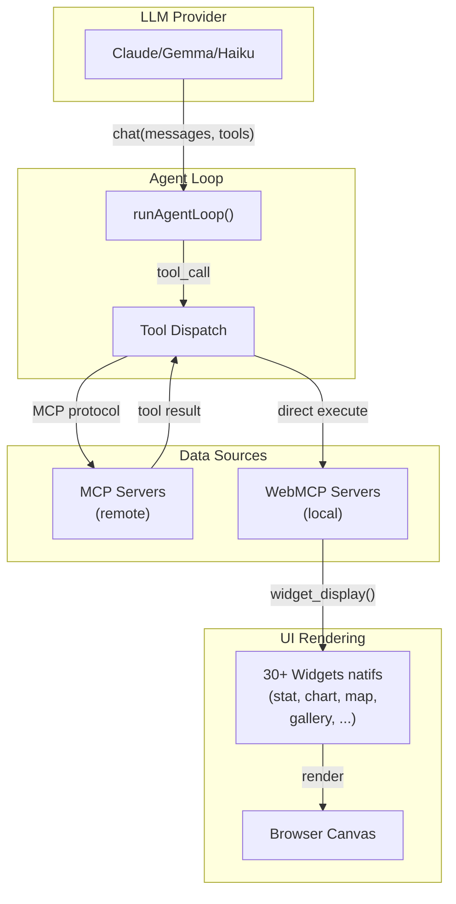

## Bienvenue

**WebMCP Auto-UI** est un framework full-stack qui permet aux agents IA (Claude, Gemma, etc.) de **générer automatiquement des interfaces utilisateur** en appelant des outils via [Model Context Protocol (MCP)](https://modelcontextprotocol.io).

Au lieu de renvoyer du texte ou du JSON brut, un agent peut appeler `widget_display('chart', {...})` pour afficher un graphique interactif. Les outils MCP (bases de données, APIs, calculs) sont exposés à l'agent via une couche d'abstraction unifiée.

### Cas d'usage

- **Dashboards générés dynamiquement** : Un agent explore une base de données et génère des visualisations sans code de rendu manuel
- **Explorateurs de données interactifs** : Lister, filtrer, afficher des résultats en graphiques, tableaux, cartes
- **Workflows automatisés** : Orchestrer des outils MCP + affichage UI dans une boucle agent
- **Prototypage rapide** : Designer des skills (workflows) en JSON, les exécuter instantanément

### Architecture schématique

### Points clés

1. **Bidirectionnel** : Les agents appelent les outils (MCP), les outils renvoient des données que l'agent met en forme pour les widgets
2. **Lazy loading** : Les outils découverts progressivement — le système commence avec `search_recipes`, `list_recipes`, puis active les serveurs à la demande
3. **Système de recettes** : Chaque widget a une recette (documentation + schéma JSON) que l'agent utilise pour générer les bons appels
4. **Framework-agnostic** : Rendus Svelte, vanilla JS, ou composants React — la logique reste la même
5. **Compression de contexte** : Les anciens résultats d'outils sont tronqués après utilisation pour économiser les tokens

### Composants clés

| Composant | Rôle |
|-----------|------|
| `@webmcp-auto-ui/core` | Polyfill WebMCP, client MCP, serveur WebMCP |
| `@webmcp-auto-ui/agent` | Boucle agent, tool layers, system prompt builder |
| `@webmcp-auto-ui/ui` | 30+ widgets Svelte, dispatcher, SafeImage |
| `@webmcp-auto-ui/sdk` | Store canvas, HyperSkill encoding, registry |

### Commençons

Voir **[Getting Started](./guide/getting-started)** pour une installation en 5 minutes.

Ensuite, consultez **[Architecture](./guide/architecture)** pour comprendre comment les composants s'assemblent.
