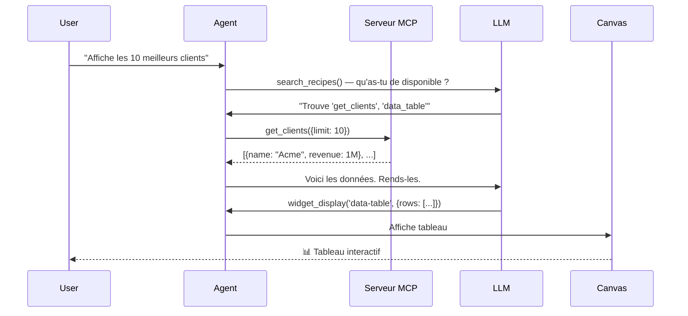

## À propos

**WebMCP Auto-UI** est un système complet d'auto-génération et d'orchestration d'interfaces utilisateur par agents IA utilisant le protocole **Model Context Protocol (MCP)**.

Le projet combine trois piliers :

1. **Agent Loop** — Une boucle LLM itérative qui appelle des outils MCP pour découvrir et exécuter des recettes
2. **Tool Layers** — Un système de couches de composants normalisés (MCP, WebMCP) avec résolution d'alias et lazy loading
3. **Canvas & Widgets** — Un rendu multi-framework d'interfaces réactives avec support vanilla et Svelte/React/Vue/Astro

### Vision

Les utilisateurs posent des questions naturelles. L'agent :
- 🔍 **Découvre** les outils disponibles via MCP
- 🎯 **Choisit** la meilleure recette/widget
- ⚙️ **Exécute** les opérations nécessaires
- 🎨 **Affiche** les résultats dans une UI contextuelle

Le tout sans code manuel — les interfaces sont générées à partir de **schémas JSON et de recettes Markdown**.

## Structure du projet

```
packages/
  ├── core/              # Types WebMCP, validation, client MCP streamable HTTP
  ├── agent/             # Boucle agent, tool layers, autoui server
  ├── ui/                # Composants Svelte (WidgetRenderer, primitives)
  ├── sdk/               # Canvas store, HyperSkill encoding
  └── widgets-*/         # Packs de widgets spécialisés (D3, Three.js, Leaflet, etc.)

apps/
  ├── flex/              # SvelteKit demo (mode chat)
  ├── viewer/            # SvelteKit viewer (skill loading)
  ├── home/              # Astro homepage statique
  ├── multi-*/           # Multi-framework showcases (Astro, React, Vue, WebComponents)
  └── ...
```

## Concepts clés

### MCP (Model Context Protocol)
Protocole standardisé pour exposer des **outils** (fonctions sérialisées en JSON Schema) que les LLM peuvent appeler.

- **Serveur MCP** : expose des outils (e.g. base de données, API, calcul)
- **Client MCP** : interroge le serveur, exécute les outils
- **Format** : JSON-RPC sur HTTP streamable (sans polling)

### WebMCP
Extension locale du MCP pour la **couche présentation** :
- Enregistre des **widgets** (composants UI) avec schémas d'entrée
- Fournit des **outils d'action** : `widget_display()`, `canvas()`, `recall()`
- Rendus par Svelte (natif) ou vanilla JavaScript

### Tool Layers
Abstraction unifiée pour les outils provenant de multiples sources :

```typescript
interface ToolLayer {
  protocol: 'mcp' | 'webmcp';
  serverName: string;
  tools: McpToolDef[] | WebMcpToolDef[];
}
```

Les outils sont préfixés : `{serverName}_{protocol}_{toolName}` pour éviter les collisions.

### Agent Loop
Boucle d'itération LLM :

```
LLM.chat(messages, tools) → {text, tool_calls}
  ↓
FOR each tool_call:
  dispatch(tool_call) → result
  store_result(resultBuffer)
  add_to_history()
↓
COMPRESS old results to save context
↓
(repeat until end_turn or max_iterations)
```

### Recettes
Document Markdown avec frontmatter YAML décrivant un widget :

```markdown
---
widget: stat
description: Statistique clé (KPI)
schema:
  type: object
  required: [label, value]
  properties:
    label: { type: string }
    value: { type: string }
---

## Quand utiliser
Pour afficher un nombre clé (KPI, total, compteur).

## Comment
Appeler widget_display('stat', {label: "Total", value: "42"}).
```

## Flux utilisateur typique



## Intégration multi-framework

Le projet supporte plusieurs renderers :

- **Svelte** (`@webmcp-auto-ui/ui`) : `<WidgetRenderer>` avec tous les widgets natifs
- **Vanilla JS** (`@webmcp-auto-ui/core`) : `mountWidget()` pour montage direct dans un DOM element
- **Widget Packs** : D3, Three.js, Leaflet, Plotly, Mermaid, Mapbox, etc. enregistrés dynamiquement
- **Astro, React, Vue, Web Components** : intégration via `multi-*` showcases

## Démarrage rapide

Voir [Getting Started](/guide/getting-started/) pour installer et lancer votre première démo.

## Documentation

- **[Architecture](/guide/architecture/)** — Diagrammes détaillés du système
- **[Tool Calling](/guide/tool-calling/)** — Mécanique de dispatch des outils et résolution d'alias
- **[Déploiement](/guide/deploy/)** — Scripts et chemins de déploiement

===
