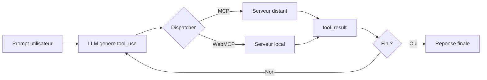

import { Card, CardGrid, LinkCard } from '@astrojs/starlight/components';

WebMCP Auto-UI est une plateforme de generation automatique d'interfaces utilisateur pilotees par des agents IA. Elle combine le **Model Context Protocol (MCP)** pour l'integration de donnees, un **moteur d'agents LLM** pour l'orchestration, et un **systeme de widgets declaratifs** pour le rendu cote client.

En quelques mots : vous decrivez ce que vous voulez en langage naturel, et l'agent construit l'interface pour vous -- widgets, donnees, mise en page, tout.

## Demarrage rapide

Cinq lignes suffisent pour lancer votre premier agent :

```bash
npx degit jeanbaptiste/webmcp-auto-ui/apps/boilerplate my-app
cd my-app
npm install
npm run dev
# Ouvrir http://localhost:5173 — taper un prompt dans le chat
```

L'agent recoit votre message, choisit les widgets adaptes, appelle les outils necessaires et construit l'interface sur le canvas en temps reel.

## Vue d'ensemble


Le diagramme ci-dessus montre les trois couches fondamentales du systeme :

1. **L'agent LLM** (e.g. Claude, Gemini, ChatGPT via API distante, ou Gemma in-browser) recoit un prompt utilisateur et decide quels outils appeler.
2. **Le dispatcher** achemine chaque appel vers le bon serveur -- MCP distant (donnees, API) ou WebMCP local (widgets, actions UI).
3. **Le canvas reactif** affiche les widgets generes et permet a l'agent de les repositionner, redimensionner et mettre a jour.

## Pourquoi WebMCP Auto-UI ?

Les interfaces classiques sont codees a la main : un composant par ecran, des routes, du state management. WebMCP Auto-UI inverse cette logique.

| Approche traditionnelle | Avec WebMCP Auto-UI |
|------------------------|---------------------|
| Designer + developpeur codent chaque ecran | L'agent genere l'interface a partir d'un prompt |
| Ajout d'un widget = PR + review + deploy | Ajout d'un widget = une recette markdown |
| Connexion API = code custom par endpoint | Connexion MCP = branchement declaratif |
| Mise en page figee | Canvas reactif, reorganisable par l'agent |

:::tip[Pas de compromis sur le controle]
L'agent ne remplace pas le developpeur. Il augmente sa productivite en generant les interfaces repetitives. Le systeme de recettes et de schemas JSON garantit que chaque widget respecte un contrat strict.
:::

## Caracteristiques principales

- **Agents autonomes** : Boucle agentic native avec support pour les LLM distants (toute API compatible OpenAI, e.g. Claude, Gemini, ChatGPT, Mistral, Qwen), Gemma 4 (LiteRT in-browser WASM) et Ollama (local)
- **Tool calling multi-protocoles** : Dispatch transparent vers MCP (protocole reseau) et WebMCP (local)
- **30+ widgets natifs** : Stat, chart, timeline, carte, galerie, hemicycle parlementaire, Sankey, D3, sandbox JS...
- **Lazy loading** : Charge les outils a la demande pour optimiser le contexte LLM
- **Skill serialisation** : Export/import via HyperSkills avec compression gzip -- un canvas entier tient dans une URL
- **Canvas reactif** : Rendu Svelte 5 (runes) avec message bus FONC pour l'inter-composants
- **Nano-RAG** : Compaction de contexte par embeddings pour les conversations longues

## Concepts cles

### 1. Tool Layers (couches d'outils)

Les outils sont organises en **couches structurees** pour que l'agent sache ou envoyer chaque appel :

- **MCP Layers** : Serveurs MCP distants (donnees, API externes). Communication via SSE (Server-Sent Events).
- **WebMCP Layers** : Serveurs locaux qui tournent dans le navigateur (widgets, actions UI, stockage).

Chaque outil recoit un prefixe canonique qui encode son origine : `{serverName}_{protocol}_{toolName}`. Par exemple, `weather_mcp_get_forecast` designe l'outil `get_forecast` du serveur `weather`, accessible via le protocole MCP.

### 2. Agent Loop (boucle agentic)

L'agent execute une boucle iterative jusqu'a `end_turn` (le LLM decide qu'il a fini) ou `max_iterations` (garde-fou) :



A chaque iteration, l'agent peut appeler plusieurs outils en parallele, recevoir les resultats et decider de la suite. La compression automatique des anciens resultats (`recall`) evite de saturer la fenetre de contexte.

### 3. Widget Discovery (decouverte lazy)

Au demarrage, l'agent ne connait que les **outils de decouverte** -- un catalogue leger :

- `search_recipes(query)` : Chercher une recette par mot-cle
- `list_recipes()` : Lister toutes les recettes disponibles
- `get_recipe(name)` : Charger une recette complete avec son schema
- `search_tools(query)` / `list_tools()` : Explorer les outils disponibles

Quand l'agent appelle un outil reel pour la premiere fois, le serveur s'**active** et tous ses outils deviennent disponibles. Ce mecanisme economise le contexte LLM : au lieu de charger des centaines d'outils au lancement, seuls ceux reellement necessaires sont actives.

### 4. HyperSkills (serialisation)

Les canvas sont exportes en tant que **skills** JSON, compresses en URL courtes via gzip/Brotli :

```typescript
import { encodeHyperSkill, decodeHyperSkill } from '@webmcp-auto-ui/sdk';

// Exporter un canvas en URL partageable
const url = await encodeHyperSkill(skill, window.location.href);
// → "https://demos.hyperskills.net/?hs=eJy0kc9qwzAMxu..."

// Restaurer un canvas depuis une URL
const restored = await decodeHyperSkill(url);
```

Un canvas complet -- widgets, donnees, mise en page, historique de chat -- tient dans une seule URL. Ideal pour le partage et la collaboration.

## Packages

Le monorepo est organise en quatre packages, chacun avec une responsabilite claire :

| Package | Responsabilite | Exports principaux |
|---------|----------------|-------------------|
| `@webmcp-auto-ui/core` | Types WebMCP, polyfill, client MCP, validation JSON Schema | `McpClient`, `createWebMcpServer`, `validateJsonSchema`, `McpMultiClient` |
| `@webmcp-auto-ui/agent` | Boucle agent, providers LLM, tool layers, recettes, Nano-RAG | `runAgentLoop`, `RemoteLLMProvider`, `WasmProvider`, `autoui` |
| `@webmcp-auto-ui/ui` | Composants Svelte (30+ widgets), theme, message bus, agent UI | `WidgetRenderer`, `LLMSelector`, `ChatPanel`, `bus` |
| `@webmcp-auto-ui/sdk` | HyperSkills, registre de skills, canvas store | `encode`, `decode`, `createSkill`, `listSkills` |

:::note[Architecture framework-agnostic]
Le `core` et l'`agent` sont du TypeScript pur -- aucune dependance a Svelte. Ils peuvent etre utilises avec n'importe quel framework (React, Vue, vanilla JS) via la fonction `mountWidget()` du core.
:::

## Stack technique

- **Framework frontend** : Svelte 5 (runes) avec SvelteKit pour les apps serveur
- **Styling** : UnoCSS avec themes dark/light et tokens semantiques
- **LLM** : API distante (tout provider compatible OpenAI, e.g. Claude, Gemini, ChatGPT, Mistral, Qwen), Google Gemma 4 (LiteRT, in-browser WASM), Ollama (local)
- **Schema** : JSON Schema pour la validation cote agent de chaque widget
- **Communication** : postMessage bridge pour le WebMCP cross-document
- **Tests** : Vitest (unitaires) + Playwright (e2e sur les apps deployees)

## Cas d'usage

### Explorateurs de donnees
L'agent se connecte a un serveur MCP (base de donnees, API REST), navigue les donnees disponibles et construit des charts et tables pour les visualiser.

### Dashboards intelligents
A partir d'un prompt comme *"Montre les KPI de la semaine"*, l'agent collecte les metriques, choisit les widgets adaptes (stat-card, chart, timeline) et compose un tableau de bord.

### Assistants creatifs
Le LLM genere du contenu textuel et visuel, puis l'organise automatiquement en grille, carousel ou galerie sur le canvas.

### Configurateurs interactifs
L'agent guide l'utilisateur a travers des formulaires generes dynamiquement, valide les reponses et adapte les etapes suivantes.

### Partage de skills
Un canvas finalise s'exporte en URL courte. Un collegue ouvre le lien, le canvas se restaure a l'identique -- widgets, donnees, theme, tout.

## Prochaines etapes

<CardGrid stagger>
  <LinkCard title="Guide de demarrage" href="./guide/getting-started" description="Du git clone au premier agent fonctionnel en 5 minutes" />
  <LinkCard title="Architecture" href="./guide/architecture" description="Boucle agent, tool layers, canvas reactif et widget registry" />
  <LinkCard title="Tool calling" href="./guide/tool-calling" description="Comment les outils sont appeles, routes et executes" />
  <LinkCard title="Deploiement" href="./guide/deploy" description="Mise en production avec deploy.sh" />
  <LinkCard title="Contribuer" href="./guide/contributing" description="Patterns, pieges et workflow de contribution" />
</CardGrid>
