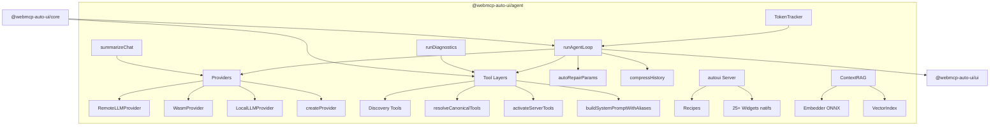
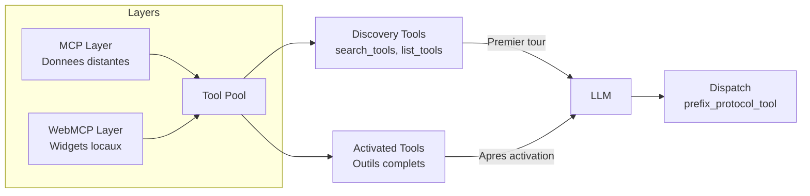
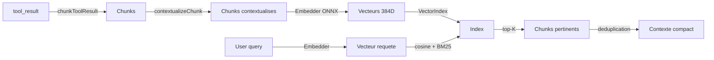

Le package `@webmcp-auto-ui/agent` est le cerveau de la plateforme. Il orchestre la boucle agent LLM (prompt → tool call → resultat → prompt), gere les providers (Claude distant, Gemma WASM in-browser, Ollama local), structure les outils en layers avec lazy loading, et fournit un serveur WebMCP integre (`autoui`) avec plus de 25 widgets natifs.

C'est le package le plus volumineux du monorepo, et celui qui relie tous les autres.

## Architecture interne



## Installation

```ts
import { runAgentLoop, RemoteLLMProvider, autoui } from '@webmcp-auto-ui/agent';
```

Dans un `package.json` d'app :

```json
{
  "devDependencies": {
    "@webmcp-auto-ui/agent": "file:../../packages/agent",
    "@webmcp-auto-ui/core": "file:../../packages/core"
  }
}
```

Le package depend de `@webmcp-auto-ui/core` et optionnellement de `@huggingface/transformers` + `onnxruntime-web` pour le nano-RAG et les embeddings.

---

## runAgentLoop

La fonction centrale du package. Execute une boucle iterative : envoyer un message au LLM, recevoir une reponse (texte ou tool calls), executer les outils, renvoyer les resultats au LLM, jusqu'a `end_turn` ou `maxIterations`.

```ts
import { runAgentLoop } from '@webmcp-auto-ui/agent';

const result = await runAgentLoop('Affiche un graphique des ventes Q1', {
  provider: remoteLLMProvider,
  layers: toolLayers,
  maxIterations: 5,
  callbacks: {
    onToken: (token) => process.stdout.write(token),
    onToolCall: (call) => console.log('Tool:', call.name),
    onWidget: (type, data) => {
      console.log(`Widget: ${type}`, data);
      return { id: `w_${Date.now()}` };
    },
  },
});

console.log(result.text);           // Reponse finale
console.log(result.toolCalls);      // Tous les appels d'outils
console.log(result.metrics);        // Tokens, latence, iterations
console.log(result.stopReason);     // 'end_turn' | 'max_iterations'
```

### AgentLoopOptions

```ts
interface AgentLoopOptions {
  // Obligatoire
  provider: LLMProvider;              // Provider LLM (Remote, Wasm, ou Local)

  // Connexion MCP (optionnel si WebMCP seulement)
  client?: McpClient;                 // Client MCP pour les serveurs distants

  // Outils
  layers?: ToolLayer[];               // Couches de tools structurees
  maxTools?: number;                  // Max outils par appel LLM

  // Controle de la boucle
  maxIterations?: number;             // Max iterations (defaut: 5)
  signal?: AbortSignal;               // Annulation

  // Parametres LLM
  maxTokens?: number;                 // Max tokens en sortie
  temperature?: number;               // Temperature (creativite)
  topK?: number;                      // Top K sampling
  cacheEnabled?: boolean;             // Cache de prompts (defaut: true)

  // Prompt
  systemPrompt?: string;              // Prompt systeme custom
  initialMessages?: ChatMessage[];    // Historique precedent

  // Optimisation contexte
  truncateResults?: boolean;          // Tronquer resultats longs (defaut: true)
  compressHistory?: boolean;          // Compresser anciens resultats (defaut: true)
  maxResultLength?: number;           // Max chars par resultat (defaut: 10000)

  // Streaming
  callbacks?: AgentCallbacks;         // Callbacks temps reel
}
```

### AgentResult

```ts
interface AgentResult {
  text: string;                       // Reponse finale texte
  toolCalls: ToolCall[];              // Historique des appels d'outils
  metrics: AgentMetrics;              // Metriques globales
  stopReason: 'end_turn' | 'max_iterations';
  messages: ChatMessage[];            // Conversation complete (utile pour continuer)
}
```

### AgentCallbacks

Les callbacks permettent le streaming en temps reel et la reaction aux evenements de l'agent :

```ts
interface AgentCallbacks {
  // Lifecycle
  onIterationStart?: (iteration: number, maxIterations: number) => void;
  onDone?: (metrics: AgentMetrics) => void;

  // LLM
  onLLMRequest?: (messages: ChatMessage[], tools: ProviderTool[]) => void;
  onLLMResponse?: (response: LLMResponse, latencyMs: number, tokens?: { input: number; output: number }) => void;
  onToken?: (token: string) => void;       // Streaming token par token
  onText?: (text: string) => void;         // Texte complet du bloc

  // Outils
  onToolCall?: (call: ToolCall) => void;

  // Widgets
  onWidget?: (type: string, data: Record<string, unknown>) => { id: string } | void;
  onClear?: () => void;                    // Canvas clear demande par l'agent
  onUpdate?: (id: string, data: Record<string, unknown>) => void;
  onMove?: (id: string, x: number, y: number) => void;
  onResize?: (id: string, w: number, h: number) => void;
  onStyle?: (id: string, styles: Record<string, string>) => void;
}
```

:::tip[Streaming]
Le callback `onToken` est appele pour chaque token genere par le LLM, permettant d'afficher la reponse progressivement. `onText` est appele une seule fois avec le texte complet du bloc, apres tous les tokens.
:::

### Mecanismes internes

**Compression de l'historique** : apres chaque iteration, les anciens `tool_result` sont compresses pour economiser le contexte. Les resultats volumineux sont tronques avec un hint `recall('id')` pour que le LLM puisse les recuperer a la demande via le tool `recall`.

**Result buffer** : chaque resultat d'outil est stocke dans un buffer interne. L'outil `recall(id)` permet au LLM de re-lire un resultat complet qui a ete compresse.

**Auto-repair** : si le LLM genere des parametres invalides (objet aplati, JSON stringify au lieu d'objet, champs manquants), `autoRepairParams` tente une reparation mecanique avant de renvoyer une erreur.

**Discovery tools** : au premier tour, l'agent ne voit que les outils de decouverte (`search_tools`, `list_tools`). Quand il active un serveur, les outils complets sont reveles (lazy loading).

---

## Providers LLM

Tous les providers implementent l'interface `LLMProvider` :

```ts
interface LLMProvider {
  chat(
    messages: ChatMessage[],
    options: { tools?: ProviderTool[]; maxTokens?: number; temperature?: number; topK?: number; signal?: AbortSignal; cacheEnabled?: boolean; systemPrompt?: string }
  ): Promise<LLMResponse>;
}
```

### RemoteLLMProvider

Provider pour Anthropic Claude via un proxy HTTP. Le proxy (typiquement un `+server.ts` SvelteKit) ajoute la cle API et relaie la requete a l'API Anthropic.

```ts
import { RemoteLLMProvider } from '@webmcp-auto-ui/agent';

const provider = new RemoteLLMProvider({
  proxyUrl: '/api/chat',       // URL du proxy (obligatoire)
  model: 'sonnet',             // 'haiku' | 'sonnet' | 'opus' (defaut: 'haiku')
  apiKey: 'sk-...',            // Optionnel, injecte dans le body
});
```

Les identifiants de modele sont resolus automatiquement :
- `'haiku'` → `claude-haiku-4-5-20250414`
- `'sonnet'` → `claude-sonnet-4-6-20250514`
- `'opus'` → `claude-opus-4-6-20250514`

```ts
interface RemoteLLMProviderOptions {
  proxyUrl: string;
  model?: string;    // Defaut: 'haiku'
  apiKey?: string;   // Optionnel
}
```

### WasmProvider

Provider Gemma 4 LiteRT qui execute le modele directement dans le navigateur via WASM, sans serveur. Le modele tourne sur le **thread principal** (pas de Web Worker) et supporte nativement le format `<|tool_call|>` pour les appels d'outils.

```ts
import { WasmProvider } from '@webmcp-auto-ui/agent';

const provider = new WasmProvider({
  model: 'gemma-e2b',       // 'gemma-e2b' (2B params) ou 'gemma-e4b' (4B params)
  contextSize: 32768,        // Taille du contexte (defaut: 32768)
  onProgress: (progress, status, loadedBytes, totalBytes) => {
    console.log(`Chargement: ${Math.round(progress * 100)}%`);
    console.log(`${loadedBytes} / ${totalBytes} octets`);
  },
  onStatusChange: (status) => {
    console.log(`Statut: ${status}`);
    // 'idle' → 'loading' → 'ready' (ou 'error')
  },
});

// Initialiser le modele (telecharge les poids ~200-400 MB)
await provider.initialize();
```

```ts
interface WasmProviderOptions {
  model: WasmModelId;        // 'gemma-e2b' | 'gemma-e4b'
  contextSize?: number;      // Defaut: 32768
  onProgress?: (progress: number, status: string, loaded?: number, total?: number) => void;
  onStatusChange?: (status: 'idle' | 'loading' | 'ready' | 'error') => void;
}
```

:::caution[Thread principal]
Gemma tourne sur le thread principal. Pendant l'inference, l'UI peut etre momentanement bloquee. Pour les taches longues, utilisez le provider Claude distant.
:::

### LocalLLMProvider

Provider pour Ollama (LLM local via serveur HTTP).

```ts
import { LocalLLMProvider } from '@webmcp-auto-ui/agent';

const provider = new LocalLLMProvider({
  baseUrl: 'http://localhost:11434',   // URL Ollama
  model: 'mistral',                    // Nom du modele Ollama
});
```

### createProvider (factory)

Instancie le bon provider a partir d'une configuration declarative :

```ts
import { createProvider } from '@webmcp-auto-ui/agent';
import type { LLMConfig } from '@webmcp-auto-ui/agent';

// Remote
const remote = createProvider({ type: 'remote', proxyUrl: '/api/chat', model: 'sonnet' });

// WASM
const wasm = createProvider({ type: 'wasm', model: 'gemma-e2b' });

// Local
const local = createProvider({ type: 'local', baseUrl: 'http://localhost:11434', model: 'mistral' });
```

### Aliases de compatibilite (deprecies)

```ts
// Ces aliases sont conserves pour retrocompatibilite mais deprecies
import { AnthropicProvider } from '@webmcp-auto-ui/agent';  // = RemoteLLMProvider
import { GemmaProvider } from '@webmcp-auto-ui/agent';      // = WasmProvider
```

---

## Tool Layers

Les tool layers structurent les outils en couches pour le lazy loading, l'injection dans le prompt, et la resolution d'alias. C'est le systeme qui permet a l'agent de decouvrir progressivement les outils disponibles sans saturer le contexte.



### Types de layers

```ts
type ToolLayer = McpLayer | WebMcpLayer;

interface McpLayer {
  protocol: 'mcp';
  serverName: string;        // Nom du serveur (utilise pour le prefix)
  description?: string;
  serverUrl?: string;
  tools: McpToolDef[];       // Outils MCP
  recipes?: McpRecipe[];     // Recipes optionnelles
}

interface WebMcpLayer {
  protocol: 'webmcp';
  serverName: string;
  description: string;
  tools: WebMcpToolDef[];    // Outils WebMCP (avec execute)
}
```

### Convention de nommage des outils

Les outils sont prefixes selon la convention `{server}_{protocol}_{tool}` :
- `recipes_mcp_search_recipes` — outil `search_recipes` du serveur MCP `recipes`
- `autoui_webmcp_widget_display` — outil `widget_display` du serveur WebMCP `autoui`

La fonction `sanitizeServerName` nettoie les noms de serveur (supprime "mcp", "server", "srv", normalise les separateurs).

### buildSystemPromptWithAliases

Genere le prompt systeme avec la liste des outils, les aliases canoniques, et les instructions d'execution.

```ts
import { buildSystemPromptWithAliases } from '@webmcp-auto-ui/agent';

const { prompt, aliasMap } = buildSystemPromptWithAliases(layers);
// prompt: texte complet du prompt systeme
// aliasMap: Map<"alias_name", "real_name">
```

Le prompt genere inclut :
- La liste des serveurs disponibles et leurs descriptions
- Les instructions pour la decouverte progressive des outils
- Les aliases canoniques (ex: `search_recipes` → `recipes_mcp_search_recipes`)
- Les recipes formatees pour l'injection dans le contexte

### buildDiscoveryToolsWithAliases

Construit les outils de decouverte initiaux. Au premier tour, l'agent ne voit que ces outils — il doit "activer" un serveur pour voir ses outils complets.

```ts
import { buildDiscoveryToolsWithAliases } from '@webmcp-auto-ui/agent';

const { tools, aliasMap } = buildDiscoveryToolsWithAliases(layers);
// tools: ProviderTool[] — discovery tools + aliases canoniques
// aliasMap: Map pour la resolution
```

### activateServerTools

Active les outils complets d'une layer. Appele quand l'agent decouvre un serveur via les outils de decouverte.

```ts
import { activateServerTools } from '@webmcp-auto-ui/agent';

// currentTools = outils actuels (discovery + deja actives)
// layer = la layer a activer
const nextTools = activateServerTools(currentTools, layer);
```

### resolveCanonicalTools

Resout les outils MCP en roles canoniques via un systeme de matching a 4 couches. Permet au prompt de reference des noms generiques (`search_recipes`, `list_recipes`, `get_recipe`) qui sont mappes aux noms reels des outils du serveur.

```ts
import { resolveCanonicalTools } from '@webmcp-auto-ui/agent';

const matches = resolveCanonicalTools(mcpTools);
// CanonicalMatch[] { role, realToolName }
```

Les 4 couches de matching :

1. **Exact match** — le nom de l'outil correspond exactement (`search_recipes`)
2. **Decompose** — tokenise le nom et teste toutes les paires (action, resource). Ex: `find_dishes` → action=find (synonyme de search), resource=dishes
3. **Description keywords** — scanne la description pour des mots-cles (recipe, template, workflow, content)
4. **Fallback** — aucune correspondance trouvee

```ts
// Actions reconnues par role
// search: 'search', 'find', 'query'
// list: 'list', 'browse', 'explore', 'discover'
// get: 'get', 'read', 'fetch', 'show', 'describe', 'detail', 'view', 'load'
```

### SchemaTransformOptions

Options pour transformer les schemas avant envoi au LLM :

```ts
interface SchemaTransformOptions {
  sanitize?: boolean;   // Nettoyer pour compatibilite Anthropic (defaut: true)
  flatten?: boolean;    // Aplatir les objets imbriques (defaut: false)
  onSchemaPatch?: (toolName: string, patches: SchemaPatch[]) => void;
}
```

---

## Serveur WebMCP integre (autoui)

Le package fournit un serveur WebMCP pre-configure avec plus de 25 widgets natifs et 6 outils de base. C'est le serveur par defaut utilise par toutes les apps de demo.

```ts
import { autoui, NATIVE_WIDGET_NAMES } from '@webmcp-auto-ui/agent';

// autoui est un WebMcpServer pret a l'emploi
const layer = autoui.layer();
```

### Widgets natifs

| Widget | Description |
|--------|-------------|
| `stat` | Statistique cle (label + valeur + tendance) |
| `kv` | Paires cle-valeur |
| `list` | Liste d'items |
| `chart` | Graphique a barres simple |
| `alert` | Alerte (info, warning, error, success) |
| `code` | Bloc de code avec coloration syntaxique |
| `text` | Texte Markdown |
| `actions` | Boutons d'action interactifs |
| `tags` | Badges/tags colores |
| `stat-card` | Carte statistique enrichie |
| `data-table` | Tableau de donnees triable |
| `timeline` | Chronologie d'evenements |
| `profile` | Fiche profil utilisateur |
| `trombinoscope` | Grille de profils |
| `json-viewer` | Arbre JSON interactif |
| `hemicycle` | Hemicycle parlementaire |
| `chart-rich` | Graphique multi-series (bar, line, area, pie, donut) |
| `cards` | Grille de cartes |
| `grid-data` | Grille de donnees |
| `sankey` | Diagramme Sankey |
| `map` | Carte Leaflet avec marqueurs |
| `log` | Visionneuse de logs |
| `gallery` | Galerie d'images |
| `carousel` | Carousel d'images/contenus |
| `d3` | Visualisations D3.js (treemap, force, heatmap, radial) |
| `js-sandbox` | Sandbox JavaScript pour visualisations custom |
| `recipe-browser` | Navigateur de recipes |

### Outils natifs

```ts
// widget_display — afficher un widget sur le canvas
await callTool('widget_display', {
  name: 'stat',
  params: { label: 'Revenue', value: '$42k', trend: 'up' }
});

// canvas — manipuler le canvas
await callTool('canvas', {
  action: 'clear'           // Vider le canvas
});
await callTool('canvas', {
  action: 'update',
  id: 'widget_123',
  params: { value: '$45k' } // Mettre a jour un widget
});
await callTool('canvas', {
  action: 'move',
  id: 'widget_123',
  x: 100, y: 200            // Deplacer un widget
});

// recall — rejouer un resultat d'outil precedent
await callTool('recall', { id: 'toolu_abc123' });

// search_recipes / list_recipes / get_recipe — decouvrir les widgets
await callTool('search_recipes', { query: 'chart' });
await callTool('list_recipes');
await callTool('get_recipe', { name: 'stat' });
```

---

## Recipes

Les recipes sont des fichiers Markdown avec frontmatter YAML qui documentent les widgets pour l'agent. Elles sont compilees a la build et injectees dans le prompt systeme.

### WEBMCP_RECIPES

Tableau statique de toutes les recipes compilees :

```ts
import { WEBMCP_RECIPES } from '@webmcp-auto-ui/agent';

console.log(WEBMCP_RECIPES.length);  // Nombre de recipes disponibles
```

### parseRecipe / parseRecipes

Parsent un fichier Markdown en objet `Recipe` :

```ts
import { parseRecipe, parseRecipes } from '@webmcp-auto-ui/agent';

const recipe = parseRecipe(markdownString);
// Recipe | null

const recipes = parseRecipes(arrayOfMarkdownStrings);
// Recipe[]
```

### recipeRegistry

Registre global avec enregistrement, filtrage et formatage :

```ts
import {
  recipeRegistry,
  registerRecipes,
  filterRecipesByServer,
  formatRecipesForPrompt,
  formatMcpRecipesForPrompt,
} from '@webmcp-auto-ui/agent';

// Enregistrer des recipes dans le registre global
registerRecipes(recipes);

// Filtrer par serveur
const nasaRecipes = filterRecipesByServer(recipes, 'nasa');

// Formater pour injection dans le system prompt
const promptBlock = formatRecipesForPrompt(recipes);
const mcpBlock = formatMcpRecipesForPrompt(mcpRecipes);
```

---

## summarizeChat

Resume une conversation agent pour l'export HyperSkill. Envoie l'historique au LLM pour generer un resume anonymise de 2-3 phrases.

```ts
import { summarizeChat } from '@webmcp-auto-ui/agent';
import type { SummarizeOptions, ChatSummaryResult } from '@webmcp-auto-ui/agent';

const result: ChatSummaryResult = await summarizeChat({
  messages: conversationHistory,
  provider: remoteLLMProvider,
  toolsUsed: ['widget_display', 'search_recipes'],
  toolCallCount: 5,
  mcpServers: ['nasa', 'hackernews'],
  skillsReferenced: [],
});

console.log(result.chatSummary);   // Resume textuel anonymise
console.log(result.provenance);     // Objet de traçabilite
```

Le resume est anonymise automatiquement : les noms de personnes, entreprises, lieux et URLs sont remplaces par des termes generiques.

```ts
interface ChatSummaryResult {
  chatSummary: string;
  provenance: {
    mcpServers?: string[];
    toolsUsed?: string[];
    toolCallCount?: number;
    skillsReferenced?: string[];
    llm?: string;
    exportedAt: string;
  };
}
```

---

## Token Tracker

Suit les tokens et la latence en temps reel avec des taux glissants sur 60 secondes.

```ts
import { TokenTracker } from '@webmcp-auto-ui/agent';

const tracker = new TokenTracker();

// Enregistrer les metriques apres chaque reponse LLM
tracker.record(
  { input_tokens: 1500, output_tokens: 200, cache_read_input_tokens: 800 },
  1200  // latence en ms
);

// Lire les metriques
const m = tracker.metrics;
console.log(`Total: ${m.totalInputTokens} in / ${m.totalOutputTokens} out`);
console.log(`Taux: ${m.requestsPerMin} req/min`);
console.log(`Cache: ${m.totalCachedGB.toFixed(3)} GB lu depuis le cache`);

// S'abonner aux mises a jour en temps reel
const unsubscribe = tracker.subscribe((metrics) => {
  updateUI(metrics);
});
```

```ts
interface TokenMetrics {
  // Cumulatifs
  totalRequests: number;
  totalInputTokens: number;
  totalOutputTokens: number;
  totalCacheReadTokens: number;

  // Taux glissants (fenetre de 60s)
  requestsPerMin: number;
  inputTokensPerMin: number;
  outputTokensPerMin: number;

  // Derniere requete
  lastInputTokens: number;
  lastOutputTokens: number;
  lastCacheReadTokens: number;
  lastLatencyMs: number;

  // Derives
  totalCachedGB: number;   // totalCacheReadTokens * 4 / 1e9
  isWasm: boolean;          // true si metriques estimees (WASM)
}
```

---

## Nano-RAG (context compaction)

Le module nano-RAG compresse le contexte agent en decoupant les resultats d'outils en chunks, en les embedant via ONNX (modele `all-MiniLM-L6-v2`), et en ne recuperant que les chunks pertinents avant chaque appel LLM.



### ContextRAG

```ts
import { ContextRAG, type ContextRAGOptions } from '@webmcp-auto-ui/agent';

const rag = new ContextRAG({
  topK: 5,              // Chunks a recuperer par requete (defaut: 5)
  maxChunkSize: 300,    // Taille max d'un chunk en chars (defaut: 300)
  enabled: true,        // Activer/desactiver
  onProgress: (status, loaded, total) => {
    console.log(`Embedder: ${status} (${loaded}/${total})`);
  },
});

// Initialiser (telecharge le modele ONNX au premier usage)
await rag.initialize();

// Ingerer un resultat d'outil
await rag.ingest('toolu_123', toolResultText);

// Recuperer les chunks pertinents pour une requete
const context = await rag.query('revenue Q1');
// string — chunks concatenes, prets pour injection dans le prompt
```

Le nano-RAG utilise un systeme hybride embeddings + BM25, avec deduplication par similarite Jaccard et eviction LRU des anciens chunks.

---

## Diagnostics

Analyse les layers, les schemas et le prompt pour detecter les problemes potentiels.

```ts
import { runDiagnostics } from '@webmcp-auto-ui/agent';
import type { Diagnostic } from '@webmcp-auto-ui/agent';

const diagnostics: Diagnostic[] = runDiagnostics(layers, tools, systemPrompt, {
  sanitize: true,
  flatten: false,
});

diagnostics.forEach(d => {
  console.log(`[${d.severity}] ${d.title}`);
  console.log(`  ${d.detail}`);
  if (d.quickFix) console.log(`  Fix rapide: ${d.quickFix}`);
  if (d.codeFix) console.log(`  Fix code: ${d.codeFix}`);
});
```

```ts
interface Diagnostic {
  severity: 'error' | 'warning';
  title: string;
  detail: string;
  quickFix?: string;    // Instruction pour le prompt
  codeFix?: string;     // Modification de code suggeree
}
```

Detecte :
- Bruit dans les prefixes de serveur ("mcp", "server" residuels)
- Schemas invalides ou incompatibles avec Anthropic
- Incoherences entre le prompt et les outils enregistres

---

## Auto-Repair

Repare automatiquement les parametres d'appel d'outil quand le LLM genere des structures incorrectes.

```ts
import { autoRepairParams } from '@webmcp-auto-ui/agent';
import type { RepairResult } from '@webmcp-auto-ui/agent';

const { params, fixes } = autoRepairParams(rawInput, toolSchema, toolName);

if (fixes.length > 0) {
  console.log('Reparations appliquees:', fixes);
  // Ex: ['flat params → nested {name, params:{...}}', 'data: stringified JSON → parsed object']
}
```

Reparations supportees :
- **Flat → nested** : si le schema attend `{name, params}` mais reçoit `{name, key1, key2}`, regroupe automatiquement en `{name, params: {key1, key2}}`
- **String → object** : si un champ attend un objet mais reçoit une chaine JSON, parse automatiquement
- **Champs manquants** : ajoute les champs obligatoires avec des valeurs par defaut quand possible

---

## Utilitaires

### toProviderTools

Convertit les outils MCP en format Anthropic (utilise par la boucle agent) :

```ts
import { toProviderTools } from '@webmcp-auto-ui/agent';

const providerTools = toProviderTools(mcpTools);
// ProviderTool[] — format attendu par l'API Anthropic
```

### fromMcpTools

Convertit les `McpTool[]` (du core) en `McpToolDef[]` (agent) :

```ts
import { fromMcpTools } from '@webmcp-auto-ui/agent';

const toolDefs = fromMcpTools(tools);
```

### trimConversationHistory

Reduit l'historique a un budget de tokens en supprimant les messages les plus anciens :

```ts
import { trimConversationHistory } from '@webmcp-auto-ui/agent';

const trimmed = trimConversationHistory(messages, 4096);
```

### Discovery Cache

Cache pour les resultats de decouverte (recipes MCP, schemas) :

```ts
import { DiscoveryCache } from '@webmcp-auto-ui/agent';
import type { CachedRecipe, ServerCache } from '@webmcp-auto-ui/agent';

const cache = new DiscoveryCache();
// Utilisé en interne par buildDiscoveryCache()
```

---

## Types

### Messages et contenus

```ts
interface ChatMessage {
  role: 'user' | 'assistant' | 'system';
  content: string | ContentBlock[];
}

type ContentBlock =
  | { type: 'text'; text: string }
  | { type: 'tool_use'; id: string; name: string; input: Record<string, unknown> }
  | { type: 'tool_result'; tool_use_id: string; content: string };

interface LLMResponse {
  content: ContentBlock[];
  stopReason: string;
  usage?: { input_tokens: number; output_tokens: number; cache_read_input_tokens?: number };
}
```

### Outils et metriques

```ts
interface ToolCall {
  id: string;
  name: string;
  args: Record<string, unknown>;
  result?: string;
  error?: string;
  elapsed?: number;
  guided?: boolean;    // Precede par un outil de decouverte
}

interface AgentMetrics {
  totalTokens: number;
  promptTokens: number;
  completionTokens: number;
  totalLatencyMs: number;
  toolCalls: number;
  iterations: number;
  cacheHits: number;
}
```

### Modeles

```ts
type RemoteModelId = 'haiku' | 'sonnet' | 'opus';
type WasmModelId = 'gemma-e2b' | 'gemma-e4b';
type LLMId = RemoteModelId | WasmModelId;
type ModelId = LLMId | string;  // Inclut les modeles Ollama
```

---

## Tutoriel : agent complet avec MCP + WebMCP

Ce tutoriel construit un agent qui se connecte a un serveur MCP distant pour les donnees, utilise les widgets natifs pour l'affichage, et gere le streaming en temps reel.

### Etape 1 : configurer les providers et clients

```ts
import { runAgentLoop, RemoteLLMProvider, autoui } from '@webmcp-auto-ui/agent';
import { McpClient } from '@webmcp-auto-ui/core';

// Provider Claude Sonnet
const provider = new RemoteLLMProvider({
  proxyUrl: '/api/chat',
  model: 'sonnet',
});

// Client MCP pour le serveur de donnees
const client = new McpClient('https://mcp.example.com/mcp');
await client.connect();
const mcpTools = await client.listTools();
```

### Etape 2 : construire les layers

```ts
const layers = [
  // Layer MCP — donnees distantes
  {
    protocol: 'mcp' as const,
    serverName: 'data-api',
    description: 'API de donnees: utilisateurs, ventes, metriques',
    tools: mcpTools,
  },
  // Layer WebMCP — widgets natifs (autoui)
  autoui.layer(),
];
```

### Etape 3 : lancer la boucle avec callbacks

```ts
const result = await runAgentLoop('Montre-moi les ventes du trimestre en graphique', {
  client,
  provider,
  layers,
  maxIterations: 5,
  callbacks: {
    onIterationStart: (i, max) => console.log(`--- Iteration ${i}/${max} ---`),
    onToken: (token) => process.stdout.write(token),
    onToolCall: (call) => {
      console.log(`\n[Tool] ${call.name}(${JSON.stringify(call.args)})`);
    },
    onWidget: (type, data) => {
      console.log(`\n[Widget] ${type}:`, JSON.stringify(data));
      return { id: `w_${Date.now()}` };
    },
    onDone: (metrics) => {
      console.log(`\nTermine: ${metrics.totalTokens} tokens, ${metrics.iterations} iterations`);
    },
  },
});
```

### Deroulement typique

1. L'agent reçoit le message utilisateur
2. Il appelle `search_tools` ou `list_tools` pour decouvrir les outils
3. Il active le serveur MCP `data-api` (lazy loading)
4. Il appelle l'outil MCP pour recuperer les donnees de ventes
5. Il appelle `widget_display` avec le widget `chart-rich` pour afficher le graphique
6. Il repond avec un texte de synthese

---

## Bonnes pratiques

:::tip[Limiter les iterations]
Gardez `maxIterations` entre 3 et 8. Au-dela, l'agent risque de tourner en boucle. Si l'agent atteint systematiquement la limite, le prompt systeme a probablement besoin d'etre affine.
:::

:::tip[Cache de prompts]
Le cache (`cacheEnabled: true` par defaut) reduit les couts de 90% en evitant de re-envoyer le prompt systeme a chaque requete. Laissez-le active sauf pour le debug.
:::

:::caution[Taille des resultats]
`truncateResults` et `compressHistory` sont actifs par defaut. Si vous les desactivez, l'historique peut exploser et depasser le contexte du LLM. Pour les resultats volumineux (>10k chars), utilisez le tool `recall` plutot que de tout garder en contexte.
:::

:::caution[Schemas des outils]
Certains serveurs MCP exposent des schemas avec `$ref`, `oneOf`, ou `anyOf` que l'API Anthropic ne supporte pas. La sanitization est active par defaut (`sanitize: true`), mais verifiez avec `runDiagnostics` si vous rencontrez des erreurs de schema.
:::

---

## FAQ

**Quelle est la difference entre RemoteLLMProvider et WasmProvider ?**
Remote envoie les requetes a l'API Claude via un proxy HTTP. Wasm telecharge et execute le modele Gemma directement dans le navigateur, sans serveur. Remote est plus puissant mais payant ; Wasm est gratuit mais plus lent et moins capable.

**Comment l'agent sait quel widget utiliser ?**
Les recipes injectees dans le prompt systeme decrivent chaque widget (nom, description, schema des parametres, cas d'utilisation). L'agent choisit le widget le plus adapte a la donnee qu'il veut afficher.

**Le nano-RAG est-il active par defaut ?**
Non. Il faut creer explicitement une instance `ContextRAG` et la passer a la boucle. Le nano-RAG est surtout utile pour les conversations longues avec de nombreux resultats d'outils volumineux.

**Puis-je utiliser un modele Ollama avec les widgets ?**
Oui, mais les modeles Ollama sont generalement moins performants que Claude pour les tool calls. Testez avec `runDiagnostics` pour verifier la compatibilite des schemas.

**Comment fonctionne l'auto-repair ?**
Quand le LLM genere des parametres invalides (objet aplati, JSON stringify, champs manquants), `autoRepairParams` tente des corrections mecaniques avant de renvoyer une erreur. Cela ameliore significativement le taux de reussite des tool calls, surtout avec les modeles locaux.
