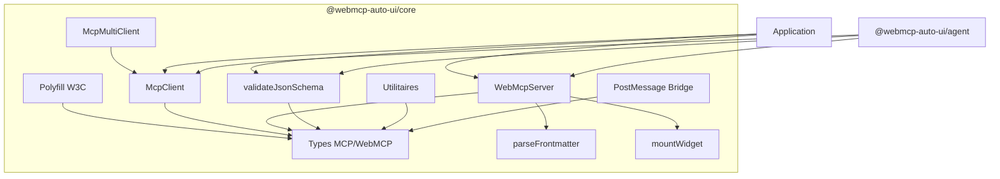
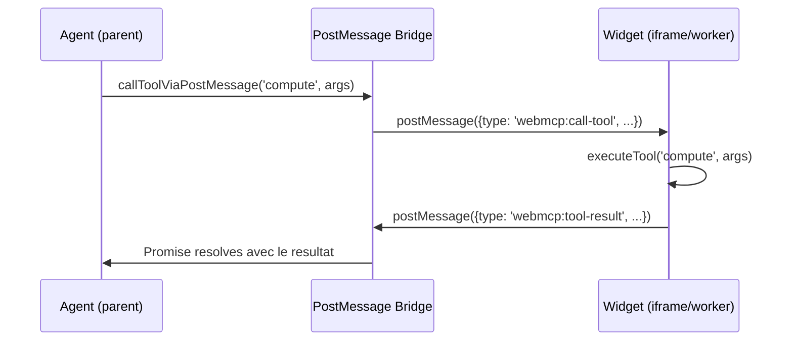
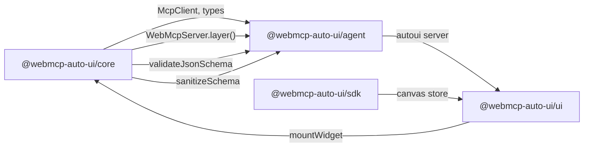

Le package `@webmcp-auto-ui/core` constitue le socle technique de toute la plateforme WebMCP Auto-UI. Il fournit quatre capacites fondamentales : un **polyfill W3C WebMCP** (conforme au Draft CG Report 2026-03-27), un **client MCP** Streamable HTTP, un **serveur WebMCP** pour exposer widgets et outils, et une **validation JSON Schema** sans dependance externe.

Zero dependances. Framework-agnostique. Utilisable cote serveur comme cote client.

## Architecture interne



## Installation

Le package fait partie du monorepo. Dans une app du projet :

```ts
import { McpClient, createWebMcpServer, validateJsonSchema } from '@webmcp-auto-ui/core';
```

Dans un `package.json` d'app :

```json
{
  "devDependencies": {
    "@webmcp-auto-ui/core": "file:../../packages/core"
  }
}
```

---

## Polyfill W3C WebMCP

Le polyfill implemente les 17 fonctionnalites obligatoires du W3C WebMCP Draft CG Report (2026-03-27). Il installe `navigator.modelContext` dans les navigateurs qui ne l'implementent pas nativement, rendant les outils MCP accessibles via une API standardisee.

### Concept de "polyfill MCP"

Le principe est simple : les navigateurs n'implementent pas encore nativement le Model Context Protocol. Le polyfill intercepte les appels a `navigator.modelContext` et les redirige vers une implementation JavaScript qui gere l'enregistrement d'outils, la validation des schemas, et la communication avec les agents LLM.

### initializeWebMCPPolyfill

Installe le polyfill sur `navigator.modelContext`.

```ts
import { initializeWebMCPPolyfill, cleanupWebMCPPolyfill, hasNativeWebMCP } from '@webmcp-auto-ui/core';

// Verifier si le navigateur supporte nativement WebMCP
if (!hasNativeWebMCP()) {
  // Installer le polyfill avec options
  initializeWebMCPPolyfill({
    // Tier de confirmation pour les outils sensibles
    defaultConfirmationTier: 'auto',
  });
}

// Plus tard, retirer le polyfill proprement
cleanupWebMCPPolyfill();
```

Le polyfill restaure les descripteurs originaux de `navigator.modelContext` lors du cleanup (save/restore pattern).

### Enregistrement d'outils via le polyfill

Une fois le polyfill installe, les outils s'enregistrent via l'API standard :

```ts
// Enregistrer un outil sur navigator.modelContext
await navigator.modelContext.registerTool({
  name: 'search_recipes',
  description: 'Chercher des recettes',
  inputSchema: {
    type: 'object',
    properties: {
      query: { type: 'string', description: 'Mot-cle de recherche' }
    },
    required: ['query']
  }
}, async (params) => {
  // Logique d'execution
  return { content: [{ type: 'text', text: 'Resultats...' }] };
});
```

### executeToolInternal

Execute un outil enregistre dans le polyfill (usage interne par la boucle agent).

```ts
import { executeToolInternal } from '@webmcp-auto-ui/core';

const result = await executeToolInternal('search_recipes', { query: 'pasta' });
// ToolExecuteResult { content: [...] }
```

---

## MCP Client

Client JSON-RPC pour le Model Context Protocol via HTTP Streamable. Gere automatiquement les sessions, la reconnexion, et le timeout.

### McpClient

```ts
import { McpClient } from '@webmcp-auto-ui/core';

// Creer un client pour un serveur MCP distant
const client = new McpClient('http://localhost:3000/mcp', {
  clientName: 'my-app',
  clientVersion: '1.0.0',
  timeout: 30000,
});
```

Le constructeur accepte l'URL du serveur MCP et un objet d'options :

```ts
interface McpClientOptions {
  clientName?: string;              // Defaut: 'webmcp-auto-ui'
  clientVersion?: string;           // Defaut: '0.1.0'
  timeout?: number;                 // Defaut: 30000 ms
  headers?: Record<string, string>; // Headers HTTP additionnels
  autoReconnect?: boolean;          // Reconnexion automatique (defaut: true)
  maxReconnectAttempts?: number;    // Tentatives max (defaut: 3)
}
```

### Cycle de vie d'une connexion

```ts
// 1. Connexion et handshake JSON-RPC
const initResult = await client.connect();
// initResult: McpInitializeResult { protocolVersion, capabilities, serverInfo }

// 2. Decouverte des outils disponibles
const tools = await client.listTools();
// McpTool[] — chaque outil a un name, description, et inputSchema

// 3. Appel d'un outil
const result = await client.callTool('search_recipes', { query: 'desserts' });
// McpToolResult { content: [...], isError? }

// 4. Fermeture propre
await client.close();
```

:::tip
Le client gere automatiquement les sessions via le header `Mcp-Session-Id`. Si la connexion est perdue et que `autoReconnect` est active, le client retente jusqu'a `maxReconnectAttempts` fois.
:::

### McpMultiClient

Quand l'application doit interagir avec plusieurs serveurs MCP simultanément — par exemple un serveur de recettes et un serveur de donnees — le `McpMultiClient` simplifie la gestion.

```ts
import { McpMultiClient } from '@webmcp-auto-ui/core';

const multi = new McpMultiClient();

// Connecter plusieurs serveurs en parallele
await multi.connect('recipes', 'http://localhost:3000/mcp');
await multi.connect('database', 'http://localhost:3001/mcp');

// Lister les serveurs connectes
const servers = multi.listServers();
// ConnectedServer[] { url, name, tools, ... }

// Appeler un outil sur un serveur specifique
const result = await multi.callTool('recipes', 'search_recipes', { query: 'pasta' });

// Fermer toutes les connexions
await multi.closeAll();
```

Le type `ConnectedServer` expose les informations de chaque serveur connecte :

```ts
interface ConnectedServer {
  url: string;
  name: string;
  tools: McpTool[];
  client: McpClient;
}
```

---

## WebMCP Server

Le serveur WebMCP est le pendant local du serveur MCP distant. Alors que MCP fournit les **donnees** (via un serveur HTTP), WebMCP fournit les **widgets** (cote client, dans le navigateur). C'est cette symetrie qui permet a l'agent de combiner donnees distantes et affichage local dans une boucle unifiee.

### createWebMcpServer

Fabrique un serveur WebMCP capable d'enregistrer des widgets et des outils.

```ts
import { createWebMcpServer } from '@webmcp-auto-ui/core';

const server = createWebMcpServer('my-widgets', {
  description: 'Widgets personnalises pour mon application',
});
```

Le serveur retourne un objet `WebMcpServer` :

```ts
interface WebMcpServer {
  readonly name: string;
  readonly description: string;

  registerWidget(recipeMarkdown: string, renderer: WidgetRenderer): void;
  addTool(tool: WebMcpToolDef): void;
  layer(): { protocol: 'webmcp'; serverName: string; description: string; tools: WebMcpToolDef[] };
  getWidget(name: string): WidgetEntry | undefined;
  listWidgets(): WidgetEntry[];
}
```

### Enregistrer un widget

Les widgets se declarent via une **recipe** Markdown avec frontmatter YAML. Le frontmatter definit le nom, la description et le schema JSON des parametres. Le body Markdown contient la documentation du widget (injectee dans le prompt de l'agent).

```ts
server.registerWidget(`
---
widget: my-chart
description: Graphique personnalise avec titre et donnees
schema:
  type: object
  properties:
    title:
      type: string
      description: Titre du graphique
    data:
      type: array
      description: Donnees a afficher
required:
  - data
---

## Quand utiliser

Utilise ce widget pour afficher des donnees sous forme de graphique.
Le champ 'title' est optionnel, 'data' est obligatoire.
`, renderer);
```

### Renderers

Le serveur supporte deux types de renderers :

**Renderer vanilla (fonction JavaScript)** — pour les widgets sans framework :

```ts
const renderer = (container: HTMLElement, data: Record<string, unknown>) => {
  const title = data.title as string || 'Sans titre';
  container.innerHTML = `
    <div class="chart">
      <h2>${title}</h2>
      <div class="chart-body">...</div>
    </div>
  `;

  // Retourner optionnellement une fonction de cleanup
  return () => {
    container.innerHTML = '';
  };
};
```

**Renderer framework (Svelte, React, etc.)** — passer directement le composant :

```ts
import MyChart from './MyChart.svelte';
server.registerWidget(recipeMd, MyChart);
```

Le serveur detecte automatiquement si le renderer est une fonction (vanilla) ou un composant framework, et positionne le flag `vanilla` dans `WidgetEntry` en consequence.

### Ajouter un outil custom

Les outils ajoutent des capacites au serveur au-dela des widgets. Par exemple, un outil de calcul :

```ts
server.addTool({
  name: 'compute',
  description: 'Effectuer un calcul mathematique',
  inputSchema: {
    type: 'object',
    properties: {
      operation: { type: 'string', enum: ['add', 'subtract', 'multiply', 'divide'] },
      a: { type: 'number' },
      b: { type: 'number' },
    },
    required: ['operation', 'a', 'b'],
  },
  execute: async (params) => {
    const { operation, a, b } = params as { operation: string; a: number; b: number };
    const ops: Record<string, (x: number, y: number) => number> = {
      add: (x, y) => x + y,
      subtract: (x, y) => x - y,
      multiply: (x, y) => x * y,
      divide: (x, y) => x / y,
    };
    return { result: ops[operation](a, b) };
  },
});
```

### Exporter en tant que layer

La methode `layer()` convertit le serveur en `ToolLayer` injectable dans la boucle agent :

```ts
const layer = server.layer();
// { protocol: 'webmcp', serverName: 'my-widgets', description: '...', tools: [...] }

// Utiliser dans runAgentLoop
const result = await runAgentLoop('Affiche un graphique', {
  provider,
  layers: [layer],
});
```

### Lister et retrouver les widgets

```ts
const widgets = server.listWidgets();
// WidgetEntry[] — chaque entree contient name, description, inputSchema, recipe, renderer

const widget = server.getWidget('my-chart');
if (widget) {
  console.log(widget.description);
  console.log(widget.inputSchema);
  console.log(widget.vanilla); // true si renderer fonction
}
```

---

## parseFrontmatter

Parse le frontmatter YAML d'une recipe Markdown. Implementation interne sans dependance YAML externe — supporte les scalaires, objets imbriques (indentation), tableaux (`- item`), et valeurs inline.

```ts
import { parseFrontmatter } from '@webmcp-auto-ui/core';

const markdown = `---
widget: stat
description: Statistique cle
schema:
  type: object
  properties:
    label:
      type: string
    value:
      type: string
---

## Quand utiliser

Ce widget affiche une statistique importante avec un label et une valeur.
`;

const { frontmatter, body } = parseFrontmatter(markdown);
// frontmatter: { widget: 'stat', description: 'Statistique cle', schema: { type: 'object', ... } }
// body: '\n## Quand utiliser\n\nCe widget affiche...'
```

:::note
Si le Markdown ne commence pas par `---`, la fonction retourne un frontmatter vide et le body complet. Aucune erreur n'est levee.
:::

---

## mountWidget

Monte un widget vanilla dans un conteneur DOM. Resoud le widget par nom parmi les serveurs fournis, puis appelle son renderer.

```ts
import { mountWidget } from '@webmcp-auto-ui/core';

const container = document.getElementById('widget-container');

// Le dernier argument est un tableau de serveurs WebMCP
const cleanup = mountWidget(container, 'stat', {
  label: 'Revenue',
  value: '$42k'
}, [server]);

// Plus tard, demonter le widget proprement
cleanup?.();
```

Cette fonction est utilisee par le `WidgetRenderer` du package `@webmcp-auto-ui/ui` pour les widgets vanilla qui ne sont pas des composants Svelte.

---

## Validation JSON Schema

### validateJsonSchema

Validation stricte d'une donnee contre un JSON Schema. Supporte les types primitifs, les objets imbriques, les tableaux, les contraintes `minimum`/`maximum`/`minLength`/`maxLength`/`enum`, et les champs `required`.

```ts
import { validateJsonSchema } from '@webmcp-auto-ui/core';

const schema = {
  type: 'object',
  properties: {
    name: { type: 'string', minLength: 1 },
    age: { type: 'number', minimum: 0 },
    role: { type: 'string', enum: ['admin', 'user', 'guest'] },
  },
  required: ['name'],
};

// Donnee valide
const ok = validateJsonSchema({ name: 'Alice', age: 30, role: 'admin' }, schema);
// { valid: true, errors: [] }

// Donnee invalide
const err = validateJsonSchema({ age: -5 }, schema);
// { valid: false, errors: [
//   { path: '$.name', message: 'required property missing', expected: 'string' },
//   { path: '$.age', message: 'value below minimum', expected: '0', actual: '-5' }
// ] }
```

**Types de retour :**

```ts
interface ValidationResult {
  valid: boolean;
  errors: ValidationError[];
}

interface ValidationError {
  path: string;      // Chemin JSON Pointer (ex: '$.properties.age')
  message: string;   // Description humaine de l'erreur
  expected?: string;  // Valeur ou type attendu
  actual?: string;    // Valeur ou type reel
}
```

:::tip
Cette validation est utilisee en interne par le serveur WebMCP pour valider les parametres des outils avant execution, et par la boucle agent pour verifier les arguments des tool calls du LLM.
:::

---

## Utilitaires

### sanitizeSchema

Nettoie un JSON Schema pour le rendre compatible avec les API LLM (notamment Anthropic). Certains providers imposent des contraintes strictes sur les schemas (pas de `$ref` sans `$defs`, pas de `additionalProperties` dans certains contextes, profondeur limitee).

```ts
import { sanitizeSchema } from '@webmcp-auto-ui/core';

const clean = sanitizeSchema(rawSchema);
```

Supprime :
- References non resolues (`$ref` sans `$defs`)
- Proprietes additionnelles invalides
- Schemas imbriques trop profonds

La variante `sanitizeSchemaWithReport` retourne en plus la liste des modifications appliquees :

```ts
import { sanitizeSchemaWithReport } from '@webmcp-auto-ui/core';

const { schema, patches } = sanitizeSchemaWithReport(rawSchema);
// patches: SchemaPatch[] — chaque patch decrit une modification

interface SchemaPatch {
  path: string;
  action: string;
  detail?: string;
}
```

### flattenSchema / unflattenParams

Aplatit un schema a objets imbriques en un schema plat avec convention `key__subkey`. Utile quand le LLM a du mal avec les objets profondement imbriques.

```ts
import { flattenSchema, unflattenParams } from '@webmcp-auto-ui/core';

// Aplatir le schema
const flat = flattenSchema({ type: 'object', properties: {
  config: { type: 'object', properties: {
    host: { type: 'string' },
    port: { type: 'number' }
  }}
}});
// Resultat: { type: 'object', properties: { config__host: { type: 'string' }, config__port: { type: 'number' } } }

// Desaplatir les parametres reçus du LLM
const nested = unflattenParams({ config__host: 'localhost', config__port: 3000 }, pathMap);
// Resultat: { config: { host: 'localhost', port: 3000 } }
```

### createToolGroup

Cree un groupe d'outils avec un namespace partage. Prefixe automatiquement les noms.

```ts
import { createToolGroup } from '@webmcp-auto-ui/core';

const group = createToolGroup('database', [
  { name: 'query', description: 'Execute a SQL query', inputSchema: { /* ... */ } },
  { name: 'insert', description: 'Insert a record', inputSchema: { /* ... */ } },
]);

// group.tools contient :
// - database_query
// - database_insert
```

### textResult / jsonResult

Helpers pour construire des resultats de tool conformes au format MCP :

```ts
import { textResult, jsonResult } from '@webmcp-auto-ui/core';

// Resultat texte
const text = textResult('Operation reussie');
// { content: [{ type: 'text', text: 'Operation reussie' }] }

// Resultat JSON (serialise automatiquement)
const json = jsonResult({ count: 42, items: ['a', 'b'] });
// { content: [{ type: 'text', text: '{"count":42,"items":["a","b"]}' }] }
```

---

## PostMessage Bridge

Le pont postMessage permet a des outils de s'executer dans des contextes isoles (iframes, Web Workers) tout en communiquant avec l'agent principal. C'est le mecanisme qui rend possible l'execution securisee de code non fiable (widgets sandbox, extensions tierces).



### listenForAgentCalls

Ecoute les appels d'outils entrants via postMessage. Typiquement utilise dans un iframe ou un worker.

```ts
import { listenForAgentCalls, signalCompletion } from '@webmcp-auto-ui/core';

const stopListening = listenForAgentCalls(async (toolName, args) => {
  const result = await executeTool(toolName, args);
  signalCompletion(result);
});

// Arreter l'ecoute
stopListening();
```

### callToolViaPostMessage

Appelle un outil dans un contexte distant. Retourne une Promise qui se resout quand le resultat arrive via postMessage.

```ts
import { callToolViaPostMessage } from '@webmcp-auto-ui/core';

const result = await callToolViaPostMessage(
  targetWindow,     // iframe.contentWindow ou worker
  'compute',
  { a: 5, b: 3 }
);
```

### isWebMCPEvent

Verifie si un event `message` est un message WebMCP valide (utile pour filtrer les messages dans un listener global).

```ts
import { isWebMCPEvent } from '@webmcp-auto-ui/core';

window.addEventListener('message', (e) => {
  if (isWebMCPEvent(e.data)) {
    console.log(e.data.type);
    // 'webmcp:call-tool' | 'webmcp:tool-result' | 'webmcp:tool-error'
  }
});
```

---

## Types

### Types JSON Schema

```ts
export type JsonSchemaType =
  | 'string' | 'number' | 'integer' | 'boolean'
  | 'object' | 'array' | 'null';

export interface JsonSchemaObject {
  type?: JsonSchemaType | JsonSchemaType[];
  description?: string;
  properties?: Record<string, JsonSchema>;
  required?: string[];
  items?: JsonSchema | JsonSchema[];
  minLength?: number;
  maxLength?: number;
  minimum?: number;
  maximum?: number;
  enum?: unknown[];
  // ... et autres contraintes JSON Schema
}

export type JsonSchema = boolean | JsonSchemaObject;
```

### Types MCP

```ts
export interface McpTool {
  name: string;
  description?: string;
  inputSchema?: JsonSchema;
  outputSchema?: JsonSchema;
}

export interface McpToolResult {
  content: McpToolResultContent[];
  isError?: boolean;
}

export interface McpToolResultContent {
  type: 'text' | 'image' | 'resource';
  text?: string;
  data?: string;
  mimeType?: string;
  resource?: { uri: string; mimeType?: string; text?: string };
}

export interface McpInitializeResult {
  protocolVersion: string;
  capabilities: McpCapabilities;
  serverInfo: McpServerInfo;
}
```

### Types WebMCP

```ts
export interface WebMcpToolDef {
  name: string;
  description: string;
  inputSchema: Record<string, unknown>;
  execute: (params: Record<string, unknown>) => Promise<unknown>;
}

export interface WidgetEntry {
  name: string;
  description: string;
  inputSchema: Record<string, unknown>;
  recipe: string;
  renderer: WidgetRenderer;
  group?: string;
  vanilla: boolean;  // true si le renderer est une fonction (pas un composant framework)
}

export type WidgetRenderer =
  | ((container: HTMLElement, data: Record<string, unknown>) => void | (() => void))
  | unknown;  // Composant framework (Svelte, React, etc.)
```

---

## Tutoriel : creer un serveur WebMCP de A a Z

Ce tutoriel guide la creation d'un serveur WebMCP avec deux widgets et un outil custom, puis son integration dans une boucle agent.

### Etape 1 : creer le serveur

```ts
import { createWebMcpServer } from '@webmcp-auto-ui/core';

const server = createWebMcpServer('dashboard', {
  description: 'Widgets de tableau de bord',
});
```

### Etape 2 : enregistrer un widget stat

```ts
server.registerWidget(`
---
widget: metric
description: Affiche une metrique cle avec label, valeur et tendance
schema:
  type: object
  properties:
    label:
      type: string
      description: Label de la metrique
    value:
      type: string
      description: Valeur affichee
    trend:
      type: string
      enum: [up, down, stable]
      description: Tendance
  required:
    - label
    - value
---

## Utilisation

Utilise ce widget pour afficher un KPI important.
Exemples : "Revenue: $42k (up)", "Users: 1.2k (stable)".
`, (container, data) => {
  const trend = data.trend === 'up' ? '↑' : data.trend === 'down' ? '↓' : '→';
  container.innerHTML = `
    <div style="padding: 16px; border-radius: 8px; background: var(--color-surface);">
      <div style="font-size: 0.875rem; color: var(--color-muted);">${data.label}</div>
      <div style="font-size: 1.5rem; font-weight: bold;">${data.value} ${trend}</div>
    </div>
  `;
});
```

### Etape 3 : ajouter un outil de donnees

```ts
server.addTool({
  name: 'fetch_metrics',
  description: 'Recuperer les metriques du tableau de bord',
  inputSchema: {
    type: 'object',
    properties: {
      period: { type: 'string', enum: ['day', 'week', 'month'] },
    },
    required: ['period'],
  },
  execute: async (params) => {
    const { period } = params as { period: string };
    // Simuler des donnees
    return {
      revenue: period === 'day' ? '$2.1k' : period === 'week' ? '$14.8k' : '$42k',
      users: period === 'day' ? '89' : period === 'week' ? '523' : '1.2k',
    };
  },
});
```

### Etape 4 : connecter a la boucle agent

```ts
import { runAgentLoop, RemoteLLMProvider } from '@webmcp-auto-ui/agent';

const provider = new RemoteLLMProvider({ proxyUrl: '/api/chat', model: 'sonnet' });

const result = await runAgentLoop('Affiche les metriques du mois', {
  provider,
  layers: [server.layer()],
  callbacks: {
    onWidget: (type, data) => {
      console.log(`Widget ${type} affiche:`, data);
      return { id: `widget_${Date.now()}` };
    },
    onToolCall: (call) => console.log(`Outil appele: ${call.name}`),
  },
});
```

L'agent va :
1. Appeler `fetch_metrics({ period: 'month' })` pour obtenir les donnees
2. Appeler `widget_display({ name: 'metric', params: { label: 'Revenue', value: '$42k', trend: 'up' } })` pour afficher le widget

---

## Integration avec les autres packages



- **agent** depend de core pour le client MCP, les types, la validation des schemas, et la sanitization
- **ui** utilise `mountWidget` de core pour les widgets vanilla
- **agent** utilise `createWebMcpServer` de core pour creer le serveur `autoui` integre

---

## Bonnes pratiques

:::tip[Privilegier les layers]
Plutot que d'appeler `client.callTool()` manuellement, exportez le serveur en layer via `.layer()` et laissez la boucle agent gerer le dispatch. Le systeme de layers ajoute automatiquement le namespace, la decouverte, et l'alias canonique.
:::

:::caution[Schemas compatibles LLM]
Certains providers LLM imposent des contraintes sur les JSON Schemas (pas de `$ref`, pas de `oneOf`/`anyOf`/`allOf`). Utilisez `sanitizeSchema()` avant d'envoyer un schema au LLM, ou activez l'option `sanitize: true` dans les `SchemaTransformOptions` de la boucle agent (active par defaut).
:::

:::caution[Cleanup des widgets]
Les renderers vanilla qui ajoutent des event listeners ou des timers doivent retourner une fonction de cleanup. Sans cela, les widgets accumulent des fuites memoire a chaque re-rendu.
:::

---

## FAQ

**Le polyfill W3C est-il conforme a la spec ?**
Oui, il implemente les 17 fonctionnalites obligatoires du Draft CG Report 2026-03-27. L'architecture est module-level (pas de classe) pour permettre le tree-shaking.

**Puis-je utiliser le McpClient sans la boucle agent ?**
Absolument. Le client est framework-agnostique et peut etre utilise independamment pour interroger n'importe quel serveur MCP compatible Streamable HTTP.

**Pourquoi parseFrontmatter n'utilise pas une lib YAML ?**
Pour maintenir le zero-dependances du package core. L'implementation interne couvre les cas d'usage des recipes (scalaires, objets imbriques, tableaux simples) sans necessiter une spec YAML complete.

**Comment fonctionne le pont postMessage pour la securite ?**
Les messages WebMCP sont types et valides (`isWebMCPEvent`). Le pont ne transmet que les messages conformes au protocole, rejetant tout autre message. Les iframes sandbox beneficient de l'isolation standard du navigateur.
