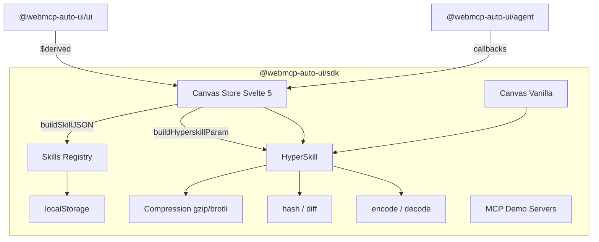
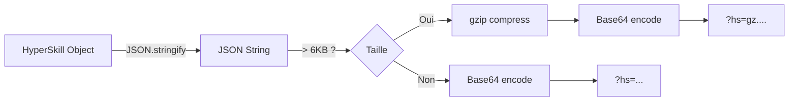
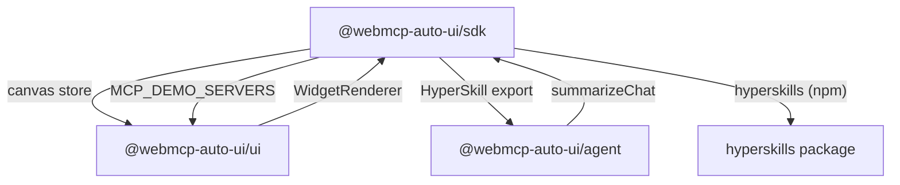

Le package `@webmcp-auto-ui/sdk` fournit la couche applicative entre l'agent et l'UI. Il gere l'etat reactif du canvas (widgets, chat, connexion MCP), le systeme HyperSkill pour serialiser et partager des configurations completes en URLs courtes, et un registre de skills persistant en localStorage.

C'est le lien entre ce que l'agent produit et ce que l'UI affiche.

## Architecture interne



## Installation

```ts
// Import principal (types + HyperSkill + skills registry)
import { encodeHyperSkill, decodeHyperSkill, createSkill } from '@webmcp-auto-ui/sdk';

// Canvas store Svelte 5 (avec runes $state/$derived)
import { canvas } from '@webmcp-auto-ui/sdk/canvas';

// Canvas store vanilla (React, Vue, ou plain JS)
import { canvas } from '@webmcp-auto-ui/sdk/canvas-vanilla';
```

Dans un `package.json` d'app :

```json
{
  "devDependencies": {
    "@webmcp-auto-ui/sdk": "file:../../packages/sdk"
  }
}
```

Le package depend de `hyperskills` (NPM) pour l'encoding/decoding HyperSkill, et de Svelte 5 en peer dependency pour le canvas store reactif.

---

## Canvas Store

Le canvas store est le magasin d'etat central de l'application. Il gere :
- Les **widgets** affiches (blocks)
- Le **modele LLM** selectionne
- La **connexion MCP** (URL, statut, outils)
- L'**historique chat** (messages)
- Les **overrides de theme**
- L'etat de **generation** (l'agent est-il en train de repondre ?)

### Deux versions du store

Le SDK exporte deux versions du meme store, avec la meme API :

| Import | Framework | Reactivite |
|--------|-----------|-----------|
| `@webmcp-auto-ui/sdk/canvas` | Svelte 5 | Runes (`$state` / `$derived`) |
| `@webmcp-auto-ui/sdk/canvas-vanilla` | Agnostique | `subscribe()` / `getSnapshot()` |

### API complete

```ts
// ── Widgets ──────────────────────────────────────────────
canvas.blocks: Widget[];                      // Liste des widgets affiches
canvas.addWidget(type, data): Widget;         // Ajouter un widget, retourne l'objet cree
canvas.removeBlock(id): void;                 // Supprimer un widget par ID
canvas.updateBlock(id, data): void;           // Mettre a jour les donnees d'un widget
canvas.moveBlock(fromId, toId): void;         // Deplacer un widget (reorder)
canvas.clearBlocks(): void;                   // Vider le canvas
canvas.setBlocks(widgets): void;              // Remplacer tous les widgets d'un coup

// ── Mode ─────────────────────────────────────────────────
canvas.mode: 'auto' | 'drag' | 'chat';       // Mode d'interaction
canvas.setMode(mode): void;

// ── LLM ──────────────────────────────────────────────────
canvas.llm: 'haiku' | 'sonnet' | 'gemma-e2b' | 'gemma-e4b';
canvas.setLlm(model): void;

// ── MCP ──────────────────────────────────────────────────
canvas.mcpUrl: string;                        // URL du serveur MCP
canvas.setMcpUrl(url): void;
canvas.mcpConnected: boolean;                 // Est-on connecte ?
canvas.mcpConnecting: boolean;                // Connexion en cours ?
canvas.mcpName: string;                       // Nom du serveur
canvas.mcpTools: McpToolInfo[];               // Outils disponibles
canvas.setMcpConnecting(bool): void;
canvas.setMcpConnected(connected, name?, tools?): void;
canvas.setMcpError(error): void;

// ── Chat ─────────────────────────────────────────────────
canvas.messages: ChatMsg[];                   // Historique des messages
canvas.addMsg(role, content, thinking?): ChatMsg;   // Ajouter un message
canvas.updateMsg(id, content, thinking?): void;     // Modifier un message
canvas.clearMessages(): void;                       // Effacer l'historique

// ── Theme ────────────────────────────────────────────────
canvas.themeOverrides: Record<string, string>;
canvas.setThemeOverrides(overrides): void;

// ── Metriques derivees ───────────────────────────────────
canvas.blockCount: number;                    // Nombre de widgets
canvas.isEmpty: boolean;                      // Canvas vide ?
canvas.generating: boolean;                   // Agent en cours de generation ?
```

### Exemple Svelte 5

```svelte
<script lang="ts">
  import { canvas } from '@webmcp-auto-ui/sdk/canvas';
  import { WidgetRenderer } from '@webmcp-auto-ui/ui';

  // La reactivite est automatique grace aux runes $state/$derived
  // Pas besoin de subscribe() ni de set()
</script>

<!-- Selecteur de modele -->
<select bind:value={canvas.llm}>
  <option value="haiku">Claude Haiku</option>
  <option value="sonnet">Claude Sonnet</option>
  <option value="gemma-e2b">Gemma 2B (local)</option>
  <option value="gemma-e4b">Gemma 4B (local)</option>
</select>

<!-- Ajouter un widget -->
<button onclick={() => canvas.addWidget('stat', { label: 'Sales', value: '1000' })}>
  Ajouter un widget
</button>

<!-- Afficher les widgets -->
<div class="grid grid-cols-2 gap-4">
  {#each canvas.blocks as widget (widget.id)}
    <WidgetRenderer type={widget.type} data={widget.data} />
  {/each}
</div>

<!-- Compteur reactif -->
<p>{canvas.blockCount} widgets affiches</p>
```

### Exemple vanilla (React, Vue, plain JS)

```ts
import { canvas } from '@webmcp-auto-ui/sdk/canvas-vanilla';

// S'abonner aux changements
const unsubscribe = canvas.subscribe(() => {
  const snapshot = canvas.getSnapshot();
  console.log('Widgets:', snapshot.blocks.length);
  console.log('LLM:', snapshot.llm);
  console.log('MCP connecte:', snapshot.mcpConnected);

  // Mettre a jour l'UI
  renderWidgets(snapshot.blocks);
});

// Modifier l'etat
canvas.addWidget('stat', { label: 'Users', value: '42k' });
canvas.setLlm('sonnet');

// Se desabonner
unsubscribe();
```

:::tip[Pattern useSyncExternalStore]
Le canvas vanilla est compatible avec le pattern `useSyncExternalStore` de React 18+ pour une integration sans wrapper supplementaire.
:::

---

## HyperSkill : serialisation d'experiences

Le systeme HyperSkill permet de serialiser une experience complete (widgets, theme, connexion MCP, historique) en un parametre URL court et partageable. C'est le mecanisme qui rend les demos partageables par simple lien.

### Flux de serialisation



### encodeHyperSkill

Serialise un objet HyperSkill en parametre URL. Compresse automatiquement avec gzip si la charge depasse 6 KB.

```ts
import { encodeHyperSkill } from '@webmcp-auto-ui/sdk';

const skill = {
  meta: {
    title: 'Dashboard Q1',
    llm: 'sonnet',
    mcp: 'https://mcp.example.com/mcp',
    tags: ['sales', 'quarterly'],
    theme: { '--color-primary': '#4F46E5' },
  },
  content: {
    blocks: [
      { type: 'stat', data: { label: 'Revenue', value: '$42k', trend: 'up' } },
      { type: 'chart-rich', data: { type: 'bar', labels: ['Q1', 'Q2'], data: [{ label: 'Sales', values: [42, 58] }] } },
    ],
  },
};

// Le deuxieme argument est l'URL de base (optionnel, defaut: window.location)
const param = await encodeHyperSkill(skill, 'https://demos.hyperskills.net');
// "g_qs9K2wZqE..." ou "gz.eJzLSM3JyVcozy/KSQEAHmwFpA==" (si compresse)
```

### decodeHyperSkill

Deserialise un parametre URL ou une URL complete en objet HyperSkill :

```ts
import { decodeHyperSkill } from '@webmcp-auto-ui/sdk';

// Depuis un parametre brut
const skill = await decodeHyperSkill('g_qs9K2wZqE...');

// Depuis une URL complete
const skill2 = await decodeHyperSkill('https://demos.hyperskills.net?hs=g_qs9K2w...');

console.log(skill.meta.title);       // 'Dashboard Q1'
console.log(skill.content.blocks);   // [{ type: 'stat', ... }, ...]
```

Supporte automatiquement :
- **gzip** (prefixe `gz.`)
- **brotli** (prefixe `br.`)
- **Base64 plain** (pas de prefixe)
- **URL complete** avec `?hs=...`

### Interface HyperSkill

```ts
interface HyperSkill {
  meta: HyperSkillMeta;
  content: unknown;         // Donnees arbitraires (blocks, etc.)
}

interface HyperSkillMeta {
  title?: string;
  description?: string;
  version?: string;
  created?: string;
  mcp?: string;              // URL du serveur MCP
  mcpName?: string;          // Nom du serveur MCP
  llm?: string;              // Modele LLM utilise
  tags?: string[];
  theme?: Record<string, string>;  // Overrides CSS
  hash?: string;             // Hash de version
  previousHash?: string;     // Hash de la version precedente (linked list)
  chatSummary?: string;      // Resume anonymise de la conversation
  provenance?: {
    mcpServers?: string[];
    toolsUsed?: string[];
    toolCallCount?: number;
    skillsReferenced?: string[];
    llm?: string;
    exportedAt?: string;
  };
}
```

### Fonctions brutes (re-exports)

Le SDK re-exporte les fonctions brutes du package NPM `hyperskills` pour un acces direct :

```ts
import { encode, decode, hash, diff, getHsParam } from '@webmcp-auto-ui/sdk';

// encode(sourceUrl, content, options?) → Promise<string>
const param = await encode('https://example.com', jsonString, { compress: 'gz' });

// decode(urlOrParam) → Promise<{ sourceUrl, content }>
const { sourceUrl, content } = await decode(param);

// hash(sourceUrl, content) → Promise<string>
const h = await hash('https://example.com', jsonString);

// diff(oldContent, newContent) → changes
const changes = await diff(oldJson, newJson);

// getHsParam(url) → string | null
const param2 = getHsParam('https://example.com?hs=abc123');
// 'abc123'
```

:::note[Wrapper type]
Le package `hyperskills` est en JavaScript pur. Le SDK l'importe avec `// @ts-ignore` et re-exporte chaque fonction avec des types explicites, suivant la convention du projet pour les packages JS sans types.
:::

### Hash et versioning

Le systeme de hash permet de versionner les skills avec une linked list de hashes :

```ts
import { computeHash, createVersion } from '@webmcp-auto-ui/sdk';

// Calculer le hash d'un contenu
const h = await computeHash('https://example.com', skillContent);
// "c7d3e2a1f4b5..."

// Creer une version avec lien vers la precedente
const version = await createVersion(skill, 'https://example.com', previousHash);
// {
//   hash: "a1b2c3...",
//   previousHash: "c7d3e2...",
//   timestamp: 1710000000000,
//   skill: { meta: { hash: "a1b2c3...", previousHash: "c7d3e2...", ... }, content: ... }
// }
```

```ts
interface HyperSkillVersion {
  hash: string;
  previousHash?: string;
  timestamp: number;
  skill: HyperSkill;
}
```

### Diff

Comparer deux versions de skill :

```ts
import { diffSkills } from '@webmcp-auto-ui/sdk';

const changes = await diffSkills(oldSkill, newSkill);
// { added: [...], modified: [...], removed: [...] }
```

---

## Canvas Store x HyperSkill

Le canvas store integre nativement les fonctions HyperSkill pour l'export et l'import :

```ts
import { canvas } from '@webmcp-auto-ui/sdk/canvas';

// ── Export ────────────────────────────────────────────────

// Generer un objet skill JSON depuis l'etat actuel
const skill = canvas.buildSkillJSON();
// {
//   version: '1.0',
//   name: 'skill-1710000000',
//   created: '2024-01-15T10:00:00.000Z',
//   mcp: canvas.mcpUrl,
//   llm: canvas.llm,
//   blocks: canvas.blocks.map(b => ({ type: b.type, data: b.data })),
//   theme: canvas.themeOverrides,
// }

// Generer un parametre HyperSkill compresse
const param = await canvas.buildHyperskillParam();
// "g_qs9K2wZqE..." — pret a mettre dans ?hs=...

const url = `https://demos.hyperskills.net?hs=${param}`;

// ── Import ────────────────────────────────────────────────

// Charger depuis un parametre
await canvas.loadFromParam(param);

// Charger depuis une URL complete
await canvas.loadFromUrl('https://demos.hyperskills.net?hs=g_qs9K2w...');
```

:::tip[Partage de demos]
Ce mecanisme est utilise par toutes les apps de demo pour generer des liens partageables. Un utilisateur peut configurer un dashboard, cliquer "Partager", et envoyer l'URL a un collegue qui retrouvera exactement le meme etat.
:::

---

## Skills Registry

Le registre de skills persiste les configurations en localStorage avec une API CRUD complete.

### API du registre

```ts
import {
  createSkill,
  updateSkill,
  deleteSkill,
  getSkill,
  listSkills,
  clearSkills,
  loadSkills,
  loadDemoSkills,
  onSkillsChange,
} from '@webmcp-auto-ui/sdk';
```

### Types

```ts
interface Skill {
  id: string;
  name: string;
  description?: string;
  content: any;            // Contenu arbitraire (blocks, config, etc.)
  created: number;         // Timestamp creation
  updated: number;         // Timestamp derniere modification
  version?: string;
  tags?: string[];
}

interface SkillBlock {
  type: string;
  data: Record<string, unknown>;
}
```

### CRUD

```ts
// Creer un skill
const skill = createSkill('dashboard-q1', {
  description: 'Dashboard trimestriel des ventes',
  content: { blocks: [{ type: 'stat', data: { label: 'Revenue', value: '$42k' } }] },
  tags: ['sales', 'quarterly'],
});

// Lire
const retrieved = getSkill(skill.id);
const all = listSkills();

// Mettre a jour
updateSkill(skill.id, {
  name: 'Dashboard Q1 2024',
  content: { blocks: [/* ... */] },
});

// Supprimer
deleteSkill(skill.id);
```

### Operations batch

```ts
// Charger un ensemble de skills d'un coup
await loadSkills(skillObjects);

// Charger les skills de demo pre-configures (utile pour le dev)
await loadDemoSkills();

// Vider tout le registre
clearSkills();
```

### Reactivite

```ts
// S'abonner aux changements
const unsubscribe = onSkillsChange((skills) => {
  console.log(`${skills.length} skills dans le registre`);
  updateSidebar(skills);
});

// Se desabonner
unsubscribe();
```

### Exemple : sauvegarde automatique

```svelte
<script lang="ts">
  import { canvas } from '@webmcp-auto-ui/sdk/canvas';
  import { createSkill, updateSkill } from '@webmcp-auto-ui/sdk';

  let currentSkillId: string | null = null;

  function autoSave() {
    const json = canvas.buildSkillJSON();
    if (!currentSkillId) {
      const skill = createSkill(`skill_${Date.now()}`, json);
      currentSkillId = skill.id;
    } else {
      updateSkill(currentSkillId, json);
    }
  }

  // Sauvegarder 5 secondes apres chaque modification
  $effect(() => {
    canvas.blocks;  // Dependance reactive
    const timer = setTimeout(autoSave, 5000);
    return () => clearTimeout(timer);
  });
</script>
```

---

## MCP Demo Servers

Liste des serveurs MCP de demonstration disponibles pour tester l'agent :

```ts
import { MCP_DEMO_SERVERS } from '@webmcp-auto-ui/sdk';

interface McpDemoServer {
  name: string;
  description: string;
  url: string;
  tools: string[];        // Noms des outils exposes
}

// Lister les serveurs disponibles
MCP_DEMO_SERVERS.forEach(server => {
  console.log(`${server.name}: ${server.url}`);
  console.log(`  ${server.description}`);
  console.log(`  Outils: ${server.tools.join(', ')}`);
});
```

Ce tableau est utilise par le composant `<RemoteMCPserversDemo>` du package UI pour afficher l'interface de connexion multi-serveurs.

---

## Tutoriel : application multi-skills

Ce tutoriel construit une application qui gere une collection de skills, permet de naviguer entre eux, et d'exporter/importer via HyperSkill.

### Etape 1 : initialiser le canvas

```svelte
<script lang="ts">
  import { canvas } from '@webmcp-auto-ui/sdk/canvas';
  import { listSkills, createSkill, getSkill, loadDemoSkills } from '@webmcp-auto-ui/sdk';
  import { WidgetRenderer, LLMSelector } from '@webmcp-auto-ui/ui';

  let skills = $state(listSkills());
  let selectedId = $state<string | null>(null);

  // Charger les skills de demo au premier lancement
  $effect(() => {
    if (skills.length === 0) {
      loadDemoSkills().then(() => { skills = listSkills(); });
    }
  });
</script>
```

### Etape 2 : navigation entre skills

```svelte
<aside class="w-64 p-4 bg-gray-100">
  <h2 class="font-bold mb-4">Skills</h2>
  <ul>
    {#each skills as skill (skill.id)}
      <li class="mb-2">
        <button
          class:bg-blue-500={selectedId === skill.id}
          class:text-white={selectedId === skill.id}
          onclick={() => {
            selectedId = skill.id;
            const s = getSkill(skill.id);
            if (s?.content?.blocks) canvas.setBlocks(s.content.blocks);
            if (s?.content?.llm) canvas.setLlm(s.content.llm);
          }}
        >
          {skill.name}
        </button>
      </li>
    {/each}
  </ul>
</aside>
```

### Etape 3 : export HyperSkill

```svelte
<script lang="ts">
  async function shareSkill() {
    const param = await canvas.buildHyperskillParam();
    const url = `https://demos.hyperskills.net?hs=${param}`;
    await navigator.clipboard.writeText(url);
    alert('Lien copie !');
  }
</script>

<button onclick={shareSkill}>Partager</button>
```

### Etape 4 : import depuis URL

```svelte
<script lang="ts">
  import { onMount } from 'svelte';
  import { getHsParam } from '@webmcp-auto-ui/sdk';

  onMount(async () => {
    const param = getHsParam(window.location.href);
    if (param) {
      await canvas.loadFromParam(param);
    }
  });
</script>
```

---

## Integration avec les autres packages



- Le **canvas store** est lu par les composants UI pour afficher les widgets et reagir aux changements
- L'**agent** ecrit dans le canvas via les callbacks (`onWidget`, `onClear`, `onUpdate`)
- **summarizeChat** genere un resume qui est integre dans la `provenance` HyperSkill
- **MCP_DEMO_SERVERS** alimente le composant `<RemoteMCPserversDemo>`

---

## Bonnes pratiques

:::tip[Canvas Svelte vs Vanilla]
Utilisez `@webmcp-auto-ui/sdk/canvas` dans les composants Svelte pour beneficier de la reactivite automatique. Utilisez `@webmcp-auto-ui/sdk/canvas-vanilla` dans les contextes non-Svelte (React, tests, scripts).
:::

:::caution[Taille des URLs HyperSkill]
Les URLs avec `?hs=...` sont limitees par la configuration nginx (~8 KB par defaut). La compression gzip s'active automatiquement au-dessus de 6 KB, mais les skills tres volumineux (nombreux widgets avec beaucoup de donnees) peuvent quand meme depasser la limite. Dans ce cas, envisagez de stocker le skill sur un backend et d'utiliser un identifiant court.
:::

:::caution[localStorage]
Le registre de skills utilise localStorage, qui est limite a ~5 MB par origine. Ne stockez pas de donnees volumineuses dans le contenu des skills (images base64, gros JSON). Preferez stocker des references (URLs) plutot que des donnees brutes.
:::

---

## FAQ

**Pourquoi deux versions du canvas store ?**
Le store Svelte 5 utilise les runes (`$state`/`$derived`) pour une reactivite fine-grained native. Le store vanilla utilise un pattern `subscribe`/`getSnapshot` compatible avec n'importe quel framework. Les deux partagent la meme logique interne.

**Le parametre HyperSkill est-il securise ?**
Le parametre est encode en Base64 (optionnellement compresse), pas chiffre. Ne mettez pas de donnees sensibles dans un skill. Le resume de chat est anonymise automatiquement par `summarizeChat`.

**Comment fonctionne la compression ?**
Au-dessus de 6 KB, `encodeHyperSkill` utilise gzip via l'API `CompressionStream` du navigateur. Le prefixe `gz.` indique a `decodeHyperSkill` qu'il faut decompresser. Brotli est aussi supporte (prefixe `br.`), mais gzip est le defaut car plus largement supporte.

**Les skills persistent-ils entre les sessions ?**
Oui, le registre utilise localStorage. Les skills sont disponibles tant que l'utilisateur ne vide pas le stockage de son navigateur. Pour un partage entre appareils, utilisez l'export HyperSkill.
