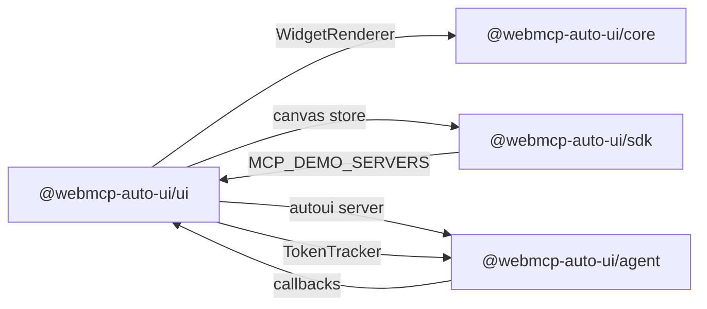

Le package `@webmcp-auto-ui/ui` fournit une bibliotheque complete de composants Svelte 5 pour construire des applications agent. Il couvre quatre domaines : les **widgets** (plus de 25 types pour afficher des donnees), les **layouts** (grille, flottant, empile, flex), les **composants agent** (selecteur LLM, progression, chat, parametres), et l'**infrastructure** (theme, bus de messages, primitives UI).

Tous les composants utilisent le design system du projet (tokens CSS, Tailwind preset) et supportent les themes light/dark.

## Architecture interne

```mermaid
graph TD
    subgraph "@webmcp-auto-ui/ui"
        THEME[ThemeProvider] --> TOKENS[Tokens CSS]
        WR[WidgetRenderer] --> SIMPLE[9 Widgets simples]
        WR --> RICH[16 Widgets riches]
        WR --> CUSTOM[Custom widgets<br/>via WebMCP server]
        BR[BlockRenderer] --> WR

        LAYOUTS[Layouts] --> TILING[TilingLayout]
        LAYOUTS --> FLOATING[FloatingLayout]
        LAYOUTS --> STACK[StackLayout]
        LAYOUTS --> FLEX[FlexLayout]

        AGENT_UI[Composants Agent] --> LLM[LLMSelector]
        AGENT_UI --> GEMMA[GemmaLoader]
        AGENT_UI --> MCP_S[McpStatus]
        AGENT_UI --> PROG[AgentProgress]
        AGENT_UI --> CHAT[ChatPanel]
        AGENT_UI --> CONSOLE[AgentConsole]
        AGENT_UI --> SETTINGS[SettingsPanel]

        BUS[bus FONC] --> LINKS[LinkOverlay]
        BUS --> LI[LinkIndicators]
        ADAPTER[layoutAdapter] --> LAYOUTS
    end

    SDK["@webmcp-auto-ui/sdk"] -->|canvas store| AGENT_UI
    AGENT["@webmcp-auto-ui/agent"] -->|autoui server| WR
```



## Installation

```ts
import { WidgetRenderer, LLMSelector, ThemeProvider, bus } from '@webmcp-auto-ui/ui';
```

Dans un `package.json` d'app :

```json
{
  "devDependencies": {
    "@webmcp-auto-ui/ui": "file:../../packages/ui",
    "@webmcp-auto-ui/sdk": "file:../../packages/sdk"
  }
}
```

Peer dependencies : `svelte ^5.0.0`, `d3 ^7.9.0` (pour D3Widget), `leaflet >=1.9.0` (pour MapView).

---

## Theme

### ThemeProvider

Enveloppe racine qui fournit le contexte de theme a tous les composants enfants. Gere le basculement dark/light et les overrides CSS.

```svelte
<script lang="ts">
  import { ThemeProvider } from '@webmcp-auto-ui/ui';
</script>

<ThemeProvider defaultMode="dark" overrides={{ '--color-primary': '#4F46E5' }}>
  <!-- Tous les composants enfants heritent du theme -->
  <slot />
</ThemeProvider>
```

**Props :**

```ts
interface Props {
  defaultMode?: ThemeMode;                    // 'light' | 'dark' (defaut: 'light')
  overrides?: Record<string, string>;         // CSS custom properties
  theme?: ThemeJSON;                          // Theme JSON externe
  children: Snippet;
}
```

### getTheme

Fonction contexte Svelte pour acceder a l'API de theme depuis n'importe quel composant enfant de `ThemeProvider`.

```svelte
<script lang="ts">
  import { getTheme } from '@webmcp-auto-ui/ui';

  const theme = getTheme();
</script>

<span>Mode : {theme.mode}</span>
<button onclick={theme.toggle}>Basculer</button>
```

**API retournee :**

```ts
interface ThemeAPI {
  readonly mode: ThemeMode;       // 'light' | 'dark'
  toggle: () => void;             // Bascule dark ↔ light
  setMode: (m: ThemeMode) => void;
}
```

### Tokens et constantes

```ts
import { DARK_TOKENS, LIGHT_TOKENS, THEME_MAP } from '@webmcp-auto-ui/ui';
import type { ThemeMode, ThemeOverrides, ThemeTokens } from '@webmcp-auto-ui/ui';

// DARK_TOKENS / LIGHT_TOKENS : Record<string, string> avec les CSS variables par mode
// THEME_MAP : { light: ThemeTokens, dark: ThemeTokens }
```

---

## Rendu de widgets

### WidgetRenderer

Composant principal qui resout et affiche un widget. Il cherche le widget dans les serveurs WebMCP fournis (custom), puis dans le registre natif. Si le widget est inconnu, un fallback est affiche.

```svelte
<script lang="ts">
  import { WidgetRenderer } from '@webmcp-auto-ui/ui';
  import { autoui } from '@webmcp-auto-ui/agent';
</script>

<WidgetRenderer
  id="block_1"
  type="stat"
  data={{ label: 'Revenue', value: '$42k', trend: 'up' }}
  servers={[autoui]}
  oninteract={(type, action, payload) => console.log(action, payload)}
/>
```

**Props :**

```ts
interface Props {
  id?: string;                              // ID du widget (auto-genere si absent)
  type: string;                             // Type de widget ('stat', 'chart', etc.)
  data: Record<string, unknown>;            // Donnees du widget
  servers?: WebMcpServer[];                 // Serveurs WebMCP (pour les widgets custom)
  oninteract?: (type: string, action: string, payload: unknown) => void;
}
```

**Actions d'interaction supportees :**

| Action | Widget | Description |
|--------|--------|-------------|
| `itemclick` | list | Clic sur un item de liste |
| `rowclick` | data-table | Clic sur une ligne du tableau |
| `cardclick` | cards | Clic sur une carte |
| `imageclick` | gallery | Clic sur une image |
| `slidechange` | carousel | Changement de slide |
| `cellclick` | grid-data | Clic sur une cellule |

**Auto-enregistrement WebMCP :** chaque widget s'enregistre automatiquement sur `navigator.modelContext` avec 3 outils :
- `widget_{id}_get()` — obtenir les donnees actuelles
- `widget_{id}_update(...)` — mettre a jour les donnees
- `widget_{id}_remove()` — supprimer le widget

### BlockRenderer

Alias herite de `WidgetRenderer`. Conserve pour retrocompatibilite.

```svelte
<BlockRenderer type="stat" data={{ label: 'Sales', value: '100' }} />
```

---

## Widgets simples (9)

Widgets legers pour l'affichage de donnees basiques.

### StatBlock

Statistique cle avec label, valeur, et tendance optionnelle. Affiche une carte compacte avec une fleche de tendance.

```svelte
<StatBlock data={{
  label: 'Revenue',
  value: '$42k',
  trend: 'up'           // 'up' | 'down' | 'stable'
}} />
```

### KVBlock

Paires cle-valeur en grille.

```svelte
<KVBlock data={{
  items: [
    { key: 'Status', value: 'Active' },
    { key: 'Region', value: 'Europe' },
    { key: 'Users', value: '1,234' }
  ]
}} />
```

### ListBlock

Liste d'items avec puces.

```svelte
<ListBlock data={{
  items: ['Premier item', 'Deuxieme item', 'Troisieme item'],
  title: 'Taches'
}} />
```

### ChartBlock

Graphique a barres simple (sans librairie externe).

```svelte
<ChartBlock data={{
  bars: [['Jan', 10], ['Fev', 20], ['Mar', 15], ['Avr', 25]]
}} />
```

### AlertBlock

Alerte coloree avec icone et message. Niveaux : info, warning, error, success.

```svelte
<AlertBlock data={{
  level: 'warning',
  title: 'Attention',
  message: 'Les donnees sont obsoletes depuis 24h.'
}} />
```

### CodeBlock

Bloc de code avec coloration syntaxique et bouton de copie.

```svelte
<CodeBlock data={{
  code: 'const x = 42;\nconsole.log(x);',
  language: 'javascript'
}} />
```

### TextBlock

Texte Markdown rendu en HTML.

```svelte
<TextBlock data={{
  text: '# Titre\n\nParagraphe avec **gras** et *italique*.'
}} />
```

### ActionsBlock

Boutons d'action interactifs. L'agent peut proposer des choix a l'utilisateur.

```svelte
<ActionsBlock data={{
  actions: [
    { label: 'Approuver', value: 'approve', variant: 'primary' },
    { label: 'Rejeter', value: 'reject', variant: 'danger' }
  ]
}} />
```

### TagsBlock

Badges/tags colores.

```svelte
<TagsBlock data={{
  tags: [
    { label: 'Frontend', color: '#3B82F6' },
    { label: 'Production', color: '#10B981' },
    { label: 'Urgent', color: '#EF4444' }
  ]
}} />
```

---

## Widgets riches (16)

Widgets avances pour des visualisations complexes.

### DataTable

Tableau de donnees avec tri par colonne cliquable.

```svelte
<DataTable
  spec={{
    columns: [
      { key: 'name', label: 'Nom' },
      { key: 'age', label: 'Age' },
      { key: 'role', label: 'Role' }
    ],
    rows: [
      { name: 'Alice', age: 30, role: 'Dev' },
      { name: 'Bob', age: 25, role: 'Design' }
    ]
  }}
  onrowclick={(row) => console.log('Clic:', row)}
/>
```

### StatCard

Carte statistique enrichie avec icone, tendance, et description.

```svelte
<StatCard spec={{
  title: 'Revenus',
  value: '$42,000',
  change: '+12%',
  trend: 'up',
  description: 'Par rapport au trimestre precedent'
}} />
```

### Timeline

Chronologie d'evenements avec statuts visuels.

```svelte
<Timeline spec={{
  events: [
    { title: 'Lancement', date: '2024-01', status: 'done' },
    { title: 'Beta publique', date: '2024-03', status: 'active' },
    { title: 'v1.0', date: '2024-06', status: 'pending' }
  ]
}} />
```

### ProfileCard

Fiche profil avec avatar, champs personnalises et statistiques.

```svelte
<ProfileCard spec={{
  name: 'Alice Martin',
  subtitle: 'Lead Developer',
  avatar: 'https://example.com/avatar.jpg',
  fields: [
    { label: 'Equipe', value: 'Backend' },
    { label: 'Localisation', value: 'Paris' }
  ],
  stats: [
    { label: 'Commits', value: '1,234' },
    { label: 'PRs', value: '89' }
  ]
}} />
```

### Trombinoscope

Grille de profils (equipe, classe, organisation).

```svelte
<Trombinoscope spec={{
  people: [
    { name: 'Alice', role: 'Dev', avatar: '...' },
    { name: 'Bob', role: 'Design', avatar: '...' }
  ]
}} />
```

### JsonViewer

Arbre JSON interactif et explorable avec ouverture/fermeture des noeuds.

```svelte
<JsonViewer spec={{
  data: { users: [{ name: 'Alice' }, { name: 'Bob' }], count: 2 },
  expanded: true
}} />
```

### Hemicycle

Representation d'un hemicycle parlementaire avec sieges colores par groupe.

```svelte
<Hemicycle spec={{
  groups: [
    { name: 'Majorite', seats: 289, color: '#3B82F6' },
    { name: 'Opposition', seats: 248, color: '#EF4444' }
  ]
}} />
```

### Chart (Rich)

Graphique multi-series. Supporte : bar, line, area, pie, donut.

```svelte
<Chart spec={{
  type: 'bar',
  labels: ['Q1', 'Q2', 'Q3', 'Q4'],
  data: [
    { label: 'Ventes', values: [10, 20, 15, 25] },
    { label: 'Couts', values: [8, 12, 10, 15] }
  ]
}} />
```

### Cards

Grille de cartes avec titre, description, et tags.

```svelte
<Cards
  spec={{
    cards: [
      { title: 'Projet A', description: 'En cours', tags: ['frontend'] },
      { title: 'Projet B', description: 'Termine', tags: ['backend'] }
    ]
  }}
  oncardclick={(card) => console.log(card)}
/>
```

### GridData

Grille de donnees avec cellules cliquables (similaire a un tableur).

```svelte
<GridData spec={{
  headers: ['Lun', 'Mar', 'Mer', 'Jeu', 'Ven'],
  rows: [
    { label: 'Alice', cells: [8, 7, 9, 8, 6] },
    { label: 'Bob', cells: [6, 8, 7, 9, 7] }
  ]
}} />
```

### Sankey

Diagramme Sankey pour visualiser des flux entre categories.

```svelte
<Sankey spec={{
  nodes: ['Source A', 'Source B', 'Target X', 'Target Y'],
  links: [
    { source: 0, target: 2, value: 10 },
    { source: 0, target: 3, value: 5 },
    { source: 1, target: 3, value: 8 }
  ]
}} />
```

### MapView

Carte Leaflet interactive avec marqueurs et popups.

```svelte
<MapView spec={{
  center: { lat: 48.8566, lng: 2.3522 },
  zoom: 12,
  height: '400px',
  markers: [
    { lat: 48.8566, lng: 2.3522, label: 'Paris', popup: 'Capitale' },
    { lat: 48.8606, lng: 2.3376, label: 'Louvre' }
  ]
}} />
```

:::note
MapView necessite `leaflet` en peer dependency. Le CSS Leaflet est charge automatiquement.
:::

### D3Widget

Visualisations D3.js avec presets : hex-heatmap, radial, treemap, force graph.

```svelte
<D3Widget spec={{
  preset: 'treemap',
  data: {
    name: 'root',
    children: [
      { name: 'A', value: 100 },
      { name: 'B', value: 200 },
      { name: 'C', children: [
        { name: 'C1', value: 50 },
        { name: 'C2', value: 150 }
      ]}
    ]
  }
}} />
```

### JsSandbox

Sandbox JavaScript isolee pour des visualisations custom. Execute du code dans une iframe securisee.

```svelte
<JsSandbox spec={{
  code: "document.getElementById('root').textContent = 'Hello from sandbox!';",
  html: '<div id="root"></div>',
  css: 'body { font-family: sans-serif; padding: 16px; }',
  height: '300px'
}} />
```

### LogViewer

Visionneuse de logs avec filtrage par niveau et coloration.

```svelte
<LogViewer spec={{
  title: 'Application Logs',
  entries: [
    { timestamp: '2024-01-15T10:30:00Z', level: 'info', message: 'Server started', source: 'main' },
    { timestamp: '2024-01-15T10:31:00Z', level: 'error', message: 'Connection failed', source: 'db' },
    { timestamp: '2024-01-15T10:32:00Z', level: 'warn', message: 'Slow query detected', source: 'db' },
  ],
  maxHeight: '400px',
}} />
```

### Gallery

Galerie d'images responsive en grille.

```svelte
<Gallery
  spec={{
    title: 'Collection',
    images: [
      { src: 'https://example.com/a.jpg', alt: 'Image A', caption: 'Premiere' },
      { src: 'https://example.com/b.jpg', alt: 'Image B', caption: 'Deuxieme' },
    ],
    columns: 3,
    gap: '8px',
  }}
  onimageclick={(img, index) => console.log(img, index)}
/>
```

### Carousel

Carousel d'images/contenus avec navigation et autoplay.

```svelte
<Carousel
  spec={{
    title: 'Presentation',
    slides: [
      { src: 'https://example.com/slide1.jpg', title: 'Slide 1' },
      { content: '<h2>Texte</h2><p>Contenu HTML</p>', title: 'Slide 2' },
    ],
    autoPlay: true,
    interval: 5000,
  }}
  onslidechange={(slide, index) => console.log(slide, index)}
/>
```

---

## Composants agent

### LLMSelector

Selecteur de modele LLM avec support des modeles distants (e.g. Claude, Gemini, ChatGPT) et locaux (Gemma WASM).

```svelte
<script lang="ts">
  import { LLMSelector } from '@webmcp-auto-ui/ui';
  import { canvas } from '@webmcp-auto-ui/sdk/canvas';
</script>

<LLMSelector value={canvas.llm} onchange={(model) => canvas.setLlm(model)} />
```

**Props :**

```ts
interface Props {
  value?: string;                     // Modele selectionne
  disabled?: boolean;
  onchange?: (model: string) => void;
}
```

Modeles affiches : `haiku`, `sonnet`, `opus` (LLM distant, e.g. Claude), `gemma-e2b`, `gemma-e4b` (Google Gemma WASM).

### GemmaLoader

Indicateur de chargement pour le modele Gemma WASM. Affiche une barre de progression, la taille telechargee, et le temps ecoule.

```svelte
<GemmaLoader
  status="loading"
  progress={45}
  elapsed={12}
  loadedMB={120}
  totalMB={267}
  modelName="Gemma E2B"
  onunload={() => { /* decharger le modele */ }}
/>
```

**Props :**

```ts
interface Props {
  status: 'idle' | 'loading' | 'ready' | 'error';
  progress?: number;         // 0-100
  elapsed?: number;          // Secondes ecoulees
  loadedMB?: number;         // Mo telecharges
  totalMB?: number;          // Mo total
  modelName?: string;
  onunload?: () => void;     // Callback pour decharger le modele
}
```

### McpStatus

Indicateur de connexion MCP (pastille verte/rouge + nombre d'outils disponibles).

```svelte
<McpStatus
  connected={canvas.mcpConnected}
  connecting={canvas.mcpConnecting}
  name={canvas.mcpName}
  toolCount={canvas.mcpTools.length}
  servers={[{ url: '...', name: 'recipes', toolCount: 5 }]}
/>
```

**Props :**

```ts
interface Props {
  connected: boolean;
  connecting: boolean;
  name?: string;
  toolCount?: number;
  servers?: { url: string; name: string; toolCount: number }[];
  onconnect?: () => void;
}
```

### AgentProgress

Barre de progression animee de l'agent avec metriques temps reel.

```svelte
<AgentProgress
  active={canvas.generating}
  elapsed={12}
  toolCalls={3}
  lastTool="search_recipes"
/>
```

**Props :**

```ts
interface Props {
  active?: boolean;          // Agent en cours de generation
  elapsed?: number;          // Secondes ecoulees
  toolCalls?: number;        // Nombre de tool calls
  lastTool?: string;         // Nom du dernier outil appele
}
```

### McpConnector

Interface de connexion MCP avec champ URL et bouton.

```svelte
<McpConnector
  url={canvas.mcpUrl}
  connecting={canvas.mcpConnecting}
  onconnect={(url) => { /* logique de connexion */ }}
  oninput={(url) => canvas.setMcpUrl(url)}
/>
```

**Props :**

```ts
interface Props {
  url?: string;
  connecting?: boolean;
  oninput?: (url: string) => void;
  onconnect?: (url: string) => void;
}
```

### ChatPanel

Panneau de chat complet avec feed de messages, indicateur de generation, et champ de saisie.

```svelte
<script lang="ts">
  import { ChatPanel } from '@webmcp-auto-ui/ui';
  import type { ChatFeedItem } from '@webmcp-auto-ui/ui';

  let feed = $state<ChatFeedItem[]>([]);
  let input = $state('');
</script>

<ChatPanel
  {feed}
  bind:input
  generating={false}
  timer={0}
  toolCount={0}
  lastTool=""
  onsend={(msg) => { /* envoyer le message a l'agent */ }}
/>
```

**Props :**

```ts
interface Props {
  feed?: ChatFeedItem[];       // Messages du chat
  input?: string;              // Valeur du champ (bindable)
  generating?: boolean;        // Agent en cours
  timer?: number;              // Temps ecoule
  toolCount?: number;
  lastTool?: string;
  placeholder?: string;
  showSrc?: boolean;           // Afficher la source des messages
  onsend?: (msg: string) => void;
  class?: string;
}
```

**Types du feed :**

```ts
interface ChatBubble {
  role: 'user' | 'assistant';
  html: string;
}
interface ChatBlock {
  type: string;
  data: Record<string, unknown>;
}
type ChatFeedItem = ChatBubble | ChatBlock;
```

### AgentConsole

Console de logs de l'agent avec filtrage par type et bouton de vidage.

```svelte
<AgentConsole
  logs={[
    { ts: Date.now(), type: 'tool', detail: 'search_recipes({query: "pasta"})' },
    { ts: Date.now(), type: 'rag', detail: 'Ingested 5 chunks (1.2k chars)' },
  ]}
  onclear={() => { /* vider les logs */ }}
/>
```

**Props :**

```ts
interface Props {
  logs: { ts: number; type: string; detail: string }[];
  onclear?: () => void;
  class?: string;
}
```

### SettingsPanel

Panneau de reglages agent avec tous les parametres bindables.

```svelte
<SettingsPanel
  bind:systemPrompt
  bind:maxTokens
  bind:maxContextTokens
  bind:maxTools
  bind:cacheEnabled
  bind:temperature
  bind:topK
/>
```

**Props :**

```ts
interface Props {
  systemPrompt?: string;           // Bindable
  effectivePrompt?: string;        // Prompt final genere (lecture seule)
  maxTokens?: number;              // Defaut: 4096
  maxContextTokens?: number;       // Defaut: 150000
  maxTools?: number;               // Defaut: 8
  cacheEnabled?: boolean;          // Defaut: true
  temperature?: number;            // Defaut: 0.7
  topK?: number;                   // Defaut: 10
  modelType?: 'remote' | 'wasm';
  modelId?: string;
  class?: string;
}
```

### EphemeralBubble

Bulles de messages ephemeres affichees pendant la generation. Disparaissent automatiquement.

```svelte
<EphemeralBubble ephemeral={[
  { id: '1', role: 'assistant', html: '<p>En reflexion...</p>' }
]} />
```

### TokenBubble

Metriques de tokens en temps reel (requetes/min, tokens in/out, cache).

```svelte
<script lang="ts">
  import { TokenBubble } from '@webmcp-auto-ui/ui';
  import { TokenTracker } from '@webmcp-auto-ui/agent';

  const tracker = new TokenTracker();
  let metrics = $state(tracker.metrics);
  tracker.subscribe(m => { metrics = m; });
</script>

<TokenBubble {metrics} visible={true} />
```

### RemoteMCPserversDemo

Interface de connexion multi-serveurs MCP avec liste pre-configuree.

```svelte
<RemoteMCPserversDemo
  servers={MCP_DEMO_SERVERS}
  connectedUrls={['https://mcp.example.com/mcp']}
  loading={[]}
  onconnect={(url) => { /* connecter */ }}
  onconnectall={() => { /* tout connecter */ }}
  ondisconnect={(url) => { /* deconnecter */ }}
/>
```

### DiagnosticModal / DiagnosticIcon

Composants pour afficher les resultats de `runDiagnostics` du package agent.

```svelte
<DiagnosticIcon diagnostics={diagnosticResults} />
<DiagnosticModal diagnostics={diagnosticResults} open={showModal} />
```

---

## Primitives

### Card

Conteneur carte avec border et fond surface.

```svelte
<Card><p>Contenu</p></Card>
```

### Panel

Conteneur avec barre de titre, collapsible optionnellement.

```svelte
<Panel title="Statistiques" collapsible={true}>
  <div>Contenu du panneau</div>
</Panel>
```

**Props :** `title?: string`, `collapsible?: boolean`, `collapsed?: boolean`, `onclose?: () => void`

### Window

Fenetre avec barre de titre, optionnellement deplaçable.

```svelte
<Window title="Editeur" draggable={true}>
  <p>Contenu</p>
</Window>
```

**Props :** `title: string`, `draggable?: boolean`, `onmove?: (dx, dy) => void`

### NativeSelect

Select HTML natif stylise avec le design system.

```svelte
<NativeSelect bind:value class="w-24">
  <option value="low">Low</option>
  <option value="normal">Normal</option>
</NativeSelect>
```

### Tooltip

Tooltip au survol.

```svelte
<Tooltip content="Information supplementaire">
  <span>Survolez-moi</span>
</Tooltip>
```

### Button / Badge

Composants de base avec variantes (pattern shadcn-svelte) :

```svelte
<Button variant="default" size="sm">Cliquer</Button>
<Badge variant="outline">Tag</Badge>
```

### Dialog

Ensemble de composants pour modales accessibles :

```svelte
<Dialog>
  <DialogTrigger><button>Ouvrir</button></DialogTrigger>
  <DialogContent>
    <DialogHeader>
      <DialogTitle>Titre</DialogTitle>
      <DialogDescription>Description</DialogDescription>
    </DialogHeader>
    <p>Contenu</p>
    <DialogFooter><button>Confirmer</button></DialogFooter>
  </DialogContent>
</Dialog>
```

### SafeImage

Image robuste avec validation d'URL et fallback. Valide les protocoles (http, https, data, /), affiche un placeholder si l'URL est invalide ou si l'image ne charge pas.

```svelte
<SafeImage
  src="https://example.com/image.jpg"
  alt="Description"
  fallbackText="Image"
  hideOnError={false}
/>
```

---

## Layouts

### TilingLayout

Grille de tuiles responsive.

```svelte
<TilingLayout gap="4" columns={3}>
  <div>Widget 1</div>
  <div>Widget 2</div>
  <div>Widget 3</div>
</TilingLayout>
```

**Props :** `gap?: string`, `columns?: number`, `rows?: number`

### FloatingLayout

Layout flottant avec fenetres deplaçables et redimensionnables par drag. Utilise un snippet `children` qui reçoit le contexte de chaque fenetre.

```svelte
<script lang="ts">
  import { FloatingLayout } from '@webmcp-auto-ui/ui';
  import type { ManagedWindow } from '@webmcp-auto-ui/ui';

  let fl: FloatingLayout;
  let windows = $state<ManagedWindow[]>([]);
</script>

<FloatingLayout bind:this={fl} {windows} defaultWidth={380} defaultHeight={280}>
  {#snippet children(win, _lw, ctx)}
    <div class="bg-surface rounded-lg border">
      <!-- Barre de titre (drag) -->
      <div onmousedown={(e) => ctx.ondragstart(e)}
           ondblclick={() => ctx.ontogglecollapse()}>
        {win.title}
      </div>
      <!-- Contenu (collapsible) -->
      {#if !ctx.collapsed}
        <div>Widget {win.id}</div>
      {/if}
      <!-- Poignee de redimensionnement -->
      <div onmousedown={(e) => ctx.onresizestart(e)} class="resize-handle"></div>
    </div>
  {/snippet}
</FloatingLayout>
```

**Props :** `windows: ManagedWindow[]`, `gap?: number`, `defaultWidth?: number`, `defaultHeight?: number`, `onmove?`, `onresize?`

**Contexte snippet :**

```ts
interface SnippetCtx {
  ondragstart: (e: MouseEvent) => void;
  ontogglecollapse: () => void;
  onfittocontent: () => void;
  onresizestart: (e: MouseEvent) => void;
  collapsed: boolean;
}
```

**Methodes exposees (via `bind:this`) :**

```ts
fl.move(id, x, y): void
fl.resize(id, w, h): void
fl.toggleCollapse(id): void
fl.fitToContent(id): void
```

### FlexLayout

Layout flex responsive avec largeur adaptative.

```svelte
<FlexLayout {windows} minWidth={260} maxWidth={600} showSlider={true}>
  {#snippet children(win, _lw, ctx)}
    <div>Widget {win.id} (scale: {ctx.scale})</div>
  {/snippet}
</FlexLayout>
```

**Props :** `windows`, `minWidth?: number`, `maxWidth?: number`, `gap?: number`, `showSlider?: boolean`

### StackLayout

Layout empile : une fenetre a la fois ou defilement vertical.

```svelte
<StackLayout {windows} mode="scroll" gap={8}>
  {#snippet children(win, _lw)}
    <div>{win.title}: contenu</div>
  {/snippet}
</StackLayout>
```

**Props :** `windows`, `mode?: 'single' | 'scroll'`, `gap?: number`, `padding?: number`

### GridLayout

Grille CSS avec positionnement explicite des cellules.

```svelte
<GridLayout rows={4} cols={4}>
  <div style="grid-row: 1; grid-column: 1 / 3;">Widget A</div>
  <div style="grid-row: 1 / 3; grid-column: 3 / 5;">Widget B</div>
</GridLayout>
```

### Types Window Manager

```ts
interface ManagedWindow {
  id: string;
  title: string;
  visible: boolean;
  focused: boolean;
  folded: boolean;
  weight: number;
  createdAt: number;
  lastFocusedAt: number;
}

interface LayoutWindow {
  id: string;
  x: number; y: number;
  width: number; height: number;
  zIndex: number;
  visible: boolean;
  folded: boolean;
}

interface FloatingWindowState {
  x: number; y: number;
  width: number; height: number;
  zIndex: number;
}
```

---

## FONC Message Bus

Systeme de messagerie inter-composants pour la communication entre widgets sans couplage direct.

```ts
import { bus } from '@webmcp-auto-ui/ui';
import type { BusMessage } from '@webmcp-auto-ui/ui';
```

### API du bus

```ts
// Enregistrer un participant (widget, composant)
const unregister = bus.register(
  'widget_123',           // ID unique
  'widget',               // Type de participant
  ['update', 'interact'], // Channels ecoutes (ou ['*'] pour tout)
  (msg: BusMessage) => {
    console.log(`Message de ${msg.from}: ${msg.channel}`, msg.payload);
  }
);

// Envoyer un message cible
bus.send('widget_123', 'widget_456', 'update', { newValue: 42 });

// Diffuser a tous les participants
bus.broadcast('widget_123', 'refresh', { timestamp: Date.now() });

// S'abonner sans s'enregistrer comme participant
const unsub = bus.subscribe(['update', 'interact'], (msg) => { /* ... */ });

// Lier des widgets (communication bidirectionnelle)
const groupId = bus.link(['widget_1', 'widget_2', 'widget_3']);

// Delier
bus.unlink('widget_1', groupId);

// Interroger les liens
bus.getLinks('widget_1');      // string[] — groupes
bus.getGroup(groupId);         // string[] — widgets du groupe
bus.hasLinks('widget_1');      // boolean
```

Le bus est utilise par `LinkOverlay` et `LinkIndicators` pour dessiner les liens visuels entre widgets.

### LinkOverlay

Overlay SVG plein ecran qui dessine des fleches bezier entre les widgets lies.

```svelte
<LinkOverlay />
```

S'abonne automatiquement aux evenements `show-links` et `link` du bus.

### LinkIndicators

Indicateurs visuels dans les barres de titre des fenetres.

```svelte
<LinkIndicators busId="widget_123" />
```

### linkGroupColor

Retourne une couleur HSL deterministe pour un group ID.

```ts
import { linkGroupColor } from '@webmcp-auto-ui/ui';
const color = linkGroupColor('group_abc'); // "hsl(210, 70%, 60%)"
```

---

## Layout Adapter

Singleton qui connecte les layouts aux outils de l'agent (`canvas` tool avec actions `move`, `resize`, `style`).

```ts
import { layoutAdapter } from '@webmcp-auto-ui/ui';

// Enregistrer les callbacks de layout (dans onMount)
layoutAdapter.register({
  move:   (id, x, y) => floatingLayout?.move(id, x, y),
  resize: (id, w, h) => floatingLayout?.resize(id, w, h),
  style:  (id, styles) => {
    const el = document.querySelector(`[data-block-id="${id}"]`);
    if (el instanceof HTMLElement) {
      for (const [k, v] of Object.entries(styles)) {
        el.style.setProperty(`--color-${k}`, v);
      }
    }
  },
});

// Desenregistrer (dans onDestroy)
layoutAdapter.unregister();
```

---

## Tutoriel : construire un chat agent complet

Ce tutoriel assemble les composants UI pour creer une interface de chat avec widgets, selection de modele, et progression agent.

### Etape 1 : structure de base

```svelte
<script lang="ts">
  import { ThemeProvider, LLMSelector, McpStatus, AgentProgress,
           ChatPanel, WidgetRenderer } from '@webmcp-auto-ui/ui';
  import { canvas } from '@webmcp-auto-ui/sdk/canvas';
  import { runAgentLoop, RemoteLLMProvider, autoui } from '@webmcp-auto-ui/agent';
  import type { ChatFeedItem } from '@webmcp-auto-ui/ui';

  let feed = $state<ChatFeedItem[]>([]);
  let input = $state('');
  let timer = $state(0);
  let toolCount = $state(0);
  let lastTool = $state('');

  const provider = new RemoteLLMProvider({
    proxyUrl: '/api/chat',
    model: 'sonnet',
  });
</script>
```

### Etape 2 : logique de chat

```svelte
<script lang="ts">
  // ... (suite du script precedent)

  async function send(msg: string) {
    feed = [...feed, { role: 'user', html: `<p>${msg}</p>` }];
    canvas.generating = true;
    const start = Date.now();
    const interval = setInterval(() => { timer = (Date.now() - start) / 1000; }, 100);

    try {
      const result = await runAgentLoop(msg, {
        provider,
        layers: [autoui.layer()],
        maxIterations: 5,
        callbacks: {
          onToolCall: (call) => {
            toolCount++;
            lastTool = call.name;
          },
          onWidget: (type, data) => {
            feed = [...feed, { type, data }];
            return { id: `w_${Date.now()}` };
          },
          onText: (text) => {
            feed = [...feed, { role: 'assistant', html: `<p>${text}</p>` }];
          },
        },
      });
    } finally {
      canvas.generating = false;
      clearInterval(interval);
    }
  }
</script>
```

### Etape 3 : assembler l'UI

```svelte
<ThemeProvider defaultMode="dark">
  <div class="flex flex-col h-screen">
    <!-- Barre superieure -->
    <header class="p-4 border-b flex items-center gap-4">
      <LLMSelector value={canvas.llm} onchange={(m) => canvas.setLlm(m)} />
      <McpStatus connected={canvas.mcpConnected} name={canvas.mcpName} />
      {#if canvas.generating}
        <AgentProgress active elapsed={timer} toolCalls={toolCount} lastTool={lastTool} />
      {/if}
    </header>

    <!-- Zone principale -->
    <main class="flex-1 overflow-auto p-4">
      <ChatPanel
        {feed}
        bind:input
        generating={canvas.generating}
        {timer}
        {toolCount}
        {lastTool}
        onsend={send}
      />
    </main>
  </div>
</ThemeProvider>
```

---

## Integration avec les autres packages



- **WidgetRenderer** utilise `mountWidget` de core pour les widgets vanilla
- Les composants agent lisent l'etat du canvas store du SDK
- Le `TokenBubble` s'abonne au `TokenTracker` de l'agent
- Le `RemoteMCPserversDemo` utilise `MCP_DEMO_SERVERS` du SDK

---

## Bonnes pratiques

:::tip[ThemeProvider obligatoire]
Enveloppez toujours la racine de votre application dans `<ThemeProvider>`. Sans cela, les tokens CSS ne sont pas injectes et les composants n'ont pas de couleurs.
:::

:::tip[WidgetRenderer plutot que composants directs]
Preferez `<WidgetRenderer type="stat" data={...} />` plutot qu'importer `StatBlock` directement. Le renderer gere la resolution (natif vs custom), le fallback, et l'auto-enregistrement WebMCP.
:::

:::caution[Peer dependencies]
`MapView` necessite `leaflet`, `D3Widget` necessite `d3`. Si vous n'utilisez pas ces widgets, les peer dependencies ne sont pas requises — les widgets ne sont importes que quand ils sont utilises via le `WidgetRenderer`.
:::

:::caution[Performances du FloatingLayout]
Avec plus de 20 fenetres, le FloatingLayout peut devenir lent a cause du recalcul des z-index et des positions. Preferez `FlexLayout` ou `StackLayout` pour les grandes collections.
:::

---

## FAQ

**Combien de widgets sont disponibles ?**
25 widgets natifs (9 simples + 16 riches), plus la possibilite d'ajouter des widgets custom via un serveur WebMCP.

**Puis-je utiliser les widgets sans l'agent ?**
Oui. Chaque widget est un composant Svelte autonome importable directement. Le `WidgetRenderer` est pratique mais pas obligatoire.

**Comment ajouter un widget custom ?**
Creez un serveur WebMCP avec `createWebMcpServer()` (package core), enregistrez votre widget avec `registerWidget()`, et passez le serveur dans la prop `servers` du `WidgetRenderer`.

**Le bus FONC est-il persistant ?**
Non, le bus est en memoire. Les liens et les messages sont perdus au rechargement de la page. Pour persister des liens, stockez-les dans le canvas store.

**Quel est le rapport entre les layouts ?**
`TilingLayout` est une grille statique. `FlexLayout` est responsive avec un slider de taille. `FloatingLayout` permet le drag & drop libre. `StackLayout` empile verticalement. Choisissez selon le mode d'interaction souhaite.
