Ce tutoriel est un voyage dans l'architecture de webmcp-auto-ui. Vous n'allez pas ecrire de code ici, mais vous allez comprendre comment chaque piece s'assemble. A la fin, vous saurez exactement ce qui se passe quand un utilisateur pose une question et qu'un widget apparait sur l'ecran.

## Objectif

Comprendre l'architecture complete de webmcp-auto-ui : les deux protocoles (MCP et WebMCP), leur symetrie, le prefixage uniforme, le lazy loading, le pipeline de schemas, et le resolver canonique.

## Prerequis

- Avoir lu le tutoriel [Demarrer avec le boilerplate](./boilerplate) (ou avoir utilise l'app)
- Comprendre ce qu'est un LLM et un appel d'outil (tool call)

## Resultat final

Une comprehension profonde de l'architecture qui vous permettra de :
- Debugger des problemes de routage d'outils
- Ajouter de nouveaux serveurs MCP et WebMCP
- Comprendre les logs de la boucle agent
- Etendre le systeme avec de nouveaux protocoles

---

## Les deux protocoles

Le systeme repose sur deux protocoles symetriques :

- **MCP** (Model Context Protocol) fournit les **donnees distantes** -- requetes SQL, API REST, scraping, etc.
- **WebMCP** fournit l'**affichage local** -- widgets, canvas, interactions navigateur.

Chacun expose des **tools** (actions atomiques) et des **recettes** (guides de composition).

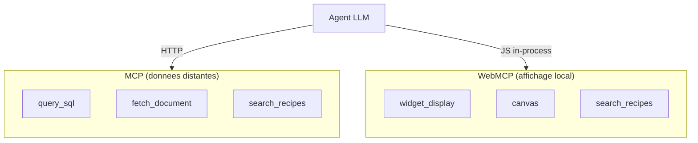

### Tableau comparatif

| Dimension | MCP | WebMCP |
|-----------|-----|--------|
| Role | Donnees, API, bases | Affichage, interaction |
| Transport | HTTP Streamable / stdio | Appels JS in-process |
| Execution | Serveur distant | Navigateur local |
| Latence | Reseau (50-500ms) | Instantane (&lt;1ms) |
| Exemples tools | query_sql, fetch_document | widget_display, canvas |
| Recettes | Decrivent les donnees | Decrivent la presentation |
| Package | `@webmcp-auto-ui/core` | `@webmcp-auto-ui/core` |

---

## La symetrie fondamentale

Le design fondamental est la **symetrie** : le LLM ne distingue pas un tool MCP d'un tool WebMCP. Les deux protocoles exposent la meme interface :

- `search_recipes()` -- decouvrir les recettes disponibles
- `get_recipe()` -- obtenir le schema et les instructions
- Des tools specifiques -- executer des actions

Du point de vue du LLM, un appel MCP et un appel WebMCP suivent le meme cycle : decouverte, lecture du schema, execution. Seul le routage interne differe -- la boucle agent dispatche vers le bon serveur selon le prefixe.

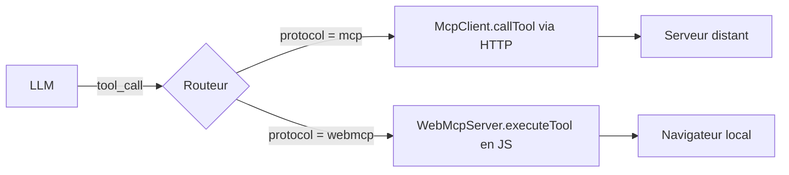

:::note[Pourquoi cette symetrie ?]
En rendant les deux protocoles interchangeables du point de vue du LLM, on simplifie le system prompt, on reduit les erreurs de routage, et on peut combiner des sources de donnees et des modes d'affichage arbitrairement.
:::

---

## Le prefixage uniforme

Tous les tools suivent la convention de nommage :

```
{serverName}_{protocol}_{toolName}
```

Exemples concrets avec plusieurs serveurs connectes :

| Tool prefixe complet | serverName | protocol | toolName |
|---------------------|------------|----------|----------|
| `tricoteuses_mcp_query_sql` | tricoteuses | mcp | query_sql |
| `tricoteuses_mcp_search_recipes` | tricoteuses | mcp | search_recipes |
| `datagouv_mcp_fetch_dataset` | datagouv | mcp | fetch_dataset |
| `autoui_webmcp_widget_display` | autoui | webmcp | widget_display |
| `autoui_webmcp_search_recipes` | autoui | webmcp | search_recipes |
| `designkit_webmcp_widget_display` | designkit | webmcp | widget_display |

Le routage dans la boucle agent parse ce prefixe avec une regex :

```typescript
/^(.+?)_(mcp|webmcp)_(.+)$/
```

Puis dispatche :
- `protocol === 'mcp'` --> `McpClient.callTool(toolName, params)`
- `protocol === 'webmcp'` --> `WebMcpServer.executeTool(toolName, params)`

Ce prefixage garantit qu'il n'y a **aucune collision de noms** meme avec 10 serveurs connectes simultanement.

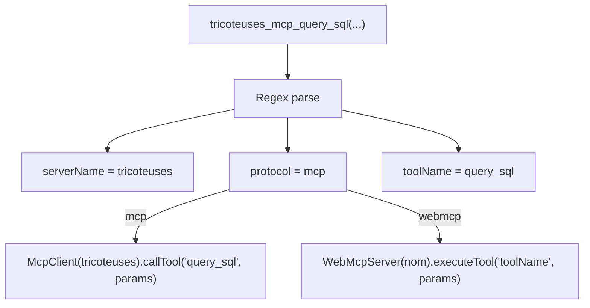

---

## Le system prompt dynamique

`buildSystemPrompt(layers)` genere un prompt **recipe-driven** adapte aux serveurs connectes. Le prompt impose un workflow strict en 4 etapes :

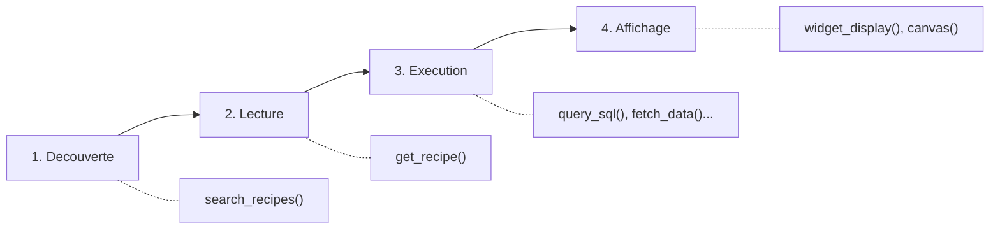

1. **Decouverte** -- appeler `search_recipes()` pour trouver la recette pertinente
2. **Lecture** -- appeler `get_recipe()` pour lire les instructions
3. **Execution** -- suivre les instructions de la recette (fetch data, etc.)
4. **Affichage** -- utiliser `widget_display`, `canvas`, `recall` pour le rendu UI

### Placeholders dynamiques

Les listes d'outils aux etapes 1, 2 et 4 sont des **placeholders** : `buildSystemPrompt` injecte automatiquement les noms prefixes selon les layers connectes. Avec 2 serveurs MCP et 1 WebMCP, l'etape 1 contiendra par exemple :

```
tricoteuses_mcp_search_recipes(), datagouv_mcp_search_recipes(), autoui_webmcp_search_recipes()
```

### Personnalisation par app

Les apps peuvent passer un `systemPrompt` custom dans les options de `runAgentLoop()`. Quand il est fourni, il remplace le prompt genere. Cependant, le prompt unifie s'adapte aux serveurs presents et couvre la majorite des cas.

---

## Le lazy loading

Au demarrage, la boucle agent n'expose **pas** tous les tools de tous les serveurs. Elle ne fournit que les tools de decouverte :

| Protocol | Tools exposes au depart |
|----------|------------------------|
| MCP | `search_recipes`, `get_recipe` |
| WebMCP | `search_recipes`, `get_recipe`, `widget_display`, `canvas`, `recall` |

Les tools WebMCP d'action (`widget_display`, `canvas`, `recall`) sont toujours presents car ils sont necessaires pour afficher des resultats.

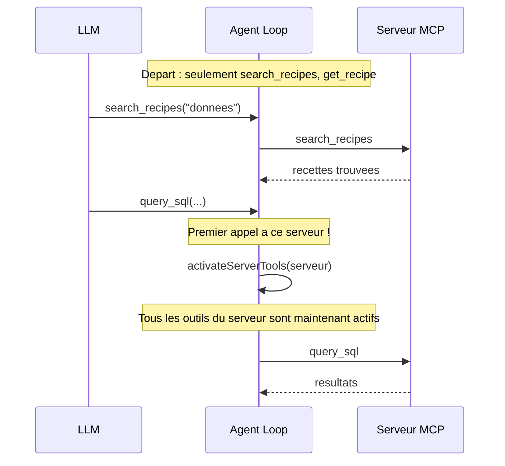

Quand le LLM appelle un tool d'un serveur pour la premiere fois, `activateServerTools()` ajoute tous les tools de ce serveur au jeu actif. Le serveur n'est active qu'une seule fois.

### Economie de tokens

Avec 4 serveurs et 50 tools au total, le mode discovery expose environ 20 tools au lieu de 50. Cela represente une economie d'environ 3000-5000 tokens dans le prompt initial -- significatif quand le budget est de 8K tokens par tour.

:::tip[Pourquoi c'est important]
Moins de tokens dans le prompt = plus de tokens disponibles pour les donnees et la reflexion du LLM. C'est particulierement critique avec les modeles legers (Haiku, Gemma) qui ont des fenetres de contexte plus petites.
:::

---

## Le pipeline de schemas

Les schemas des widgets suivent un pipeline en 4 etapes, du composant Svelte au runtime :

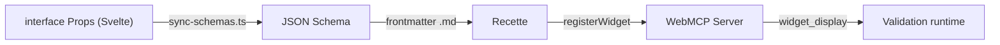

Le script `sync-schemas.ts` maintient un mapping explicite entre chaque nom de widget et son fichier `.svelte` (ex: `"stat"` -- `StatBlock.svelte`, `"profile"` -- `ProfileCard.svelte`).

### Validation au runtime

Quand le LLM appelle `widget_display(name, params)`, le serveur WebMCP valide les params contre le JSON Schema **avant** de les passer au renderer :

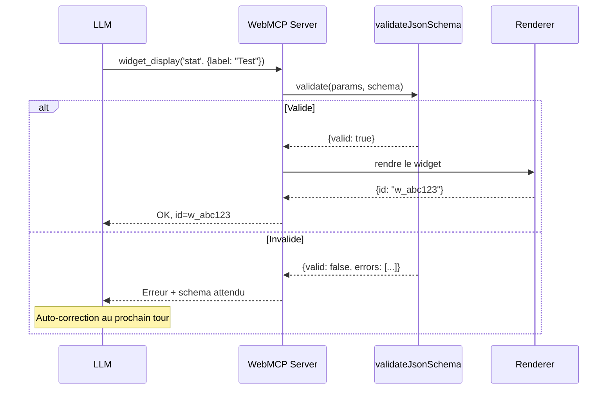

Si la validation echoue, le LLM recoit un message d'erreur avec le schema attendu, ce qui lui permet de corriger son appel.

---

## Le flow complet d'une conversation

Voici la sequence complete quand l'utilisateur demande : "Montre-moi le profil du depute Jean Dupont".

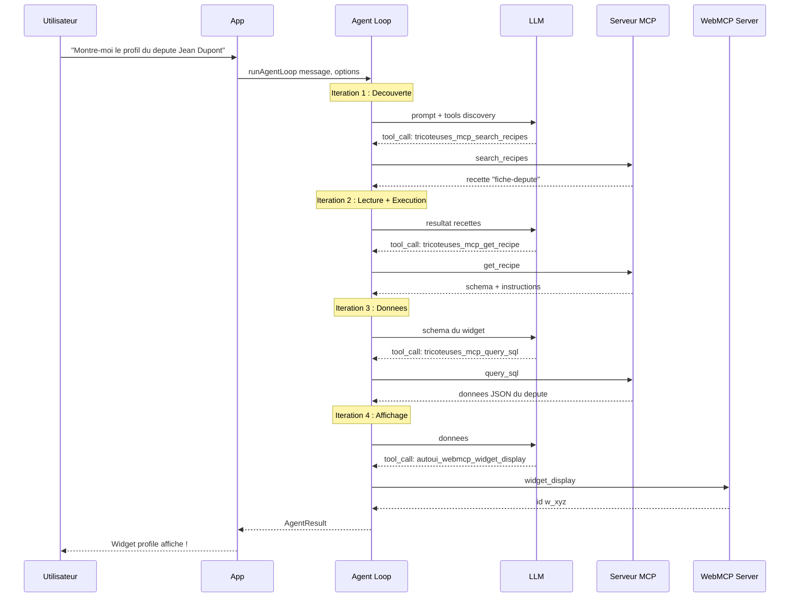

### Mecanismes de securite

Deux garde-fous evitent les boucles infinies :

1. **Compteur d'iterations sans rendu** -- apres 4 iterations sans `widget_display`, les tools de discovery sont retires du jeu actif. Apres 5 iterations, un message de nudge est injecte.
2. **`maxIterations`** (defaut 5) -- la boucle s'arrete meme si le LLM n'a pas termine.

### Compression des resultats

Apres chaque iteration, les anciens `tool_result` sont comprimes : les textes de plus de 300 caracteres sont tronques a 200 avec un hint `recall('id')`. Le LLM peut recuperer le resultat complet via l'outil `recall`.

:::tip[Pourquoi la compression ?]
Sans compression, les resultats des outils (souvent du JSON volumineux) s'accumulent et epuisent le budget de tokens. La compression avec `recall` permet au LLM de garder un resume tout en pouvant revenir aux details complets si necessaire.
:::

---

## Multi-serveurs

Plusieurs serveurs MCP et WebMCP coexistent grace au prefixage uniforme.

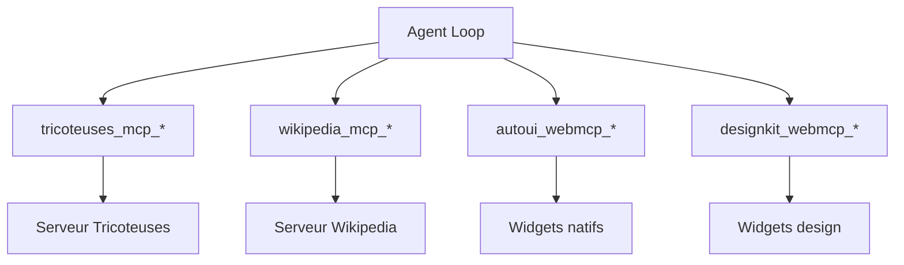

### Isolation des namespaces

Chaque serveur est un namespace complet. Si `autoui` et `designkit` exposent tous les deux un tool `widget_display`, le LLM voit :

- `autoui_webmcp_widget_display` -- widgets standards (stat, chart, map...)
- `designkit_webmcp_widget_display` -- widgets design (mockup, wireframe...)

Pas de confusion possible.

---

## Le resolver canonique (4 couches)

Les serveurs MCP n'utilisent pas toujours les noms exacts `search_recipes` et `get_recipe`. Le resolver canonique identifie les tools equivalents via 4 couches de matching :

| Couche | Strategie | Exemple |
|--------|-----------|---------|
| Layer 1 | Correspondance exacte sur le nom | `search_recipes` |
| Layer 2 | Decomposition (action, resource) | `list_skills` --> action=list, resource=skills --> search_recipes |
| Layer 3 | Scan de la description pour keywords | description contient "recipe" + action "search" |
| Layer 4 | Fallback : pas de tool recette, liste les tools bruts | serveur sans recettes |

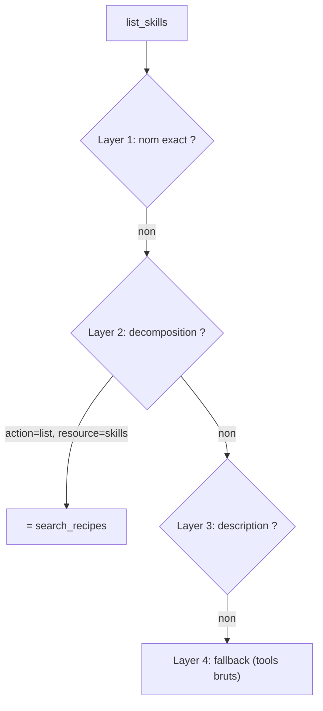

Le resolver enregistre des **alias** dans une map locale :

```typescript
// Si le serveur expose "list_skills" au lieu de "search_recipes"
aliasMap.set('serveur_mcp_search_recipes', 'serveur_mcp_list_skills');
```

Le system prompt utilise le nom canonique (`search_recipes`), et la boucle agent resout l'alias au moment de l'execution.

---

## Extensibilite

L'architecture par layers est concue pour accueillir de nouveaux types de serveurs sans modifier la boucle agent.

### Browser WebMCP

Un serveur WebMCP `browser` pourrait exposer `notify`, `clipboard`, `share`, `download`. Le LLM appellerait `browser_webmcp_notify(...)`.

### Native WebMCP (SwiftUI bridge)

Un bridge natif pourrait exposer `widget_display` (rendu SwiftUI), `haptic`, `speech`. Meme convention : `native_webmcp_*`.

### Nouveaux protocoles

`ToolLayer` est un union discrimine par `protocol`. Ajouter un troisieme type = nouveau membre d'union + un cas dans `buildToolsFromLayers()`.

```typescript
// Aujourd'hui
export type ToolLayer = McpLayer | WebMcpLayer;
// Demain
export type ToolLayer = McpLayer | WebMcpLayer | WasmLayer;
```

---

## Architecture globale

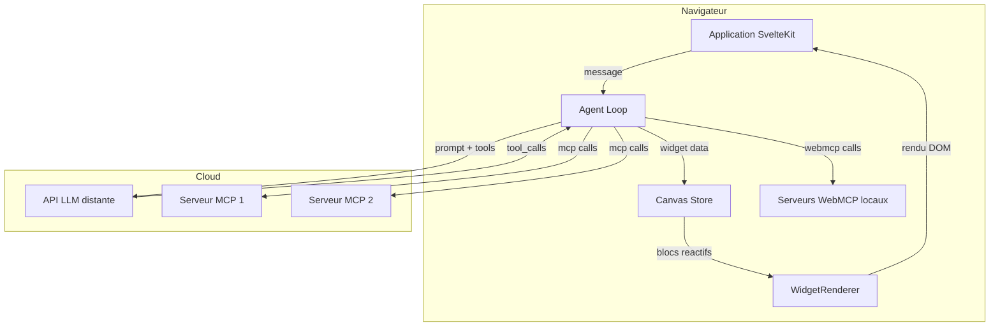

---

## Resume

| Concept | Implementation |
|---------|---------------|
| Protocoles | MCP (distant) + WebMCP (local), symetriques |
| Prefixage | `{server}_{protocol}_{tool}` |
| Layers | `McpLayer[]` + `WebMcpLayer[]` = `ToolLayer[]` |
| Lazy loading | `buildDiscoveryTools()` + `activateServerTools()` |
| System prompt | `buildSystemPrompt(layers)` -- dynamique |
| Pipeline schemas | Props TS --> sync-schemas --> .md --> WebMCP |
| Validation | JSON Schema au runtime avant rendu |
| Multi-serveurs | Namespaces isoles, alias, filtrage recettes |
| Resolver canonique | 4 couches : exact, decomposition, description, fallback |
| Compression contexte | Troncature + recall() pour long results |
| Extensibilite | Union discriminee `ToolLayer`, nouveau type |

---

## Troubleshooting

| Probleme | Cause probable | Solution |
|----------|---------------|----------|
| "Unknown tool" dans les logs | Le prefixe ne correspond a aucun serveur | Verifiez que le serverName dans le layer correspond |
| Le LLM ignore un serveur MCP | Pas de recettes, le LLM ne sait pas quoi demander | Ajoutez un fichier `recipes.json` au serveur |
| Boucle infinie | Le LLM ne termine jamais | Reduisez `maxIterations` ou verifiez le system prompt |
| Outils non visibles | Le serveur n'est pas dans les layers | Verifiez que `layers` contient le layer du serveur |

---

## Aller plus loin

- **Implementer un nouveau protocole** : etendez l'union `ToolLayer` et ajoutez un cas dans `buildToolsFromLayers()`
- **Creer un bridge natif** : implementez un serveur WebMCP qui communique avec du code natif (Swift, Kotlin)
- **Optimiser le lazy loading** : utilisez `buildDiscoveryCache()` pour pre-calculer les outils de decouverte

## Voir aussi

- [Demarrer avec le boilerplate](./boilerplate)
- [Creer un serveur WebMCP](./create-webmcp-server)
- [Architecture du systeme](/webmcp-auto-ui/guide/architecture)
