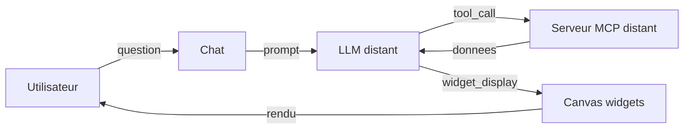
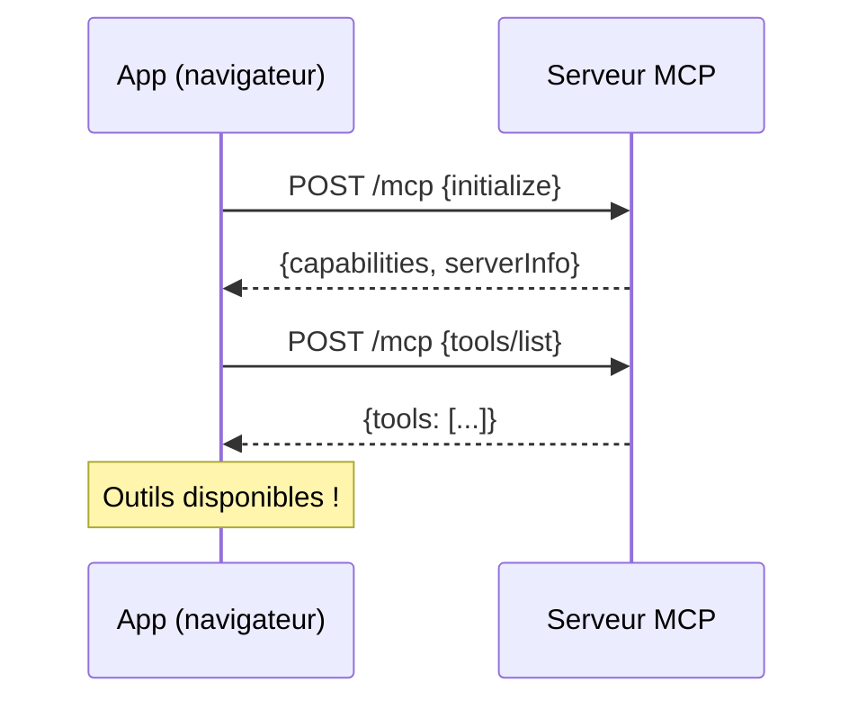
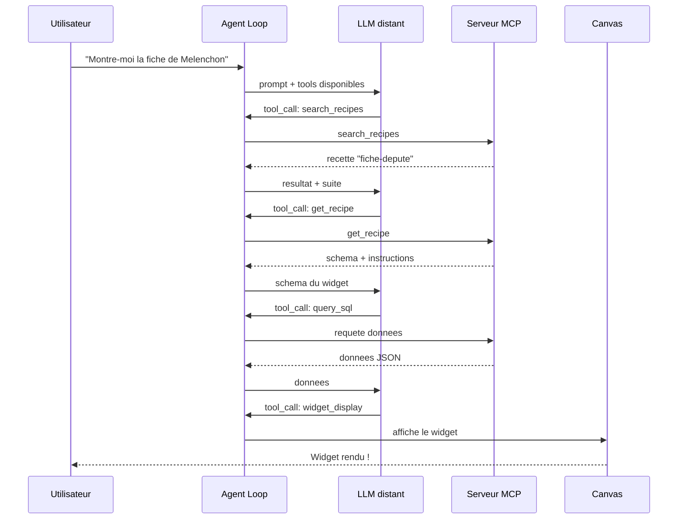

Vous allez voir, en 10 minutes vous aurez une application fonctionnelle qui connecte un serveur MCP, interroge un LLM distant, et affiche des widgets generes automatiquement par l'IA. C'est le point de depart ideal pour tout projet webmcp-auto-ui.

## Objectif

Installer le boilerplate, connecter un serveur MCP distant, et obtenir votre premier widget genere par l'agent IA dans le navigateur.

## Prerequis

- **Node.js 18+** installe
- Une **cle API LLM** (e.g. Anthropic pour Claude, Google pour Gemini, OpenAI pour ChatGPT) -- niveaux gratuits disponibles pour les premiers essais
- Un terminal et un editeur de code
- Aucune connaissance prealable de MCP n'est requise

## Resultat final

A la fin de ce tutoriel, vous aurez une app SvelteKit 5 complete avec :
- Un chat connecte a un LLM distant (e.g. Claude, Gemini, ChatGPT)
- Un serveur MCP distant connecte (donnees parlementaires francaises)
- Des widgets qui s'affichent automatiquement sur un canvas
- Un theme clair/sombre fonctionnel



---

## Etape 1 : Scaffolding

On commence par cloner le boilerplate avec `degit`, qui telecharge le repertoire sans l'historique git :

```bash
npx degit jeanbaptiste/webmcp-auto-ui/apps/boilerplate my-app
cd my-app
npm install
```

Cela installe une app SvelteKit 5 pre-cablee avec les 4 packages du monorepo :

| Package | Role |
|---------|------|
| `@webmcp-auto-ui/core` | Client MCP, serveur WebMCP, validation JSON Schema |
| `@webmcp-auto-ui/agent` | Boucle agent, providers LLM, lazy loading |
| `@webmcp-auto-ui/sdk` | Canvas store, encodage HyperSkill |
| `@webmcp-auto-ui/ui` | Composants Svelte (LLMSelector, McpStatus, WidgetRenderer, etc.) |

:::tip[Pourquoi degit ?]
`degit` copie uniquement les fichiers, sans le `.git` du monorepo. Vous repartez avec un projet propre, pret a initialiser votre propre repo.
:::

**Verification** : apres `npm install`, verifiez que le repertoire `node_modules/@webmcp-auto-ui` contient les 4 sous-repertoires (`core`, `agent`, `sdk`, `ui`).

---

## Etape 2 : Configurer le proxy API

Le navigateur ne peut pas appeler l'API du provider LLM directement (les cles API ne doivent jamais etre exposees cote client). Le boilerplate inclut un proxy serveur SvelteKit qui relaie les requetes.

Ouvrez le fichier `src/routes/api/chat/+server.ts` (deja present dans le boilerplate) :

```ts
import { env } from '$env/dynamic/private';
import type { RequestHandler } from '@sveltejs/kit';
import { anthropicProxy } from '@webmcp-auto-ui/agent/server';

export const POST: RequestHandler = async ({ request }) => {
  const body = await request.json() as Record<string, unknown>;
  const apiKey = (body.__apiKey as string | undefined) || env.ANTHROPIC_API_KEY || '';
  delete body.__apiKey;
  return anthropicProxy(body, apiKey, request.headers.get('X-Model'));
};
```

Voici ce qui se passe :
- Le proxy lit la cle API depuis les variables d'environnement serveur (jamais exposee au client)
- `anthropicProxy` reformate le body et l'envoie a l'API du LLM distant
- Le header `X-Model` permet de changer de modele dynamiquement (`'haiku'`, `'sonnet'`, `'opus'`)

Ajoutez votre cle API dans un fichier `.env` a la racine du projet :

```
ANTHROPIC_API_KEY=sk-ant-...
```

:::caution[Ne committez jamais votre .env]
Le fichier `.env` est deja dans le `.gitignore` du boilerplate. Ne le retirez pas.
:::

**Verification** : le fichier `.env` existe et contient `ANTHROPIC_API_KEY=sk-ant-...` (votre vraie cle).

---

## Etape 3 : Comprendre la connexion MCP

Le boilerplate utilise `McpMultiClient` pour gerer une ou plusieurs connexions a des serveurs MCP distants. Un serveur MCP expose des **outils** (tools) que le LLM peut appeler pour recuperer des donnees.

```ts
import { McpMultiClient } from '@webmcp-auto-ui/core';

const multiClient = new McpMultiClient();
await multiClient.addServer('https://mcp.code4code.eu/mcp');
```

`addServer` effectue trois operations :
1. **Connexion** au serveur via HTTP Streamable (JSON-RPC 2.0)
2. **Initialisation** du protocole MCP (echange de capabilities)
3. **Recuperation** de la liste des outils disponibles

Dans le boilerplate, la connexion est deja cablee dans le composant principal : un champ URL + un bouton "Connecter". L'app se connecte automatiquement au chargement de la page.



**Verification** : lancez `npm run dev`, ouvrez `http://localhost:5173`, et verifiez que l'indicateur MCP en haut de page passe au vert.

---

## Etape 4 : Comprendre le provider LLM

Le provider LLM est l'abstraction qui permet de communiquer avec differents modeles de langage. Le boilerplate utilise `RemoteLLMProvider` pour les modeles distants (toute API compatible OpenAI) :

```ts
import { RemoteLLMProvider } from '@webmcp-auto-ui/agent';

const provider = new RemoteLLMProvider({ proxyUrl: '/api/chat' });
```

Le composant `<LLMSelector>` (dans la barre superieure) permet de changer de modele a chaud. Les alias disponibles sont :

| Alias | Modele reel | Cas d'usage |
|-------|-------------|-------------|
| `haiku` | Claude Haiku | Rapide, economique, ideal pour les tests |
| `sonnet` | Claude Sonnet | Equilibre performance/cout |
| `opus` | Claude Opus | Maximum de qualite |

:::tip[Commencez avec Haiku]
Pendant le developpement, utilisez Haiku pour iterer rapidement. Passez a Sonnet ou Opus quand vous etes satisfait du workflow.
:::

---

## Etape 5 : Lancer la boucle agent

La boucle agent est le coeur du systeme. Elle orchestre les echanges entre le LLM, les outils MCP (donnees distantes) et les widgets WebMCP (affichage local).

Voici le code complet, tel qu'il apparait dans le boilerplate :

```ts
import { runAgentLoop, buildSystemPrompt, fromMcpTools, autoui } from '@webmcp-auto-ui/agent';
import type { ToolLayer, McpLayer } from '@webmcp-auto-ui/agent';

// 1. Construire les layers (MCP distant + WebMCP local)
const layers: ToolLayer[] = [];

// Layer MCP : chaque serveur connecte fournit ses outils
for (const server of multiClient.listServers()) {
  const mcpLayer: McpLayer = {
    protocol: 'mcp',
    serverName: server.name,
    tools: fromMcpTools(server.tools),
  };
  layers.push(mcpLayer);
}

// Layer WebMCP : widgets natifs (stat, chart, table, map...)
layers.push(autoui.layer());

// 2. Generer le system prompt adapte aux serveurs connectes
const systemPrompt = buildSystemPrompt(layers);

// 3. Lancer la boucle
const result = await runAgentLoop(userMessage, {
  provider,
  systemPrompt,
  layers,
  maxIterations: 10,
  maxTokens: 4096,
  callbacks: {
    onWidget: (type, data) => {
      // Le LLM a demande d'afficher un widget
      const id = 'b_' + Date.now().toString(36);
      blocks = [...blocks, { id, type, data }];
      return { id };
    },
    onText: (text) => { ephemeralText = text; },
    onToolCall: (call) => { console.log('Tool:', call.name); },
  },
});
```

Le flux est le suivant :



Le `buildSystemPrompt` genere un prompt qui impose un workflow en 4 etapes au LLM :
1. **Decouverte** : chercher les recettes disponibles
2. **Lecture** : lire le schema et les instructions de la recette
3. **Execution** : appeler les outils de donnees
4. **Affichage** : appeler `widget_display` avec les bonnes donnees

**Verification** : tapez "Montre-moi la fiche de Jean-Luc Melenchon" dans le chat. Vous devriez voir l'indicateur de progression, puis un widget s'afficher.

---

## Etape 6 : Afficher les widgets

Le rendu des widgets se fait via `<WidgetRenderer>`. Ce composant resout automatiquement le composant Svelte correspondant au `type` du widget :

```svelte
<script lang="ts">
  import { WidgetRenderer } from '@webmcp-auto-ui/ui';
</script>

<div class="grid grid-cols-1 md:grid-cols-2 gap-4">
  {#each blocks as block (block.id)}
    <WidgetRenderer
      id={block.id}
      type={block.type}
      data={block.data}
      {servers}
    />
  {/each}
</div>
```

`WidgetRenderer` cherche le bon composant dans cet ordre :
1. Les serveurs WebMCP custom (passes via la prop `servers`)
2. Les widgets natifs `autoui` (stat, chart, table, map, profile, timeline, etc.)

Si le type n'est reconnu par aucun serveur, un fallback JSON s'affiche pour le debug.

:::note[WidgetRenderer vs BlockRenderer]
`WidgetRenderer` est le composant recommande pour les apps qui utilisent des serveurs WebMCP multiples. `BlockRenderer` est un composant plus simple qui ne gere que les widgets natifs.
:::

---

## Etape 7 : Ajouter les composants UI

Le boilerplate integre plusieurs composants UI pre-faits qui simplifient la construction de l'interface :

```svelte
<script lang="ts">
  import {
    LLMSelector,     // Selecteur de modele (haiku/sonnet/opus)
    McpStatus,       // Indicateur de connexion MCP
    AgentProgress,   // Progression de la boucle agent
    WidgetRenderer,  // Rendu des widgets
    getTheme,        // Theme clair/sombre
  } from '@webmcp-auto-ui/ui';
</script>

<!-- Barre superieure -->
<header class="flex items-center gap-3 px-4 border-b">
  <McpStatus
    connecting={canvas.mcpConnecting}
    connected={canvas.mcpConnected}
    name={mcpName}
    servers={multiClient.listServers().map(s => ({
      url: s.url, name: s.name, toolCount: s.tools.length
    }))}
  />
  <LLMSelector />
</header>

<!-- Progression agent (barre animee pendant la generation) -->
<AgentProgress
  active={canvas.generating}
  elapsed={chatTimer}
  toolCalls={chatToolCount}
  lastTool={chatLastTool}
/>
```

Chaque composant est autonome :
- **`McpStatus`** affiche un point vert/rouge avec le nom du serveur et le nombre d'outils
- **`LLMSelector`** expose un dropdown pour choisir le modele LLM
- **`AgentProgress`** montre une barre de progression avec le temps ecoule, le nombre d'appels d'outils, et le dernier outil appele

---

## Etape 8 : Ajouter un widget custom

Le boilerplate inclut 3 widgets custom (fiches deputes, scrutins, amendements) comme exemples. Pour creer les votres, il suffit de :

1. **Creer un serveur WebMCP local** :

```ts
import { createWebMcpServer } from '@webmcp-auto-ui/core';
import MonWidget from './widgets/MonWidget.svelte';
import monWidgetRecipe from './recipes/mon-widget.md?raw';

const monServeur = createWebMcpServer('mon-app', {
  description: 'Widgets custom de mon application',
});

// Enregistrer le widget avec sa recette (frontmatter + instructions)
monServeur.registerWidget(monWidgetRecipe, MonWidget);
```

2. **Ajouter le layer a la boucle agent** :

```ts
layers.push(monServeur.layer());
```

3. **Passer le serveur au WidgetRenderer** :

```svelte
<WidgetRenderer
  id={block.id}
  type={block.type}
  data={block.data}
  servers={[monServeur]}
/>
```

Le LLM decouvre automatiquement vos widgets via `search_recipes` et peut les utiliser dans ses reponses.

**Verification** : demandez au chat quelque chose en rapport avec votre widget. Le LLM devrait decouvrir la recette et afficher votre composant.

:::tip[Pour aller plus loin]
Consultez le tutoriel [Creer un widget custom](./create-custom-widget) pour un guide complet avec recette, schema et interactions.
:::

---

## Lancer le serveur de developpement

```bash
npm run dev
```

L'app est accessible sur `http://localhost:5173`. L'app se connecte automatiquement au serveur MCP par defaut.

**Verification finale** : tapez une question dans le chat et verifiez que :
1. L'indicateur de progression s'active
2. Des appels d'outils s'affichent dans la console
3. Un ou plusieurs widgets apparaissent sur le canvas

---

## Structure du projet

```
my-app/
  src/
    routes/
      +page.svelte          # Page principale (chat + canvas)
      +layout.svelte        # Layout racine (ThemeProvider)
      api/chat/+server.ts   # Proxy API LLM distant
    lib/
      widgets/
        register.ts         # Serveur WebMCP + enregistrement widgets
        MonWidget.svelte    # Composant widget custom
      recipes/
        mon-widget.md       # Recette du widget (frontmatter + instructions)
  .env                      # ANTHROPIC_API_KEY (jamais commite)
  package.json
  svelte.config.js
  vite.config.ts
```

---

## Troubleshooting

| Probleme | Cause probable | Solution |
|----------|---------------|----------|
| "Failed to fetch" dans le chat | Cle API manquante ou invalide | Verifiez `.env` et redemarrez le serveur de dev |
| MCP reste rouge | URL incorrecte ou serveur MCP down | Verifiez l'URL, testez avec `curl -X POST <url>` |
| Widgets ne s'affichent pas | Le LLM n'appelle pas `widget_display` | Verifiez que `autoui.layer()` est dans les layers |
| "Module not found" au build | Packages pas installes | Relancez `npm install` |

---

## Aller plus loin

- **Ajouter un second serveur MCP** : appelez `multiClient.addServer('https://autre-serveur/mcp')` pour combiner plusieurs sources de donnees
- **Personnaliser le theme** : modifiez les tokens dans `ThemeProvider` (voir [Construire une demo themee](./themed-demo))
- **Creer vos propres widgets** : suivez le tutoriel [Creer un widget custom](./create-custom-widget)
- **Activer le Nano-RAG** : cochez la case "Nano-RAG" pour compresser le contexte avec des embeddings locaux

## Voir aussi

- [Creer un widget custom](./create-custom-widget)
- [Utiliser les widgets existants](./use-existing-widgets)
- [Connecter un serveur MCP](./connect-mcp-server)
- [Architecture MCP / WebMCP](./architecture-mcp-webmcp)
