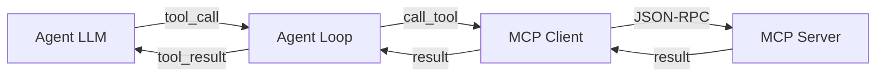

Un **serveur MCP** expose des outils et des ressources (données, fichiers, APIs externes) que l'agent AI peut utiliser. Ce tutorial montre comment connecter un serveur MCP existant à WebMCP Auto-UI et l'utiliser dans la boucle agent.

## Concepts clés

- **MCP Server** : serveur JSON-RPC qui expose des outils (ex: rechercher des recettes, appeler une API)
- **MCP Client** : client qui se connecte au serveur et exécute des outils
- **Tool Layer** : couche structurée qui regroupe les outils d'un serveur MCP
- **Agent Loop** : boucle qui alterne entre appels LLM et exécution d'outils



## Architecture

WebMCP Auto-UI supporte deux protocoles :

- **MCP** (Model Context Protocol) : serveur distant qui expose des outils de données
- **WebMCP** : serveur local qui expose des outils d'affichage (widgets)

Typiquement, vous connectez **1+ serveurs MCP** (données) + **1 serveur WebMCP** (UI autoui) :

```typescript
const layers: ToolLayer[] = [
  // Couche MCP — récupère des données
  {
    protocol: 'mcp',
    serverName: 'postgres',
    tools: [
      { name: 'query', description: 'Exécuter une requête SQL', ... },
      { name: 'list_tables', description: 'Lister les tables', ... }
    ]
  },
  // Couche WebMCP — affiche des widgets
  {
    protocol: 'webmcp',
    serverName: 'autoui',
    tools: [
      { name: 'widget_display', description: 'Afficher un widget', ... },
      { name: 'search_recipes', description: 'Lister les widgets', ... }
    ]
  }
];
```

## Exemple 1 : connecter un serveur MCP local via stdio

Si vous avez un serveur MCP local écrit en Python ou Node.js qui communique via stdin/stdout :

```typescript
import { spawn } from 'child_process';
import { McpClient } from '@webmcp-auto-ui/core';

// Démarrer le serveur MCP
const server = spawn('python', ['./mcp_server.py'], {
  stdio: ['pipe', 'pipe', 'inherit']
});

// Créer un client MCP
const mcpClient = new McpClient({
  transport: 'stdio',
  process: server,
  clientName: 'webmcp-auto-ui',
  timeout: 30000
});

// Initialiser
await mcpClient.initialize();
const tools = await mcpClient.listTools();
console.log('Outils disponibles:', tools.map(t => t.name));
```

## Exemple 2 : connecter un serveur MCP HTTP distant

Si votre serveur MCP écoute sur une URL HTTP :

```typescript
import { McpClient } from '@webmcp-auto-ui/core';

const mcpClient = new McpClient({
  transport: 'http',
  url: 'https://mcp-server.example.com/mcp',
  clientName: 'webmcp-auto-ui',
  timeout: 30000
});

await mcpClient.initialize();
const tools = await mcpClient.listTools();
```

## Exemple 3 : créer une couche MCP structurée

Une fois le client créé, convertissez les outils en couche structurée :

```typescript
import { McpClient } from '@webmcp-auto-ui/core';
import type { ToolLayer } from '@webmcp-auto-ui/agent';

const mcpClient = new McpClient({ /* ... */ });
await mcpClient.initialize();

// Récupérer les outils
const mcpTools = await mcpClient.listTools();

// Créer une couche MCP
const mcpLayer: ToolLayer = {
  protocol: 'mcp',
  serverName: 'my-api', // Utilisé comme préfixe : my-api_mcp_query, etc.
  description: 'API personnalisée',
  tools: mcpTools.map(t => ({
    name: t.name,
    description: t.description ?? '',
    inputSchema: t.inputSchema
  }))
};

export { mcpClient, mcpLayer };
```

## Exemple 4 : utiliser la couche MCP dans la boucle agent

```typescript
import { runAgentLoop } from '@webmcp-auto-ui/agent';
import { RemoteLLMProvider } from '@webmcp-auto-ui/agent';
import { autoui } from '@webmcp-auto-ui/agent';
import { mcpClient, mcpLayer } from './mcp-setup.js';

const llmProvider = new RemoteLLMProvider({
  apiKey: process.env.ANTHROPIC_API_KEY,
  model: 'claude-3-5-sonnet-20241022'
});

const result = await runAgentLoop(
  'Récupère tous les utilisateurs actifs et affiche-les dans un tableau',
  {
    client: mcpClient,           // Client MCP pour les appels d'outils
    provider: llmProvider,        // Fournisseur LLM
    layers: [
      mcpLayer,                  // Couche MCP — outils de données
      autoui.layer()             // Couche WebMCP — widgets d'affichage
    ],
    maxIterations: 5,
    callbacks: {
      onIterationStart: (i, max) => {
        console.log(`Itération ${i}/${max}`);
      },
      onToolCall: (call) => {
        console.log(`Appel outil: ${call.name}`);
        if (call.result) console.log(`Résultat: ${call.result.slice(0, 100)}...`);
        if (call.error) console.log(`Erreur: ${call.error}`);
      },
      onWidget: (type, data) => {
        console.log(`Widget affiché: ${type}`);
        return { id: `widget_${Date.now()}` };
      },
      onDone: (metrics) => {
        console.log(`Terminé - ${metrics.toolCalls} appels, ${metrics.totalTokens} tokens`);
      }
    }
  }
);

console.log('Résultat:', result.text);
```

## Exemple 5 : gérer plusieurs serveurs MCP

Si vous avez plusieurs serveurs MCP (base de données, API météo, système de fichiers) :

```typescript
import { McpClient } from '@webmcp-auto-ui/core';
import type { ToolLayer } from '@webmcp-auto-ui/agent';

async function setupMultipleMcpServers() {
  // Serveur 1 : PostgreSQL
  const postgresClient = new McpClient({
    transport: 'stdio',
    process: spawn('node', ['./mcp-postgres.js']),
    timeout: 30000
  });
  await postgresClient.initialize();
  const postgresTools = await postgresClient.listTools();

  // Serveur 2 : Système de fichiers
  const fsClient = new McpClient({
    transport: 'stdio',
    process: spawn('node', ['./mcp-filesystem.js']),
    timeout: 30000
  });
  await fsClient.initialize();
  const fsTools = await fsClient.listTools();

  // Serveur 3 : API météo
  const weatherClient = new McpClient({
    transport: 'http',
    url: 'https://weather-api.example.com/mcp',
    timeout: 30000
  });
  await weatherClient.initialize();
  const weatherTools = await weatherClient.listTools();

  // Créer les couches
  const layers: ToolLayer[] = [
    {
      protocol: 'mcp',
      serverName: 'postgres',
      description: 'Base de données PostgreSQL',
      tools: postgresTools.map(t => ({
        name: t.name,
        description: t.description ?? '',
        inputSchema: t.inputSchema
      }))
    },
    {
      protocol: 'mcp',
      serverName: 'filesystem',
      description: 'Accès au système de fichiers',
      tools: fsTools.map(t => ({
        name: t.name,
        description: t.description ?? '',
        inputSchema: t.inputSchema
      }))
    },
    {
      protocol: 'mcp',
      serverName: 'weather',
      description: 'API météo',
      tools: weatherTools.map(t => ({
        name: t.name,
        description: t.description ?? '',
        inputSchema: t.inputSchema
      }))
    },
    autoui.layer() // Couche WebMCP
  ];

  return { layers, clients: [postgresClient, fsClient, weatherClient] };
}

const { layers, clients } = await setupMultipleMcpServers();

const result = await runAgentLoop(
  'Récupère les fichiers du répertoire courant et crée un tableau avec leurs tailles',
  {
    // Note: le client MCP n'est pas utilisé directement quand plusieurs clients sont en jeu
    // L'agent dispatche aux bons clients via les noms de serveurs
    provider: llmProvider,
    layers,
    callbacks: {
      onToolCall: (call) => {
        // Chaque appel inclut le nom du serveur : "postgres_mcp_query", "filesystem_mcp_ls", etc.
        console.log(`Outil: ${call.name}`);
      }
    }
  }
);
```

## Architecture de dispatch des outils

Chaque outil est nommé avec le format : `{serverName}_{protocol}_{toolName}`

Par exemple :
- `postgres_mcp_query` — outil "query" du serveur MCP "postgres"
- `weather_mcp_forecast` — outil "forecast" du serveur MCP "weather"
- `autoui_webmcp_widget_display` — outil "widget_display" du serveur WebMCP "autoui"

La boucle agent parse ce format et route automatiquement vers le client approprié :

```typescript
// Dans la boucle agent (packages/agent/src/loop.ts)
const toolMatch = name.match(/^(.+?)_(mcp|webmcp)_(.+)$/);
if (toolMatch) {
  const [, serverName, protocol, realToolName] = toolMatch;

  if (protocol === 'mcp') {
    const result = await mcpClient.callTool(realToolName, args);
  } else if (protocol === 'webmcp') {
    const server = webmcpServers.get(serverName);
    const result = await server.executeTool(realToolName, args);
  }
}
```

## Avancé : lazy loading des outils

Quand vous avez de nombreux outils, ne les charger tous d'emblée ralentit le LLM. WebMCP Auto-UI supporte le **lazy loading** :

1. **Phase initiale** : afficher uniquement les outils de découverte (search_recipes, get_recipe)
2. **À la première utilisation** : activer tous les outils du serveur
3. **Itérations suivantes** : utiliser les outils activés

```typescript
import { 
  buildDiscoveryToolsWithAliases, 
  activateServerTools 
} from '@webmcp-auto-ui/agent';

const { tools: discoveryTools } = buildDiscoveryToolsWithAliases(layers);

const result = await runAgentLoop(userMessage, {
  provider: llmProvider,
  layers, // Inclure toutes les couches
  // BUT: démarre avec discoveryTools uniquement
  // La boucle agent activera les outils à la première utilisation via activateServerTools()
});
```

## Résolution canonique des outils

MCP expose souvent des outils avec des noms différents : `search_recipes`, `list_recipes`, `search_templates`, etc. WebMCP Auto-UI normalise cela avec le système **resolveCanonicalTools** (4 couches) :

```typescript
import { resolveCanonicalTools } from '@webmcp-auto-ui/agent';

const mcpTools = await mcpClient.listTools();
const matches = resolveCanonicalTools(mcpTools);

// Resultat : [
//   { role: 'search_recipes', realToolName: 'search_templates' },
//   { role: 'get_recipe', realToolName: 'get_template' }
// ]

// Les outils sont alors exposés sous les noms canoniques :
// - postgres_mcp_search_recipes (alias vers postgres_mcp_search_templates)
// - postgres_mcp_get_recipe (alias vers postgres_mcp_get_template)
```

## Gestion des erreurs

La boucle agent capture les erreurs d'outils et tente de les corriger :

```typescript
// Dans les callbacks
onToolCall: (call) => {
  if (call.error) {
    console.error(`Erreur outil ${call.name}: ${call.error}`);
    // L'agent recevra le message d'erreur et réessayera
  }
}
```

L'agent suit une **politique d'erreur** :

1. Première erreur → analyser le schéma et corriger l'appel
2. Deuxième erreur identique → chercher un autre outil/recette
3. Troisième erreur → signaler à l'utilisateur

## Résumé

| Étape | Action |
|-------|--------|
| 1 | Créer un client MCP via `new McpClient(...)` |
| 2 | Initialiser : `await client.initialize()` |
| 3 | Lister les outils : `await client.listTools()` |
| 4 | Créer une couche MCP structurée |
| 5 | Passer la couche + client à `runAgentLoop()` |
| 6 | L'agent dispatch automatiquement via `{serverName}_{protocol}_{toolName}` |

Pour plus d'exemples, consultez `packages/agent/src/loop.ts` et `packages/core/src/client.ts`.
