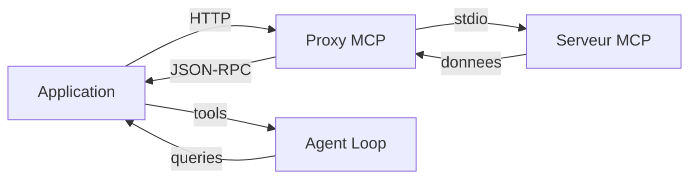
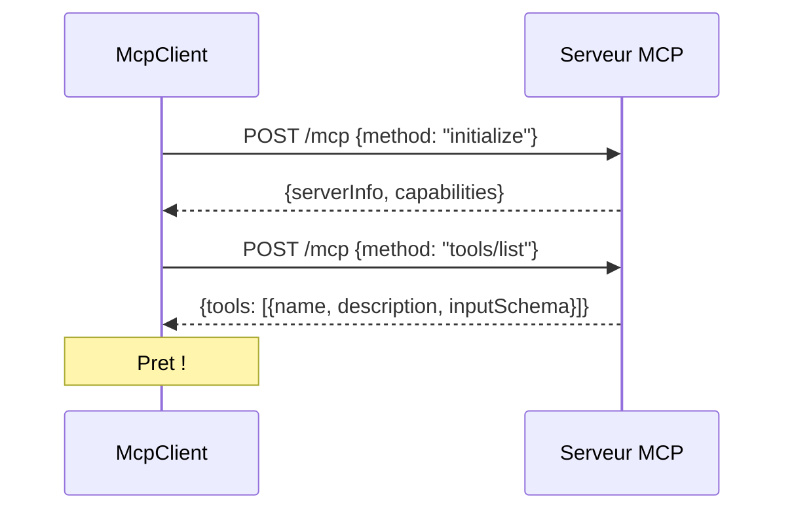
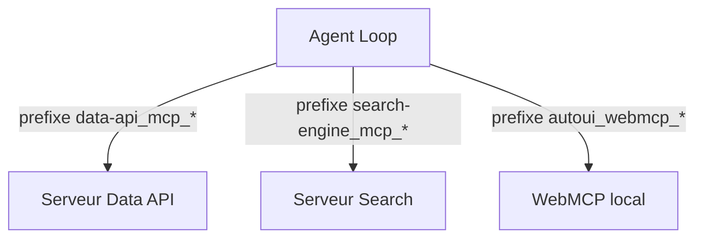

Les serveurs MCP sont la source de donnees de vos applications webmcp-auto-ui. Ce tutoriel vous montre comment connecter un serveur MCP externe, creer les couches d'outils, et les integrer dans la boucle agent pour que le LLM puisse interroger des donnees distantes.

## Objectif

Connecter un serveur MCP distant, recuperer ses outils, et les utiliser dans la boucle agent pour que le LLM puisse interroger des donnees en temps reel.

## Prerequis

- Le boilerplate est installe (voir [Demarrer avec le boilerplate](./boilerplate))
- Un serveur MCP accessible par HTTP (public ou local)

## Resultat final

Une application qui se connecte a un ou plusieurs serveurs MCP, avec gestion des erreurs, lazy loading des outils, et integration complete dans la boucle agent.



---

## Concepts cles

**MCP** (Model Context Protocol) est un protocole client-serveur standardise qui permet a un LLM d'acceder a des outils distants. Chaque serveur MCP expose :

- **Des outils** (tools) : actions atomiques que le LLM peut appeler (ex: `query_sql`, `search`, `fetch_document`)
- **Des recettes** (recipes) : guides de composition qui expliquent comment combiner les outils (optionnel)

Le transport utilise HTTP Streamable avec des messages JSON-RPC 2.0.

---

## Etape 1 : Initialiser le client MCP

Le package `@webmcp-auto-ui/core` fournit `McpClient` pour se connecter a un serveur MCP :

```typescript
import { McpClient } from '@webmcp-auto-ui/core';

const mcpClient = new McpClient('http://localhost:3000/mcp', {
  clientName: 'WebMCP Auto-UI',
  clientVersion: '1.0.0',
  timeout: 30000,
});

// Initialiser la connexion (handshake MCP)
await mcpClient.initialize();

// Recuperer la liste des outils disponibles
const tools = await mcpClient.listTools();
console.log('Outils disponibles :', tools);
```

L'initialisation effectue :
1. Une requete `initialize` avec les capabilities du client
2. Le serveur repond avec ses propres capabilities et ses informations
3. Une requete `tools/list` pour recuperer les outils disponibles



**Verification** : la variable `tools` contient un tableau d'objets avec `name`, `description` et `inputSchema`.

---

## Etape 2 : Creer une couche d'outils (ToolLayer)

Une `ToolLayer` encapsule un serveur MCP avec ses outils dans le format attendu par l'agent :

```typescript
import type { ToolLayer } from '@webmcp-auto-ui/agent';
import { McpClient } from '@webmcp-auto-ui/core';

async function createMcpLayer(url: string, name: string): Promise<ToolLayer> {
  const client = new McpClient(url);
  await client.initialize();

  const tools = await client.listTools();

  return {
    protocol: 'mcp',
    serverName: name,
    description: `Outils du serveur ${name}`,
    serverUrl: url,
    tools: tools.map(t => ({
      name: t.name,
      description: t.description ?? '',
      inputSchema: t.inputSchema,
    })),
  };
}

// Creer la couche
const wikiLayer = await createMcpLayer(
  'https://demos.hyperskills.net/mcp-wikipedia/mcp',
  'wikipedia'
);
```

Les champs de la `ToolLayer` :

| Champ | Role |
|-------|------|
| `protocol` | Toujours `'mcp'` pour un serveur MCP distant |
| `serverName` | Nom unique, utilise comme prefixe dans les outils |
| `description` | Description pour le system prompt |
| `serverUrl` | URL du serveur (pour le routage des appels) |
| `tools` | Liste des outils avec nom, description et schema |

---

## Etape 3 : Integrer avec la boucle agent

Passez le client MCP et les couches d'outils a `runAgentLoop()` :

```typescript
import { runAgentLoop, RemoteLLMProvider } from '@webmcp-auto-ui/agent';

const provider = new RemoteLLMProvider({
  proxyUrl: '/api/chat',
  model: 'sonnet',
});

const result = await runAgentLoop('Cherche des informations sur Svelte', {
  client: mcpClient,
  provider,
  layers: [wikiLayer],
  maxIterations: 5,
  callbacks: {
    onToolCall: (call) => {
      console.log(`Outil appele : ${call.name}`);
      if (call.result) console.log('Resultat :', call.result);
      if (call.error) console.log('Erreur :', call.error);
    },
    onText: (text) => {
      console.log('Agent dit :', text);
    },
  },
});
```

Le `client` est passe pour que la boucle agent puisse executer les appels d'outils sur le serveur MCP. Les `layers` servent a construire le system prompt et le jeu d'outils initial.

**Verification** : la console affiche les appels d'outils et les resultats retournes par le serveur MCP.

---

## Etape 4 : Gerer plusieurs serveurs MCP

### Avec McpMultiClient (recommande)

`McpMultiClient` gere automatiquement plusieurs connexions et le routage des appels :

```typescript
import { McpMultiClient } from '@webmcp-auto-ui/core';
import { fromMcpTools } from '@webmcp-auto-ui/agent';
import type { McpLayer, ToolLayer } from '@webmcp-auto-ui/agent';

const multi = new McpMultiClient();

// Connecter plusieurs serveurs
await multi.addServer('https://demos.hyperskills.net/mcp-wikipedia/mcp');
await multi.addServer('https://demos.hyperskills.net/mcp-metmuseum/mcp');
await multi.addServer('https://demos.hyperskills.net/mcp-openmeteo/mcp');

// Construire les layers automatiquement
const layers: ToolLayer[] = multi.listServers().map(server => ({
  protocol: 'mcp' as const,
  serverName: server.name,
  tools: fromMcpTools(server.tools),
}));

// Lancer l'agent avec tous les serveurs
const result = await runAgentLoop('Quel temps fait-il a Paris ?', {
  client: multi,
  provider,
  layers,
  maxIterations: 5,
});
```

### Avec des clients individuels

Pour un controle plus fin, creez chaque client separement :

```typescript
const dataClient = new McpClient('https://api.data.example.com/mcp');
await dataClient.initialize();
const dataLayer: ToolLayer = {
  protocol: 'mcp',
  serverName: 'data-api',
  tools: (await dataClient.listTools()).map(t => ({
    name: t.name,
    description: t.description ?? '',
    inputSchema: t.inputSchema,
  })),
};

const searchClient = new McpClient('https://search.example.com/mcp');
await searchClient.initialize();
const searchLayer: ToolLayer = {
  protocol: 'mcp',
  serverName: 'search-engine',
  tools: (await searchClient.listTools()).map(t => ({
    name: t.name,
    description: t.description ?? '',
    inputSchema: t.inputSchema,
  })),
};

// Combiner les layers
const result = await runAgentLoop('Analyse les tendances', {
  client: dataClient,
  provider,
  layers: [dataLayer, searchLayer],
  maxIterations: 10,
});
```



:::note[Prefixage automatique]
Chaque outil est prefixe avec `{serverName}_mcp_{toolName}`. Le LLM voit `wikipedia_mcp_search` et `metmuseum_mcp_search_objects` -- pas de confusion possible.
:::

---

## Gestion des erreurs

Enveloppez la connexion dans un try/catch pour gerer les cas d'erreur :

```typescript
async function safeConnectMcp(url: string) {
  try {
    const client = new McpClient(url, {
      timeout: 10000,
    });

    await client.initialize();
    console.log('Connexion etablie');
    return client;
  } catch (error) {
    if (error instanceof Error) {
      if (error.message.includes('timeout')) {
        console.error('Serveur MCP inaccessible (timeout)');
      } else if (error.message.includes('404')) {
        console.error('Endpoint MCP non trouve');
      } else {
        console.error('Erreur de connexion :', error.message);
      }
    }
    return null;
  }
}

const client = await safeConnectMcp('https://api.example.com/mcp');
if (client) {
  // Continuer avec le client
}
```

:::caution[Timeout reseau]
Les serveurs MCP publics peuvent etre lents au premier appel (demarrage a froid). Utilisez un timeout de 30 secondes pour la premiere connexion, puis reduisez a 10 secondes pour les appels suivants.
:::

---

## Lazy loading des outils

Pour les serveurs avec de nombreux outils, le lazy loading evite de surcharger le prompt du LLM. La boucle agent gere cela automatiquement :

```typescript
import { buildDiscoveryTools, activateServerTools } from '@webmcp-auto-ui/agent';

// Au demarrage, seuls les outils de decouverte sont exposes
// (search_recipes, get_recipe)
// Quand le LLM appelle un outil d'un serveur, tous les
// outils de ce serveur sont actives automatiquement

const result = await runAgentLoop('...', {
  client: mcpClient,
  provider,
  layers: [mcpLayer],
  // Le lazy loading est actif par defaut
});
```

Le benefice : avec 4 serveurs et 50 outils au total, le mode discovery expose environ 20 outils au lieu de 50, soit une economie de 3000 a 5000 tokens dans le prompt initial.

---

## Pattern : API SvelteKit avec MCP

Pour encapsuler la boucle agent dans une route API :

```typescript
// src/routes/api/agent/+server.ts
import { json } from '@sveltejs/kit';
import { runAgentLoop, RemoteLLMProvider } from '@webmcp-auto-ui/agent';
import { McpClient } from '@webmcp-auto-ui/core';

export async function POST({ request }) {
  const { message, mcpUrl } = await request.json();

  const client = new McpClient(mcpUrl);
  await client.initialize();

  const tools = await client.listTools();
  const layer = {
    protocol: 'mcp' as const,
    serverName: new URL(mcpUrl).hostname,
    description: 'MCP Server',
    tools: tools.map(t => ({
      name: t.name,
      description: t.description ?? '',
      inputSchema: t.inputSchema,
    })),
  };

  const result = await runAgentLoop(message, {
    client,
    provider: new RemoteLLMProvider({
      proxyUrl: '/api/chat',
      model: 'sonnet',
    }),
    layers: [layer],
    maxIterations: 5,
  });

  return json({
    text: result.text,
    toolCalls: result.toolCalls,
    metrics: result.metrics,
  });
}
```

---

## Integration complete avec l'UI Svelte

Voici un composant complet qui combine connexion MCP, agent et affichage :

```svelte
<script lang="ts">
  import { canvas } from '@webmcp-auto-ui/sdk/canvas';
  import { BlockRenderer, AgentProgress } from '@webmcp-auto-ui/ui';

  let mcpUrl = $state('https://demos.hyperskills.net/mcp-wikipedia/mcp');
  let userMessage = $state('');
  let loading = $state(false);

  async function runAgent() {
    if (!userMessage.trim()) return;
    loading = true;
    canvas.setGenerating(true);

    try {
      const response = await fetch('/api/agent', {
        method: 'POST',
        headers: { 'Content-Type': 'application/json' },
        body: JSON.stringify({ message: userMessage, mcpUrl }),
      });
      const result = await response.json();
      canvas.addMsg('user', userMessage);
      canvas.addMsg('assistant', result.text);
      userMessage = '';
    } catch (error) {
      console.error('Erreur agent :', error);
    } finally {
      loading = false;
      canvas.setGenerating(false);
    }
  }
</script>

<div class="flex flex-col gap-4 p-6">
  <input bind:value={mcpUrl} placeholder="URL du serveur MCP" disabled={loading} />
  <textarea bind:value={userMessage} placeholder="Votre question..." disabled={loading} />
  <button onclick={runAgent} disabled={loading}>
    {loading ? 'En cours...' : 'Envoyer'}
  </button>

  {#if loading}
    <AgentProgress />
  {/if}

  <div class="grid gap-4">
    {#each canvas.blocks as block (block.id)}
      <BlockRenderer id={block.id} type={block.type} data={block.data} />
    {/each}
  </div>
</div>
```

---

## Debogage

Pour inspecter les appels MCP en detail :

```typescript
const result = await runAgentLoop(message, {
  client,
  provider,
  layers,
  callbacks: {
    onToolCall: (call) => {
      console.log('=== APPEL OUTIL ===');
      console.log('Nom :', call.name);
      console.log('Args :', JSON.stringify(call.args, null, 2));
      console.log('Resultat :', call.result);
      console.log('Duree :', call.elapsed, 'ms');
    },
  },
});
```

:::tip[Console du navigateur]
Les outils MCP apparaissent dans la console du navigateur avec le prefixe complet (`wikipedia_mcp_search`). Filtrez par `APPEL OUTIL` pour ne voir que les appels MCP.
:::

---

## Serveurs MCP publics disponibles

Voici les serveurs MCP publics deja deployes et utilisables :

| Serveur | URL de production | Outils principaux |
|---------|-------------------|-------------------|
| Wikipedia | `/mcp-wikipedia/mcp` | `search`, `readArticle` |
| Met Museum | `/mcp-metmuseum/mcp` | `search-museum-objects`, `get-museum-object` |
| Open Meteo | `/mcp-openmeteo/mcp` | `weather_forecast`, `geocoding` |
| HackerNews | `/mcp-hackernews/mcp` | `get-front-page`, `search-posts` |
| iNaturalist | `/mcp-inaturalist/mcp` | `search_observations` |
| NASA | `/mcp-nasa/mcp` | `nasa_apod`, `nasa_mars_rover` |

Les URLs sont prefixees par `https://demos.hyperskills.net`.

---

## Troubleshooting

| Probleme | Cause probable | Solution |
|----------|---------------|----------|
| "Failed to initialize" | Serveur MCP eteint ou URL incorrecte | Testez avec `curl -X POST <url>` |
| "Timeout" | Serveur lent au demarrage | Augmentez le timeout a 30s |
| Outils vides | Le serveur n'expose pas `tools/list` | Verifiez la version du serveur MCP |
| "CORS error" | Appel cross-origin bloque | Utilisez un proxy nginx (voir [Deployer les proxies MCP](./setup-mcp-proxies)) |

---

## Aller plus loin

- **Creer votre propre serveur MCP** : n'importe quel serveur MCP compatible (Node, Python) fonctionne
- **Configurer les proxies** : pour deployer des serveurs MCP en production, voir [Deployer les proxies MCP](./setup-mcp-proxies)
- **Combiner MCP et WebMCP** : pour comprendre la symetrie entre donnees distantes et affichage local, voir [Architecture MCP / WebMCP](./architecture-mcp-webmcp)

## Voir aussi

- [Creer un widget custom](./create-custom-widget)
- [Utiliser les widgets existants](./use-existing-widgets)
- [Package core (McpClient)](/webmcp-auto-ui/packages/core)
- [Specification MCP officielle](https://modelcontextprotocol.io)
