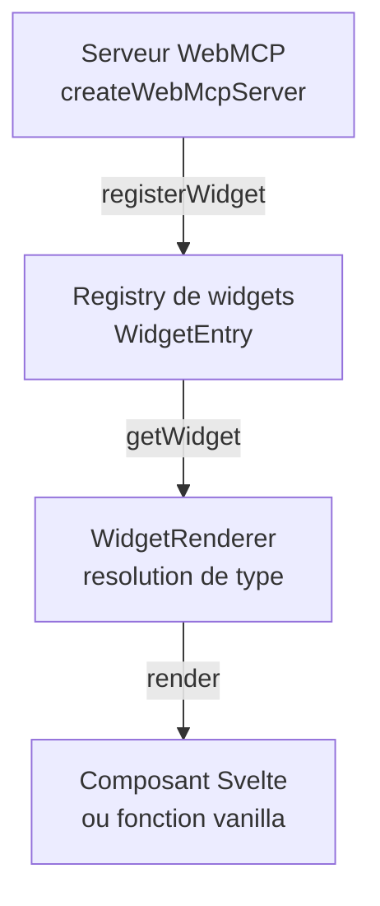

Un widget personnalisé est un composant Svelte qui affiche des données structurées sur le canvas. Ce tutorial montre comment créer, enregistrer et utiliser un widget custom.

## Architecture des widgets

Le système de widgets WebMCP Auto-UI comporte trois niveaux :



**Résumé :**
1. Un `WebMcpServer` regroupe les widgets et les outils de rendu
2. Chaque widget est enregistré avec un **frontmatter YAML** (schéma + instructions) + un **composant Svelte**
3. Au moment du rendu, `WidgetRenderer` recherche le widget dans les serveurs connectés ou utilise les natives

## Exemple complet : widget "notification-feed"

### Étape 1 : Créer le composant Svelte

```svelte
<!-- src/lib/widgets/NotificationFeed.svelte -->
<script lang="ts">
  interface Props {
    data: {
      title?: string;
      notifications: Array<{
        id: string;
        timestamp: string;
        level: 'info' | 'warn' | 'error';
        message: string;
      }>;
    };
  }

  let { data } = $props();

  const colors = {
    info: 'text-blue-500',
    warn: 'text-amber-500',
    error: 'text-red-500',
  };

  function formatTime(ts: string): string {
    const date = new Date(ts);
    return date.toLocaleTimeString('fr-FR', { hour: '2-digit', minute: '2-digit' });
  }
</script>

<div class="p-4 bg-surface1 rounded-lg border border-surface2">
  {#if data.title}
    <h3 class="font-semibold mb-3 text-text1">{data.title}</h3>
  {/if}
  
  <div class="space-y-2 max-h-64 overflow-y-auto">
    {#each data.notifications as notif (notif.id)}
      <div class="flex gap-3 items-start text-sm p-2 rounded bg-surface2">
        <div class={`mt-0.5 w-2 h-2 rounded-full flex-shrink-0 ${colors[notif.level]}`}></div>
        <div class="flex-1 min-w-0">
          <div class="text-text2">{notif.message}</div>
          <div class="text-xs text-text3 mt-1">{formatTime(notif.timestamp)}</div>
        </div>
      </div>
    {/each}
  </div>

  {#if data.notifications.length === 0}
    <div class="text-xs text-text3 italic">Aucune notification</div>
  {/if}
</div>

<style>
  :global(.dark) {
    --surface1: #1a1a1a;
    --surface2: #2d2d2d;
  }
</style>
```

### Étape 2 : Définir le frontmatter et la recette

Créer une constante avec le **frontmatter YAML** décrivant le schéma du widget :

```typescript
// src/lib/widgets/notification-feed-recipe.ts
export const NOTIFICATION_FEED_RECIPE = `---
widget: notification-feed
description: Flux de notifications en temps réel avec timestamps et niveaux de sévérité.
schema:
  type: object
  required:
    - notifications
  properties:
    title:
      type: string
      description: Titre optionnel du flux
    notifications:
      type: array
      description: Liste des notifications
      items:
        type: object
        required:
          - id
          - timestamp
          - level
          - message
        properties:
          id:
            type: string
          timestamp:
            type: string
            description: ISO 8601 timestamp
          level:
            type: string
            enum: [info, warn, error]
          message:
            type: string
---

## Quand utiliser

Pour afficher un flux de notifications structuré avec tri par timestamp et filtrage par niveau de sévérité.

## Comment

Appeler \`widget_display('notification-feed', {
  title: "Événements récents",
  notifications: [
    { id: "n1", timestamp: "2024-01-15T14:30:00Z", level: "info", message: "Tâche complétée" }
  ]
})\`.

## Erreurs courantes

- Ne pas oublier les timestamps ISO 8601 — le widget les utilise pour l'ordre d'affichage
- L'id doit être unique — c'est la clé pour la réactivité Svelte
`;
```

### Étape 3 : Créer un serveur WebMCP

Enregistrer le widget dans un serveur WebMCP custom :

```typescript
// src/lib/webmcp-server.ts
import { createWebMcpServer } from '@webmcp-auto-ui/core';
import NotificationFeed from './widgets/NotificationFeed.svelte';
import { NOTIFICATION_FEED_RECIPE } from './widgets/notification-feed-recipe';

export const customServer = createWebMcpServer('my-widgets', {
  description: 'Widgets personnalisés pour l\'application',
});

// Enregistrer le widget
customServer.registerWidget(NOTIFICATION_FEED_RECIPE, NotificationFeed);

// Optionnel : ajouter des outils custom (ex: clear-notifications)
customServer.addTool({
  name: 'clear-notifications',
  description: 'Effacer toutes les notifications du flux.',
  inputSchema: {
    type: 'object',
    properties: {},
  },
  execute: async () => ({
    ok: true,
    message: 'Notifications effacées',
  }),
});

// Exporter la couche (pour intégration agent)
export function getCustomLayer() {
  return customServer.layer();
}
```

### Étape 4 : Utiliser le widget dans une app

Dans un composant Svelte, utiliser `<WidgetRenderer>` avec le serveur custom :

```svelte
<!-- routes/+page.svelte -->
<script lang="ts">
  import { WidgetRenderer } from '@webmcp-auto-ui/ui';
  import { customServer } from '$lib/webmcp-server';

  let widgets = [
    {
      id: 'notif-feed-1',
      type: 'notification-feed',
      data: {
        title: 'Événements système',
        notifications: [
          {
            id: 'n1',
            timestamp: new Date(Date.now() - 300000).toISOString(),
            level: 'info' as const,
            message: 'Base de données synchronisée',
          },
          {
            id: 'n2',
            timestamp: new Date(Date.now() - 60000).toISOString(),
            level: 'warn' as const,
            message: 'Utilisation CPU élevée (85%)',
          },
        ],
      },
    },
  ];

  function handleInteraction(type: string, action: string, payload: unknown) {
    console.log(`Widget ${type} a déclenché:`, action, payload);
  }
</script>

<div class="p-6 max-w-2xl mx-auto">
  <h1 class="text-2xl font-bold mb-6">Dashboard personnel</h1>
  
  {#each widgets as widget (widget.id)}
    <div class="mb-4">
      <WidgetRenderer
        id={widget.id}
        type={widget.type}
        data={widget.data}
        servers={[customServer]}
        oninteract={handleInteraction}
      />
    </div>
  {/each}
</div>
```

## Intégration avec le canvas store

Pour que le widget s'ajoute au canvas via l'agent :

```typescript
// Dans un handler d'agent ou un callback
import { canvas } from '@webmcp-auto-ui/sdk/canvas';

canvas.addWidget('notification-feed', {
  title: 'Notifications en direct',
  notifications: [
    /* ... données du MCP ... */
  ],
});
```

## Points clés

✅ **Toujours fournir un frontmatter YAML** — le schéma est utilisé pour la validation et la documentation générée automatiquement

✅ **Exporter le serveur** — pour que les autres modules puissent enregistrer leurs widgets

✅ **Utiliser Svelte 5 `$props()`** — plus moderne et typé que `export let`

✅ **Gérer les états vides** — afficher un placeholder quand `data.notifications.length === 0`

❌ **Ne pas laisser `data` sans type** — TypeScript aide à attraper les bugs tôt

❌ **Ne pas enregistrer deux widgets avec le même `widget:` name** — utiliser des noms uniques

## Test en dev

```bash
npm run dev
# Naviguer vers http://localhost:5173
# Ouvrir la console pour voir les logs d'interaction
```

Voir aussi : [Utiliser les widgets existants](./use-existing-widgets.mdx)
