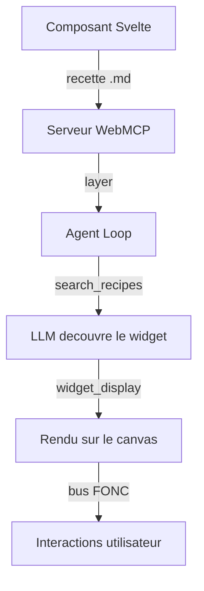
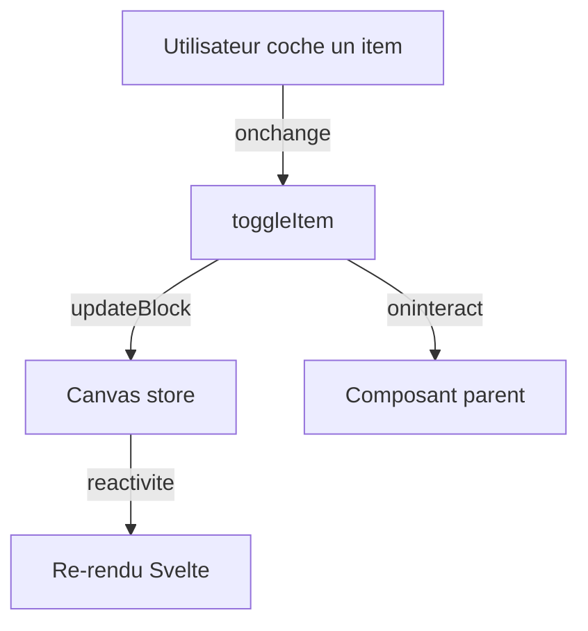
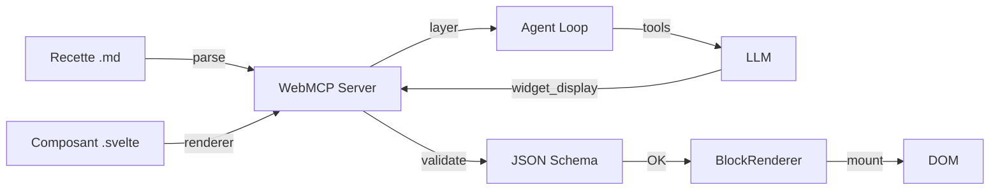

Vous avez besoin d'un widget qui n'existe pas dans la bibliotheque native ? Ce tutoriel vous guide de A a Z : creation du composant Svelte, ecriture de la recette, enregistrement dans le serveur WebMCP, et integration avec la boucle agent. A la fin, le LLM pourra utiliser votre widget comme n'importe quel widget natif.

## Objectif

Creer une barre de progression interactive, l'enregistrer comme widget WebMCP, et la rendre utilisable par l'agent IA.

## Prerequis

- Le boilerplate est installe et fonctionne (voir [Demarrer avec le boilerplate](./boilerplate))
- Familiarite de base avec Svelte 5 (`$props`, `$derived`, `$state`)
- Comprendre ce qu'est un JSON Schema (optionnel, le tutoriel l'explique)

## Resultat final

Un widget "progress-bar" que le LLM peut appeler via `widget_display('progress-bar', {label: "Chargement", current: 75, max: 100})`, avec validation automatique des parametres et interactions via le bus FONC.



---

## Etape 1 : Creer le composant Svelte

Un widget est un composant Svelte 5 standard. La seule convention : il recoit ses donnees via une prop `data` (ou directement via les props du schema).

Creez le fichier `src/lib/widgets/CustomProgressBar.svelte` :

```svelte
<script lang="ts">
  interface Props {
    data: {
      label: string;
      current: number;
      max: number;
      color?: string;
    };
  }

  let { data }: Props = $props();
  const percentage = $derived((data.current / data.max) * 100);
</script>

<div class="card">
  <h3>{data.label}</h3>
  <div class="progress-container">
    <div
      class="progress-bar"
      style="width: {percentage}%; background-color: {data.color ?? '#3b82f6'}"
    />
  </div>
  <p class="text-sm">{data.current} / {data.max}</p>
</div>

<style>
  .card {
    padding: 1rem;
    border: 1px solid #e5e7eb;
    border-radius: 0.5rem;
  }

  .progress-container {
    height: 8px;
    background: #f3f4f6;
    border-radius: 4px;
    overflow: hidden;
    margin: 0.5rem 0;
  }

  .progress-bar {
    height: 100%;
    transition: width 0.3s ease;
  }
</style>
```

Voici ce qui se passe dans ce composant :
- `interface Props` definit le contrat de donnees. C'est aussi la source du JSON Schema (genere automatiquement ou ecrit dans la recette)
- `$derived` calcule le pourcentage de maniere reactive
- La `transition` CSS anime le changement de valeur

:::tip[Convention de nommage]
Nommez vos fichiers en PascalCase (`CustomProgressBar.svelte`) et l'identifiant du widget en kebab-case (`progress-bar`). Le mapping entre les deux est explicite dans la recette.
:::

**Verification** : le fichier compile sans erreur TypeScript.

---

## Etape 2 : Ecrire la recette

La recette est un fichier Markdown avec un **frontmatter YAML** qui definit le widget. C'est ce que le LLM lit pour savoir quand et comment utiliser votre widget.

Creez le fichier `src/lib/recipes/progress-bar.md` :

```markdown
---
widget: progress-bar
description: Barre de progression animee. Telecharment, progression, completion, score.
group: feedback
schema:
  type: object
  required:
    - label
    - current
    - max
  properties:
    label:
      type: string
      description: Libelle affiche au-dessus de la barre
    current:
      type: number
      description: Valeur actuelle de la progression
    max:
      type: number
      description: Valeur maximale (100%)
    color:
      type: string
      description: Couleur CSS de la barre (defaut bleu)
---

## Quand utiliser

Pour montrer une progression, un score, un taux de completion,
ou toute valeur numerique bornee.

## Comment

Appeler widget_display('progress-bar', {label: "Telechargement", current: 45, max: 100}).
Pour personnaliser la couleur : ajouter color: "#10b981" (vert).

## Erreurs courantes

- Oublier max : il est obligatoire pour calculer le pourcentage
- current > max : la barre deborde, toujours s'assurer que current <= max
```

Le frontmatter contient trois champs obligatoires :

| Champ | Role |
|-------|------|
| `widget` | Identifiant unique du widget (utilise dans `widget_display`) |
| `description` | Description courte pour le LLM (apparait dans `search_recipes`) |
| `schema` | JSON Schema des parametres attendus par le composant |

Le champ `group` est optionnel et sert a classer les widgets dans `search_recipes`.

Le body du fichier (apres le second `---`) contient les instructions libres pour le LLM. Trois sections recommandees :
- **Quand utiliser** : les cas d'usage
- **Comment** : un exemple d'appel concret
- **Erreurs courantes** : les pieges a eviter

:::caution[La description est cruciale]
Le LLM choisit le widget en se basant sur la description. Incluez des mots-cles varies pour maximiser la probabilite de match : "progression, score, completion, telecharment, pourcentage".
:::

---

## Etape 3 : Enregistrer le widget dans un serveur WebMCP

Le serveur WebMCP expose vos widgets au LLM. Creez ou modifiez le fichier `src/lib/widgets/register.ts` :

```typescript
import { createWebMcpServer } from '@webmcp-auto-ui/core';
import CustomProgressBar from './CustomProgressBar.svelte';

// Importer la recette en raw string (Vite)
import progressBarRecipe from '../recipes/progress-bar.md?raw';

// Creer le serveur
const myServer = createWebMcpServer('mon-app', {
  description: 'Widgets custom de mon application',
});

// Enregistrer le widget
myServer.registerWidget(progressBarRecipe, CustomProgressBar);

export { myServer };
```

`registerWidget` fait trois choses en interne :
1. **Parse** le frontmatter pour extraire `widget`, `description` et `schema`
2. **Stocke** le composant comme renderer pour ce type de widget
3. **Cree automatiquement** les 4 outils built-in (au premier appel) :
   - `search_recipes` -- lister les widgets disponibles
   - `list_recipes` -- lister tous les widgets avec nom et description
   - `get_recipe` -- obtenir le schema + instructions d'un widget
   - `widget_display` -- afficher un widget sur le canvas

Vous pouvez enregistrer plusieurs widgets sur le meme serveur :

```typescript
import AnotherWidget from './AnotherWidget.svelte';
import anotherRecipe from '../recipes/another.md?raw';

myServer.registerWidget(progressBarRecipe, CustomProgressBar);
myServer.registerWidget(anotherRecipe, AnotherWidget);
```

**Verification** : appelez `myServer.listWidgets()` dans la console -- vous devriez voir `['progress-bar']`.

---

## Etape 4 : Connecter a la boucle agent

Ajoutez le layer de votre serveur aux layers de la boucle agent :

```typescript
import { autoui } from '@webmcp-auto-ui/agent';
import { myServer } from '$lib/widgets/register';

const layers = [
  autoui.layer(),       // widgets natifs (stat, chart, table...)
  myServer.layer(),     // vos widgets custom
];
```

Et passez le serveur au `WidgetRenderer` pour que le composant soit resolu au rendu :

```svelte
<WidgetRenderer
  id={block.id}
  type={block.type}
  data={block.data}
  servers={[myServer]}
/>
```

Le prefixage des outils est automatique :

| Outil brut | Nom expose au LLM |
|------------|-------------------|
| `search_recipes` | `mon-app_webmcp_search_recipes` |
| `get_recipe` | `mon-app_webmcp_get_recipe` |
| `widget_display` | `mon-app_webmcp_widget_display` |

**Verification** : dans le chat, demandez "Montre-moi une barre de progression a 75%". Le LLM devrait decouvrir la recette et afficher votre widget.

---

## Etape 5 : Ajouter des interactions (optionnel)

Si votre widget doit communiquer avec l'agent ou d'autres widgets, utilisez le **bus FONC** :

```svelte
<script lang="ts">
  import { bus } from '@webmcp-auto-ui/ui';

  interface Props {
    id?: string;
    data: {
      label: string;
      current: number;
      max: number;
      onUpdate?: (value: number) => void;
    };
  }

  let { id, data }: Props = $props();

  function handleComplete() {
    // Emettre un evenement bus vers le canvas
    if (id) {
      bus.broadcast(id, 'progress-complete', { label: data.label });
    }
    data.onUpdate?.(data.max);
  }
</script>

<div class="progress-bar">
  <progress value={data.current} max={data.max}></progress>
  <button onclick={handleComplete}>Terminer</button>
</div>
```

Le bus FONC permet aux widgets de communiquer entre eux sans couplage direct. Un widget "tableau" pourrait ecouter l'evenement `progress-complete` pour mettre a jour une ligne.

---

## Etape 6 : Integrer avec le WebMCP bus (optionnel avance)

Pour permettre a l'agent de mettre a jour le widget apres sa creation, enregistrez un outil WebMCP dans le composant :

```svelte
<script lang="ts">
  import { onMount } from 'svelte';

  onMount(() => {
    const mc = (navigator as any).modelContext;
    if (!mc) return;

    mc.registerTool({
      name: `progress_${id}_update`,
      description: `Mettre a jour la barre de progression`,
      inputSchema: {
        type: 'object',
        properties: {
          current: { type: 'number' },
        },
        required: ['current'],
      },
      execute: (args: Record<string, any>) => {
        data.current = args.current;
        return {
          content: [{ type: 'text', text: `Progression mise a jour: ${args.current}` }],
        };
      },
    });
  });
</script>
```

Avec cet outil, le LLM peut appeler `progress_{id}_update({current: 90})` pour modifier la valeur de la barre apres sa creation.

---

## Etape 7 : Typer le widget (optionnel)

Si vous voulez le typage strict dans votre app, ajoutez le type a l'union `WidgetType` :

```typescript
export type WidgetType =
  | 'stat' | 'kv' | 'list' | 'chart' | 'alert' | 'code' | 'text' | 'actions' | 'tags'
  | 'stat-card' | 'data-table' | 'timeline' | 'profile' | 'trombinoscope' | 'json-viewer'
  | 'hemicycle' | 'chart-rich' | 'cards' | 'grid-data' | 'sankey' | 'map' | 'log'
  | 'gallery' | 'carousel' | 'd3' | 'js-sandbox'
  | 'progress-bar'  // votre widget custom
  | (string & {});  // fallback pour les widgets de plugins
```

Le fallback `(string & {})` permet d'accepter n'importe quel type sans casser la validation TypeScript.

---

## Exemple complet : widget checklist avec etat persistant

Voici un widget plus complet qui combine etat reactif, persistence dans le canvas, et interactions :

```svelte
<script lang="ts">
  import { canvas } from '@webmcp-auto-ui/sdk/canvas';

  interface Props {
    id: string;
    data: {
      items: string[];
      completed: number;
    };
    oninteract?: (type: string, action: string, payload: unknown) => void;
  }

  let { id, data, oninteract }: Props = $props();
  let items = $state(data.items);
  let completed = $state(data.completed);

  function toggleItem(index: number) {
    completed = completed === index ? -1 : index;
    // Persister dans le canvas store
    canvas.updateBlock(id, { completed });
    // Emettre une interaction pour les parents
    oninteract?.('checklist', 'toggle', { index, completed });
  }
</script>

<div class="checklist">
  <h3>Checklist ({completed + 1}/{items.length})</h3>
  {#each items as item, i (i)}
    <label>
      <input
        type="checkbox"
        checked={completed === i}
        onchange={() => toggleItem(i)}
      />
      <span class:done={completed === i}>{item}</span>
    </label>
  {/each}
</div>

<style>
  .checklist { padding: 1rem; }
  label { display: flex; gap: 0.5rem; margin: 0.5rem 0; }
  .done { text-decoration: line-through; color: #6b7280; }
</style>
```



---

## Validation automatique des parametres

Le serveur WebMCP valide automatiquement les parametres du LLM contre le JSON Schema **avant** le rendu. Si le LLM envoie des donnees invalides :

```typescript
// Extrait interne de webmcp-server.ts
const validation = validateJsonSchema(rawParams, entry.inputSchema);
if (!validation.valid) {
  return {
    error: 'Validation failed',
    details: validation.errors,
    expected_schema: entry.inputSchema,
  };
}
```

Le LLM recoit alors le schema attendu et peut corriger son appel au tour suivant. Ce mecanisme d'auto-correction fonctionne dans la majorite des cas.

:::note[Sanitisation des URLs d'images]
Le serveur WebMCP sanitise aussi automatiquement les champs d'image (`src`, `avatar`, `photo`, `thumbnail`) pour supprimer les URLs hallucinees par le LLM. Seuls les prefixes valides sont acceptes : `http://`, `https://`, `data:`, `/`.
:::

---

## Architecture interne



---

## Troubleshooting

| Probleme | Cause probable | Solution |
|----------|---------------|----------|
| Widget pas decouvert par le LLM | Description trop vague dans la recette | Ajoutez des mots-cles dans la `description` du frontmatter |
| "Validation failed" | Le LLM envoie des donnees qui ne matchent pas le schema | Ajoutez des `description` a chaque propriete du schema |
| Widget rendu mais vide | Les props ne correspondent pas | Verifiez que l'`interface Props` correspond au schema |
| "Unknown widget type" | Le serveur n'est pas passe au WidgetRenderer | Ajoutez `servers={[myServer]}` au WidgetRenderer |

---

## Checklist de creation

- [ ] Composant Svelte cree avec `interface Props` et prop `data`
- [ ] Recette `.md` avec frontmatter (`widget`, `description`, `schema`) + body
- [ ] `createWebMcpServer()` + `registerWidget()`
- [ ] Layer ajoute aux layers de la boucle agent
- [ ] Serveur passe au `WidgetRenderer`
- [ ] Teste : le LLM decouvre et utilise le widget
- [ ] (Optionnel) Interactions via le bus FONC
- [ ] (Optionnel) Outil WebMCP pour les mises a jour dynamiques

## Aller plus loin

- **Generation automatique du schema** : executez `npm run sync:schemas` pour generer le JSON Schema depuis l'`interface Props` de vos composants Svelte
- **Renderer vanilla** : utilisez `mountWidget()` du package core pour integrer des widgets sans framework Svelte
- **Outils custom** : ajoutez des outils supplementaires a votre serveur WebMCP avec `server.addTool()`

## Voir aussi

- [Utiliser les widgets existants](./use-existing-widgets)
- [Creer un serveur WebMCP](./create-webmcp-server)
- [Connecter un serveur MCP](./connect-mcp-server)
- [Package UI (WidgetRenderer)](/webmcp-auto-ui/packages/ui)
