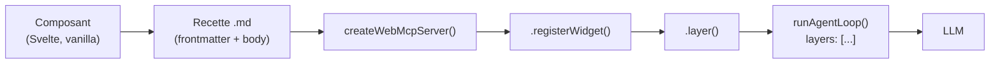
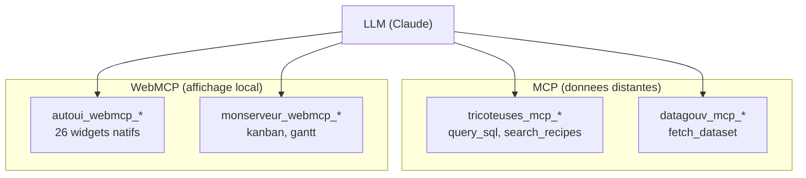
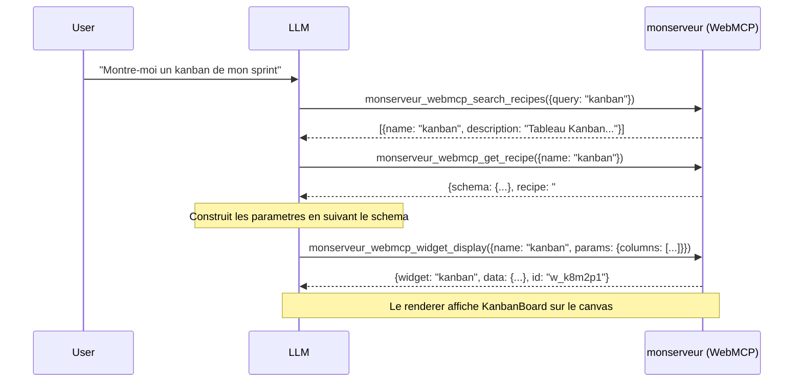
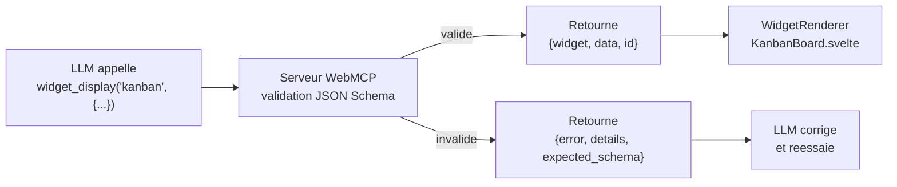

Ce tutoriel explique comment exposer vos propres widgets via le protocole WebMCP, de la creation du composant jusqu'a l'integration dans la boucle agent.

## Vue d'ensemble



Le pipeline complet part d'un composant UI, passe par une recette declarative, puis est enregistre dans un serveur WebMCP qui expose les outils au LLM.

---

## Etape 1 : Creer le composant

Le composant sera rendu sur le canvas quand le LLM appelle `widget_display`. Deux options selon votre approche.

### Option A : Svelte 5

```svelte
<!-- src/lib/widgets/KanbanBoard.svelte -->
<script lang="ts">
  interface Props {
    title?: string;
    columns: {
      name: string;
      cards: {
        title: string;
        description?: string;
        tag?: string;
      }[];
    }[];
  }

  let { title, columns }: Props = $props();
</script>

{#if title}
  <h3>{title}</h3>
{/if}

<div class="kanban">
  {#each columns as col}
    <div class="column">
      <h4>{col.name}</h4>
      {#each col.cards as card}
        <div class="card">
          <strong>{card.title}</strong>
          {#if card.description}<p>{card.description}</p>{/if}
          {#if card.tag}<span class="tag">{card.tag}</span>{/if}
        </div>
      {/each}
    </div>
  {/each}
</div>

<style>
  .kanban { display: flex; gap: 1rem; }
  .column { flex: 1; background: #1a1a2e; border-radius: 8px; padding: 0.75rem; }
  .card { background: #16213e; border-radius: 6px; padding: 0.5rem; margin-bottom: 0.5rem; }
  .tag { font-size: 0.75rem; color: #888; }
</style>
```

### Option B : Vanilla renderer

Un renderer vanilla est une fonction pure qui recoit un `HTMLElement` et des donnees, et retourne optionnellement une fonction de cleanup :

```typescript
// src/widgets/kanban.ts
export function render(
  container: HTMLElement,
  data: Record<string, unknown>,
): void | (() => void) {
  const { title, columns } = data as {
    title?: string;
    columns: { name: string; cards: { title: string }[] }[];
  };

  const wrapper = document.createElement('div');
  wrapper.style.display = 'flex';
  wrapper.style.gap = '1rem';

  for (const col of columns) {
    const colEl = document.createElement('div');
    colEl.innerHTML = `<h4>${col.name}</h4>`;
    for (const card of col.cards) {
      const cardEl = document.createElement('div');
      cardEl.textContent = card.title;
      colEl.appendChild(cardEl);
    }
    wrapper.appendChild(colEl);
  }

  container.appendChild(wrapper);

  return () => { container.innerHTML = ''; };
}
```

---

## Etape 2 : Ecrire la recette

La recette est un fichier Markdown avec un frontmatter YAML. C'est ce que le LLM lira pour savoir comment utiliser le widget.

```markdown
---
widget: kanban
description: Tableau Kanban avec colonnes et cartes. Gestion de projet, workflow, pipeline.
group: project
schema:
  type: object
  required:
    - columns
  properties:
    title:
      type: string
    columns:
      type: array
      items:
        type: object
        required:
          - name
          - cards
        properties:
          name:
            type: string
          cards:
            type: array
            items:
              type: object
              required:
                - title
              properties:
                title:
                  type: string
                description:
                  type: string
                tag:
                  type: string
---

## Quand utiliser

Pour afficher un workflow en colonnes : pipeline de recrutement, sprint board,
pipeline de vente, ou toute progression par etapes.

## Comment

Appeler widget_display('kanban', {columns: [{name: "A faire", cards: [{title: "Tache 1"}]}, {name: "En cours", cards: []}]}).

## Erreurs courantes

- Colonnes vides oubliees : toujours inclure les colonnes meme si elles n'ont pas de cartes (cards: [])
- Trop de colonnes : au-dela de 5 colonnes, la lisibilite baisse
```

Le frontmatter contient trois champs obligatoires :

| Champ         | Role                                                    |
|---------------|---------------------------------------------------------|
| `widget`      | Identifiant unique du widget (utilise dans widget_display) |
| `description` | Description courte pour le LLM (search_recipes)           |
| `schema`      | JSON Schema des parametres attendus par le composant       |

Le champ `group` est optionnel et sert au classement dans `search_recipes`.

Le body (apres `---`) contient les instructions libres pour le LLM : quand utiliser le widget, comment construire les parametres, et les erreurs a eviter.

---

## Etape 3 : Generer les schemas automatiquement

Si votre composant est en Svelte avec une `interface Props`, vous pouvez generer le JSON Schema automatiquement a partir des types TypeScript :

```bash
npm run sync:schemas
```

Ce script parse les `interface Props` des composants Svelte, les convertit en JSON Schema, et injecte le resultat dans le frontmatter de chaque recette `.md`. Cela evite de maintenir le schema manuellement.

Pour les renderers vanilla, le schema doit etre ecrit manuellement dans la recette.

---

## Etape 4 : Creer le serveur

```typescript
// src/lib/mon-serveur.ts
import { createWebMcpServer } from '@webmcp-auto-ui/core';
import KanbanBoard from './widgets/KanbanBoard.svelte';

// La recette peut etre importee en raw string (Vite)
import kanbanRecipe from './recipes/kanban.md?raw';

const monserveur = createWebMcpServer('monserveur', {
  description: 'Widgets de gestion de projet (kanban, gantt, ...)',
});
```

`createWebMcpServer` cree un serveur vide avec un nom et une description. Le nom sera utilise comme prefixe dans les outils (`monserveur_webmcp_*`).

---

## Etape 5 : Enregistrer le widget

```typescript
monserveur.registerWidget(kanbanRecipe, KanbanBoard);
```

`registerWidget` fait trois choses :
1. Parse le frontmatter pour extraire `widget`, `description` et `schema`
2. Stocke le composant comme renderer
3. Cree automatiquement les 4 outils built-in (au premier appel) :
   - `search_recipes` -- lister les widgets disponibles
   - `list_recipes` -- lister tous les widgets avec nom et description
   - `get_recipe` -- obtenir le schema + instructions d'un widget
   - `widget_display` -- afficher un widget sur le canvas

Vous pouvez enregistrer plusieurs widgets sur le meme serveur :

```typescript
import ganttRecipe from './recipes/gantt.md?raw';
import GanttChart from './widgets/GanttChart.svelte';

monserveur.registerWidget(kanbanRecipe, KanbanBoard);
monserveur.registerWidget(ganttRecipe, GanttChart);
```

---

## Etape 6 : Ajouter des outils custom (optionnel)

Vous pouvez ajouter des outils supplementaires au serveur. Ces outils apparaitront dans le meme namespace que les widgets :

```typescript
monserveur.addTool({
  name: 'move_card',
  description: 'Deplacer une carte entre colonnes du kanban.',
  inputSchema: {
    type: 'object',
    properties: {
      cardTitle: { type: 'string', description: 'Titre de la carte' },
      targetColumn: { type: 'string', description: 'Nom de la colonne cible' },
    },
    required: ['cardTitle', 'targetColumn'],
  },
  execute: async (params) => {
    const { cardTitle, targetColumn } = params as {
      cardTitle: string;
      targetColumn: string;
    };
    return {
      ok: true,
      message: `Carte "${cardTitle}" deplacee vers "${targetColumn}"`,
    };
  },
});
```

---

## Etape 7 : Connecter a la boucle agent

Appelez `.layer()` pour obtenir la couche de tools, puis passez-la a `runAgentLoop` :

```typescript
import { runAgentLoop, autoui } from '@webmcp-auto-ui/agent';

const layers = [
  autoui.layer(),        // widgets natifs (stat, chart, table, ...)
  monserveur.layer(),    // vos widgets custom
];

const result = await runAgentLoop(userMessage, {
  provider,
  layers,
});
```

Le prefixage des outils est automatique :

| Outil brut          | Nom expose au LLM                        |
|---------------------|-------------------------------------------|
| `search_recipes`    | `monserveur_webmcp_search_recipes`        |
| `get_recipe`        | `monserveur_webmcp_get_recipe`            |
| `widget_display`    | `monserveur_webmcp_widget_display`        |
| `move_card`         | `monserveur_webmcp_move_card`             |

Ce prefixage evite les collisions quand plusieurs serveurs (MCP + WebMCP) coexistent.

### Architecture multi-serveurs



---

## Etape 8 : Tester

### Verifier la decouverte

Dans le chat, demandez quelque chose qui declenche la recherche de recettes :

```
User: "Montre-moi un kanban de mon sprint"
```

Le LLM va suivre cette sequence :



### Le dispatch widget_display



### Verifier le rendu

Le resultat de `widget_display` contient un `id` (ex: `w_a3f2k1`). L'UI utilise ce retour pour :
1. Trouver le renderer (`KanbanBoard.svelte`) via `getWidget('kanban')`
2. Passer `data` comme props au composant
3. Afficher le widget sur le canvas

---

## Validation des parametres

Le serveur WebMCP valide automatiquement les parametres contre le JSON Schema avant de les passer au renderer. L'implementation utilise `validateJsonSchema` du package `@webmcp-auto-ui/core` :

```typescript
// Extrait de webmcp-server.ts — execute de widget_display
const rawParams = (params.params ?? {}) as Record<string, unknown>;
const validation = validateJsonSchema(rawParams, entry.inputSchema as JsonSchema);
if (!validation.valid) {
  return {
    error: 'Validation failed',
    details: validation.errors,
    expected_schema: entry.inputSchema,
  };
}
```

Si la validation echoue, le LLM recoit le schema attendu et peut corriger son appel au tour suivant.

---

## Sanitisation des URLs d'images

Le serveur WebMCP sanitise automatiquement les champs d'image (src, avatar, photo, thumbnail, etc.) pour supprimer les URLs hallucinees par le LLM. Seuls les prefixes valides sont acceptes : `http://`, `https://`, `data:`, `/`.

---

## Checklist

- [ ] Composant cree (Svelte ou vanilla)
- [ ] Recette `.md` avec frontmatter (`widget`, `description`, `schema`) + body
- [ ] `npm run sync:schemas` execute (si Svelte)
- [ ] `createWebMcpServer('nom', {description})`
- [ ] `server.registerWidget(recette, composant)`
- [ ] `server.addTool({...})` si besoin
- [ ] `layers: [..., server.layer()]`
- [ ] Tester : search_recipes --> get_recipe --> widget_display

## Voir aussi

- [Creer un widget custom](./create-custom-widget)
- [Architecture MCP / WebMCP](./architecture-mcp-webmcp)
- [Utiliser les widgets existants](./use-existing-widgets)
- [Package core](/packages/core)
