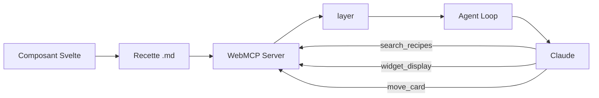
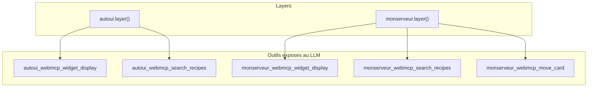
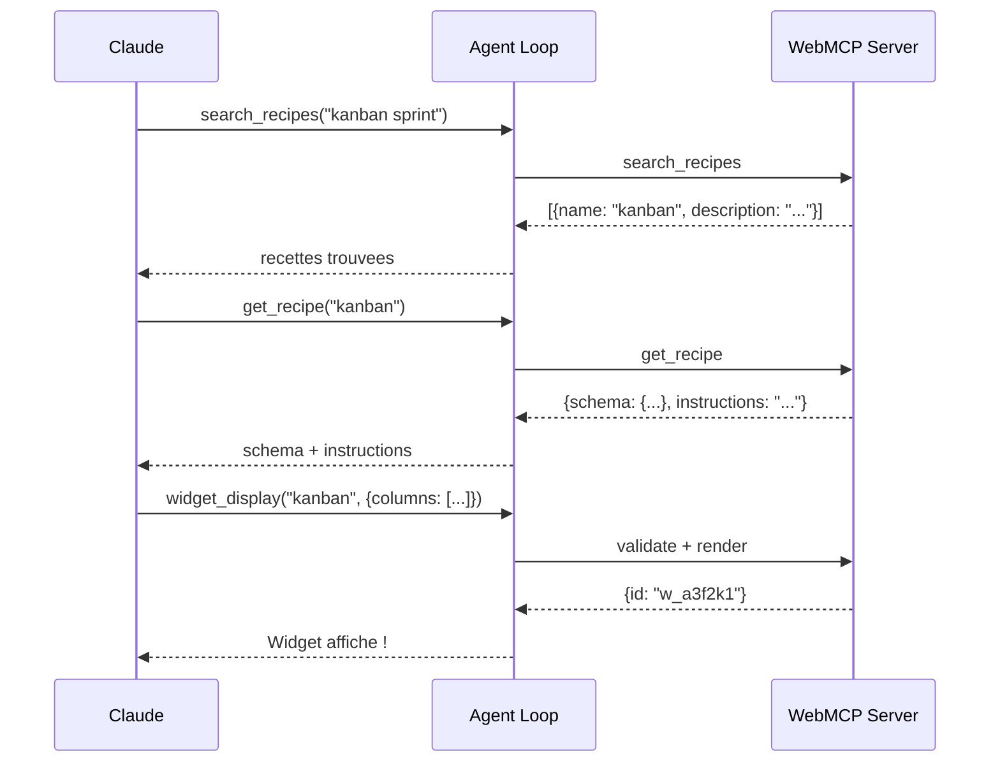

Vous voulez que le LLM utilise vos propres widgets de maniere autonome ? Ce tutoriel vous montre comment creer un serveur WebMCP complet : composant, recette, enregistrement, outils custom, et integration dans la boucle agent. A la fin, vos widgets seront aussi naturels a utiliser que les widgets natifs.

## Objectif

Creer un serveur WebMCP qui expose un widget Kanban, avec validation automatique, outils custom, et integration complete dans la boucle agent.

## Prerequis

- Le boilerplate est installe (voir [Demarrer avec le boilerplate](./boilerplate))
- Avoir lu [Creer un widget custom](./create-custom-widget) (recommande)
- Comprendre les bases du JSON Schema

## Resultat final

Un serveur WebMCP `monserveur` avec un widget Kanban que le LLM decouvre via `search_recipes`, lit via `get_recipe`, et affiche via `widget_display` -- avec validation automatique des parametres et un outil custom `move_card`.



---

## Etape 1 : Creer le composant

Le composant sera rendu sur le canvas quand le LLM appelle `widget_display`. Deux options sont disponibles.

### Option A : Svelte 5 (recommande)

Creez `src/lib/widgets/KanbanBoard.svelte` :

```svelte
<script lang="ts">
  interface Props {
    title?: string;
    columns: {
      name: string;
      cards: {
        title: string;
        description?: string;
        tag?: string;
      }[];
    }[];
  }

  let { title, columns }: Props = $props();
</script>

{#if title}
  <h3>{title}</h3>
{/if}

<div class="kanban">
  {#each columns as col}
    <div class="column">
      <h4>{col.name} <span class="count">({col.cards.length})</span></h4>
      {#each col.cards as card}
        <div class="card">
          <strong>{card.title}</strong>
          {#if card.description}<p>{card.description}</p>{/if}
          {#if card.tag}<span class="tag">{card.tag}</span>{/if}
        </div>
      {/each}
    </div>
  {/each}
</div>

<style>
  .kanban { display: flex; gap: 1rem; overflow-x: auto; }
  .column { flex: 1; min-width: 200px; background: var(--color-surface2, #1a1a2e); border-radius: 8px; padding: 0.75rem; }
  .card { background: var(--color-surface, #16213e); border-radius: 6px; padding: 0.5rem; margin-bottom: 0.5rem; }
  .tag { font-size: 0.75rem; color: var(--color-text2, #888); }
  .count { font-weight: normal; color: var(--color-text2, #888); font-size: 0.85em; }
</style>
```

Remarquez l'utilisation de variables CSS (`var(--color-surface2)`) pour respecter le theme actif.

### Option B : Renderer vanilla

Un renderer vanilla est une fonction pure qui recoit un `HTMLElement` et des donnees :

```typescript
// src/widgets/kanban.ts
export function render(
  container: HTMLElement,
  data: Record<string, unknown>,
): void | (() => void) {
  const { title, columns } = data as {
    title?: string;
    columns: { name: string; cards: { title: string }[] }[];
  };

  const wrapper = document.createElement('div');
  wrapper.style.display = 'flex';
  wrapper.style.gap = '1rem';

  for (const col of columns) {
    const colEl = document.createElement('div');
    colEl.innerHTML = `<h4>${col.name}</h4>`;
    for (const card of col.cards) {
      const cardEl = document.createElement('div');
      cardEl.textContent = card.title;
      colEl.appendChild(cardEl);
    }
    wrapper.appendChild(colEl);
  }

  container.appendChild(wrapper);
  // Retourner une fonction de cleanup (optionnel)
  return () => { container.innerHTML = ''; };
}
```

Le renderer vanilla utilise `mountWidget()` du package core pour etre monte dans un element DOM sans framework.

**Verification** : le composant compile sans erreur.

---

## Etape 2 : Ecrire la recette

La recette est le document que le LLM lit pour comprendre votre widget. Elle contient un frontmatter YAML (schema) et un body Markdown (instructions).

Creez `src/lib/recipes/kanban.md` :

```markdown
---
widget: kanban
description: Tableau Kanban avec colonnes et cartes. Gestion de projet, workflow, pipeline, sprint board.
group: project
schema:
  type: object
  required:
    - columns
  properties:
    title:
      type: string
      description: Titre optionnel du tableau
    columns:
      type: array
      items:
        type: object
        required:
          - name
          - cards
        properties:
          name:
            type: string
            description: Nom de la colonne
          cards:
            type: array
            items:
              type: object
              required:
                - title
              properties:
                title:
                  type: string
                description:
                  type: string
                tag:
                  type: string
---

## Quand utiliser

Pour afficher un workflow en colonnes : pipeline de recrutement, sprint board,
pipeline de vente, ou toute progression par etapes.

## Comment

Appeler widget_display('kanban', {columns: [{name: "A faire", cards: [{title: "Tache 1"}]}, {name: "En cours", cards: []}]}).

## Erreurs courantes

- Colonnes vides oubliees : toujours inclure les colonnes meme si elles n'ont pas de cartes (cards: [])
- Trop de colonnes : au-dela de 5 colonnes, la lisibilite baisse
```

Le frontmatter contient trois champs obligatoires :

| Champ | Role |
|-------|------|
| `widget` | Identifiant unique du widget (utilise dans `widget_display`) |
| `description` | Description courte pour le LLM (apparait dans `search_recipes`) |
| `schema` | JSON Schema des parametres attendus |

Le champ `group` est optionnel et sert au classement dans `search_recipes`.

Le body contient les instructions libres pour le LLM : quand utiliser, comment appeler, erreurs a eviter. Plus c'est precis, mieux le LLM utilisera votre widget.

:::caution[La description est votre SEO pour le LLM]
Le LLM choisit le widget en se basant sur la `description`. Incluez des synonymes et des cas d'usage varies.
:::

---

## Etape 3 : Generer les schemas automatiquement (optionnel)

Si votre composant est en Svelte avec une `interface Props`, vous pouvez generer le JSON Schema automatiquement :

```bash
npm run sync:schemas
```

Ce script parse les `interface Props`, les convertit en JSON Schema, et injecte le resultat dans le frontmatter de chaque recette. Cela evite de maintenir le schema manuellement.

Pour les renderers vanilla, le schema doit etre ecrit manuellement dans la recette.

---

## Etape 4 : Creer le serveur

```typescript
// src/lib/mon-serveur.ts
import { createWebMcpServer } from '@webmcp-auto-ui/core';
import KanbanBoard from './widgets/KanbanBoard.svelte';
import kanbanRecipe from './recipes/kanban.md?raw';

const monserveur = createWebMcpServer('monserveur', {
  description: 'Widgets de gestion de projet (kanban, gantt, ...)',
});
```

`createWebMcpServer` cree un serveur vide avec un nom et une description :
- Le **nom** sera utilise comme prefixe dans les outils (`monserveur_webmcp_*`)
- La **description** apparait dans le system prompt pour aider le LLM a choisir le bon serveur

**Verification** : `monserveur.listWidgets()` retourne un tableau vide (aucun widget enregistre encore).

---

## Etape 5 : Enregistrer le widget

```typescript
monserveur.registerWidget(kanbanRecipe, KanbanBoard);
```

`registerWidget` fait trois choses :
1. **Parse** le frontmatter pour extraire `widget`, `description` et `schema`
2. **Stocke** le composant comme renderer
3. **Cree automatiquement** les 4 outils built-in (au premier appel) :
   - `search_recipes` -- lister les widgets disponibles
   - `list_recipes` -- lister tous les widgets avec nom et description
   - `get_recipe` -- obtenir le schema + instructions d'un widget
   - `widget_display` -- afficher un widget sur le canvas

Vous pouvez enregistrer plusieurs widgets sur le meme serveur :

```typescript
import GanttChart from './widgets/GanttChart.svelte';
import ganttRecipe from './recipes/gantt.md?raw';

monserveur.registerWidget(kanbanRecipe, KanbanBoard);
monserveur.registerWidget(ganttRecipe, GanttChart);
```

**Verification** : `monserveur.listWidgets()` retourne `['kanban']` (ou `['kanban', 'gantt']`).

---

## Etape 6 : Ajouter des outils custom (optionnel)

Vous pouvez ajouter des outils supplementaires au serveur. Ils apparaitront dans le meme namespace que les widgets :

```typescript
monserveur.addTool({
  name: 'move_card',
  description: 'Deplacer une carte entre colonnes du kanban.',
  inputSchema: {
    type: 'object',
    properties: {
      cardTitle: { type: 'string', description: 'Titre de la carte' },
      targetColumn: { type: 'string', description: 'Nom de la colonne cible' },
    },
    required: ['cardTitle', 'targetColumn'],
  },
  execute: async (params) => {
    const { cardTitle, targetColumn } = params as {
      cardTitle: string;
      targetColumn: string;
    };
    // Logique metier ici
    return {
      ok: true,
      message: `Carte "${cardTitle}" deplacee vers "${targetColumn}"`,
    };
  },
});
```

Le LLM verra cet outil comme `monserveur_webmcp_move_card` et pourra l'appeler apres avoir affiche le kanban.

---

## Etape 7 : Connecter a la boucle agent

Appelez `.layer()` pour obtenir la couche de tools, puis passez-la a `runAgentLoop` :

```typescript
import { runAgentLoop, autoui } from '@webmcp-auto-ui/agent';

const layers = [
  autoui.layer(),        // widgets natifs (stat, chart, table, ...)
  monserveur.layer(),    // vos widgets custom
];

const result = await runAgentLoop(userMessage, {
  provider,
  layers,
});
```

Le prefixage des outils est automatique :

| Outil brut | Nom expose au LLM |
|------------|-------------------|
| `search_recipes` | `monserveur_webmcp_search_recipes` |
| `get_recipe` | `monserveur_webmcp_get_recipe` |
| `widget_display` | `monserveur_webmcp_widget_display` |
| `move_card` | `monserveur_webmcp_move_card` |

N'oubliez pas de passer le serveur au `WidgetRenderer` pour le rendu :

```svelte
<WidgetRenderer
  id={block.id}
  type={block.type}
  data={block.data}
  servers={[monserveur]}
/>
```



---

## Etape 8 : Tester

### Verifier la decouverte

Dans le chat, demandez quelque chose qui declenche la recherche de recettes :

```
User: "Montre-moi un kanban de mon sprint"
```

Le LLM va suivre cette sequence :



### Verifier le rendu

Le resultat de `widget_display` contient un `id` (ex: `w_a3f2k1`). L'UI utilise ce retour pour :
1. Trouver le renderer (`KanbanBoard.svelte`) via `getWidget('kanban')`
2. Passer `data` comme props au composant
3. Afficher le widget sur le canvas

**Verification** : le kanban s'affiche avec les colonnes et cartes generees par le LLM.

---

## Validation des parametres

Le serveur WebMCP valide automatiquement les parametres contre le JSON Schema avant de les passer au renderer :

```typescript
// Extrait de webmcp-server.ts -- execute de widget_display
const rawParams = (params.params ?? {}) as Record<string, unknown>;
const validation = validateJsonSchema(rawParams, entry.inputSchema as JsonSchema);
if (!validation.valid) {
  return {
    error: 'Validation failed',
    details: validation.errors,
    expected_schema: entry.inputSchema,
  };
}
```

Si la validation echoue, le LLM recoit le schema attendu et peut corriger son appel au tour suivant. Ce mecanisme d'auto-correction est transparent et fonctionne dans la majorite des cas.

:::note[Sanitisation des images]
Le serveur WebMCP sanitise automatiquement les champs d'image (src, avatar, photo, thumbnail) pour supprimer les URLs hallucinees par le LLM. Seuls les prefixes valides sont acceptes : `http://`, `https://`, `data:`, `/`.
:::

---

## Troubleshooting

| Probleme | Cause probable | Solution |
|----------|---------------|----------|
| Widget pas decouvert | La `description` dans la recette ne matche pas la requete | Enrichissez la description avec des synonymes |
| "Validation failed" | Le LLM envoie des params incompatibles | Ajoutez des `description` a chaque propriete du schema |
| Widget rendu comme JSON brut | Le serveur n'est pas passe au WidgetRenderer | Ajoutez `servers={[monserveur]}` |
| Outil custom non visible | L'outil est ajoute apres `layer()` | Appelez `addTool()` avant `layer()` |

---

## Checklist

- [ ] Composant cree (Svelte ou vanilla)
- [ ] Recette `.md` avec frontmatter (`widget`, `description`, `schema`) + body
- [ ] `npm run sync:schemas` execute (si Svelte)
- [ ] `createWebMcpServer('nom', {description})`
- [ ] `server.registerWidget(recette, composant)`
- [ ] `server.addTool({...})` si besoin
- [ ] `layers: [..., server.layer()]`
- [ ] Serveur passe au WidgetRenderer via `servers={[...]}`
- [ ] Test : search_recipes --> get_recipe --> widget_display

## Aller plus loin

- **Combiner MCP et WebMCP** : votre serveur WebMCP peut coexister avec des serveurs MCP distants dans les memes layers
- **Schema auto-genere** : utilisez `sync:schemas` pour ne jamais ecrire de schema manuellement
- **Composant interactif** : ajoutez le bus FONC pour les interactions cross-widgets

## Voir aussi

- [Creer un widget custom](./create-custom-widget)
- [Architecture MCP / WebMCP](./architecture-mcp-webmcp)
- [Utiliser les widgets existants](./use-existing-widgets)
- [Package core](/packages/core)
