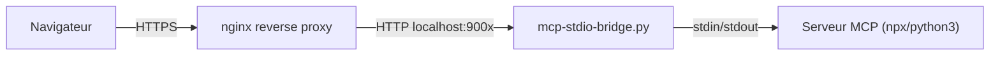
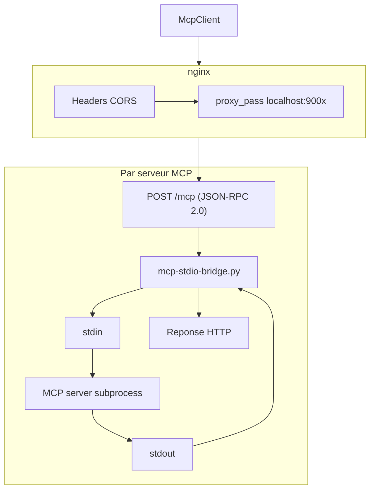
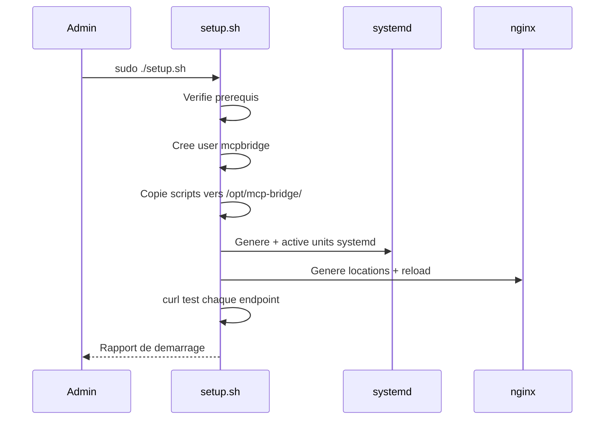

Les serveurs MCP communiquent par stdio (stdin/stdout), mais les navigateurs ont besoin d'endpoints HTTP. Ce tutoriel vous montre comment deployer les proxies qui font le pont, en local avec Docker ou en production avec systemd et nginx.

## Objectif

Deployer les proxies MCP pour rendre accessibles depuis le navigateur les serveurs MCP publics (NASA, HackerNews, Wikipedia, etc.).

## Prerequis

- Docker et Docker Compose installes (pour la methode rapide)
- Ou : une VM Ubuntu/Debian avec `python3`, `node`, `npm`, `nginx` (pour la production)
- Comprendre ce qu'est un serveur MCP (voir [Connecter un serveur MCP](./connect-mcp-server))

## Resultat final

Des serveurs MCP accessibles par HTTP, avec CORS configure, recettes injectees, et monitoring systemd.



---

## Architecture

Chaque bridge est un processus Python qui :
- Spawn le serveur MCP comme processus enfant communicant via stdio
- Accepte `POST /mcp` avec un body JSON-RPC 2.0
- Transmet au subprocess via stdin, lit la reponse sur stdout
- Gere le cycle de vie du subprocess (demarrage paresseux, redemarrage sur crash)
- Injecte optionnellement des outils "recettes" depuis un fichier JSON



---

## Methode rapide : Docker

Pour le developpement local, Docker Compose demarre tous les serveurs en une commande :

```bash
cd mcp-proxies
docker compose up -d
```

Tous les serveurs sont alors accessibles sur `localhost:9001` a `localhost:9008`.

Pour demarrer un seul serveur :

```bash
docker compose up -d hackernews
```

**Verification** : testez avec curl :

```bash
curl -s -X POST http://localhost:9006/mcp \
  -H 'Content-Type: application/json' \
  -d '{
    "jsonrpc": "2.0",
    "id": 1,
    "method": "initialize",
    "params": {
      "protocolVersion": "2024-11-05",
      "capabilities": {},
      "clientInfo": { "name": "test", "version": "1.0" }
    }
  }'
```

Une reponse valide contient `"result"` avec les capabilities du serveur.

:::tip[Developpement rapide]
En developpement, utilisez Docker. Ne passez a la methode VM que pour le deploiement en production.
:::

---

## Methode production : systemd + nginx

Pour un deploiement en production sur une VM Ubuntu/Debian :

```bash
cd mcp-proxies
sudo ./setup.sh
```

Le script est **idempotent** (il peut etre relance sans risque). Il effectue :

1. Verification des prerequis (`python3`, `node`, `npm`, `nginx`)
2. Creation d'un utilisateur systeme dedie `mcpbridge`
3. Copie des scripts bridge dans `/opt/mcp-bridge/`
4. Generation des fichiers unit systemd pour chaque serveur
5. Generation du bloc de locations nginx
6. Demarrage ou redemarrage de tous les services
7. Test de chaque endpoint avec curl



### Cle API NASA

Le proxy NASA necessite une variable d'environnement `NASA_API_KEY`. Definissez-la avant de lancer le setup :

```bash
export NASA_API_KEY="votre-cle-ici"
sudo -E ./setup.sh
```

:::caution[Ne pas oublier -E]
Le flag `-E` preserve les variables d'environnement dans le contexte sudo. Sans lui, `NASA_API_KEY` ne sera pas transmise au script.
:::

---

## Ajouter un nouveau serveur MCP

Pour ajouter un serveur MCP au systeme de proxies :

### 1. Creer le repertoire

```bash
mkdir mcp-proxies/servers/mon-serveur
```

### 2. Ajouter les fichiers de configuration

```
mcp-proxies/servers/mon-serveur/
  recipes.json    # Outils "recettes" injectes (optionnel)
  service.conf    # Configuration systemd (commande, port, env)
  README.md       # Documentation du serveur
  examples.md     # Exemples de prompts
```

Le fichier `service.conf` definit comment demarrer le serveur :

```ini
[Service]
ExecStart=npx -y @modelcontextprotocol/server-mon-serveur
Environment=PORT=9009
```

### 3. Creer les recettes (optionnel mais recommande)

Le fichier `recipes.json` injecte des outils de decouverte dans le serveur :

```json
[
  {
    "name": "guide-recherche",
    "description": "Comment chercher dans mon-serveur",
    "content": "## Recherche\\n\\nUtiliser search({query: 'mot-cle'})..."
  }
]
```

### 4. Relancer le setup

```bash
sudo ./setup.sh
```

**Verification** : le nouveau service apparait dans `systemctl status mcp-bridge-mon-serveur`.

---

## Tester un serveur

Envoyez une requete `initialize` pour verifier qu'un serveur repond :

```bash
curl -s -X POST http://localhost:9001/mcp \
  -H 'Content-Type: application/json' \
  -d '{
    "jsonrpc": "2.0",
    "id": 1,
    "method": "initialize",
    "params": {
      "protocolVersion": "2024-11-05",
      "capabilities": {},
      "clientInfo": { "name": "test", "version": "1.0" }
    }
  }'
```

Puis listez les outils :

```bash
curl -s -X POST http://localhost:9001/mcp \
  -H 'Content-Type: application/json' \
  -d '{
    "jsonrpc": "2.0",
    "id": 2,
    "method": "tools/list",
    "params": {}
  }'
```

---

## Connecter depuis une app webmcp-auto-ui

Une fois le proxy en marche, connectez-vous depuis votre app :

```typescript
import { McpClient } from '@webmcp-auto-ui/core';

// En developpement local
const client = new McpClient('http://localhost:9001/mcp');
await client.initialize();
const tools = await client.listTools();

// En production
const client = new McpClient('https://demos.hyperskills.net/mcp-metmuseum/mcp');
```

Pour gerer plusieurs serveurs simultanement :

```typescript
import { McpMultiClient } from '@webmcp-auto-ui/core';

const multi = new McpMultiClient();
await multi.addServer('https://demos.hyperskills.net/mcp-metmuseum/mcp');
await multi.addServer('https://demos.hyperskills.net/mcp-wikipedia/mcp');
```

---

## Systeme de recettes

Chaque serveur peut optionnellement inclure un fichier `recipes.json` qui injecte des outils de recettes (`list_recipes`, `get_recipe`, `search_recipes`) dans la liste d'outils du serveur MCP. Le bridge charge ces recettes au demarrage via le flag `--recipes`.

Les recettes permettent au LLM de decouvrir comment utiliser le serveur de maniere autonome, meme si le serveur MCP d'origine n'a pas de mecanisme de decouverte integre.

---

## Serveurs disponibles

| Serveur | Outils principaux | Port | URL production | Exemple de prompt |
|---------|-------------------|------|----------------|-------------------|
| hackernews | `get-front-page`, `search-posts` | 9006 | `/mcp-hackernews/mcp` | "Top 10 stories on HN today" |
| metmuseum | `search-museum-objects`, `get-museum-object` | 9001 | `/mcp-metmuseum/mcp` | "Show impressionist paintings" |
| openmeteo | `weather_forecast`, `geocoding` | 9002 | `/mcp-openmeteo/mcp` | "Weather in Paris this week" |
| wikipedia | `search`, `readArticle` | 9005 | `/mcp-wikipedia/mcp` | "Article about quantum computing" |
| inaturalist | `search_observations` | 9007 | `/mcp-inaturalist/mcp` | "Birds spotted near Lyon" |
| nasa | `nasa_apod`, `nasa_mars_rover`, `nasa_neo` | 9008 | `/mcp-nasa/mcp` | "Latest Mars rover photos" |
| datagouv | proxy distant (pas de bridge) | -- | `/mcp-datagouv/mcp` | "Transport datasets in France" |

Les URLs de production sont prefixees par `https://demos.hyperskills.net`.

:::note[Cas special : datagouv]
Le serveur `datagouv` n'utilise pas de bridge stdio mais un simple reverse proxy nginx vers un serveur MCP distant deja accessible en HTTP.
:::

---

## Structure des fichiers

```
mcp-proxies/
  bridge/
    mcp-stdio-bridge.py      # Le pont generique stdio-to-HTTP
    inaturalist-mcp.py        # Serveur MCP Python custom pour iNaturalist
  nginx/
    mcp-locations.conf        # Blocs location nginx (CORS + proxy_pass)
  servers/
    hackernews/               # Config et recettes par serveur
    metmuseum/
    openmeteo/
    wikipedia/
    inaturalist/
    nasa/
    datagouv/
  setup.sh                    # Script de provisioning VM
  docker-compose.yml          # Alternative Docker pour le dev local
```

---

## Troubleshooting

| Probleme | Cause probable | Solution |
|----------|---------------|----------|
| "Connection refused" | Le bridge n'est pas demarre | `systemctl status mcp-bridge-<nom>` |
| "CORS error" | Headers CORS manquants dans nginx | Verifiez `mcp-locations.conf` |
| Timeout au premier appel | Le serveur MCP met du temps a demarrer | Le bridge fait un demarrage paresseux, le premier appel est lent |
| "Invalid JSON-RPC" | Format de requete incorrect | Verifiez le body JSON-RPC 2.0 |
| Serveur qui crash en boucle | Dependance npm manquante | `journalctl -u mcp-bridge-<nom>` pour voir les logs |

---

## Aller plus loin

- **Creer un serveur MCP custom** : ecrivez votre propre serveur MCP en Node.js ou Python
- **Monitoring** : ajoutez des healthchecks systemd et des alertes
- **Securite** : ajoutez une authentification par token aux endpoints

## Voir aussi

- [Demarrer avec le boilerplate](./boilerplate)
- [Connecter un serveur MCP](./connect-mcp-server)
- [Architecture](/webmcp-auto-ui/guide/architecture)
