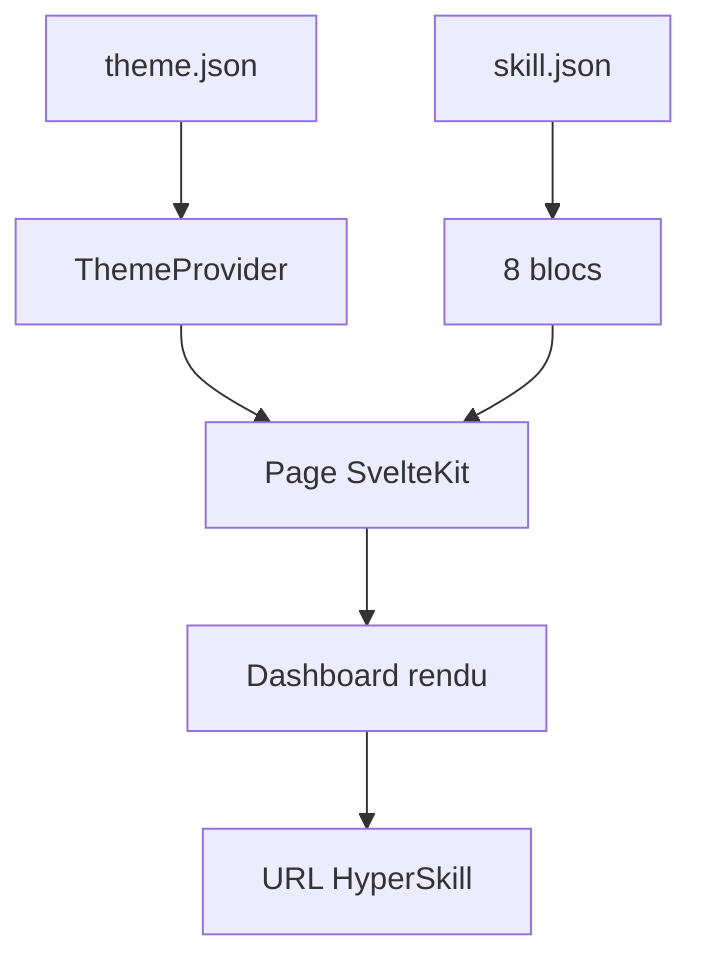
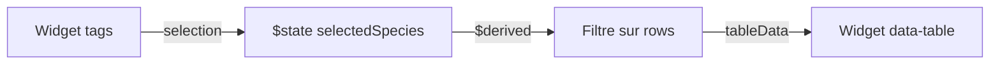
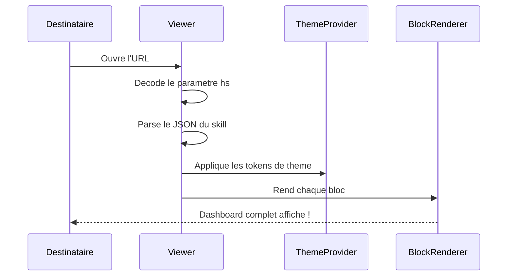

Les dashboards themees sont la vitrine de webmcp-auto-ui : une palette de couleurs, des widgets interconnectes, et une URL partageable. Ce tutoriel vous montre comment construire un "Nature Observatory" -- un tableau de bord de suivi de la faune dans une reserve naturelle.

## Objectif

Construire un dashboard theme complet avec 8 widgets, un theme clair/sombre, des interactions entre composants, et un export en URL HyperSkill partageable.

## Prerequis

- Le monorepo est clone et `npm install` a ete execute
- Les packages sont buildes (`npm run build` a la racine)
- Familiarite de base avec Svelte 5 et JSON
- Avoir lu [Utiliser les widgets existants](./use-existing-widgets)

## Resultat final

Un dashboard "Nature Observatory" avec 8 widgets (stats, graphique en aires, tableau, carte, timeline, profil), un theme nature vert/brun, du filtrage interactif, et une URL que n'importe qui peut ouvrir pour voir le dashboard.



---

## Etape 1 : Creer le theme

Un theme est un ensemble de **tokens CSS** qui definissent la palette de couleurs. Creez `apps/showcase/theme.json` :

```json
{
  "name": "nature-observatory",
  "tokens": {
    "color-bg":       "#f4f1eb",
    "color-surface":  "#ffffff",
    "color-surface2": "#ede8df",
    "color-border":   "rgba(101, 78, 50, 0.10)",
    "color-border2":  "rgba(101, 78, 50, 0.20)",
    "color-accent":   "#2d6a4f",
    "color-accent2":  "#bc4749",
    "color-amber":    "#b07d1e",
    "color-teal":     "#40916c",
    "color-text1":    "#2b2118",
    "color-text2":    "#7a6e5d"
  },
  "dark": {
    "color-bg":       "#1a1612",
    "color-surface":  "#252019",
    "color-surface2": "#302a21",
    "color-border":   "rgba(210, 190, 160, 0.10)",
    "color-border2":  "rgba(210, 190, 160, 0.20)",
    "color-accent":   "#52b788",
    "color-text1":    "#ede8df",
    "color-text2":    "#a89b88"
  }
}
```

Explication de la palette :
- **accent** (`#2d6a4f`) : vert foret profond pour les actions primaires
- **accent2** (`#bc4749`) : rouge chaud pour les alertes
- **teal** (`#40916c`) : vert clair pour les etats de succes
- **amber** (`#b07d1e`) : brun dore pour les avertissements
- **bg/surface** : blanc casse evoquant du parchemin
- **text** : brun fonce au lieu de noir pur

Les tokens `dark` remplacent les valeurs en mode sombre. Les tokens non specifies dans `dark` heritent de la version claire.

:::tip[Choisir ses couleurs]
Partez d'une couleur d'accent qui evoque votre theme (vert nature, bleu ocean, rouge pompier), puis derivez les autres couleurs avec des variations de saturation et de luminosite.
:::

**Verification** : le fichier est du JSON valide.

---

## Etape 2 : Creer le skill

Un **skill** definit les blocs a afficher avec leurs donnees. C'est un fichier JSON qui decrit le contenu du dashboard. Creez `apps/showcase/nature-observatory.skill.json` :

```json
{
  "name": "nature-observatory",
  "description": "Dashboard de suivi de la faune pour une reserve naturelle",
  "tags": ["nature", "wildlife", "dashboard"],
  "theme": {
    "color-bg": "#f4f1eb",
    "color-accent": "#2d6a4f",
    "color-accent2": "#bc4749"
  },
  "blocks": [
    {
      "type": "stat",
      "data": {
        "label": "Especes observees",
        "value": "347",
        "trend": "+12",
        "trendDir": "up"
      }
    },
    {
      "type": "stat",
      "data": {
        "label": "Observations cette semaine",
        "value": "1 204",
        "trend": "+8.3%",
        "trendDir": "up"
      }
    },
    {
      "type": "stat",
      "data": {
        "label": "Alertes especes menacees",
        "value": "3",
        "trend": "+1",
        "trendDir": "up"
      }
    },
    {
      "type": "chart-rich",
      "data": {
        "title": "Observations par mois",
        "type": "area",
        "labels": ["Jan", "Fev", "Mar", "Avr", "Mai", "Jun"],
        "data": [
          { "label": "Oiseaux", "values": [120, 145, 210, 320, 410, 380], "color": "#2d6a4f" },
          { "label": "Mammiferes", "values": [45, 52, 68, 95, 110, 102], "color": "#b07d1e" },
          { "label": "Reptiles", "values": [15, 18, 35, 55, 72, 68], "color": "#40916c" }
        ]
      }
    },
    {
      "type": "data-table",
      "data": {
        "title": "Observations recentes",
        "columns": [
          { "key": "species", "label": "Espece" },
          { "key": "location", "label": "Lieu" },
          { "key": "date", "label": "Date" },
          { "key": "observer", "label": "Observateur" },
          { "key": "status", "label": "Statut" }
        ],
        "rows": [
          { "species": "Buse a queue rousse", "location": "Crete Nord", "date": "2026-04-05", "observer": "A. Muir", "status": "Confirme" },
          { "species": "Loutre de riviere", "location": "Ruisseau des Saules", "date": "2026-04-05", "observer": "B. Carson", "status": "Confirme" },
          { "species": "Crotale des bois", "location": "Falaise Rocheuse", "date": "2026-04-04", "observer": "C. Leopold", "status": "En attente" },
          { "species": "Pygargue a tete blanche", "location": "Pointe de l'Aigle", "date": "2026-04-04", "observer": "A. Muir", "status": "Confirme" },
          { "species": "Ours noir", "location": "Vallon des Pins", "date": "2026-04-03", "observer": "D. Thoreau", "status": "Confirme" }
        ]
      }
    },
    {
      "type": "profile",
      "data": {
        "name": "Reserve de la Crete Nord",
        "subtitle": "Fondee en 1987 -- 5 000 hectares",
        "badge": { "text": "Active", "variant": "success" },
        "fields": [
          { "label": "Region", "value": "Hauts plateaux" },
          { "label": "Altitude", "value": "800-2 200m" },
          { "label": "Habitats", "value": "Foret, Zone humide, Alpin" }
        ],
        "stats": [
          { "label": "Especes", "value": "347" },
          { "label": "Observateurs", "value": "24" },
          { "label": "Observations", "value": "18.4K" }
        ]
      }
    },
    {
      "type": "map",
      "data": {
        "title": "Lieux d'observation",
        "center": { "lat": 35.6, "lng": -83.5 },
        "zoom": 10,
        "markers": [
          { "lat": 35.65, "lng": -83.48, "label": "Buse a queue rousse" },
          { "lat": 35.58, "lng": -83.52, "label": "Loutre de riviere" },
          { "lat": 35.62, "lng": -83.45, "label": "Pygargue a tete blanche" },
          { "lat": 35.55, "lng": -83.55, "label": "Ours noir" }
        ]
      }
    },
    {
      "type": "timeline",
      "data": {
        "title": "Activite de l'observatoire",
        "events": [
          { "date": "2026-04-05", "title": "Nidification confirmee", "description": "Couple de buses en nidification sur la Crete Nord", "status": "active" },
          { "date": "2026-04-03", "title": "Ours repere pres du sentier", "description": "Ours noir au Vallon des Pins, avis de prudence emis", "status": "done" },
          { "date": "2026-03-28", "title": "Debut de la migration", "description": "Premiere vague de passereaux migrateurs en zone humide", "status": "done" },
          { "date": "2026-03-15", "title": "Reseau de capteurs mis a jour", "description": "12 nouveaux pieges photographiques dans le secteur sud", "status": "done" }
        ]
      }
    }
  ]
}
```

Ce skill utilise 8 blocs : 3 stat pour les KPI, un graphique en aires, un tableau, une fiche profil, une carte et une timeline.

---

## Etape 3 : Monter la page SvelteKit

### 3a. Creer le repertoire

```bash
mkdir -p apps/showcase/src/routes/nature
```

### 3b. Creer la page

Creez `apps/showcase/src/routes/nature/+page.svelte` :

```svelte
<script lang="ts">
  import { ThemeProvider, BlockRenderer } from '@webmcp-auto-ui/ui';
  import themeJson from '../../../theme.json';
  import skillJson from '../../../nature-observatory.skill.json';
</script>

<ThemeProvider defaultMode="light" overrides={themeJson.tokens}>
  <div class="min-h-screen bg-bg p-6">
    <header class="max-w-6xl mx-auto mb-8">
      <h1 class="text-3xl font-bold text-text1">Nature Observatory</h1>
      <p class="text-text2 mt-1">Dashboard de suivi de la faune -- Reserve de la Crete Nord</p>
    </header>

    <main class="max-w-6xl mx-auto space-y-6">
      <!-- KPI : 3 blocs stat cote a cote -->
      <div class="grid grid-cols-1 md:grid-cols-3 gap-4">
        {#each skillJson.blocks.slice(0, 3) as block}
          <BlockRenderer type={block.type} data={block.data} />
        {/each}
      </div>

      <!-- Graphique en aires -->
      <BlockRenderer type={skillJson.blocks[3].type} data={skillJson.blocks[3].data} />

      <!-- Tableau de donnees -->
      <BlockRenderer type={skillJson.blocks[4].type} data={skillJson.blocks[4].data} />

      <!-- Grille 2 colonnes : profil + carte -->
      <div class="grid grid-cols-1 md:grid-cols-2 gap-4">
        <BlockRenderer type={skillJson.blocks[5].type} data={skillJson.blocks[5].data} />
        <BlockRenderer type={skillJson.blocks[6].type} data={skillJson.blocks[6].data} />
      </div>

      <!-- Timeline -->
      <BlockRenderer type={skillJson.blocks[7].type} data={skillJson.blocks[7].data} />
    </main>
  </div>
</ThemeProvider>
```

`ThemeProvider` injecte les tokens CSS sous forme de variables (`--color-bg`, `--color-accent`, etc.) que tous les widgets natifs utilisent. Les classes UnoCSS (`bg-bg`, `text-text1`) sont des alias vers ces variables.

### 3c. Lancer le serveur de dev

```bash
npm -w apps/showcase run dev
```

Ouvrez `http://localhost:5177/nature` dans le navigateur.

**Verification** : le dashboard complet s'affiche avec le theme nature applique. Les 8 widgets sont visibles.

---

## Etape 4 : Interactions entre composants

Pour relier les blocs entre eux sans passer par l'agent, utilisez l'etat reactif Svelte. Voici un exemple de filtrage du tableau par espece :

```svelte
<script lang="ts">
  import { BlockRenderer } from '@webmcp-auto-ui/ui';

  let selectedSpecies = $state('all');
  let allRows = skillJson.blocks[4].data.rows;

  let tableData = $derived(
    selectedSpecies === 'all'
      ? skillJson.blocks[4].data
      : {
          ...skillJson.blocks[4].data,
          rows: allRows.filter(r => r.species === selectedSpecies),
        }
  );
</script>

<!-- Bloc tags pour le filtrage -->
<BlockRenderer
  type="tags"
  data={{
    label: "Filtrer par espece",
    tags: [
      { text: "Toutes", active: selectedSpecies === 'all' },
      { text: "Buse a queue rousse", active: selectedSpecies === 'Buse a queue rousse' },
      { text: "Loutre de riviere", active: selectedSpecies === 'Loutre de riviere' },
      { text: "Pygargue a tete blanche", active: selectedSpecies === 'Pygargue a tete blanche' },
    ]
  }}
/>

<!-- Tableau filtre -->
<BlockRenderer type="data-table" data={tableData} />
```



Ce pattern permet de construire des dashboards interactifs ou la selection d'un tag filtre le tableau, le clic sur un marqueur de carte met en evidence une ligne, etc.

---

## Etape 5 : Exporter en URL HyperSkill

Une fois le dashboard pret, exportez-le en URL portable que n'importe qui peut ouvrir -- sans serveur, sans installation.

```typescript
import { encode } from '@webmcp-auto-ui/sdk';

const skill = {
  version: '1.0',
  name: 'nature-observatory',
  description: 'Dashboard de suivi de la faune',
  theme: themeJson.tokens,
  blocks: skillJson.blocks,
};

const shareUrl = await encode(
  'https://demos.hyperskills.net/viewer',
  JSON.stringify(skill),
);

console.log(shareUrl);
// N'importe qui peut ouvrir cette URL pour voir le dashboard
```

### Fonctionnement de l'URL

```
https://demos.hyperskills.net/viewer?hs=eyJ2ZXJzaW9uIjoiMS4wI...
                                        ^^^^^^^^^^^^^^^^^^^^^^^^^
                                        base64(JSON.stringify(skill))
                                        ou gz.base64(gzip(...)) si > 6 KB
```



:::tip[Partage sans serveur]
Les URLs HyperSkill sont autonomes : toutes les donnees du dashboard sont encodees dans l'URL. Pas besoin de base de donnees, pas besoin de backend. Le Viewer est une app statique.
:::

---

## Etape 6 : Deployer

Pour pousser votre demo en production :

```bash
./scripts/deploy.sh showcase
```

Le script gere le build des packages, le build de l'app, le nettoyage des anciens fichiers, la copie au bon endroit, et la verification d'integrite.

---

## Troubleshooting

| Probleme | Cause probable | Solution |
|----------|---------------|----------|
| Theme non applique | `ThemeProvider` absent ou mal configure | Verifiez que `overrides={themeJson.tokens}` est present |
| Mode sombre ne fonctionne pas | Tokens `dark` absents du theme.json | Ajoutez la section `dark` dans le fichier theme |
| Carte invisible | La librairie Leaflet n'est pas chargee | Verifiez que le build inclut la feuille de style Leaflet |
| URL HyperSkill trop longue | Trop de donnees dans le skill | Les donnees > 6 KB sont automatiquement compressees en gzip |

---

## Resume

Ce que nous avons construit :
1. Une palette de couleurs nature dans `theme.json`
2. Un skill avec 8 blocs (stats, graphique, tableau, profil, carte, timeline)
3. Une page SvelteKit avec `ThemeProvider` et `BlockRenderer`
4. Du filtrage interactif entre composants
5. Une URL HyperSkill partageable
6. Un deploiement en production

Le meme pattern fonctionne pour n'importe quel theme et n'importe quelle combinaison des 26+ types de widgets disponibles.

## Aller plus loin

- **Theme generatif** : demandez a l'agent de generer le theme a partir d'une description ("theme cyberpunk neon")
- **Dashboard dynamique** : remplacez le skill JSON statique par des donnees fetches depuis une API
- **Widgets custom** : ajoutez vos propres widgets pour des visualisations specifiques a votre domaine

## Voir aussi

- [Demarrer avec le boilerplate](./boilerplate)
- [Creer un widget custom](./create-custom-widget)
- [Utiliser les widgets existants](./use-existing-widgets)
- [Deploiement](/webmcp-auto-ui/guide/deploy)
