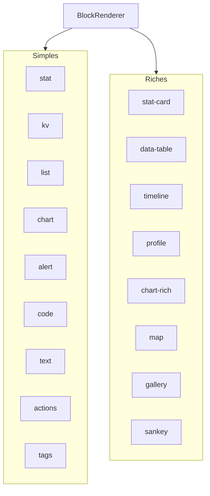
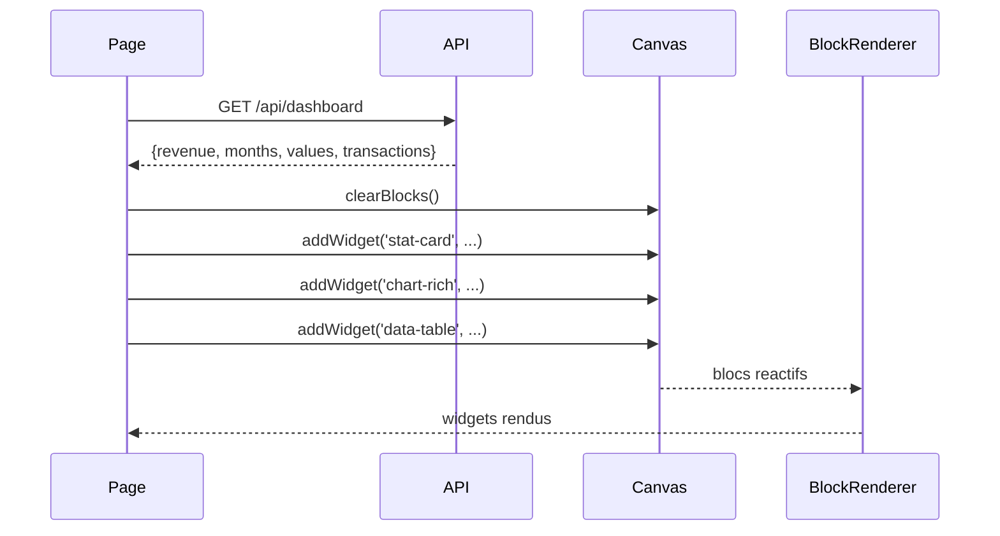

WebMCP Auto-UI fournit plus de 26 types de widgets prets a l'emploi. Ce tutoriel vous montre comment les utiliser, les personnaliser et les faire interagir entre eux. Pas besoin de creer quoi que ce soit : tout est deja la.

## Objectif

Decouvrir et utiliser les widgets natifs de WebMCP Auto-UI pour construire des interfaces riches sans ecrire de composants custom.

## Prerequis

- Le boilerplate est installe (voir [Demarrer avec le boilerplate](./boilerplate))
- Comprendre les bases de Svelte 5 (`$state`, `{#each}`)

## Resultat final

Un tableau de bord interactif utilisant stat, chart-rich, data-table, timeline et profile -- le tout avec mises a jour dynamiques et gestion des interactions.

---

## Catalogue des widgets

### Widgets simples

Ces widgets sont legers, rapides a rendre, et couvrent les cas d'usage les plus courants :

| Widget | Description | Utilisation typique |
|--------|-------------|---------------------|
| `stat` | Statistique cle (KPI) | Chiffre avec tendance |
| `kv` | Paires cle-valeur | Metadonnees, proprietes |
| `list` | Liste ordonnee | Elements textuels |
| `chart` | Graphique a barres simple | Comparaisons rapides |
| `alert` | Notification/alerte | Messages importants |
| `code` | Bloc de code avec coloration | Extraits de code |
| `text` | Paragraphe de texte | Contenu redige |
| `actions` | Boutons d'action | Appels a l'action |
| `tags` | Badges/etiquettes | Filtres, categories |

### Widgets riches

Ces widgets sont plus complexes et offrent des interactions avancees :

| Widget | Description | Utilisation typique |
|--------|-------------|---------------------|
| `stat-card` | KPI enrichi avec delta et couleur | Dashboard financier |
| `data-table` | Tableau triable avec colonnes | Listes de donnees |
| `timeline` | Chronologie d'evenements | Historique de projet |
| `profile` | Fiche profil avec avatar | Page de contact |
| `trombinoscope` | Grille de portraits | Equipes |
| `json-viewer` | Arbre JSON interactif | Debug, API |
| `hemicycle` | Composition parlementaire | Politique |
| `chart-rich` | Multi-series (bar, line, area, pie) | Analyses comparatives |
| `cards` | Grille de cartes | Catalogues |
| `grid-data` | Grille avec highlights | Matrices |
| `sankey` | Diagramme de flux | Flux financiers |
| `map` | Carte Leaflet interactive | Geolocalisation |
| `log` | Flux de logs | Monitoring |
| `gallery` | Galerie d'images avec lightbox | Portfolios |
| `carousel` | Diaporama de slides | Presentations |
| `d3` | Visualisations D3.js | Graphiques avances |
| `js-sandbox` | Sandbox JavaScript custom | Code interactif |



---

## Etape 1 : Importer BlockRenderer

Le composant `BlockRenderer` est le point d'entree pour afficher n'importe quel widget. Il resout automatiquement le composant Svelte correspondant au `type` du widget :

```svelte
<script lang="ts">
  import { BlockRenderer } from '@webmcp-auto-ui/ui';
  import { canvas } from '@webmcp-auto-ui/sdk/canvas';
</script>
```

`BlockRenderer` prend trois props principales :
- `type` : le nom du widget (`'stat'`, `'data-table'`, etc.)
- `data` : les donnees au format attendu par le widget
- `id` : (optionnel) identifiant unique pour les interactions

---

## Etape 2 : Creer des widgets programmatiquement

Le store `canvas` fournit des methodes pour ajouter des widgets :

```svelte
<script lang="ts">
  function addStatWidget() {
    canvas.addWidget('stat', {
      label: 'Total des ventes',
      value: '12 450 EUR',
      trend: '+12%',
      trendDir: 'up',
    });
  }

  function addChartWidget() {
    canvas.addWidget('chart', {
      title: 'Ventes mensuelles',
      bars: [
        ['Janvier', 120],
        ['Fevrier', 190],
        ['Mars', 150],
      ],
    });
  }

  function addTableWidget() {
    canvas.addWidget('data-table', {
      title: 'Clients actifs',
      columns: [
        { key: 'name', label: 'Nom' },
        { key: 'email', label: 'Email' },
        { key: 'status', label: 'Statut' },
      ],
      rows: [
        { name: 'Alice Dupont', email: 'alice@example.com', status: 'Actif' },
        { name: 'Bob Martin', email: 'bob@example.com', status: 'Suspendu' },
        { name: 'Charlie Lenoir', email: 'charlie@example.com', status: 'Actif' },
      ],
    });
  }
</script>

<button onclick={addStatWidget}>Ajouter KPI</button>
<button onclick={addChartWidget}>Ajouter graphique</button>
<button onclick={addTableWidget}>Ajouter tableau</button>
```

**Verification** : cliquez sur chaque bouton et verifiez que le widget correspondant s'affiche.

---

## Etape 3 : Afficher les widgets

Parcourez les blocs du canvas et rendez-les avec `BlockRenderer` :

```svelte
<div class="widgets-grid">
  {#each canvas.blocks as block (block.id)}
    <BlockRenderer
      id={block.id}
      type={block.type}
      data={block.data}
    />
  {/each}
</div>

<style>
  .widgets-grid {
    display: grid;
    grid-template-columns: repeat(auto-fit, minmax(300px, 1fr));
    gap: 1rem;
    padding: 1rem;
  }
</style>
```

:::tip[Responsive par defaut]
Utilisez `grid-template-columns: repeat(auto-fit, minmax(300px, 1fr))` pour une grille responsive qui s'adapte a la largeur de l'ecran.
:::

---

## Galerie des widgets courants avec exemples

### KPI enrichi (`stat-card`)

Un KPI avec delta, unite et variante coloree :

```svelte
<script lang="ts">
  function addKpi() {
    canvas.addWidget('stat-card', {
      label: 'Taux de conversion',
      value: '3.2',
      unit: '%',
      trend: 'up',
      delta: '+0.5%',
      variant: 'success',   // 'success' | 'warning' | 'danger' | 'info'
    });
  }
</script>
```

Les variantes colorees disponibles : `success` (vert), `warning` (orange), `danger` (rouge), `info` (bleu).

### Graphique multi-series (`chart-rich`)

5 types de graphiques en un seul widget :

```svelte
<script lang="ts">
  function addRichChart() {
    canvas.addWidget('chart-rich', {
      title: 'Performance trimestrielle',
      type: 'bar',  // 'bar' | 'line' | 'area' | 'pie' | 'donut'
      labels: ['Q1', 'Q2', 'Q3', 'Q4'],
      data: [
        {
          label: 'Ventes',
          values: [120, 190, 150, 180],
          color: '#3b82f6',
        },
        {
          label: 'Benefice',
          values: [80, 140, 110, 150],
          color: '#10b981',
        },
      ],
    });
  }
</script>
```

:::tip[Changer de type dynamiquement]
Le meme jeu de donnees peut etre affiche en barres, lignes, aires ou camembert. Changez juste la propriete `type`.
:::

### Chronologie (`timeline`)

Une liste d'evenements ordonnes dans le temps :

```svelte
<script lang="ts">
  function addTimeline() {
    canvas.addWidget('timeline', {
      title: 'Historique du projet',
      events: [
        {
          title: 'Demarrage',
          date: '2024-01-15',
          status: 'done',        // 'done' | 'active' | 'pending'
          description: 'Projet lance',
        },
        {
          title: 'Premiere version',
          date: '2024-02-28',
          status: 'done',
          description: 'MVP livre',
        },
        {
          title: 'Optimisations',
          date: '2024-04-01',
          status: 'active',
          description: 'Phase d\'amelioration en cours',
        },
        {
          title: 'Lancement public',
          date: '2024-05-01',
          status: 'pending',
          description: 'Prevu',
        },
      ],
    });
  }
</script>
```

### Fiche profil (`profile`)

Une fiche contact avec champs et statistiques :

```svelte
<script lang="ts">
  function addProfile() {
    canvas.addWidget('profile', {
      name: 'Alice Dupont',
      subtitle: 'Senior Developer',
      badge: { text: 'En ligne', variant: 'success' },
      fields: [
        { label: 'Equipe', value: 'Backend' },
        { label: 'Localisation', value: 'Paris, France' },
        { label: 'Depuis', value: '2021' },
      ],
      stats: [
        { label: 'Projets', value: '12' },
        { label: 'Contributeurs', value: '45' },
      ],
    });
  }
</script>
```

### Tableau interactif (`data-table`)

Un tableau triable avec colonnes alignables :

```svelte
<script lang="ts">
  function addTable() {
    canvas.addWidget('data-table', {
      title: 'Liste des articles',
      columns: [
        { key: 'title', label: 'Titre', align: 'left' },
        { key: 'category', label: 'Categorie', align: 'center' },
        { key: 'views', label: 'Vues', align: 'right' },
      ],
      rows: [
        { title: 'Introduction a Svelte', category: 'Tutorial', views: 1250 },
        { title: 'WebMCP Best Practices', category: 'Guide', views: 890 },
      ],
    });
  }
</script>
```

### Carte interactive (`map`)

Une carte Leaflet avec marqueurs :

```svelte
<script lang="ts">
  function addMap() {
    canvas.addWidget('map', {
      title: 'Bureaux en France',
      center: { lat: 46.6, lng: 2.3 },
      zoom: 6,
      markers: [
        { lat: 48.86, lng: 2.35, label: 'Paris (siege)' },
        { lat: 43.60, lng: 1.44, label: 'Toulouse' },
        { lat: 45.76, lng: 4.84, label: 'Lyon' },
      ],
    });
  }
</script>
```

### Galerie d'images (`gallery`)

Une galerie avec lightbox integre :

```svelte
<script lang="ts">
  function addGallery() {
    canvas.addWidget('gallery', {
      title: 'Portfolio',
      images: [
        {
          src: 'https://example.com/img1.jpg',
          alt: 'Projet 1',
          caption: 'Interface de gestion',
        },
        {
          src: 'https://example.com/img2.jpg',
          alt: 'Projet 2',
          caption: 'Dashboard analytique',
        },
      ],
      columns: 2,
    });
  }
</script>
```

### Bloc de code (`code`)

Code avec coloration syntaxique :

```svelte
<script lang="ts">
  function addCode() {
    canvas.addWidget('code', {
      lang: 'typescript',
      content: `interface User {
  id: number;
  name: string;
  email: string;
}

const user: User = {
  id: 1,
  name: 'Alice',
  email: 'alice@example.com',
};`,
    });
  }
</script>
```

### Arbre JSON (`json-viewer`)

Un viewer interactif pour explorer des structures JSON :

```svelte
<script lang="ts">
  function addJsonViewer() {
    canvas.addWidget('json-viewer', {
      title: 'Structure de donnees',
      data: {
        user: {
          id: 123,
          name: 'Alice',
          tags: ['admin', 'developer'],
          meta: { created: '2024-01-01', visits: 456 },
        },
      },
      maxDepth: 3,
      expanded: true,
    });
  }
</script>
```

---

## Gestion des interactions

Certains widgets emettent des evenements quand l'utilisateur interagit. Utilisez la prop `oninteract` pour les capturer :

```svelte
<script lang="ts">
  function handleWidgetInteraction(
    type: string,
    action: string,
    payload: unknown
  ) {
    console.log(`Widget ${type} -- action: ${action}`, payload);
  }
</script>

<BlockRenderer
  id={block.id}
  type={block.type}
  data={block.data}
  oninteract={handleWidgetInteraction}
/>
```

Evenements emis par les widgets :

| Widget | Action | Payload |
|--------|--------|---------|
| `data-table` | `rowclick` | Objet de la ligne cliquee |
| `timeline` | `eventclick` | Objet de l'evenement |
| `cards` | `cardclick` | Objet de la carte |
| `gallery` | `imageclick` | `{image, index}` |
| `tags` | `tagclick` | `{tag, index}` |
| `actions` | `click` | `{action, index}` |

---

## Mises a jour dynamiques

Modifiez un widget apres sa creation avec les methodes du canvas :

```svelte
<script lang="ts">
  // Mettre a jour les donnees d'un widget existant
  function updateStat(blockId: string) {
    canvas.updateBlock(blockId, {
      value: '15 000 EUR',
      trend: '+20%',
      trendDir: 'up',
    });
  }

  // Supprimer un widget
  function removeWidget(blockId: string) {
    canvas.removeBlock(blockId);
  }

  // Tout effacer
  function clearAll() {
    canvas.clearBlocks();
  }
</script>

<button onclick={() => updateStat('b_123')}>Mettre a jour le KPI</button>
<button onclick={clearAll}>Tout effacer</button>
```

:::note[Reactivite automatique]
Les mises a jour via `canvas.updateBlock()` declenchent automatiquement le re-rendu du composant Svelte concerne.
:::

---

## Theme et personnalisation

Enveloppez vos widgets dans un `ThemeProvider` pour appliquer un theme coherent :

```svelte
<script lang="ts">
  import { ThemeProvider } from '@webmcp-auto-ui/ui';
</script>

<ThemeProvider defaultMode="light" overrides={{
  'color-accent': '#2d6a4f',
  'color-bg': '#f4f1eb',
}}>
  <div class="widgets-grid">
    {#each canvas.blocks as block (block.id)}
      <BlockRenderer id={block.id} type={block.type} data={block.data} />
    {/each}
  </div>
</ThemeProvider>
```

Tous les widgets natifs respectent les tokens de theme. Changer `color-accent` modifie la couleur d'accent dans tous les graphiques, barres de progression, et boutons.

---

## Cas d'usage complet : Tableau de bord dynamique

Voici un exemple complet qui charge des donnees depuis une API et construit un dashboard :

```svelte
<script lang="ts">
  import { BlockRenderer } from '@webmcp-auto-ui/ui';
  import { canvas } from '@webmcp-auto-ui/sdk/canvas';
  import { onMount } from 'svelte';

  function buildDashboard(data: any) {
    canvas.clearBlocks();

    // KPI principal
    canvas.addWidget('stat-card', {
      label: 'Revenu mensuel',
      value: data.revenue.toLocaleString('fr-FR'),
      unit: 'EUR',
      trend: 'up',
      variant: 'success',
    });

    // Graphique de tendance
    canvas.addWidget('chart-rich', {
      title: 'Tendance',
      type: 'line',
      labels: data.months,
      data: [{ label: 'Revenus', values: data.values }],
    });

    // Tableau des transactions
    canvas.addWidget('data-table', {
      title: 'Dernieres transactions',
      columns: [
        { key: 'date', label: 'Date' },
        { key: 'amount', label: 'Montant' },
        { key: 'status', label: 'Statut' },
      ],
      rows: data.transactions,
    });
  }

  onMount(async () => {
    const data = await fetch('/api/dashboard').then(r => r.json());
    buildDashboard(data);
  });
</script>

<div class="dashboard">
  {#each canvas.blocks as block (block.id)}
    <BlockRenderer id={block.id} type={block.type} data={block.data} />
  {/each}
</div>

<style>
  .dashboard {
    display: grid;
    grid-template-columns: repeat(auto-fit, minmax(350px, 1fr));
    gap: 1.5rem;
    padding: 2rem;
  }
</style>
```



---

## Troubleshooting

| Probleme | Cause probable | Solution |
|----------|---------------|----------|
| Widget affiche comme JSON brut | Type non reconnu | Verifiez l'orthographe du `type` (ex: `data-table`, pas `datatable`) |
| Tableau sans donnees | `rows` est vide ou absent | Assurez-vous que `rows` est un tableau d'objets |
| Graphique invisible | `labels` ou `data` manquants | Les deux proprietes sont obligatoires pour `chart-rich` |
| Theme non applique | `ThemeProvider` absent | Enveloppez vos widgets dans un `<ThemeProvider>` |

---

## Aller plus loin

- **Creer vos propres widgets** : suivez [Creer un widget custom](./create-custom-widget)
- **Themes avances** : decouvrez [Construire une demo themee](./themed-demo)
- **Interactions cross-widgets** : utilisez le bus FONC ou les filtres reactifs Svelte pour relier les widgets entre eux

## Voir aussi

- [Creer un widget custom](./create-custom-widget)
- [Connecter un serveur MCP](./connect-mcp-server)
- [Catalogue des widgets](/webmcp-auto-ui/concepts/ui-widgets)
