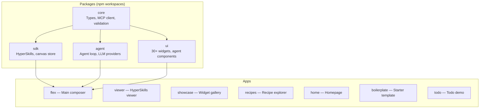

This guide documents the patterns to follow and the pitfalls to avoid when contributing to WebMCP Auto-UI. It is updated as production incidents occur -- every rule corresponds to an actual bug, not a theoretical convention.

## Monorepo Structure



### Core Rule: Reuse Packages

Before writing code in an app (`apps/*`), check whether the functionality already exists in a package. The table below lists available imports:

| Need | Import | Package |
|------|--------|---------|
| WebMCP server | `createWebMcpServer` | `core` |
| MCP client | `McpClient`, `McpMultiClient` | `core` |
| JSON Schema validation | `validateJsonSchema` | `core` |
| Vanilla widget mounting | `mountWidget` | `core` |
| Agent loop | `runAgentLoop` | `agent` |
| Remote LLM provider | `RemoteLLMProvider` | `agent` |
| Gemma provider | `WasmProvider` | `agent` |
| Ollama provider | `LocalLLMProvider` | `agent` |
| Discovery tools | `buildDiscoveryTools`, `activateServerTools` | `agent` |
| Canonical resolution | `resolveCanonicalTools`, `toolAliasMap` | `agent` |
| Token tracking | `TokenTracker` | `agent` |
| Nano-RAG | `ContextRAG` | `agent` |
| LLM selector | `<LLMSelector>` | `ui` |
| Gemma loader | `<ModelLoader>` | `ui` |
| MCP status | `<McpStatus>` | `ui` |
| Agent progress | `<AgentProgress>` | `ui` |
| Widget rendering | `<WidgetRenderer>`, `<BlockRenderer>` | `ui` |
| FONC message bus | `bus` | `ui` |
| HyperSkill encoding | `encode`, `decode` | `sdk` |
| Canvas store | `canvas` via `@webmcp-auto-ui/sdk/canvas` | `sdk` |

:::caution[Never duplicate]
If a feature exists in a package, import it. If it does not exist but should, propose adding it to the package -- not as inline code in the app.
:::

## Svelte 5 -- Reactivity

The following rules come from real production bugs. Each rule is illustrated with the faulty code and the correct version.

### Rule 1: An `$effect` must not read AND write the same state

**Symptom**: `effect_update_depth_exceeded` in the console, the entire page freezes (buttons unresponsive, modals will not open).

**Cause**: Svelte 5 re-runs an `$effect` every time one of its reactive dependencies changes. If the effect writes a value it also reads, it re-triggers itself -- infinite loop -- stops after 5 iterations.

```svelte
<!-- WRONG -- reads gemmaStatus AND writes it -->
$effect(() => {
  const llm = canvas.llm;
  if (gemmaStatus === 'ready') {   // reads gemmaStatus → tracked
    gemmaStatus = 'idle';          // writes gemmaStatus → re-run!
  }
  canvas.addMsg('system', llm);
});

<!-- CORRECT -- untrack() for non-triggering reads -->
import { untrack } from 'svelte';

$effect(() => {
  const llm = canvas.llm;         // only tracked dependency
  untrack(() => {
    if (gemmaStatus === 'ready') { // read but not tracked
      gemmaStatus = 'idle';
    }
    canvas.addMsg('system', llm);
  });
});
```

**Rule**: isolate the dependencies that should trigger re-runs, and wrap everything else in `untrack()`.

---

### Rule 2: Prefer `$derived` over `$effect` + `$state` for computed values

```svelte
<!-- WRONG -- $state written in a $effect -->
let paletteOpen = $state(true);
$effect(() => { paletteOpen = canvas.mode === 'drag'; });

<!-- CORRECT if the value is read-only -->
const paletteOpen = $derived(canvas.mode === 'drag');

<!-- CORRECT if the value is also written manually (user toggle) -->
let paletteOpen = $state(true);
$effect(() => { paletteOpen = canvas.mode === 'drag'; });
// OK because the effect does NOT read paletteOpen
```

`$derived` is always preferable when the value depends only on other reactive state. Use `$effect` + `$state` only when the value is also modified by user interaction (toggle, drag, etc.).

---

### Rule 3: Avoid redundant `$effect` with `onMount`

```svelte
<!-- WRONG -- unnecessary double initialization -->
let skills = $state([]);
$effect(() => { skills = listSkills(); });   // short-circuited by onMount
onMount(() => { skills = listSkills(); });

<!-- CORRECT -- single source of truth -->
let skills = $state([]);
onMount(() => { skills = listSkills(); });
```

If `listSkills()` does not read any reactive state, the `$effect` will never re-trigger after the first run. It is strictly equivalent to `onMount`, but more misleading to read.

---

### Rule 4: Pass the LLM model explicitly to the provider

```typescript
// WRONG -- always uses 'haiku' by default
return new RemoteLLMProvider({ proxyUrl: `${base}/api/chat` });

// CORRECT -- passes the user's choice
return new RemoteLLMProvider({
  proxyUrl: `${base}/api/chat`,
  model: canvas.llm,
});
```

`RemoteLLMProvider` defaults to `model ?? 'haiku'`. If the user selects `sonnet` in the `<LLMSelector>`, they will still get `haiku` with no error message. Always pass `model` explicitly.

## Agent Loop -- loop.ts

### `onText` Is Only Called on the Last Iteration

By default, `callbacks.onText` is called only when the LLM responds without `tool_use`. Since the system prompt pushes the use of tools, this callback is never reached in the normal flow.

**Consequence**: the "thinking" bubble stays stuck on the last tool call.

**Fix** applied in `loop.ts`: also call `onText` when there is intermediate text before `tool_use`:

```typescript
// Intermediate text before tool_use -- live update
if (lastText) callbacks.onText?.(lastText);
```

## Deployment -- Build Integrity

### Always Verify SHA-256 After Deploy

The `deploy.sh` script automatically verifies integrity after each transfer. On mismatch, the deployment fails with rollback.

**Why?** Without this check, a deploy can "succeed" (no SCP error, service `active`) but serve stale code if:
- The local build was outdated
- SCP was silently interrupted
- The target file was read-only

### Always Rebuild Apps

The script automatically rebuilds apps via `npm run build` before copying. Before this fix, packages were recompiled but apps kept their old `build/`, and Svelte fixes were lost.

## Pure JS Packages: Type Wrapper Required

When an npm package is plain JavaScript (no TypeScript types), never import it directly into the project's TypeScript code. Create a type wrapper in the SDK:

```typescript
// packages/sdk/src/hyperskills.ts
// @ts-ignore — hyperskills is intentionally pure JS
import * as hs from 'hyperskills';

export const encode: (sourceUrl: string, content: string) => Promise<string> = hs.encode;
export const decode: (urlOrParam: string) => Promise<{ sourceUrl: string; content: string }> = hs.decode;
```

**Why not `declare module`?** Ignored by `moduleResolution: "NodeNext"` when the JS is already resolved.
**Why not `.d.ts` in `node_modules`?** Deleted on the next `npm install`.
**Why not `allowJs`?** Not sufficient with `strict: true` + NodeNext.

## Testing

### Unit Tests (Vitest)

```bash
npm run test          # All tests
npm run test:watch    # Watch mode
npm run test:coverage # With coverage
```

### End-to-End Tests (Playwright)

E2E tests verify the apps deployed on `https://demos.hyperskills.net`:

```bash
npx playwright test                    # All tests
npx playwright test --grep "Composer"  # A suite
npx playwright test --grep "export"    # A specific test
```

**When to run tests**:
- After each significant deploy
- Before marking a bug as resolved
- After a refactor touching multiple components

:::caution[SvelteKit hydration]
SSR components are in the DOM as soon as the page loads, but Svelte event handlers are only attached after JavaScript hydration. An immediate `page.click()` after `page.goto()` may hit a non-hydrated button.
:::

```typescript
// WRONG -- may click before hydration
await page.goto(url);
await page.click('button:has-text("export")');

// CORRECT -- wait for a client-side element
await page.goto(url);
await page.waitForSelector('select', { state: 'visible' });
await page.waitForTimeout(500);   // hydration tick
await page.click('button:has-text("export")');
```

### What Tests Do Not Verify

- That deployed code matches local code (that is the job of SHA-256 in `deploy.sh`)
- Silent client-side JavaScript errors (add `page.on('pageerror')`)
- Svelte reactive loops that do not affect the tested CSS selectors

## Debug -- Checklist: "The Fix Is Not In Production"

When a fix appears applied locally but is not visible in production, follow this checklist in order:

1. **Is the local build up to date?**
   ```bash
   ls -la apps/flex/build/index.js   # Check modification date
   ```

2. **Does the deployed file match the local build?**
   ```bash
   sha256sum apps/flex/build/index.js
   ssh bot "sha256sum /opt/webmcp-demos/flex/index.js"
   # Both hashes must match
   ```

3. **Did the service restart with the correct file?**
   ```bash
   ssh bot "systemctl status webmcp-flex --no-pager | head -20"
   ```

4. **Are there client-side JavaScript errors?**
   Open the browser console (`F12`) on the production URL.

## Documentation

### Automatic Sync

After any code change that modifies exports, tokens, or widget types:

```bash
npm run docs:sync
```

CI verifies that documentation is up to date on every push.

### Mermaid Diagrams

Existing diagrams are pre-rendered as SVGs in `docs/starlight/public/diagrams/`. To regenerate SVGs after modifying a diagram:

```bash
npx @mermaid-js/mermaid-cli -i file.mmd -o docs/starlight/public/diagrams/file.svg --backgroundColor transparent
```

:::note[Mermaid reserved words]
In `sequenceDiagram` blocks, the words `Loop`, `break`, `end`, `alt`, `opt`, `par` cannot be used as participant names. Use aliases or variants.
:::

## Contribution Workflow

### 1. Create a Branch

```bash
git checkout -b feat/my-feature
```

Naming conventions:
- `feat/`: new feature
- `fix/`: bug fix
- `refactor/`: restructuring without functional change
- `docs/`: documentation only

### 2. Develop and Test

```bash
npm run dev:flex    # Develop on the main app
npm run test         # Run unit tests
npm run check        # Check TypeScript types
```

### 3. Commit

Use [Conventional Commits](https://www.conventionalcommits.org/) format:

```
feat(agent): add context compaction via Nano-RAG
fix(ui): prevent effect_update_depth_exceeded in ModelLoader
refactor(core): simplify JSON Schema validation
docs(guide): update architecture diagram
perf(onnxruntime): load WASM from CDN instead of bundling
```

### 4. Pull Request

- Short, descriptive title (under 70 characters)
- Description with context and changes
- Link issues if applicable

## FAQ

### How do I add a new widget?

1. Create the Svelte component in `packages/ui/src/widgets/rich/` or `simple/`.
2. Export it in `packages/ui/src/index.ts`.
3. Write a markdown recipe with frontmatter (JSON Schema).
4. Register the recipe in `packages/agent/src/autoui-server.ts`.
5. Run `npm run docs:sync` to update documentation.

### How do I add a new LLM provider?

1. Create a file in `packages/agent/src/providers/`.
2. Implement the `LLMProvider` interface (`chat` method).
3. Export it in `packages/agent/src/index.ts`.
4. Add a case in the `createProvider` factory.

### How do I connect a new MCP server?

1. Start the MCP server (must expose an SSE endpoint).
2. Add the URL to the configuration (`.env.local` or app settings).
3. The canonical resolver will automatically handle tool name mapping.

### Why do E2E tests target deployed apps rather than local ones?

Because the most dangerous bugs occur between the local build and the deployment. Testing in production (with test data) catches build integrity issues, nginx configuration problems, and missing environment variables.
