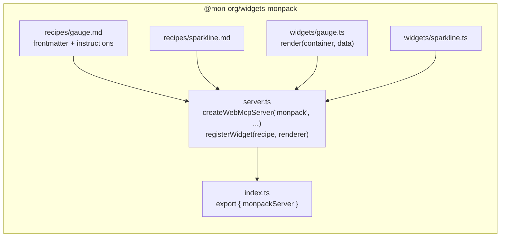
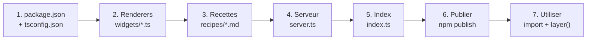

# Ajouter un widget pack

Ce tutorial explique comment creer un pack de widgets reutilisable, du
renderer vanilla jusqu'a la publication comme package NPM.

---

## Structure d'un pack

Un widget pack est un package NPM qui exporte un `WebMcpServer` avec
des widgets enregistres. Voici la structure standard :

```
packages/widgets-monpack/
  package.json
  tsconfig.json
  src/
    index.ts          # API publique (exports)
    server.ts         # Creation du serveur + enregistrement des widgets
    widgets/          # Renderers (un fichier par widget)
      gauge.ts
      sparkline.ts
    recipes/          # Recettes .md (un fichier par widget)
      gauge.md
      sparkline.md
```



---

## Etape 1 -- Initialiser le package

### package.json

```json
{
  "name": "@mon-org/widgets-monpack",
  "version": "1.0.0",
  "description": "Widget pack for WebMCP: gauge, sparkline",
  "license": "MIT",
  "type": "module",
  "main": "./src/index.ts",
  "exports": {
    ".": {
      "import": "./src/index.ts"
    },
    "./server": {
      "import": "./src/server.ts"
    }
  },
  "scripts": {
    "check": "tsc --noEmit"
  },
  "dependencies": {
    "@webmcp-auto-ui/core": "^1.0.0"
  },
  "devDependencies": {
    "typescript": "^5.0.0"
  }
}
```

Points importants :
- `@webmcp-auto-ui/core` est la seule dependance obligatoire (pour `createWebMcpServer`)
- Si votre pack utilise une librairie de rendu (d3, plotly, etc.), ajoutez-la en `dependencies`
- L'export `./server` permet l'import direct du serveur sans passer par le barrel

### tsconfig.json

```json
{
  "compilerOptions": {
    "target": "ES2022",
    "module": "ESNext",
    "moduleResolution": "bundler",
    "strict": true,
    "noEmit": true,
    "esModuleInterop": true,
    "skipLibCheck": true,
    "declaration": true
  },
  "include": ["src"]
}
```

---

## Etape 2 -- Ecrire un renderer vanilla

Un renderer est une fonction qui recoit un `HTMLElement` et des donnees,
et retourne optionnellement une fonction de cleanup :

```typescript
// src/widgets/gauge.ts

interface GaugeData {
  label: string;
  value: number;
  min?: number;
  max?: number;
  unit?: string;
  color?: string;
}

export function render(
  container: HTMLElement,
  data: Record<string, unknown>,
): void | (() => void) {
  const { label, value, min = 0, max = 100, unit = '', color = '#3498db' } = data as unknown as GaugeData;

  const pct = Math.max(0, Math.min(100, ((value - min) / (max - min)) * 100));

  const wrapper = document.createElement('div');
  wrapper.style.cssText = 'text-align: center; padding: 1rem; font-family: system-ui;';

  wrapper.innerHTML = `
    <div style="font-size: 0.85rem; color: #888; margin-bottom: 0.5rem">${label}</div>
    <svg viewBox="0 0 120 70" style="width: 120px">
      <path d="M 10 60 A 50 50 0 0 1 110 60" fill="none" stroke="#333" stroke-width="8" stroke-linecap="round"/>
      <path d="M 10 60 A 50 50 0 0 1 110 60" fill="none" stroke="${color}" stroke-width="8" stroke-linecap="round"
            stroke-dasharray="${pct * 1.57} 157" style="transition: stroke-dasharray 0.6s"/>
    </svg>
    <div style="font-size: 1.5rem; font-weight: bold; margin-top: 0.25rem">${value}${unit}</div>
  `;

  container.appendChild(wrapper);

  return () => {
    container.innerHTML = '';
  };
}
```

### Renderer avec dependance externe (ex: D3)

Pour un renderer qui utilise une librairie externe, importez-la
dynamiquement pour permettre le tree-shaking :

```typescript
// src/widgets/sparkline.ts

interface SparklineData {
  values: number[];
  color?: string;
  height?: number;
}

export async function render(
  container: HTMLElement,
  data: Record<string, unknown>,
): Promise<void | (() => void)> {
  const d3 = await import('d3');
  const { values, color = '#2ecc71', height = 40 } = data as unknown as SparklineData;

  const width = container.clientWidth || 200;
  const x = d3.scaleLinear().domain([0, values.length - 1]).range([0, width]);
  const y = d3.scaleLinear().domain([Math.min(...values), Math.max(...values)]).range([height, 0]);

  const line = d3.line<number>()
    .x((_, i) => x(i))
    .y((d) => y(d))
    .curve(d3.curveMonotoneX);

  const svg = d3.select(container)
    .append('svg')
    .attr('width', width)
    .attr('height', height);

  svg.append('path')
    .datum(values)
    .attr('fill', 'none')
    .attr('stroke', color)
    .attr('stroke-width', 2)
    .attr('d', line);

  return () => { svg.remove(); };
}
```

---

## Etape 3 -- Ecrire les recettes

Chaque widget a une recette `.md` avec un frontmatter YAML :

### recipes/gauge.md

```markdown
---
widget: gauge
description: Gauge circulaire pour afficher une valeur entre un min et un max (KPI, score, progression).
group: monpack
schema:
  type: object
  required:
    - label
    - value
  properties:
    label:
      type: string
      description: Label de la gauge
    value:
      type: number
      description: Valeur courante
    min:
      type: number
      description: Valeur minimale (defaut 0)
    max:
      type: number
      description: Valeur maximale (defaut 100)
    unit:
      type: string
      description: Unite (%, degC, etc.)
    color:
      type: string
      description: Couleur de la gauge (CSS)
---

## Quand utiliser

Pour afficher une metrique avec une valeur et des bornes (score de satisfaction,
temperature, pourcentage de completion, etc.).

## Comment

Appeler widget_display('gauge', {label: "CPU", value: 72, max: 100, unit: "%", color: "#e74c3c"}).

## Erreurs courantes

- value en dehors de [min, max] : la gauge clamp automatiquement mais l'affichage peut etre trompeur
- max < min : comportement indefini, toujours verifier l'ordre
```

### recipes/sparkline.md

```markdown
---
widget: sparkline
description: Mini graphique en ligne (tendance, historique rapide) sans axes.
group: monpack
schema:
  type: object
  required:
    - values
  properties:
    values:
      type: array
      items:
        type: number
      description: Serie de valeurs numeriques
    color:
      type: string
      description: Couleur de la ligne (CSS)
    height:
      type: number
      description: Hauteur du graphique en pixels (defaut 40)
---

## Quand utiliser

Pour une tendance rapide inline (cours de bourse, CPU load, temperature sur 24h).

## Comment

Appeler widget_display('sparkline', {values: [10, 15, 12, 18, 22, 19]}).
```

---

## Etape 4 -- Creer le serveur et enregistrer les widgets

### src/server.ts

```typescript
import { createWebMcpServer } from '@webmcp-auto-ui/core';

import { render as renderGauge } from './widgets/gauge.js';
import { render as renderSparkline } from './widgets/sparkline.js';

// Recipes (imported as raw strings — requires bundler support for ?raw)
import gaugeRecipe from './recipes/gauge.md?raw';
import sparklineRecipe from './recipes/sparkline.md?raw';

export const monpackServer = createWebMcpServer('monpack', {
  description: 'Gauge and sparkline widgets for dashboards',
});

monpackServer.registerWidget(gaugeRecipe, renderGauge);
monpackServer.registerWidget(sparklineRecipe, renderSparkline);
```

### src/index.ts

```typescript
// Public API
export { monpackServer } from './server.js';

// Individual renderers (pour composition custom)
export { render as renderGauge } from './widgets/gauge.js';
export { render as renderSparkline } from './widgets/sparkline.js';
```

L'export individuel des renderers permet aux consommateurs de les utiliser
sans passer par le serveur WebMCP (integration dans des composants existants).

---

## Etape 5 -- Publier comme package NPM

```bash
# Build de verification
cd packages/widgets-monpack
npx tsc --noEmit

# Publier
npm publish --access public
```

Pour un monorepo, ajoutez le package au workspace :

```json
// package.json racine
{
  "workspaces": ["packages/*", "apps/*"]
}
```

---

## Etape 6 -- Utiliser dans une app

### Import du serveur

```typescript
import { monpackServer } from '@mon-org/widgets-monpack';
import { autoui } from '@webmcp-auto-ui/agent';

// Pour la boucle agent
const layers = [
  autoui.layer(),
  monpackServer.layer(),
];

// Pour mountWidget
import { mountWidget } from '@webmcp-auto-ui/core';
const servers = [autoui, monpackServer];
mountWidget(container, 'gauge', { label: 'CPU', value: 72 }, servers);
```

### Selection dynamique des packs

```typescript
import { autouivanilla } from '@webmcp-auto-ui/widgets-vanilla';
import { d3server } from '@webmcp-auto-ui/widgets-d3';
import { monpackServer } from '@mon-org/widgets-monpack';

const ALL_PACKS = [
  { id: 'vanilla', label: 'Vanilla', server: autouivanilla },
  { id: 'd3', label: 'D3', server: d3server },
  { id: 'monpack', label: 'Mon Pack', server: monpackServer },
];

// L'utilisateur active/desactive les packs
const activePacks = ALL_PACKS.filter(p => enabledIds.has(p.id));
const layers = activePacks.map(p => p.server.layer());
```

---

## Exemples de packs existants

Les packs du monorepo suivent exactement cette structure. Voici comment ils
sont organises :

### @webmcp-auto-ui/widgets-d3

8 widgets D3.js avances : sunburst, chord, contour, voronoi, force-graph,
treemap, pack, radial-bar.

```typescript
// packages/widgets-d3/src/server.ts
import { createWebMcpServer } from '@webmcp-auto-ui/core';
import { render as renderSunburst } from './widgets/sunburst.js';
import sunburstRecipe from './recipes/sunburst.md?raw';
// ... 7 autres widgets

const d3server = createWebMcpServer('d3', {
  description: 'Advanced D3.js visualizations',
});

d3server.registerWidget(sunburstRecipe, renderSunburst);
// ... 7 autres registerWidget

export { d3server };
```

### @webmcp-auto-ui/widgets-mermaid

7 diagrammes Mermaid.js : flowchart, sequence, gantt, er-diagram,
class-diagram, mindmap, pie-chart.

```typescript
// packages/widgets-mermaid/src/server.ts
import { createWebMcpServer } from '@webmcp-auto-ui/core';

export const mermaidServer = createWebMcpServer('mermaid', {
  description: 'Diagram visualizations with Mermaid.js',
});

mermaidServer.registerWidget(flowchartRecipe, renderFlowchart);
// ... 6 autres
```

### @webmcp-auto-ui/widgets-leaflet

4 widgets cartographiques : leaflet-map, choropleth, heatmap-geo,
marker-cluster.

```typescript
// packages/widgets-leaflet/src/server.ts
import { createWebMcpServer } from '@webmcp-auto-ui/core';

export const leafletServer = createWebMcpServer('leaflet', {
  description: 'Cartographic widgets with Leaflet',
});

leafletServer.registerWidget(leafletMapRecipe, renderLeafletMap);
// ... 3 autres
```

---

## Checklist



| Etape | Fichier | Ce qui est fait |
|-------|---------|-----------------|
| 1 | `package.json` | Dependance sur `@webmcp-auto-ui/core` |
| 2 | `src/widgets/*.ts` | Renderers `(container, data) => void \| (() => void)` |
| 3 | `src/recipes/*.md` | Frontmatter (widget, description, schema) + body |
| 4 | `src/server.ts` | `createWebMcpServer` + `registerWidget` par widget |
| 5 | `src/index.ts` | Export du serveur + renderers individuels |
| 6 | npm | `npm publish --access public` |
| 7 | App | `import { monpackServer } from '...'` + `monpackServer.layer()` |
