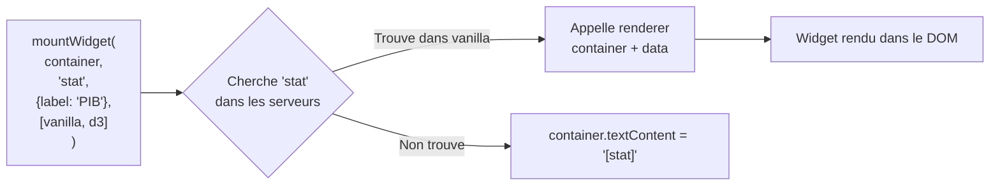
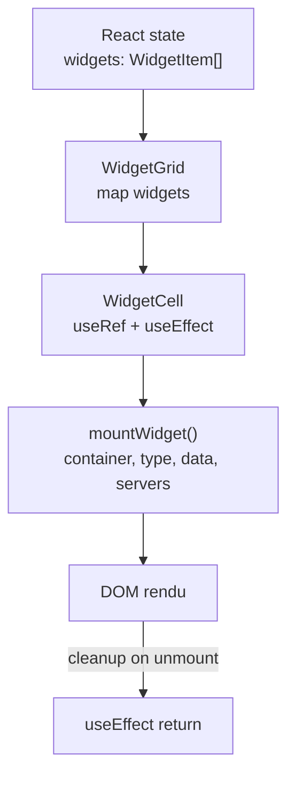
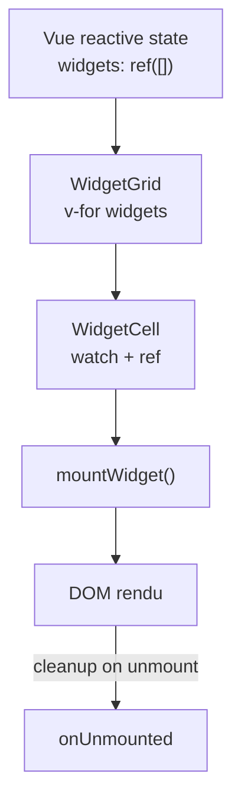

# Creer une app multi-framework

Ce tutorial explique comment utiliser les widgets WebMCP dans React, Vue,
ou vanilla JS/Web Components via la fonction `mountWidget()` de
`@webmcp-auto-ui/core`.

---

## Le concept : mountWidget

`mountWidget` est le point d'entree framework-agnostic pour rendre un
widget dans un conteneur DOM :

```typescript
import { mountWidget } from '@webmcp-auto-ui/core';
import type { WebMcpServer } from '@webmcp-auto-ui/core';

const cleanup: (() => void) | void = mountWidget(
  container,   // HTMLElement
  type,        // string — nom du widget ('stat', 'chart', 'hemicycle', ...)
  data,        // Record<string, unknown> — donnees du widget
  servers,     // WebMcpServer[] — serveurs dans lesquels chercher le renderer
);
```

`mountWidget` parcourt les serveurs dans l'ordre, trouve le premier qui
expose un widget avec ce nom, et appelle son renderer. Si le renderer
est une fonction vanilla, il retourne optionnellement une fonction de
cleanup.



---

## Pattern React

Utilisez `useRef` pour obtenir le conteneur DOM et `useEffect` pour
monter/demonter le widget.

### WidgetCell.tsx

```tsx
import { useRef, useEffect } from 'react';
import { mountWidget } from '@webmcp-auto-ui/core';
import type { WebMcpServer } from '@webmcp-auto-ui/core';

interface WidgetCellProps {
  type: string;
  data: Record<string, unknown>;
  servers: WebMcpServer[];
}

export function WidgetCell({ type, data, servers }: WidgetCellProps) {
  const ref = useRef<HTMLDivElement>(null);

  useEffect(() => {
    if (!ref.current) return;
    ref.current.innerHTML = '';
    const cleanup = mountWidget(ref.current, type, data, servers);
    return () => {
      if (typeof cleanup === 'function') cleanup();
    };
  }, [type, data, servers]);

  return <div ref={ref} className="widget-cell" />;
}
```

### WidgetGrid.tsx

```tsx
import { WidgetCell } from './WidgetCell';
import type { WebMcpServer } from '@webmcp-auto-ui/core';

interface WidgetItem {
  id: string;
  type: string;
  data: Record<string, unknown>;
}

interface WidgetGridProps {
  widgets: WidgetItem[];
  servers: WebMcpServer[];
}

export function WidgetGrid({ widgets, servers }: WidgetGridProps) {
  if (widgets.length === 0) {
    return <p>Widgets will appear here when the agent renders them.</p>;
  }

  return (
    <div className="widget-grid">
      {widgets.map((w) => (
        <WidgetCell key={w.id} type={w.type} data={w.data} servers={servers} />
      ))}
    </div>
  );
}
```



---

## Pattern Vue

Utilisez `ref` pour le conteneur, `watch` pour reagir aux changements,
et `onUnmounted` pour le cleanup.

### WidgetCell.vue

```vue
<script setup lang="ts">
import { ref, watch, onUnmounted } from 'vue';
import { mountWidget } from '@webmcp-auto-ui/core';
import type { WebMcpServer } from '@webmcp-auto-ui/core';

const props = defineProps<{
  type: string;
  data: Record<string, unknown>;
  servers: WebMcpServer[];
}>();

const container = ref<HTMLElement>();
let cleanup: (() => void) | void;

watch(
  [() => props.type, () => props.data, () => props.servers],
  () => {
    if (!container.value) return;
    if (typeof cleanup === 'function') cleanup();
    container.value.innerHTML = '';
    cleanup = mountWidget(container.value, props.type, props.data, props.servers);
  },
  { immediate: true },
);

onUnmounted(() => {
  if (typeof cleanup === 'function') cleanup();
});
</script>

<template>
  <div ref="container" class="widget-cell" />
</template>
```

### WidgetGrid.vue

```vue
<script setup lang="ts">
import type { WebMcpServer } from '@webmcp-auto-ui/core';
import WidgetCell from './WidgetCell.vue';

defineProps<{
  widgets: { id: string; type: string; data: Record<string, unknown> }[];
  servers: WebMcpServer[];
}>();
</script>

<template>
  <div class="widget-grid">
    <WidgetCell
      v-for="w in widgets"
      :key="w.id"
      :type="w.type"
      :data="w.data"
      :servers="servers"
    />
  </div>
</template>
```



---

## Pattern Web Components

Un Custom Element qui encapsule `mountWidget` :

### wm-widget.ts

```typescript
import { mountWidget } from '@webmcp-auto-ui/core';
import type { WebMcpServer } from '@webmcp-auto-ui/core';

// Les serveurs actifs sont geres par l'app
let activeServers: WebMcpServer[] = [];
export function setActiveServers(servers: WebMcpServer[]) {
  activeServers = servers;
}

export class WmWidget extends HTMLElement {
  static observedAttributes = ['type', 'data'];
  private cleanup?: () => void;

  connectedCallback() {
    this.render();
  }

  disconnectedCallback() {
    this.cleanup?.();
  }

  attributeChangedCallback() {
    this.render();
  }

  render() {
    this.cleanup?.();
    this.innerHTML = '';
    const type = this.getAttribute('type') || '';
    const data = JSON.parse(this.getAttribute('data') || '{}');
    if (!type) return;
    const result = mountWidget(this, type, data, activeServers);
    if (typeof result === 'function') {
      this.cleanup = result;
    }
  }

  /** Mise a jour programmatique sans re-render complet */
  updateData(data: Record<string, unknown>) {
    this.setAttribute('data', JSON.stringify(data));
  }
}

customElements.define('wm-widget', WmWidget);
```

### Utilisation en HTML

```html
<wm-widget type="stat" data='{"label":"PIB","value":"2.1T EUR"}'></wm-widget>
```

### Auto-enregistrement des widgets comme elements

Vous pouvez aussi enregistrer chaque widget comme son propre Custom Element :

```typescript
import { autouivanilla } from '@webmcp-auto-ui/widgets-vanilla';
import type { WebMcpServer } from '@webmcp-auto-ui/core';

function registerWidgetsAsElements(server: WebMcpServer, prefix: string = 'wm') {
  for (const widget of server.listWidgets()) {
    const tagName = `${prefix}-${widget.name}`;
    if (customElements.get(tagName)) continue;

    customElements.define(tagName, class extends HTMLElement {
      connectedCallback() {
        const data = JSON.parse(this.dataset.props ?? '{}');
        if (typeof widget.renderer === 'function') {
          (widget.renderer as (c: HTMLElement, d: Record<string, unknown>) => void)(this, data);
        }
      }
    });
  }
}

registerWidgetsAsElements(autouivanilla);
// <wm-stat data-props='{"label":"PIB","value":"2.1T EUR"}'></wm-stat>
```

---

## Choisir ses packs de widgets

Le monorepo fournit 9 packs de widgets, chacun expose un `WebMcpServer` :

| Pack | Import | Widgets | Dependance |
|------|--------|---------|-----------|
| vanilla | `@webmcp-auto-ui/widgets-vanilla` | 25 widgets (stat, chart, table, ...) | Aucune |
| d3 | `@webmcp-auto-ui/widgets-d3` | 8 widgets (sunburst, chord, voronoi, ...) | d3 |
| plotly | `@webmcp-auto-ui/widgets-plotly` | Graphiques interactifs | plotly.js |
| mermaid | `@webmcp-auto-ui/widgets-mermaid` | 7 diagrammes (flowchart, sequence, gantt, ...) | mermaid |
| leaflet | `@webmcp-auto-ui/widgets-leaflet` | 4 cartes (map, choropleth, heatmap, clusters) | leaflet |
| mapbox | `@webmcp-auto-ui/widgets-mapbox` | Cartes Mapbox | mapbox-gl |
| threejs | `@webmcp-auto-ui/widgets-threejs` | 3D | three.js |
| canvas2d | `@webmcp-auto-ui/widgets-canvas2d` | Canvas 2D | Aucune |
| mui | `@webmcp-auto-ui/widgets-mui` | Composants Material UI | @mui/material |

Exemple d'import et composition :

```typescript
import { autouivanilla } from '@webmcp-auto-ui/widgets-vanilla';
import { d3server } from '@webmcp-auto-ui/widgets-d3';
import { mermaidServer } from '@webmcp-auto-ui/widgets-mermaid';
import { leafletServer } from '@webmcp-auto-ui/widgets-leaflet';

// Combiner les serveurs pour mountWidget
const servers = [autouivanilla, d3server, mermaidServer, leafletServer];

// Ou pour la boucle agent
const layers = [
  autouivanilla.layer(),
  d3server.layer(),
  mermaidServer.layer(),
  leafletServer.layer(),
];
```

---

## Configurer la boucle agent

La boucle agent orchestre le LLM et dispatche les appels d'outils.

```typescript
import { runAgentLoop, RemoteLLMProvider } from '@webmcp-auto-ui/agent';
import { McpClient } from '@webmcp-auto-ui/core';
import { autouivanilla } from '@webmcp-auto-ui/widgets-vanilla';
import { d3server } from '@webmcp-auto-ui/widgets-d3';
import type { ToolLayer, McpLayer } from '@webmcp-auto-ui/agent';

// 1. LLM provider
const provider = new RemoteLLMProvider({ proxyUrl: '/api/chat' });

// 2. MCP client (optionnel — pour les donnees distantes)
const mcpClient = new McpClient('https://my-mcp-server.com/mcp');
await mcpClient.connect();
const mcpTools = await mcpClient.listTools();

// 3. Construire les layers
const mcpLayer: McpLayer = {
  protocol: 'mcp',
  serverName: 'mydata',
  tools: mcpTools.map(t => ({
    name: t.name,
    description: t.description ?? '',
    inputSchema: t.inputSchema as Record<string, unknown>,
  })),
};

const layers: ToolLayer[] = [
  mcpLayer,
  autouivanilla.layer(),
  d3server.layer(),
];

// 4. Lancer la boucle
const result = await runAgentLoop('Montre-moi un dashboard des ventes', {
  provider,
  client: mcpClient,
  layers,
  maxIterations: 5,
  callbacks: {
    onWidget: (type, data) => {
      console.log('Widget rendu:', type, data);
      // Ajouter au state de l'app (React setState, Vue ref, etc.)
      return { id: 'w_' + Math.random().toString(36).slice(2, 8) };
    },
    onText: (text) => {
      console.log('LLM:', text);
    },
  },
});

console.log('Resultat:', result.text);
console.log('Tool calls:', result.toolCalls.length);
console.log('Tokens:', result.metrics.totalTokens);
```

---

## Hook React complet : useServers

Un hook pour gerer la selection des packs de widgets :

```typescript
import { useState, useMemo, useCallback } from 'react';
import type { WebMcpServer } from '@webmcp-auto-ui/core';
import { autouivanilla } from '@webmcp-auto-ui/widgets-vanilla';
import { d3server } from '@webmcp-auto-ui/widgets-d3';
import { mermaidServer } from '@webmcp-auto-ui/widgets-mermaid';

const ALL_SERVERS: { id: string; label: string; server: WebMcpServer }[] = [
  { id: 'vanilla', label: 'Vanilla', server: autouivanilla },
  { id: 'd3', label: 'D3', server: d3server },
  { id: 'mermaid', label: 'Mermaid', server: mermaidServer },
];

export function useServers() {
  const [enabledIds, setEnabledIds] = useState<Set<string>>(
    () => new Set(['vanilla']),
  );

  const toggleServer = useCallback((id: string) => {
    setEnabledIds((prev) => {
      const next = new Set(prev);
      if (next.has(id)) next.delete(id);
      else next.add(id);
      return next;
    });
  }, []);

  const enabledServers = useMemo(
    () => ALL_SERVERS.filter((s) => enabledIds.has(s.id)).map((s) => s.server),
    [enabledIds],
  );

  const serverOptions = useMemo(
    () => ALL_SERVERS.map((s) => ({
      id: s.id,
      label: s.label,
      widgetCount: s.server.listWidgets().length,
      enabled: enabledIds.has(s.id),
    })),
    [enabledIds],
  );

  return { enabledServers, toggleServer, serverOptions };
}
```

---

## Composable Vue : useServers

```typescript
import { ref, computed } from 'vue';
import type { WebMcpServer } from '@webmcp-auto-ui/core';
import { autouivanilla } from '@webmcp-auto-ui/widgets-vanilla';
import { d3server } from '@webmcp-auto-ui/widgets-d3';
import { mermaidServer } from '@webmcp-auto-ui/widgets-mermaid';

const ALL_SERVERS = [
  { id: 'vanilla', label: 'Vanilla', server: autouivanilla },
  { id: 'd3', label: 'D3', server: d3server },
  { id: 'mermaid', label: 'Mermaid', server: mermaidServer },
] as const;

export function useServers() {
  const enabledIds = ref<Set<string>>(new Set(['vanilla']));

  function toggle(id: string) {
    const next = new Set(enabledIds.value);
    if (next.has(id)) next.delete(id);
    else next.add(id);
    enabledIds.value = next;
  }

  const activeServers = computed<WebMcpServer[]>(() =>
    ALL_SERVERS.filter((s) => enabledIds.value.has(s.id)).map((s) => s.server),
  );

  const layers = computed(() =>
    activeServers.value.map((s) => s.layer()),
  );

  return { activeServers, layers, toggle };
}
```

---

## Resume

| Framework | Ref DOM | Lifecycle mount | Lifecycle cleanup | Reactivite |
|-----------|---------|-----------------|-------------------|------------|
| React | `useRef` | `useEffect` | return callback | `deps` array |
| Vue | `ref<HTMLElement>` | `watch` (immediate) | `onUnmounted` | reactive watchers |
| Web Components | `this` (HTMLElement) | `connectedCallback` | `disconnectedCallback` | `attributeChangedCallback` |

Le pattern est le meme dans tous les cas :

1. Obtenir une reference au conteneur DOM
2. Appeler `mountWidget(container, type, data, servers)`
3. Stocker la fonction de cleanup retournee
4. Appeler le cleanup quand le composant est demonte ou les donnees changent

Les packs de widgets sont independants du framework -- ils fournissent
des renderers vanilla qui ecrivent directement dans le DOM.
