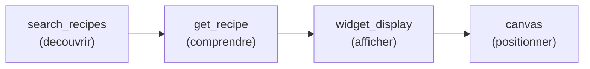
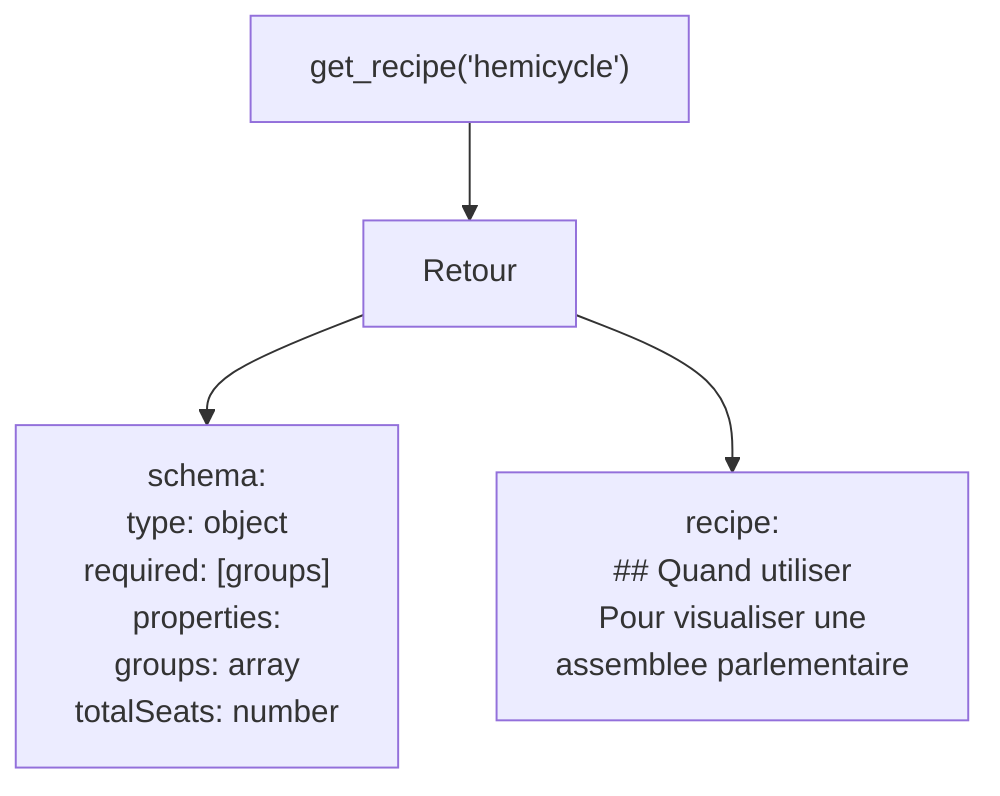
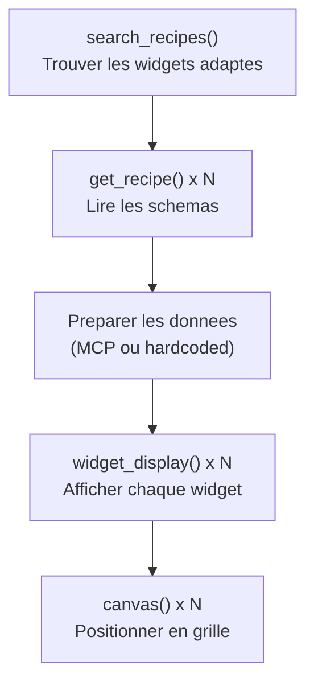

# Utiliser les widgets existants

Ce tutorial explique comment utiliser les widgets natifs du serveur `autoui`
via les outils WebMCP. Il couvre la decouverte, l'affichage, la manipulation
du canvas, et la composition de dashboards.

## Prerequis

- Un serveur `autoui` connecte via les layers
- Un agent capable d'appeler les outils WebMCP (`autoui_webmcp_*`)

---

## Vue d'ensemble du flow



Chaque etape est un appel d'outil. Le LLM execute cette sequence
automatiquement quand il recoit une demande de visualisation.

---

## Etape 1 -- Lister les widgets disponibles

L'outil `autoui_webmcp_search_recipes` retourne la liste des widgets
avec leurs descriptions et groupes.

```json
{
  "name": "autoui_webmcp_search_recipes",
  "arguments": {}
}
```

La reponse contient un tableau de recettes. Chaque entree indique le nom
du widget, son groupe et une description courte.

Vous pouvez filtrer par mot-cle :

```json
{
  "name": "autoui_webmcp_search_recipes",
  "arguments": {
    "query": "chart"
  }
}
```

### Catalogue des 26 widgets natifs

#### Groupe simple (9 widgets)

| Widget | Description | Exemple minimal |
|--------|-------------|-----------------|
| `stat` | Valeur numerique avec label et tendance | `{label: "PIB", value: "2.1T EUR"}` |
| `kv` | Liste de paires cle-valeur | `{rows: [["Nom", "Dupont"], ["Age", "42"]]}` |
| `list` | Liste simple d'elements | `{items: ["Item 1", "Item 2"]}` |
| `chart` | Graphique a barres simples | `{bars: [["Jan", 120], ["Fev", 190]]}` |
| `alert` | Message d'alerte avec severite | `{title: "Attention", level: "warn"}` |
| `code` | Bloc de code avec coloration | `{lang: "ts", content: "const x = 1;"}` |
| `text` | Texte riche (paragraphe) | `{content: "Bonjour le monde"}` |
| `actions` | Groupe de boutons d'action | `{buttons: [{label: "OK", primary: true}]}` |
| `tags` | Ensemble de badges/etiquettes | `{tags: [{text: "v2"}, {text: "stable"}]}` |

#### Groupe rich (12 widgets)

| Widget | Description | Exemple minimal |
|--------|-------------|-----------------|
| `data-table` | Tableau de donnees avec tri | `{columns: [{key: "nom", label: "Nom"}], rows: [{nom: "Dupont"}]}` |
| `timeline` | Chronologie d'evenements | `{events: [{title: "v1", date: "2024-01"}]}` |
| `profile` | Fiche de profil | `{name: "Jean Dupont"}` |
| `trombinoscope` | Grille de profils | `{people: [{name: "Alice"}, {name: "Bob"}]}` |
| `json-viewer` | Explorateur JSON interactif | `{data: {key: "value"}}` |
| `hemicycle` | Hemicycle parlementaire | `{groups: [{id: "g1", label: "Gauche", seats: 150, color: "#e74c3c"}]}` |
| `chart-rich` | Graphique multi-series | `{type: "bar", labels: ["Q1"], data: [{values: [42]}]}` |
| `cards` | Grille de cartes | `{cards: [{title: "Projet A"}]}` |
| `sankey` | Diagramme de flux Sankey | `{nodes: [{id: "a", label: "A"}], links: [{source: "a", target: "b", value: 10}]}` |
| `log` | Journal d'evenements horodate | `{entries: [{message: "Start", level: "info"}]}` |
| `stat-card` | KPI enrichi avec delta | `{label: "Users", value: "1.2M", delta: "+5%"}` |
| `grid-data` | Grille de donnees avec highlights | `{rows: [["A", 1], ["B", 2]]}` |

#### Groupe media (2 widgets)

| Widget | Description | Exemple minimal |
|--------|-------------|-----------------|
| `gallery` | Galerie d'images avec lightbox | `{images: [{src: "https://...", alt: "Photo"}]}` |
| `carousel` | Carrousel de slides | `{slides: [{title: "Slide 1", content: "..."}]}` |

#### Groupe advanced (3 widgets)

| Widget | Description | Exemple minimal |
|--------|-------------|-----------------|
| `map` | Carte avec marqueurs (vanilla) | `{markers: [{lat: 48.85, lng: 2.35, label: "Paris"}]}` |
| `d3` | Visualisation D3 simplifiee | `{preset: "hex-heatmap", data: {values: [1,2,3]}}` |
| `js-sandbox` | Sandbox JavaScript isolee | `{code: "document.body.textContent = 'Hello'"}` |

---

## Etape 2 -- Lire le schema d'un widget

Avant d'afficher un widget, lisez sa recette pour connaitre les parametres attendus.

```json
{
  "name": "autoui_webmcp_get_recipe",
  "arguments": {
    "name": "hemicycle"
  }
}
```

La reponse contient :

- **name** : identifiant du widget
- **description** : ce que le widget fait
- **schema** : JSON Schema des proprietes attendues
- **recipe** : instructions pour le LLM (quand utiliser, comment, erreurs courantes)



---

## Etape 3 -- Afficher un widget

L'outil `autoui_webmcp_widget_display` cree un widget sur le canvas.

### Exemples par groupe

#### Simple

Un indicateur statistique :

```json
{
  "name": "autoui_webmcp_widget_display",
  "arguments": {
    "name": "stat",
    "params": {
      "label": "PIB",
      "value": "2.1T EUR",
      "trend": "+1.2%"
    }
  }
}
```

Un graphique en barres :

```json
{
  "name": "autoui_webmcp_widget_display",
  "arguments": {
    "name": "chart",
    "params": {
      "bars": [["Jan", 120], ["Fev", 190], ["Mar", 300], ["Avr", 250]]
    }
  }
}
```

Une alerte :

```json
{
  "name": "autoui_webmcp_widget_display",
  "arguments": {
    "name": "alert",
    "params": {
      "level": "warn",
      "title": "Quota proche",
      "message": "Vous avez utilise 92% de votre quota mensuel."
    }
  }
}
```

#### Rich

Un tableau de donnees :

```json
{
  "name": "autoui_webmcp_widget_display",
  "arguments": {
    "name": "data-table",
    "params": {
      "columns": [
        {"key": "pays", "label": "Pays"},
        {"key": "pop", "label": "Population"},
        {"key": "pib", "label": "PIB"}
      ],
      "rows": [
        {"pays": "France", "pop": "67M", "pib": "2.78T"},
        {"pays": "Allemagne", "pop": "83M", "pib": "3.86T"}
      ]
    }
  }
}
```

Une timeline :

```json
{
  "name": "autoui_webmcp_widget_display",
  "arguments": {
    "name": "timeline",
    "params": {
      "events": [
        {"date": "2024-01-15", "title": "Lancement v1", "status": "done"},
        {"date": "2024-06-01", "title": "v2 beta", "status": "active"},
        {"date": "2024-09-30", "title": "v2 stable", "status": "pending"}
      ]
    }
  }
}
```

Un hemicycle :

```json
{
  "name": "autoui_webmcp_widget_display",
  "arguments": {
    "name": "hemicycle",
    "params": {
      "groups": [
        {"id": "gauche", "label": "Gauche", "seats": 150, "color": "#e74c3c"},
        {"id": "centre", "label": "Centre", "seats": 120, "color": "#f39c12"},
        {"id": "droite", "label": "Droite", "seats": 200, "color": "#3498db"}
      ],
      "totalSeats": 470
    }
  }
}
```

#### Media

Une galerie :

```json
{
  "name": "autoui_webmcp_widget_display",
  "arguments": {
    "name": "gallery",
    "params": {
      "images": [
        {"src": "https://example.com/photo1.jpg", "alt": "Vue aerienne"},
        {"src": "https://example.com/photo2.jpg", "alt": "Detail facade"}
      ],
      "columns": 2
    }
  }
}
```

#### Advanced

Une carte interactive :

```json
{
  "name": "autoui_webmcp_widget_display",
  "arguments": {
    "name": "map",
    "params": {
      "center": {"lat": 48.8566, "lng": 2.3522},
      "zoom": 12,
      "markers": [
        {"lat": 48.8584, "lng": 2.2945, "label": "Tour Eiffel"},
        {"lat": 48.8606, "lng": 2.3376, "label": "Louvre"}
      ]
    }
  }
}
```

---

## Etape 4 -- Manipuler le canvas

Une fois les widgets affiches, utilisez `autoui_webmcp_canvas` pour les
repositionner, redimensionner ou supprimer.

### Deplacer un widget

```json
{
  "name": "autoui_webmcp_canvas",
  "arguments": {
    "action": "move",
    "id": "w_abc",
    "params": {"x": 100, "y": 200}
  }
}
```

### Redimensionner un widget

```json
{
  "name": "autoui_webmcp_canvas",
  "arguments": {
    "action": "resize",
    "id": "w_abc",
    "params": {"width": 400, "height": 300}
  }
}
```

### Mettre a jour les donnees

```json
{
  "name": "autoui_webmcp_canvas",
  "arguments": {
    "action": "update",
    "id": "w_abc",
    "params": {"label": "PIB mis a jour", "value": "2.85T EUR"}
  }
}
```

### Supprimer un widget

```json
{
  "name": "autoui_webmcp_canvas",
  "arguments": {
    "action": "remove",
    "id": "w_abc"
  }
}
```

### Tout effacer

```json
{
  "name": "autoui_webmcp_canvas",
  "arguments": {
    "action": "clear"
  }
}
```

---

## Etape 5 -- Composer un dashboard

Le pattern standard pour creer un dashboard complet :



### Exemple : dashboard economique

Quatre widgets combines pour un apercu economique.

**Widget 1 -- Indicateur principal :**

```json
{
  "name": "autoui_webmcp_widget_display",
  "arguments": {
    "name": "stat",
    "params": {
      "label": "PIB France 2024",
      "value": "2.78T EUR",
      "trend": "+0.9%",
      "trendDir": "up"
    }
  }
}
```

**Widget 2 -- Evolution trimestrielle :**

```json
{
  "name": "autoui_webmcp_widget_display",
  "arguments": {
    "name": "chart-rich",
    "params": {
      "type": "line",
      "labels": ["T1", "T2", "T3", "T4"],
      "data": [
        {"label": "Croissance (%)", "values": [0.7, 0.9, 1.1, 0.9]}
      ]
    }
  }
}
```

**Widget 3 -- Comparatif par pays :**

```json
{
  "name": "autoui_webmcp_widget_display",
  "arguments": {
    "name": "data-table",
    "params": {
      "columns": [
        {"key": "pays", "label": "Pays"},
        {"key": "pib", "label": "PIB (T EUR)"},
        {"key": "croiss", "label": "Croissance"},
        {"key": "chomage", "label": "Chomage"}
      ],
      "rows": [
        {"pays": "France", "pib": "2.78", "croiss": "+0.9%", "chomage": "7.4%"},
        {"pays": "Allemagne", "pib": "3.86", "croiss": "+0.3%", "chomage": "5.7%"},
        {"pays": "Italie", "pib": "1.95", "croiss": "+0.7%", "chomage": "7.8%"},
        {"pays": "Espagne", "pib": "1.40", "croiss": "+2.1%", "chomage": "11.7%"}
      ]
    }
  }
}
```

**Widget 4 -- Repartition sectorielle :**

```json
{
  "name": "autoui_webmcp_widget_display",
  "arguments": {
    "name": "chart-rich",
    "params": {
      "type": "pie",
      "labels": ["Services", "Industrie", "Agriculture", "Construction"],
      "data": [
        {"label": "Part du PIB", "values": [70.2, 16.8, 3.4, 9.6]}
      ]
    }
  }
}
```

Apres affichage, positionnez les widgets en grille :

```json
{"name": "autoui_webmcp_canvas", "arguments": {"action": "move", "id": "w_stat1", "params": {"x": 0, "y": 0}}}
{"name": "autoui_webmcp_canvas", "arguments": {"action": "move", "id": "w_chart1", "params": {"x": 400, "y": 0}}}
{"name": "autoui_webmcp_canvas", "arguments": {"action": "move", "id": "w_table1", "params": {"x": 0, "y": 300}}}
{"name": "autoui_webmcp_canvas", "arguments": {"action": "move", "id": "w_chart2", "params": {"x": 400, "y": 300}}}
```

---

## Recapitulatif

| Etape | Outil | Ce qui se passe |
|-------|-------|-----------------|
| Decouvrir | `search_recipes` | Trouver les widgets par nom ou mot-cle |
| Comprendre | `get_recipe` | Lire le schema et les exemples |
| Afficher | `widget_display` | Creer le widget avec les donnees |
| Positionner | `canvas` | Deplacer, redimensionner, supprimer |

Chaque `widget_display` retourne un identifiant (`id`) que vous utilisez
ensuite dans les appels `canvas`.
